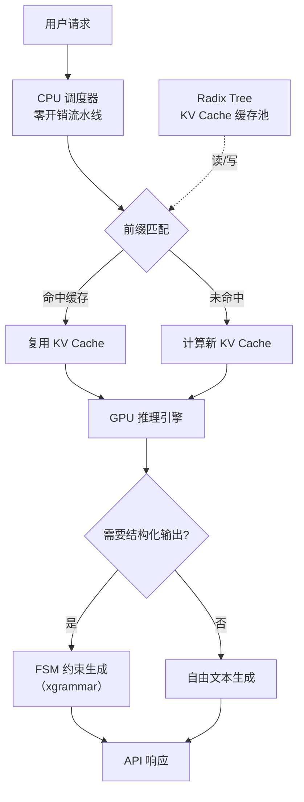

# SGLang（高效LLM推理引擎）

## 基础概念

SGLang 是由 LMSYS 组织开发的**高性能 LLM 推理服务框架（Serving Framework）**，核心解决两个问题：一是多个请求之间重复计算浪费 GPU 资源，二是让模型输出严格符合 JSON 等结构化格式。

打个比方：传统推理框架像一个"健忘"的翻译员，每次对话都从头开始翻译所有历史记录；SGLang 像一个"带记忆"的翻译员，之前翻译过的部分直接复用，只处理新内容。同时，它还能保证输出的 JSON 格式百分百合法，不会出现括号不匹配、字段缺失的问题。

截至 2025 年，SGLang 已被 xAI、AMD、NVIDIA、Intel、LinkedIn、Cursor、Oracle Cloud 等企业在生产环境中大规模使用，每天生成数万亿 token。2025 年 3 月，SGLang 正式加入 PyTorch 生态。

### 核心要素

| 要素 | 作用 |
|------|------|
| **RadixAttention（前缀复用）** | 用基数树缓存已计算的 KV Cache，多个请求共享相同前缀时直接复用，避免重复计算 |
| **结构化输出（Structured Output）** | 通过有限状态机（FSM）约束 token 生成过程，保证输出严格符合 JSON Schema 或正则表达式 |
| **零开销 CPU 调度器** | GPU 处理当前批次时，CPU 同步准备下一批次，GPU 利用率接近 100% |

### RadixAttention（前缀复用）

在实际应用中，大量请求会共享相同的前缀。比如：多轮对话中每一轮都要带上之前的历史；RAG 应用中多个查询可能检索到同一份文档；few-shot 学习中所有请求共用相同的示例。

传统做法：每个请求都从头计算这些重复前缀的 KV Cache，浪费大量 GPU 算力。

SGLang 的做法：把已计算的 KV Cache 存到一棵**基数树（Radix Tree）**里。新请求到来时，先匹配前缀——命中了就直接复用，没命中的部分才计算。

实测数据：
- few-shot 学习场景：缓存命中率 85%~95%（vLLM 的 PagedAttention 仅 15%~25%）
- 多轮对话场景：缓存命中率 75%~90%（vLLM 仅 10%~20%）

### 结构化输出（Structured Output）

Agent 应用经常需要模型输出 JSON 格式的工具调用指令。传统做法是让模型自由生成文本，然后用正则提取——但模型经常生成不合法的 JSON，导致解析失败。

SGLang 的做法：在生成过程中，把格式约束编译成**有限状态机（Finite State Machine, FSM）**。模型每生成一个 token，FSM 就限制下一个 token 的可选范围，从源头保证输出合法。底层通过集成 xgrammar 库实现高速结构化输出。

### 零开销 CPU 调度器

传统推理框架的调度流程是串行的：CPU 调度完 → GPU 计算 → CPU 再调度下一批。GPU 在 CPU 调度期间处于空闲状态。

SGLang 用流水线方式重叠 CPU 调度和 GPU 计算：GPU 执行当前批次的同时，CPU 已经在准备下一批次。GPU 一完成，下一批数据已经就绪，GPU 利用率接近 100%。

### 核心要素关系图



## 基础用法

安装依赖：

```bash
# 安装 SGLang（需要 CUDA 环境）
pip install "sglang[all]"

# 如果只需要 OpenAI 兼容客户端（不需要 GPU）
pip install sglang
```

**硬件要求**：运行模型推理需要 NVIDIA GPU（推荐 A100/H100）或 AMD GPU（MI300）。仅作为客户端调用已部署的 SGLang 服务则无 GPU 要求。

**方式一：启动 OpenAI 兼容 API 服务器（推荐生产使用）**

基于 sglang==0.4.x 验证（截至 2026-03）：

```bash
# 启动服务器，加载 Qwen2.5-7B 模型
python -m sglang.launch_server \
    --model-path Qwen/Qwen2.5-7B-Instruct \
    --port 30000
```

服务启动后，用标准 OpenAI SDK 调用：

```python
# 基于 openai>=1.0.0 验证（截至 2026-03）
# 前提：已通过上面的命令启动 SGLang 服务器

from openai import OpenAI

# 指向本地 SGLang 服务器
client = OpenAI(base_url="http://localhost:30000/v1", api_key="EMPTY")

response = client.chat.completions.create(
    model="Qwen/Qwen2.5-7B-Instruct",
    messages=[
        {"role": "user", "content": "用一句话解释什么是向量数据库"}
    ],
    max_tokens=128,
)

print(response.choices[0].message.content)
```

预期输出：

```text
向量数据库是一种专门存储和检索高维向量数据的数据库，常用于语义搜索和推荐系统等场景。
```

**方式二：使用 SGLang 原生 Python API（适合开发调试）**

```python
# 基于 sglang==0.4.x 验证（截至 2026-03）
# 需要 GPU 环境

import sglang as sgl

# 启动运行时（自动加载模型到 GPU）
runtime = sgl.Runtime(
    model_path="Qwen/Qwen2.5-7B-Instruct",
    tp_size=1,  # 张量并行数，单卡设为 1
)

# 定义生成函数
@sgl.function
def hello(s):
    s += "请用一句话解释什么是 Agent："
    s += sgl.gen("answer", max_tokens=128)

# 执行
state = hello.run(runtime=runtime)
print(state["answer"])

# 清理
runtime.shutdown()
```

预期输出：

```text
Agent 是一个能够感知环境、自主决策并采取行动来完成目标的智能程序。
```

**方式三：结构化 JSON 输出（Agent 场景核心能力）**

```python
# 基于 sglang==0.4.x 验证（截至 2026-03）
# 需要 GPU 环境

import sglang as sgl
import json

runtime = sgl.Runtime(model_path="Qwen/Qwen2.5-7B-Instruct")

# 定义输出的 JSON Schema
tool_schema = {
    "type": "object",
    "properties": {
        "action": {"type": "string", "enum": ["search", "calculate", "answer"]},
        "query": {"type": "string"}
    },
    "required": ["action", "query"]
}

@sgl.function
def decide_action(s, user_input):
    s += f"用户问题：{user_input}\n"
    s += "请决定下一步操作（JSON 格式）：\n"
    # json_schema 参数保证输出严格符合 schema
    s += sgl.gen("decision", max_tokens=128, json_schema=tool_schema)

state = decide_action.run(
    user_input="北京今天气温多少度？",
    runtime=runtime
)

# 输出一定是合法 JSON，无需 try-except
result = json.loads(state["decision"])
print(json.dumps(result, indent=2, ensure_ascii=False))

runtime.shutdown()
```

预期输出：

```text
{
  "action": "search",
  "query": "北京今天气温"
}
```

## 同类工具对比

| 维度 | SGLang | vLLM | Ollama |
|------|--------|------|--------|
| 核心定位 | 前缀复用 + 结构化输出的推理引擎 | 通用高性能 LLM 推理引擎 | 本地一键运行 LLM 的桌面工具 |
| 前缀缓存 | RadixAttention（基数树，命中率 85%+） | PagedAttention（页表式，命中率较低） | 无 |
| 结构化输出 | 原生 FSM 约束，零失败率 | 需配合 Outlines 等外部库 | 部分支持（JSON mode） |
| 吞吐量 | 16,215 tokens/s（独立测评） | 12,553 tokens/s（同条件） | 较低，面向单用户 |
| 部署门槛 | 中等（需 GPU + CUDA 环境） | 中等（需 GPU + CUDA 环境） | 极低（一键安装，CPU 可跑） |
| 适合场景 | 多轮对话、Agent 工具调用、RAG 高并发 | 通用 API 服务、模型支持最广 | 个人本地体验、开发调试 |

核心区别：

- **SGLang**：前缀复用和结构化输出是杀手锏，多轮对话和 Agent 工具调用场景性能领先
- **vLLM**：模型兼容性最广、社区最成熟，通用场景首选
- **Ollama**：零门槛本地体验，适合个人开发和快速原型

## 常见误区

| 误区 | 准确理解 |
|------|----------|
| SGLang 和 vLLM 是竞争关系，二选一 | 两者定位有差异。SGLang 的优势在前缀复用和结构化输出；vLLM 模型支持更广。实际项目中可根据场景选择，甚至混合部署 |
| 结构化生成会严重拖慢推理速度 | 恰恰相反。FSM 约束减少了无效 token 的生成尝试，结构化生成通常比"生成后验证再重试"更快 |
| RadixAttention 只对多轮对话有用 | 任何存在重复前缀的场景都受益：few-shot 学习、RAG 检索、批量处理相似请求等 |
| SGLang 只能在 NVIDIA GPU 上运行 | SGLang 支持 NVIDIA GPU、AMD GPU（MI300/MI355）、Intel CPU、Google TPU、华为昇腾 NPU 等多种硬件 |

## 优劣势分析

| 优势 | 劣势 |
|------|------|
| RadixAttention 前缀复用带来显著性能提升，多轮对话场景吞吐量领先 29% | 相比 vLLM，支持的模型种类略少（但主流模型均已覆盖） |
| 原生结构化输出约束，JSON 生成零失败率，Agent 场景刚需 | 需要 GPU 环境，无法像 Ollama 那样在纯 CPU 上轻量运行 |
| OpenAI 兼容 API，已有 OpenAI SDK 代码可无缝切换 | 社区规模和文档丰富度不如 vLLM 成熟 |
| 零开销 CPU 调度器，GPU 利用率接近 100% | 版本迭代较快，API 可能在版本间有变动 |

## 思考题

<details>
<summary>初级：RadixAttention 的"前缀复用"具体复用的是什么？为什么能省计算量？</summary>

**参考答案：**

复用的是 KV Cache（键值缓存）。LLM 推理时，对输入 token 序列计算注意力需要生成 Key 和 Value 矩阵，这个计算量很大。当多个请求共享相同的前缀（如系统提示词、对话历史）时，这些前缀对应的 KV Cache 是完全一样的。RadixAttention 用基数树把这些 KV Cache 存起来，新请求匹配到相同前缀就直接复用，只计算新增部分，因此节省了大量重复的矩阵运算。

</details>

<details>
<summary>中级：SGLang 的结构化输出和"先生成再用正则提取"相比，本质区别在哪里？</summary>

**参考答案：**

本质区别在于**约束施加的时机**：
- "先生成再提取"：模型自由生成完整文本 → 后处理阶段用正则匹配 → 格式不对就重新生成（可能多次重试）
- SGLang 结构化输出：在生成**每个 token 时**，FSM 实时限制下一个可选 token 的范围 → 生成过程中就保证了格式合法 → 零重试

前者是"事后补救"，后者是"源头控制"。源头控制不仅保证了 100% 的格式正确率，还因为减少了无效生成和重试，整体速度反而更快。

</details>

<details>
<summary>中级：在什么场景下 SGLang 的性能优势最不明显？为什么？</summary>

**参考答案：**

在**单轮、无前缀共享、自由文本输出**的场景下，SGLang 的优势最不明显。原因：
1. 单轮对话没有历史前缀可复用，RadixAttention 的缓存命中率接近零
2. 自由文本输出不需要结构化约束，FSM 优化也用不上
3. 此时 SGLang 退化为一个普通推理引擎，和 vLLM 的性能差距很小

SGLang 的核心优势来自前缀复用和结构化输出，脱离这两个场景，性能差异主要体现在调度器效率上（约 15%~29% 的吞吐差距）。

</details>

## 参考资料

1. GitHub 仓库：https://github.com/sgl-project/sglang
2. 原始论文：Lianmin Zheng et al. "SGLang: Efficient Execution of Structured Language Model Programs." arXiv:2312.07104
3. RadixAttention 原理博客：https://lmsys.org/blog/2024-01-17-sglang/
4. Mini-SGLang 教程（适合理解内部原理）：https://lmsys.org/blog/2025-12-17-minisgl/
5. NVIDIA SGLang 文档：https://docs.nvidia.com/deeplearning/frameworks/sglang-release-notes/overview.html
