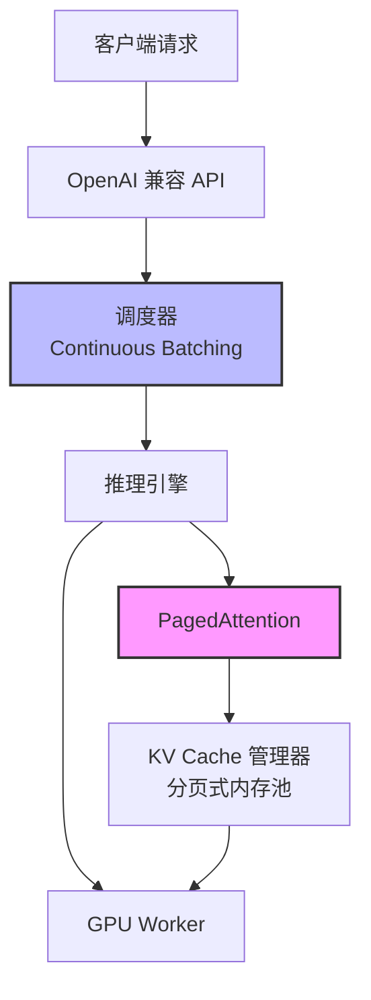

# vLLM（高性能LLM推理引擎）

## 基础概念

vLLM 是由加州大学伯克利分校团队开发的**高性能大语言模型推理引擎（LLM Inference Engine）**，2023 年开源。它的核心任务是：把大模型跑得更快、同时服务更多用户，同时把显存用到极致。

打个比方：大模型推理就像一个餐厅接待客人。传统方式给每个客人预留一整张大桌子，即使客人只坐了一个角，剩下的位置也空着。vLLM 的做法是把桌子拆成小方桌，按需拼接——来几个人拼几张，走了立刻释放给下一批客人。这就是它的核心创新 PagedAttention（分页注意力）。

在 Agent 应用场景中，vLLM 常用于搭建私有化的模型推理服务：部署一个开源模型，对外暴露与 OpenAI 完全一样的 API 接口，让所有用 OpenAI SDK 写的应用无缝切换到本地模型。

### 核心要素

| 要素 | 作用 |
|------|------|
| **PagedAttention（分页注意力）** | 把 KV Cache 拆成小页按需分配，显存利用率从传统的 20%-40% 提升到接近 100% |
| **Continuous Batching（连续批处理）** | 请求完成一个立刻补一个，GPU 始终满负荷运转，吞吐量提升数倍 |
| **OpenAI 兼容 API** | 提供和 OpenAI 一模一样的接口，改一行 `base_url` 就能切换到本地模型 |

### PagedAttention（分页注意力）

大模型在生成文本时，需要缓存之前所有 token 的计算结果（称为 KV Cache，即键值缓存）。传统做法是为每个请求预分配一大块连续显存，按最大长度预留。问题是：大多数请求用不到最大长度，大量显存白白浪费。

PagedAttention 借鉴了操作系统虚拟内存的分页思想：把 KV Cache 切成固定大小的小块（block），用一张页表（Page Table）记录每个请求用了哪些块。用多少分多少，用完了再申请新块，不同请求的块可以散布在显存的任意位置。

效果：KV Cache 的显存浪费从 60%-80% 降到不到 4%，相当于同样的 GPU 能同时服务多得多的用户。

### Continuous Batching（连续批处理）

传统批处理（Static Batching）把一批请求打包一起处理，必须等所有请求都完成才处理下一批。问题在于：短请求完成后 GPU 只能干等长请求，资源严重浪费。

Continuous Batching 采用动态策略：每生成一步 token 就检查有没有请求完成了，完成的立刻释放资源，新请求立刻插进来。GPU 始终保持满负荷运转，不存在"等最慢的"问题。

### OpenAI 兼容 API

vLLM 内置了一个与 OpenAI API 协议完全兼容的 HTTP 服务。启动后，任何使用 OpenAI SDK 的代码只需把 `base_url` 从 `https://api.openai.com/v1` 改成 `http://localhost:8000/v1`，其他代码一个字都不用动。这对已有 OpenAI 集成的项目来说，迁移成本几乎为零。

### 核心要素关系图



请求从上到下流经四层：API 层接收请求 → 调度器动态组批 → 推理引擎执行计算（PagedAttention 管理 KV Cache）→ GPU Worker 完成实际计算。

## 基础用法

安装依赖：

```bash
# 需要 CUDA 环境（NVIDIA GPU）
pip install vllm
```

> vLLM 仅支持 Linux 系统。Windows 用户需要通过 WSL2 或 Docker 使用。

最小可运行示例（基于 vllm==0.8.3 验证，截至 2026-03）：

```python
from vllm import LLM, SamplingParams

# 初始化模型（首次运行会自动从 HuggingFace 下载模型权重）
llm = LLM(
    model="Qwen/Qwen2.5-7B-Instruct",  # 模型名称
    gpu_memory_utilization=0.9,          # 最多使用 90% 的 GPU 显存
    max_model_len=4096,                  # 最大上下文长度
)

# 定义采样参数
sampling_params = SamplingParams(
    temperature=0.7,   # 控制随机性，0 = 确定性输出，1 = 更随机
    top_p=0.9,         # 核采样，只从概率前 90% 的 token 中选
    max_tokens=256,    # 最多生成 256 个 token
)

# 批量推理（vLLM 的强项：多条请求一次处理）
prompts = [
    "请用一句话解释什么是 Agent？",
    "Python 和 Java 的主要区别是什么？",
]

outputs = llm.generate(prompts, sampling_params)

for output in outputs:
    print(f"问题：{output.prompt}")
    print(f"回答：{output.outputs[0].text[:100]}...")
    print("-" * 50)
```

预期输出：

```text
问题：请用一句话解释什么是 Agent？
回答：Agent 是一种能够自主感知环境、做出决策并执行动作以完成特定目标的智能软件实体...
--------------------------------------------------
问题：Python 和 Java 的主要区别是什么？
回答：Python 是动态类型的解释型语言，语法简洁；Java 是静态类型的编译型语言，性能更强...
--------------------------------------------------
```

启动 OpenAI 兼容 API 服务（更常用的方式）：

```bash
# 一行命令启动服务
python -m vllm.entrypoints.openai.api_server \
    --model Qwen/Qwen2.5-7B-Instruct \
    --host 0.0.0.0 \
    --port 8000 \
    --max-model-len 4096
```

用 OpenAI SDK 调用：

```python
from openai import OpenAI

# 仅修改 base_url，其余代码与调用 OpenAI 完全一致
client = OpenAI(
    base_url="http://localhost:8000/v1",
    api_key="not-needed",  # vLLM 不需要真实 API key
)

response = client.chat.completions.create(
    model="Qwen/Qwen2.5-7B-Instruct",
    messages=[
        {"role": "system", "content": "你是一个专业的 AI 助手。"},
        {"role": "user", "content": "请解释 Agent 的 ReAct 范式。"}
    ],
    temperature=0.7,
    max_tokens=512,
)
print(response.choices[0].message.content)
```

## 同类工具对比

| 维度 | vLLM | SGLang | TGI（Text Generation Inference） |
|------|------|--------|----------------------------------|
| 核心定位 | 通用高性能推理引擎 | 高性能推理 + 结构化生成 | HuggingFace 官方推理服务 |
| 核心技术 | PagedAttention | RadixAttention（前缀树缓存） | Flash Attention + Continuous Batching |
| 模型支持 | 非常广泛（LLaMA、Qwen、Mistral、DeepSeek 等） | 广泛 | 广泛 |
| 结构化输出 | 支持（JSON Schema） | 原生支持（更强） | 基础支持 |
| 社区规模 | GitHub 50k+ stars，社区最大 | 快速增长中 | HuggingFace 生态加持 |
| 适合人群 | 需要通用、稳定的生产级部署 | 需要高级结构化输出和前缀缓存 | 已深度使用 HuggingFace 生态 |

核心区别：

- **vLLM**：社区最大、模型支持最全、文档最完善，通用生产部署的首选
- **SGLang**：RadixAttention 对多用户共享相同前缀（如 System Prompt）的场景更友好
- **TGI**：与 HuggingFace 生态（Hub、Inference Endpoints）集成最顺滑

## 常见误区

| 误区 | 准确理解 |
|------|----------|
| vLLM 只是一个 Python 推理库 | vLLM 提供完整的生产级服务：OpenAI 兼容 API、Prometheus 监控指标、多模型管理、Docker 部署 |
| PagedAttention 只是省内存 | 省内存是手段，真正目的是通过提高显存利用率支持更大并发批次，从而提升吞吐量 |
| GPU 越多速度越快 | 张量并行有通信开销。能装下单卡的模型，单卡反而比多卡快。多卡主要用于装不下的大模型 |
| 所有场景都该用 vLLM | vLLM 适合高并发服务场景。个人开发测试、单条推理，直接用 HuggingFace Transformers 更简单 |

## 优劣势分析

| 优势 | 劣势 |
|------|------|
| PagedAttention 显存利用率接近 100%，同等硬件下吞吐量大幅领先 | 仅支持 Linux，Windows 需通过 WSL2 或 Docker |
| OpenAI 兼容 API，已有代码零成本迁移 | 安装依赖较重（CUDA、PyTorch），环境配置门槛不低 |
| 支持张量并行，一行参数即可跨多 GPU 部署超大模型 | 对非 NVIDIA GPU（AMD、Intel）的支持仍在完善中 |
| 内置 Prefix Caching（前缀缓存），相同 System Prompt 的请求自动复用 KV Cache | 模型微调场景需配合 Multi-LoRA 功能，配置略复杂 |

## 思考题

<details>
<summary>初级：PagedAttention 为什么能提高显存利用率？它借鉴了什么思想？</summary>

**参考答案：**

PagedAttention 借鉴操作系统虚拟内存的分页管理。传统方式为每个请求预分配一大块连续显存（按最大长度预留），大部分空间浪费。PagedAttention 把 KV Cache 切成固定大小的小块，按需分配、用完再申请，通过页表映射逻辑地址到物理地址。这样消除了内存碎片和预分配浪费，显存利用率从 20%-40% 提升到接近 100%。

</details>

<details>
<summary>中级：Continuous Batching 与 Static Batching 有什么区别？为什么前者吞吐量更高？</summary>

**参考答案：**

Static Batching 把一批请求打包处理，必须等所有请求完成才处理下一批。短请求完成后 GPU 空等长请求，资源浪费严重。

Continuous Batching 在每一步 token 生成后检查哪些请求完成了，完成的立刻释放资源、新请求立刻加入。GPU 始终满负荷运转，没有"等最慢的"问题，吞吐量因此提升数倍。

</details>

<details>
<summary>中级：生产环境中 gpu_memory_utilization 和 max_model_len 怎么配？两者什么关系？</summary>

**参考答案：**

`gpu_memory_utilization` 控制 vLLM 可用的显存比例（默认 0.9）。vLLM 启动时先加载模型权重，剩余显存中的指定比例分给 KV Cache。`max_model_len` 决定支持的最大序列长度，直接影响单个请求占用的 KV Cache 大小。

两者关系：固定显存下，`max_model_len` 越大，单个请求占的 KV Cache 越多，能同时服务的并发数越少。生产建议：`max_model_len` 按业务实际最大长度设（不要盲目拉满），`gpu_memory_utilization` 设 0.85-0.95，留一点余量防 OOM。

</details>

## 参考资料

1. 官方文档：https://docs.vllm.ai/
2. GitHub 仓库：https://github.com/vllm-project/vllm
3. PagedAttention 论文：Kwon, W., et al. "Efficient Memory Management for Large Language Model Serving with PagedAttention." SOSP 2023. https://arxiv.org/abs/2309.06180
4. vLLM 官网：https://vllm.ai/
