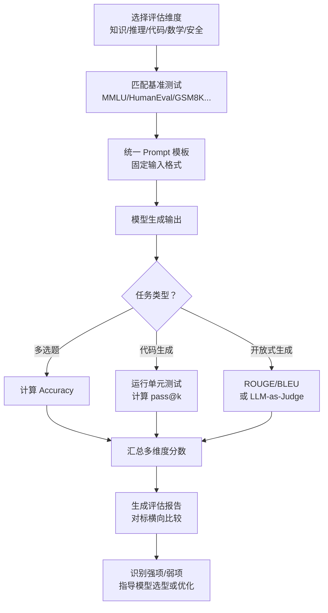

# 模型评估方法（Model Evaluation Methods）

## 概念解释

模型评估方法是一套用来给大语言模型"打分"的标准化体系。它通过固定的题库（Benchmark，基准测试）和量化的计分规则（Metric，评估指标），把模型的能力从"感觉还行"变成"MMLU 得了 88 分、代码通过率 92%"这样的具体数字。

为什么需要它？因为每家模型厂商都说自己最强，但口说无凭。你不能让 GPT-4 和 Claude 各写一篇作文然后凭感觉打分——这既不公平也不可重复。评估方法的核心价值就是提供一把"公共标尺"：同一套题、同一套评分规则，谁都可以复现，结果可以直接对比。

和传统软件测试不同，LLM 评估面临独特挑战：模型输出是非确定性的（同一个问题可能给出不同答案），能力是多维度的（擅长写代码不代表擅长数学），而且"好"的标准往往是主观的（摘要写得好不好？）。因此，现代 LLM 评估已经发展出一套从自动指标、标准基准到人工评测、LLM-as-Judge（用 LLM 评 LLM）的多层评估体系。

## 关键结构

模型评估体系由三个层次组成，从底层的计分规则到顶层的综合判断，逐层递进。

| 层次 | 作用 | 典型代表 |
|------|------|---------|
| 评估指标（Metrics） | 把模型输出转化为数字分数的计算公式 | Perplexity、BLEU、ROUGE、pass@k |
| 基准测试（Benchmarks） | 标准化的"考试题库"，用于横向对比不同模型 | MMLU、HumanEval、GSM8K、C-Eval |
| 评估方式（Methods） | 决定由谁来打分、怎么打分 | 自动评分、人工评测、LLM-as-Judge |

### 层次 1：评估指标（Metrics）

评估指标是最底层的"计分公式"，不同任务类型需要不同的指标。

**Perplexity（困惑度）**：衡量模型对文本的"惊讶程度"。数值越低，说明模型越能准确预测下一个词。适合衡量语言建模的基本能力，但无法反映回答是否正确或有用。注意：使用 API 调用的闭源模型通常不暴露概率值，因此无法计算 Perplexity。

**BLEU（双语评估替补分数）**：最初为机器翻译设计，通过计算模型输出和参考答案之间的 n-gram（连续 n 个词）重叠比例来打分。分数 0-1，越高越好。局限是只看表面词汇重叠，换个说法表达同样意思可能得低分。

**ROUGE（面向召回的摘要评估）**：专为文本摘要设计，重点看模型输出覆盖了参考答案中多少关键内容。ROUGE-1 看单词重叠，ROUGE-2 看两个连续词的重叠，ROUGE-L 看最长公共子序列。

**pass@k（通过率）**：专为代码生成设计。让模型生成 k 个候选代码，只要其中至少有一个能通过所有单元测试就算通过。pass@1 最严格（只生成一次就要对），pass@10 相对宽松。

**Accuracy（准确率）**：最直观的指标，用于多选题类基准。答对数除以总题数，简单但对开放式生成任务不适用。

### 层次 2：基准测试（Benchmarks）

基准测试是标准化的"考试题库"。以下是业界最常用的几个基准：

| 基准 | 考什么 | 题量 | 核心指标 | 现状 |
|------|--------|------|---------|------|
| MMLU | 57 个学科的通识知识 | 15,000+ 题 | Accuracy | 头部模型已接近饱和（~89%），区分度下降 |
| MMLU-Pro | MMLU 的增强版，10 选项 | 更多推理题 | Accuracy | 减少猜对概率，区分度更好 |
| HumanEval | Python 代码生成 | 164 题 | pass@k | 代码评估的"黄金标准" |
| GSM8K | 小学数学应用题 | 8,500 题 | Accuracy | 测试基础数学推理 |
| GPQA | 研究生级别的科学问答 | 专家出题 | Accuracy | 区分顶尖模型的"难题" |
| C-Eval / CMMLU | 中文多学科评估 | 13,000+ 题 | Accuracy | 中文能力的核心基准 |
| TruthfulQA | 真实性与抗幻觉能力 | 800+ 题 | 真实率 | 专测模型是否会"一本正经胡说八道" |
| SWE-bench | 真实 GitHub issue 修复 | 实际代码库 | 解决率 | 最接近真实开发场景的代码评估 |

### 层次 3：评估方式（Methods）

| 方式 | 原理 | 优点 | 缺点 |
|------|------|------|------|
| 自动评分 | 程序按公式计算分数 | 快、便宜、可重复 | 无法判断主观质量 |
| 人工评测 | 人类标注员打分 | 能判断语气、有用性等主观维度 | 慢、贵、主观不一致 |
| LLM-as-Judge | 用一个强模型给其他模型打分 | 兼顾速度和主观质量 | 可能有偏好偏差 |
| Chatbot Arena | 用户匿名对比两个模型的回答并投票 | 最接近真实用户感受 | 样本偏差、成本高 |

## 核心原理

### 原理说明

模型评估的核心逻辑可以拆解为三步：

**第一步：出题。** 从标准基准中选取测试集，或者根据业务场景自建评估集。关键是题目要覆盖目标能力维度，且不能被模型在训练时"背过答案"（数据泄漏问题）。

**第二步：答题。** 将测试题按固定格式（prompt 模板）输入模型，收集模型的原始输出。这里有个关键细节：同一道题，不同的 prompt 格式可能导致 5%-20% 的分数波动，因此评估时必须统一 prompt 模板。

**第三步：打分。** 根据任务类型选择对应的评估指标计算分数。多选题直接比对答案算准确率；代码题运行单元测试算 pass@k；开放式生成题则需要 ROUGE/BLEU 或 LLM-as-Judge。最终将各维度分数汇总为评估报告。

整套流程的核心价值在于**可复现性**：任何人用同一套题、同一套 prompt 模板、同一套评分规则，都应该得到相同（或极接近）的结果。

### Mermaid 图解



图中的关键路径是从"评估维度"到"评估报告"的完整链路。需要注意的是，分支节点"任务类型？"决定了使用哪种评分方式——这不是一个"选最好的"的问题，而是不同任务必须用对应的指标，用错指标会导致评估结果毫无意义。

### 运行示例

以下用 Python 演示 ROUGE 指标的计算原理，帮助理解"文本重叠度"这一核心概念。

```python
# 基于 rouge-score==0.1.2 验证（截至 2026-03）
from rouge_score import rouge_scorer

# 参考摘要（人工写的标准答案）
reference = "大语言模型通过预训练和微调两个阶段获得语言理解和生成能力"
# 模型生成的摘要
hypothesis = "大语言模型先进行预训练学习语言知识，再通过微调适应具体任务"

scorer = rouge_scorer.RougeScorer(['rouge1', 'rouge2', 'rougeL'], use_stemmer=False)
scores = scorer.score(reference, hypothesis)

for metric, score in scores.items():
    # precision: 生成文本中有多少比例匹配了参考答案
    # recall: 参考答案中有多少比例被生成文本覆盖
    # fmeasure: precision 和 recall 的调和平均
    print(f"{metric}: P={score.precision:.3f} R={score.recall:.3f} F={score.fmeasure:.3f}")
```

这段代码展示了 ROUGE 指标的三个维度：Precision（精确率）衡量生成文本中有多少是"有效内容"，Recall（召回率）衡量参考答案被覆盖了多少，F-measure 是两者的平衡值。实际评估中通常关注 ROUGE-L 的 F-measure。

## 易混概念辨析

| 概念 | 与模型评估方法的区别 | 更适合关注的重点 |
|------|---------------------|------------------|
| 模型训练中的 Loss | Loss 是训练过程中的优化目标，评估方法是训练完成后的外部测试 | Loss 低不代表评估分数高，两者衡量的是不同阶段的不同东西 |
| A/B 测试 | A/B 测试针对具体产品场景的用户行为，评估方法针对模型的通用能力 | A/B 测试回答"用户更喜欢哪个"，评估方法回答"模型在哪些能力上更强" |
| Agent 评估 | Agent 评估关注的是整个系统（模型 + 工具 + 流程）的任务完成率，模型评估只看模型本身 | Agent 评估需要额外考虑工具调用准确性、多步推理链的正确性 |

核心区别：

- **模型评估方法**：用标准化题库测试模型本身的能力，关注"这个模型行不行"
- **训练 Loss**：模型训练过程中的内部优化信号，关注"训练是否在收敛"
- **A/B 测试**：在具体产品中对比用户体验，关注"用户更喜欢哪个方案"
- **Agent 评估**：测试整个 Agent 系统的端到端表现，关注"这个系统能不能完成任务"

## 适用边界与局限

### 适用场景

1. **模型选型对比**：企业需要在多个候选模型中选一个最适合自己业务的。通过在相关基准上跑分对比，可以快速缩小候选范围。
2. **模型迭代验证**：每次微调或版本升级后，用同一套基准测试验证改进是否有效、有没有出现"灾难性遗忘"（Catastrophic Forgetting，改了 A 能力结果 B 能力变差）。
3. **安全合规审查**：模型上线前，用对抗攻击测试和偏见评估基准检查模型是否会输出有害内容，这在医疗、金融、政务等场景是刚需。

### 不适合的场景

1. **评估特定业务效果**：基准测试的题目是通用的，无法代表你的具体业务场景。MMLU 得 90 分不代表模型能写好你家的营销文案——这需要在你自己的数据上做评估。
2. **替代用户体验测试**：评估分数高不等于用户喜欢。模型可能在基准上得分很高，但回答风格生硬、不够友好，用户体验仍然差。

### 局限性

1. **基准饱和问题**：头部模型在 MMLU 等经典基准上的分数已经非常接近（GPT-4o 88.7% vs Claude 3.5 88.7%），几乎无法区分它们的差异。评估社区正在通过 MMLU-Pro、GPQA 等更难的基准来应对。
2. **数据泄漏风险**：如果基准题目在训练数据中出现过，模型可能是"背答案"而不是真正理解。这会导致分数虚高，不反映真实能力。
3. **刷分（Benchmark Gaming）**：模型团队可能针对知名基准进行过度优化，提高了分数但实际通用能力没有提升——就像"只为考试而学习"。
4. **开放式任务评估困难**：对于创意写作、对话质量等主观任务，BLEU/ROUGE 等自动指标只能衡量表面词汇重叠，无法评判内容的深度、逻辑性和有用性。

## 常见误区

| 常见误区 | 正确理解 |
|----------|----------|
| MMLU 分数最高的模型就是最好的 | MMLU 只测通识知识，不测代码、数学、长文本等能力。选模型要看你关心的维度，而不是某个单一基准的排名 |
| 自动评分指标能完全衡量回答质量 | BLEU/ROUGE 只衡量文字重叠，"换一种说法表达同样的意思"可能得低分。开放式任务需要配合 LLM-as-Judge 或人工评测 |
| 基准分数可以直接预测生产环境表现 | 基准是标准化"考试"，生产环境的输入远比考试题复杂多变。基准分数是必要参考，但不能替代在真实数据上的测试 |
| 评估做一次就够了 | 模型版本在更新，基准也在进化。定期重新评估是必要的，否则你参考的可能是过时的结论 |

## 思考题

<details>
<summary>初级：BLEU 和 ROUGE 指标的核心区别是什么？分别适合评估什么任务？</summary>

**参考答案：**

BLEU 侧重 Precision（精确率），衡量模型输出中有多少内容出现在参考答案里，最初为机器翻译设计。ROUGE 侧重 Recall（召回率），衡量参考答案中有多少内容被模型输出覆盖，为文本摘要设计。简单记忆：BLEU 问"你说的对不对"，ROUGE 问"你说全了没有"。

</details>

<details>
<summary>中级：某团队宣称新模型在 MMLU 上达到 92%，但没有公布其他基准的结果。你应该如何评价这个结果？</summary>

**参考答案：**

至少需要关注三个问题：(1) 是否存在数据泄漏——MMLU 题目是否出现在训练数据中；(2) 其他维度表现如何——代码生成、数学推理、长文本理解等能力是否同步提升；(3) 评估条件是否透明——使用了什么 prompt 模板、few-shot 还是 zero-shot、温度参数是多少。单一基准的高分不能说明模型综合能力强，可能是针对性优化的结果。

</details>

<details>
<summary>中级/进阶：如果你需要为一个中文客服场景选择 LLM，你会设计怎样的评估方案？只用公开基准够吗？</summary>

**参考答案：**

公开基准（C-Eval/CMMLU 测中文理解、TruthfulQA 测真实性）可以作为初筛，但不够。还需要：(1) 自建业务评估集——收集真实客服对话，标注"好回答"和"坏回答"作为评估样本；(2) 选择合适的评估方式——对话质量适合用 LLM-as-Judge 或人工评测，而非 BLEU/ROUGE；(3) 加入安全评估——测试模型在投诉、情绪激动等场景下是否会输出不当内容；(4) 考虑延迟和成本——客服场景对响应速度有要求，不能只看质量不看速度。

</details>

## 参考资料

1. Hendrycks et al. "Measuring Massive Multitask Language Understanding" (MMLU 原始论文): [https://arxiv.org/abs/2009.03300](https://arxiv.org/abs/2009.03300)
2. Chen et al. "Evaluating Large Language Models Trained on Code" (HumanEval 原始论文): [https://arxiv.org/abs/2107.03374](https://arxiv.org/abs/2107.03374)
3. LMSYS Chatbot Arena 排行榜: [https://lmarena.ai/](https://lmarena.ai/)
4. Hugging Face Open LLM Leaderboard: [https://huggingface.co/spaces/open-llm-leaderboard/open_llm_leaderboard](https://huggingface.co/spaces/open-llm-leaderboard/open_llm_leaderboard)
5. OpenCompass 大模型评估框架: [https://github.com/open-compass/opencompass](https://github.com/open-compass/opencompass)
6. Stanford HELM 评估框架: [https://crfm.stanford.edu/helm/](https://crfm.stanford.edu/helm/)
7. AIMultiple - Large Language Model Evaluation: [https://research.aimultiple.com/large-language-model-evaluation/](https://research.aimultiple.com/large-language-model-evaluation/)
