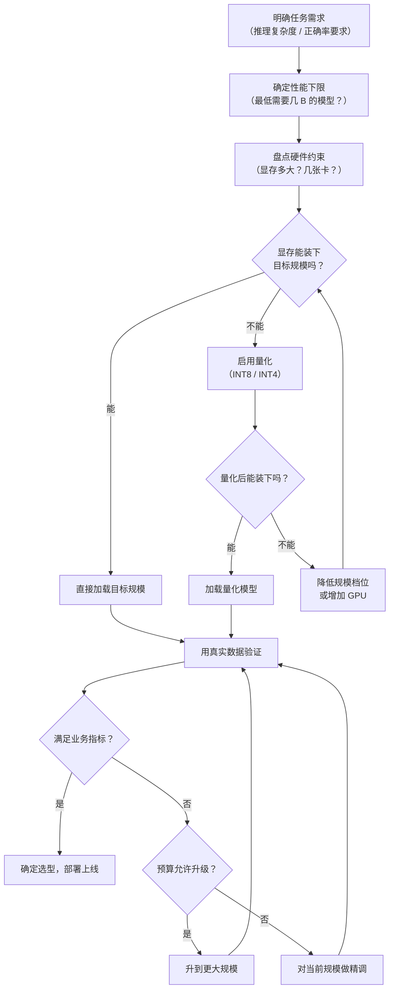

# 按规模选型（Model Selection by Parameter Size）

## 概念解释

按规模选型，指的是根据 LLM（Large Language Model，大语言模型）的参数数量（通常用 B 表示十亿）来决定选用哪个模型。参数数量越多，模型理论上越"聪明"，但推理成本、显存占用和部署复杂度也越高。核心目标是找到"刚好够用"的那个规模，而不是盲目追大。

这件事之所以重要，是因为模型规模直接决定了三笔账：**硬件投入**（需要多少张 GPU）、**运行成本**（每处理一条请求花多少钱）和**响应速度**（用户等多久才能收到回复）。选错规模的代价很高——选太大，每月多花数万美元但效果并未明显更好；选太小，业务指标达不到及格线，上线即翻车。

与传统软件"先选框架再写代码"不同，LLM 选型的核心变量是**参数量**。2026 年的行业共识是：**匹配任务，而非追求最大**。很多团队已经转向混合架构——用小模型处理 80% 的简单请求，只把复杂的 20% 交给大模型，整体成本可降低 60% 以上。

## 关键结构

| 维度 | 作用 | 说明 |
|------|------|------|
| 参数规模 | 决定模型的"知识容量"和推理上限 | 7B / 13B / 70B 等离散档位，越大越强但边际递减 |
| 硬件配置 | 决定能不能跑、跑多快 | GPU 显存是最硬的瓶颈，直接筛掉装不下的模型 |
| 量化方案 | 用精度换空间，降低显存需求 | INT4 可将显存需求压缩到 FP16 的 1/4，性能损失通常 <5% |
| 任务复杂度 | 决定"最低需要多大" | 简单分类 3B 够用，复杂推理至少 70B |
| 部署架构 | 决定实际吞吐和运维复杂度 | 单卡 vs 多卡并行 vs 云端 API |

### 维度 1：参数规模——模型的"排量"

参数规模类似于汽车的排量。1.5L 小车能通勤但跑不了越野，3.0T 大排量越野强但油耗高。LLM 也一样：

- **小规模（1B-7B）**：能做文本分类、情感分析、简单问答，部署在消费级 GPU 甚至手机上
- **中规模（7B-33B）**：能做代码生成、文档总结、多轮对话，企业应用的"甜蜜点"
- **大规模（70B+）**：能做复杂推理、专业诊断、多步逻辑链，需要专业级 GPU 集群

### 维度 2：硬件配置——最硬的约束

显存是第一个过滤条件。一个模型在 FP16（半精度浮点）下的显存占用可以简单估算：

> **显存（GB） = 参数量（B） x 2**

7B 模型 FP16 需要约 14GB 显存，70B 需要约 140GB。再加上推理时的 KV Cache（键值缓存）开销（约 20%-30%），实际需求还要更高。一张 24GB 的 RTX 4090 勉强能跑 7B 的 FP16，但 70B 必须用多张 A100/H100。

### 维度 3：量化方案——用精度换空间

量化（Quantization）是把模型参数从高精度（如 FP16，每个参数 2 字节）压缩到低精度（如 INT4，每个参数约 0.5 字节）的技术。效果：

| 精度 | 每参数字节 | 7B 显存 | 70B 显存 | 典型性能损失 |
|------|-----------|---------|---------|-------------|
| FP16 | 2 | 14 GB | 140 GB | 基准 |
| INT8 | 1 | 7 GB | 70 GB | <2% |
| INT4 | 0.5 | 3.5 GB | 35 GB | <5% |

INT4 量化后，70B 模型可以塞进单张 A100（80GB），这在 2024 年之前是不可想象的。

### 维度 4：任务复杂度——决定下限

判断任务需要多大模型的三个问题：
1. 是否需要多步推理？（是 -> 至少 13B）
2. 是否涉及专业/稀有知识？（是 -> 至少 33B）
3. 正确率要求是否 > 95%？（是 -> 至少 70B）

对于结合 RAG（检索增强生成）的场景，模型只需做总结和排序，7B 往往就够。

## 核心原理

### 原理说明

按规模选型的理论基础是 Scaling Law（缩放定律）。2020 年 OpenAI 发表的 Kaplan Scaling Law 首次揭示：模型性能（用 Loss 衡量）与参数量之间遵循**幂律关系**——参数翻倍，Loss 只下降一个固定比例，而非减半。这意味着**边际收益递减**。

2022 年 DeepMind 的 Chinchilla 论文进一步修正了这个认知：在固定计算预算下，**同时增加参数量和训练数据量**才是最优策略，而非一味堆参数。这直接影响了后来 LLaMA、Qwen 等模型家族的设计——它们宁愿用更多数据训练中等规模模型，也不盲目追求参数量。

到 2025-2026 年，行业又出现两个重要变化：

1. **MoE（Mixture of Experts，混合专家）架构**：如 DeepSeek-V3 总参数 671B，但每次只激活 37B。总参数决定知识容量，激活参数决定推理成本。这打破了"参数量 = 推理成本"的旧等式。

2. **小模型逆袭**：经过精调（Fine-tuning）的 7B 模型在特定领域可以媲美通用 70B 模型。数据质量比模型大小更重要。

选型的核心决策链路：**明确任务 -> 确定性能下限 -> 盘点硬件上限 -> 在可选范围内找成本最低的规模 -> 用真实数据验证 -> 不够再升级**。

### Mermaid 图解



这张流程图的关键分叉点有两个：一是硬件能否装下（物理约束），二是业务指标是否达标（效果约束）。量化和精调是两条"曲线救国"的路径——前者解决"装不下"，后者解决"不够准"。

### 运行示例

```python
# 模型规模选型速查工具（纯 Python，无外部依赖）
# 根据任务复杂度和硬件条件，推荐最合适的模型规模

# 规模档位参考数据（基于 2025-2026 主流开源模型实测）
SCALE_PROFILES = {
    "3B":  {"vram_fp16": 6,   "vram_int4": 1.5, "cost_idx": 1,  "tasks": "分类、情感分析、简单抽取"},
    "7B":  {"vram_fp16": 14,  "vram_int4": 3.5, "cost_idx": 2,  "tasks": "FAQ 问答、内容审核、RAG 总结"},
    "13B": {"vram_fp16": 26,  "vram_int4": 6.5, "cost_idx": 4,  "tasks": "代码生成、多轮对话、文档摘要"},
    "33B": {"vram_fp16": 66,  "vram_int4": 16,  "cost_idx": 10, "tasks": "复杂翻译、长文分析、专业问答"},
    "70B": {"vram_fp16": 140, "vram_int4": 35,  "cost_idx": 25, "tasks": "医学推理、法律分析、数学证明"},
}

def recommend(vram_gb: float, need_multi_step: bool = False,
              need_domain_expert: bool = False, allow_quantize: bool = True):
    """根据硬件和任务需求推荐模型规模"""
    # 根据任务复杂度确定最低规模
    if need_domain_expert:
        min_scale = 33
    elif need_multi_step:
        min_scale = 13
    else:
        min_scale = 3

    results = []
    for name, p in SCALE_PROFILES.items():
        param_b = int(name.replace("B", ""))
        if param_b < min_scale:
            continue
        # 检查显存是否装得下
        needed = p["vram_int4"] if allow_quantize else p["vram_fp16"]
        if needed <= vram_gb:
            quant = "INT4" if allow_quantize and needed == p["vram_int4"] else "FP16"
            results.append((name, quant, p["cost_idx"], p["tasks"]))

    if not results:
        return "当前硬件无法满足任务需求，建议增加 GPU 或使用云端 API"

    # 按成本从低到高排序，取最经济的
    results.sort(key=lambda x: x[2])
    best = results[0]
    return f"推荐: {best[0]} ({best[1]}) | 适合: {best[3]}"

# 示例：24GB 显卡，需要多步推理
print(recommend(vram_gb=24, need_multi_step=True))
# 输出: 推荐: 13B (INT4) | 适合: 代码生成、多轮对话、文档摘要

# 示例：8GB 显卡，简单分类任务
print(recommend(vram_gb=8, need_multi_step=False))
# 输出: 推荐: 3B (INT4) | 适合: 分类、情感分析、简单抽取
```

这段代码将选型决策简化为两步过滤：先按任务复杂度确定最低规模门槛，再按硬件显存筛选可部署的模型，最后取成本最低的那个。实际生产中还需用真实数据做 benchmark 验证。

## 易混概念辨析

| 概念 | 与按规模选型的区别 | 更适合关注的重点 |
|------|---------------------|------------------|
| Scaling Law（缩放定律） | 描述的是"规模与性能的数学关系"，是理论基础 | 幂律曲线、最优训练配比 |
| 模型蒸馏（Distillation） | 用大模型"教"小模型，是缩小规模的手段之一 | 教师-学生框架、知识迁移效率 |
| MoE 架构 | 总参数和激活参数分离，打破了"参数量=成本"的假设 | 激活参数量、路由机制、稀疏计算 |
| 模型量化（Quantization） | 不改变参数数量，只压缩每个参数的精度 | 精度档位选择（INT4/INT8）、性能损失评估 |

核心区别：

- **按规模选型**：面向工程决策，回答"该用多大的模型"
- **Scaling Law**：面向理论研究，回答"加大规模能提升多少"
- **蒸馏和量化**：面向优化手段，回答"怎么在更小的空间里跑更好的效果"
- **MoE 架构**：面向模型设计，让"总参数"和"推理成本"脱钩

## 适用边界与局限

### 适用场景

1. **项目初期选型**：团队刚开始接入 LLM，需要快速确定"用多大的模型"。参数规模是最直观的筛选维度，可以在几分钟内缩小候选范围。
2. **成本敏感的生产环境**：每月 API 调用量达百万级时，7B 和 70B 的成本差距可达 10 倍以上。按规模选型能直接省钱。
3. **硬件受限的部署场景**：边缘设备、私有化部署、离线场景。这些环境的显存和算力是硬上限，必须按规模筛选可用模型。

### 不适合的场景

1. **MoE 模型的选型**：MoE 模型的总参数和激活参数不同，不能简单按"参数量"比较。DeepSeek-V3（671B 总参 / 37B 激活）的推理成本接近 40B 级密集模型，而非 671B 级。
2. **同规模不同架构的精细对比**：两个都是 7B 的模型，因为训练数据、架构设计的差异，实际表现可能差距很大。此时需要 benchmark 实测，而非看参数量。

### 局限性

1. **参考数据时效性有限**：LLM 迭代极快，2025 年的 7B 模型可能超过 2023 年的 70B。对标表需要持续更新，否则会误导决策。
2. **微调后的模型不可按原规模评估**：一个在医学数据上精调过的 7B 模型，在医学问答上可能超过通用 70B。规模只是起点，不是终点。
3. **不考虑推理优化技术**：vLLM、TensorRT-LLM 等推理框架可以显著提升吞吐、降低延迟，这些优化与模型规模无关但对成本影响巨大。

## 常见误区

| 常见误区 | 正确理解 |
|----------|----------|
| 参数越多效果一定越好 | Scaling Law 显示边际收益递减。7B -> 13B 提升明显，70B -> 140B 提升可能不到 10%，但成本翻倍。经过精调的 13B 在垂直领域常常超过通用 70B |
| 显存占用 = 参数量 x 2 字节 | 这只算了参数本身。实际推理还需 KV Cache、激活值等额外开销（约 20%-30%）。7B FP16 理论 14GB，实际运行需 17-20GB |
| INT4 量化会严重损害效果 | 现代量化技术（NF4、GPTQ、AWQ）性能损失通常 <5%。9B 的 INT4 模型往往优于 3B 的 FP16 模型——降低了精度但保留了更大的知识容量 |
| 用 API 调用大模型总是更贵 | 低调用量时 API 反而便宜（无硬件投入）。当日调用超过约 10 万次时，自部署小模型的固定成本才比 API 的按量计费更划算 |

## 思考题

<details>
<summary>初级：一张 24GB 显存的 RTX 4090 能跑哪些规模的模型？</summary>

**参考答案：**

FP16 下：7B（约 14GB 参数 + KV Cache 约 17-20GB）勉强可以，13B（约 26GB）装不下。

INT4 下：7B（约 3.5GB）、13B（约 6.5GB）都能轻松运行，33B（约 16GB）也可以跑，70B（约 35GB）装不下。

结论：RTX 4090 搭配 INT4 量化，最大可跑 33B 级别的模型。

</details>

<details>
<summary>中级：为什么 2026 年越来越多团队采用"小模型 + 大模型"的混合路由架构？</summary>

**参考答案：**

原因有三：
1. **成本结构**：80% 的请求是简单任务（分类、FAQ），用 7B 模型处理成本极低；只有 20% 的复杂请求需要 70B 级别模型。混合架构可将总成本降低 60% 以上。
2. **延迟分布**：小模型本地推理延迟 50-200ms，大模型云端推理常超过 500ms。对实时性敏感的场景，小模型响应更快。
3. **MoE 的启发**：MoE 架构本质上就是"按需激活部分参数"的思路。混合路由将这个思路从模型内部扩展到了系统架构层面。

关键挑战是路由策略——如何判断一个请求"够不够简单"，需要一个轻量级的分类器或规则引擎。

</details>

<details>
<summary>中级/进阶：一家电商公司日均处理 50 万条商品描述生成请求，目前用 GPT-4 API，月费约 3 万美元。请设计一个降本方案。</summary>

**参考答案：**

分析：商品描述生成属于结构化文本生成，复杂度中等偏低，7B-13B 精调模型通常可以胜任。

方案：
1. **收集历史数据**：从 GPT-4 生成的优质描述中选 5-10 万条作为训练集
2. **精调 7B 模型**：选用 Qwen2.5-7B 或 LLaMA-3-8B，用 LoRA 精调（成本约 500-1000 美元）
3. **INT4 量化部署**：量化后显存约 3.5GB，单张 RTX 4090（约 1.2 万美元）即可部署
4. **效果对比**：A/B 测试对比精调 7B 与 GPT-4 的描述质量，若质量差距 <5% 则全量切换
5. **预估成本**：硬件一次性投入约 2-3 万美元（含冗余），月运维电费约 200 美元。第一个月即可收回投资，年节省约 35 万美元

风险点：少数复杂品类（如奢侈品、技术产品）可能仍需 GPT-4 兜底，可保留 5-10% 的 API 预算。

</details>

## 参考资料

1. Kaplan, J., et al. (2020). "Scaling Laws for Neural Language Models." arXiv:2001.08361 - [论文链接](https://arxiv.org/abs/2001.08361)
2. Hoffmann, J., et al. (2022). "Training Compute-Optimal Large Language Models (Chinchilla)." arXiv:2203.15556 - [论文链接](https://arxiv.org/abs/2203.15556)
3. [Small vs Large Language Models: The 2026 Reality Check - Index.dev](https://www.index.dev/blog/small-vs-large-language-models)
4. [LLM Model Size: 2026 Comparison Chart & Performance Guide - Label Your Data](https://labelyourdata.com/articles/llm-fine-tuning/llm-model-size)
5. [How to Choose the Right LLM Size - Vlad Koval, Medium](https://medium.com/@vlad.koval/how-to-choose-the-right-llm-size-5b8f341ba0d5)
6. [The State of LLMs 2025 - Sebastian Raschka](https://magazine.sebastianraschka.com/p/state-of-llms-2025)
