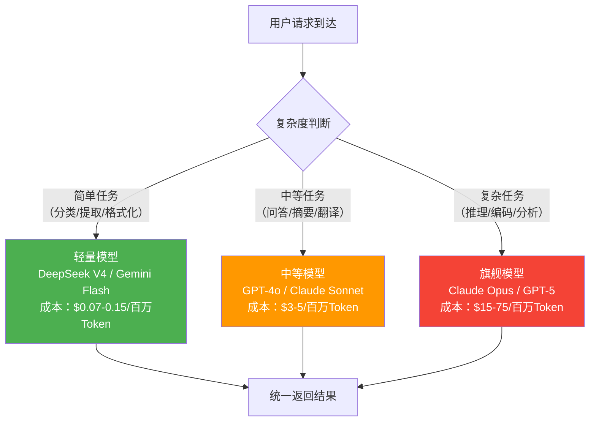

# 按场景选型（模型选择指南）

## 概念解释

按场景选型（Model Selection by Scenario）是指根据具体任务的需求特征，在多个候选大语言模型中选出最合适的那一个（或一组）的决策过程。它的核心不是"哪个模型最强"，而是"哪个模型最适合我的场景"。

为什么需要按场景选型？因为 2026 年市面上已有超过 200 个可用的 LLM（大语言模型），从 OpenAI 的 GPT-5、Anthropic 的 Claude 4.5、Google 的 Gemini 3，到开源的 DeepSeek、Qwen、LLaMA 等。每个模型在不同任务上的表现差异巨大——编码最强的未必写文案最好，推理最强的未必最便宜。如果不做选型，要么花冤枉钱（简单任务用顶级模型），要么做不好任务（复杂场景用廉价模型）。

和传统软件选型不同，LLM 选型有三个特殊挑战：模型能力边界模糊（同一个模型有时行有时不行）、市场更新极快（每季度都有新模型发布）、评测基准和真实场景存在偏差（Benchmark 分数高不等于你的任务做得好）。因此需要一套系统化的选型框架。

## 关键结构

按场景选型的核心框架可以概括为"三层三角"：三个评估层级 + 一个不可能三角。

| 结构 | 作用 | 说明 |
|------|------|------|
| 场景分析层 | 定义"要解决什么问题" | 确定任务类型、约束条件、质量底线 |
| 评估维度层 | 定义"用什么标尺量" | 性能、成本、速度、可靠性等维度及权重 |
| 决策执行层 | 定义"怎么选、怎么验" | 候选池筛选、对标测试、最终决策 |

### 结构 1：场景分析层

选型的第一步是把场景说清楚。"我要做一个 AI 应用"太模糊，需要回答三个问题：

- **任务类型**：通用对话、代码生成、长文档分析、数学推理、多模态理解？
- **约束条件**：有没有数据隐私要求（必须本地部署）？延迟上限是多少？月预算多少？
- **质量底线**：准确率低于多少不可接受？幻觉（Hallucination，模型编造事实）容忍度是多少？

### 结构 2：评估维度层

不同场景对各维度的权重完全不同。业界常用的加权评估框架：

| 维度 | 权重参考 | 衡量指标 |
|------|---------|---------|
| 准确率（Accuracy） | 25-40% | 在你的测试集上的正确率，不是公开 Benchmark |
| 成本（Cost） | 20-30% | 每百万 Token 的价格、月度总费用 |
| 速度（Latency） | 10-20% | 首 Token 延迟（TTFT）、每秒输出 Token 数 |
| 可靠性（Reliability） | 10-20% | 幻觉率、输出一致性、服务可用性 |
| 兼容性（Compatibility） | 5-10% | API 接入难度、供应商锁定风险 |

权重分配原则：**场景决定权重，不是模型决定权重**。比如客服机器人的成本权重高，医疗问答的准确率权重高，实时游戏 NPC 的速度权重高。

### 结构 3：决策执行层

评估维度确定后，进入实际的选型操作：

1. **筛选候选池**：根据硬性约束（预算、部署方式、语言支持）排除不可能的选项，留下 2-4 个候选模型
2. **对标测试**：用你的真实数据（或代表性样本）在候选模型上跑测试，记录各维度指标
3. **加权决策**：按权重计算综合评分，选出主模型 + 备选模型

## 核心原理

### 原理说明

模型选型的核心是一个**不可能三角**：性能、成本、速度三者不可兼得。任何模型都只能在这个三角中占据某个位置：

- **高性能模型**（如 Claude Opus 4.1、GPT-5）：准确率高，但价格贵、速度偏慢
- **高性价比模型**（如 Gemini 2.5 Flash、DeepSeek V4）：便宜且快，但复杂任务表现会打折
- **专用模型**（如 DeepSeek-Coder、Qwen-Coder）：特定任务上可能超越通用大模型，但泛化能力有限

选型的本质就是在这个三角中，根据你的场景找到"够用且最划算"的那个点。

一个更高级的策略是 Model Routing（模型路由）：不固定使用一个模型，而是根据每条请求的复杂度自动分发到不同模型。简单问题走小模型（便宜快），复杂问题走大模型（贵但准）。2025 年的研究表明，这种策略可以降低 37-46% 的成本，同时保持准确率不变。

### Mermaid 图解



图中展示的是 Model Routing 的基本逻辑：一个路由层根据请求复杂度，把任务分发到不同级别的模型。绿色代表低成本高吞吐，红色代表高成本高质量。实际生产中，复杂度判断可以基于规则（如 prompt 长度）、分类器或级联策略（先用小模型试，不行再升级）。

### 运行示例

```python
"""
按场景选型：加权评分计算示例
演示如何用加权矩阵量化选型决策
"""

# 候选模型的各维度得分（0-100 分制，数据为示意）
# cost 和 speed 分数越高代表越便宜/越快
candidates = {
    "Claude Opus 4.1":  {"accuracy": 95, "cost": 20, "speed": 55, "reliability": 93},
    "GPT-5":            {"accuracy": 92, "cost": 35, "speed": 60, "reliability": 88},
    "Gemini 2.5 Flash": {"accuracy": 78, "cost": 95, "speed": 93, "reliability": 75},
    "DeepSeek V4":      {"accuracy": 80, "cost": 98, "speed": 90, "reliability": 72},
}

# 不同场景的权重配置
scenarios = {
    "客服机器人":     {"accuracy": 0.25, "cost": 0.35, "speed": 0.25, "reliability": 0.15},
    "医疗问答系统":   {"accuracy": 0.45, "cost": 0.10, "speed": 0.10, "reliability": 0.35},
    "批量数据处理":   {"accuracy": 0.20, "cost": 0.40, "speed": 0.30, "reliability": 0.10},
}

for scenario, weights in scenarios.items():
    print(f"\n场景：{scenario}")
    print(f"  权重：准确率={weights['accuracy']}, 成本={weights['cost']}, "
          f"速度={weights['speed']}, 可靠性={weights['reliability']}")
    scores = {}
    for model, metrics in candidates.items():
        score = sum(metrics[dim] * weights[dim] for dim in weights)
        scores[model] = round(score, 1)
    # 按得分降序排列
    ranked = sorted(scores.items(), key=lambda x: x[1], reverse=True)
    for rank, (model, score) in enumerate(ranked, 1):
        marker = " ← 推荐" if rank == 1 else ""
        print(f"  {rank}. {model}: {score} 分{marker}")
```

预期输出：

```
场景：客服机器人
  权重：准确率=0.25, 成本=0.35, 速度=0.25, 可靠性=0.15
  1. DeepSeek V4: 87.6 分 ← 推荐
  2. Gemini 2.5 Flash: 87.2 分
  3. GPT-5: 63.5 分
  4. Claude Opus 4.1: 58.5 分

场景：医疗问答系统
  权重：准确率=0.45, 成本=0.10, 速度=0.10, 可靠性=0.35
  1. Claude Opus 4.1: 82.8 分 ← 推荐
  2. GPT-5: 81.7 分
  3. Gemini 2.5 Flash: 80.2 分
  4. DeepSeek V4: 80.0 分

场景：批量数据处理
  权重：准确率=0.20, 成本=0.40, 速度=0.30, 可靠性=0.10
  1. DeepSeek V4: 89.4 分 ← 推荐
  2. Gemini 2.5 Flash: 89.0 分
  3. GPT-5: 59.2 分
  4. Claude Opus 4.1: 52.8 分
```

上述代码展示了加权评分矩阵的核心逻辑：同样的模型在不同权重下排名完全不同。`cost` 字段用的是"得分"而非价格，分数越高代表越便宜。

## 易混概念辨析

| 概念 | 与按场景选型的区别 | 更适合关注的重点 |
|------|---------------------|------------------|
| Model Routing（模型路由） | 按场景选型是离线的选型决策过程；Model Routing 是运行时根据每条请求动态分发模型 | 关注如何在系统运行中实时匹配请求和模型 |
| Benchmark 评测 | Benchmark 是在标准数据集上测能力；按场景选型要求在你的真实数据上测 | 关注公开数据集上的横向对比 |
| 模型微调（Fine-tuning） | 选型是"选已有的模型"；微调是"改造模型使其适配你的数据" | 关注如何用自有数据提升特定任务的表现 |
| 按规模选型 | 按规模选型侧重参数量和部署条件；按场景选型侧重任务类型和业务需求 | 关注硬件资源、参数量与部署环境的匹配 |

核心区别：

- **按场景选型**：从业务需求出发，回答"我的任务该用哪个模型"
- **Model Routing**：选型之后的工程实现，回答"系统运行时每条请求该走哪个模型"
- **Benchmark 评测**：提供通用参考数据，但不能替代真实场景的对标测试

## 适用边界与局限

### 适用场景

1. **多模型可选时**：你的项目没有被锁定在某个供应商，有 2 个以上的候选模型可以选择
2. **成本敏感的大规模应用**：月请求量在百万级以上，模型选择直接影响数千到数万美元的月度开支
3. **任务特征明确的垂直场景**：如纯代码生成、纯文档摘要、纯分类提取——任务越明确，选型收益越大
4. **需要配置降级方案的生产系统**：主模型出故障时需要自动切换到备选模型

### 不适合的场景

1. **探索阶段的原型开发**：还在验证想法可行性时，直接选一个通用能力最强的模型即可，不需要花时间做选型
2. **单一供应商锁定**：如果公司政策只允许用某个供应商的模型，选型流程的价值有限

### 局限性

1. **评测结果有效期短**：模型市场更新极快，3-6 个月前的选型结论可能已经过时，需要持续投入重新评估
2. **真实数据获取困难**：对标测试需要用你的业务数据，但有些领域（医疗、金融）的数据涉及隐私，只能用脱敏或合成数据，评估准确度会打折
3. **模型输出不稳定**：同一个模型、同一个 prompt，不同时间调用的输出可能不同（受温度参数、模型版本更新等影响），单次测试不够可靠，需要多次取均值
4. **非技术因素干扰**：实际决策中，合规要求、商务关系、公司政策等非技术因素可能推翻纯技术选型结论

## 常见误区

| 常见误区 | 正确理解 |
|----------|----------|
| Benchmark 排名第一就一定最适合我的场景 | 公开 Benchmark（如 MMLU、HumanEval）用的是标准测试集，和你的真实业务数据可能差别很大。一个在 MMLU 上排名第五的模型，在你的中文法律文档场景上可能比第一名好 |
| 大模型一定比小模型好 | 对于简单任务（分类、实体提取、格式化），调优过的 7B 模型可能和 70B 模型表现相当，但推理成本低 10 倍以上。一个经过微调的小模型在特定领域往往能超越通用大模型 |
| 选定一个模型就不用再换了 | LLM 市场每季度都有重大更新。2025 年的最优选可能在 2026 年被新模型超越。建议至少每季度重新评估一次 |
| 越贵的模型越好 | Claude Opus 4.1 的输出价格是 DeepSeek V4 的 1000 倍，但并非所有任务都需要这个级别的能力。"够用就好"是选型的核心原则 |

## 思考题

<details>
<summary>初级：模型选型的"不可能三角"是哪三个维度？为什么说它们不可兼得？</summary>

**参考答案：**

性能（准确率）、成本、速度三者构成不可能三角。高性能模型（如 Claude Opus）参数量大、计算资源消耗高，因此价格贵且推理慢；低成本模型（如 DeepSeek V4）通过减小参数量或优化架构降低成本，但在复杂推理任务上表现会下降。没有模型能同时做到最准确、最便宜、最快，只能在三者之间做取舍。

</details>

<details>
<summary>中级：你负责一个客服机器人项目，月请求量 500 万次，要求延迟低于 2 秒，预算每月不超过 5000 美元。候选模型中，模型 A 准确率 92% 但每百万 Token 价格 15 美元，模型 B 准确率 86% 但每百万 Token 价格 0.5 美元。你会选哪个？为什么？</summary>

**参考答案：**

选模型 B。假设平均每次请求消耗约 500 个 Token（输入+输出），500 万次请求共计 25 亿 Token。模型 A 月度费用约 37,500 美元，远超预算。模型 B 月度费用约 1,250 美元，在预算内。虽然准确率低 6 个百分点，但客服场景通常可以通过 prompt 优化、人工兜底等方式弥补。如果准确率差距不可接受，可以考虑 Model Routing 方案：简单问题走模型 B，复杂问题升级到模型 A，在预算内最大化整体准确率。

</details>

<details>
<summary>中级/进阶：你的公司同时有三个 AI 项目——代码审查助手、营销文案生成、内部知识库问答。请为每个项目推荐一个模型层级（旗舰/中等/轻量），并说明理由。如果只有一个统一的 LLM 预算，你会如何分配？</summary>

**参考答案：**

- **代码审查助手 → 旗舰模型**（如 Claude Opus）：代码审查要求高准确率和强推理能力，一个漏检的 Bug 可能导致线上故障，质量要求高于成本要求。
- **营销文案生成 → 中等模型**（如 GPT-4o / Claude Sonnet）：文案生成需要一定的创意和语言能力，但容错率较高（人工可以修改），不需要旗舰模型。
- **内部知识库问答 → 轻量模型**（如 DeepSeek V4 / Gemini Flash）：知识库问答本质是检索 + 摘要，任务相对简单，且内部使用对质量要求低于外部产品。

预算分配建议：代码审查 50%，文案生成 30%，知识库问答 20%。因为代码审查的单次请求 Token 消耗最大（需要读完整代码）且质量要求最高，应该分配最多预算。

</details>

## 参考资料

1. OpenAI. "Models Overview." OpenAI Platform Documentation. https://platform.openai.com/docs/models

2. Anthropic. "Claude Models Overview." Claude API Documentation. https://docs.anthropic.com/en/docs/about-claude/models

3. The Complete Guide to LLM Selection (2025). Alex Harris. https://alexdharris.substack.com/p/the-complete-guide-to-llm-selection

4. The Model Selection Trap: Choosing the Right LLM for Agentic Systems (2026). Medium. https://medium.com/@nraman.n6/the-model-selection-trap-choosing-the-right-llm-for-agentic-systems-2026-be2817c2e533

5. Intelligent LLM Routing in Enterprise AI. Requesty Blog. https://www.requesty.ai/blog/intelligent-llm-routing-in-enterprise-ai-uptime-cost-efficiency-and-model

6. Cost- and Latency-Constrained Routing for LLMs (SCORE). Harvard. http://minlanyu.seas.harvard.edu/writeup/sllm25-score.pdf
