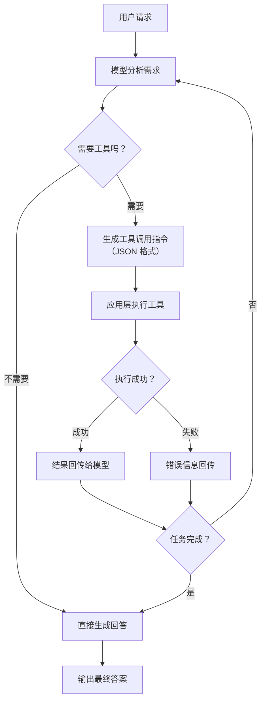

# Agent 与工具使用（Tool-Augmented LLM）

## 概念解释

大语言模型（LLM）天生只会"生成文本"——你问它今天天气，它只能根据训练数据猜，不能真的去查。Agent 与工具使用（Tool-Augmented LLM，即工具增强型大语言模型）就是解决这个问题的核心机制：让模型学会**描述"我想调哪个工具、传什么参数"**，然后由外部系统去真正执行，再把结果喂回给模型继续思考。

这个机制的出现源于 LLM 的三个根本短板：知识有截止日期（不知道今天发生了什么）、不能做数学计算（算错概率很高）、无法与外部系统交互（不能查数据库、发邮件、操作软件）。传统做法是为每个场景单独训练或微调模型，成本高、灵活性差。工具调用把"知道什么"和"能做什么"分离开——模型负责理解需求和规划步骤，工具负责执行具体操作，两者各司其职。

从 2023 年 Meta 的 Toolformer（工具学习的先驱论文）到 2025 年强化学习驱动的工具使用训练，再到 2026 年 Anthropic、OpenAI 推出的 Computer Use（计算机操作）Agent，这个方向已经从"调 API"进化到"操作整台电脑"。它被认为是 AI 从"能聊天"到"能干活"的关键转折点。

## 关键结构

工具调用的核心可以拆成四个环节，缺一不可：

| 结构 | 作用 | 说明 |
|------|------|------|
| 工具定义（Tool Definition） | 告诉模型"有哪些工具可用" | 用 JSON Schema 描述工具名称、功能说明和参数格式 |
| 意图生成（Intent Generation） | 模型决定"要不要用工具、用哪个" | 模型输出结构化的调用指令，而不是直接执行 |
| 工具执行（Tool Execution） | 外部系统真正运行工具 | 由应用层代码负责，模型不参与执行过程 |
| 结果回传（Result Feedback） | 把执行结果喂回模型 | 模型根据结果决定下一步：继续调工具还是直接回答 |

### 结构 1：工具定义

工具定义本质上是一份"使用说明书"，告诉模型这个工具叫什么、干什么、需要什么参数。模型完全依赖这份说明来判断何时该用它。说明写得越清晰，模型调用越准确；说明模糊或有歧义，模型就容易选错工具或传错参数。目前主流 LLM 提供商（OpenAI、Anthropic、Google 等）都采用 JSON Schema 格式来定义工具。

### 结构 2：意图生成

这是工具调用最核心的一步。模型分析用户的请求后，不是自己去执行操作，而是输出一段结构化数据（通常是 JSON），描述"我想调用 search 工具，参数是 query='今日天气'"。这种设计叫做 Constrained Generation（约束生成），模型的输出被限制在合法的工具名和参数范围内。这样做的好处是模型不需要真的有"执行能力"，只需要有"判断能力"。

### 结构 3：工具执行

执行由应用层代码负责，不是模型做的。系统拿到模型生成的调用指令后，验证参数是否合法，然后调用对应的函数或 API。执行可能成功也可能失败（网络超时、权限不足、参数错误等），系统需要把执行状态和结果都反馈给模型。

### 结构 4：结果回传

工具执行完毕后，结果作为新的上下文追加到对话中，模型读取后进行下一轮决策。这形成了一个**"思考 → 调用 → 观察 → 再思考"的循环**（即 Agent Loop，Agent 循环），直到模型认为任务完成才输出最终回答。

## 核心原理

### 原理说明

工具调用的完整流程可以分为五步：

1. **用户输入请求**：例如"NVDA 股价是多少？投资 1 万美元能买几股？"
2. **模型分析并拆解任务**：识别出需要先查股价、再做除法计算，规划出调用顺序
3. **生成工具调用指令**：模型输出 `{"tool": "get_stock_price", "params": {"symbol": "NVDA"}}`
4. **系统执行并返回结果**：应用层调用股价 API，返回"875.30 USD"
5. **模型读取结果，决定下一步**：拿到股价后，生成计算调用 `{"tool": "calculator", "params": {"expression": "10000/875.30"}}`，拿到结果后组织最终回答

关键点在于：模型从头到尾没有"执行"任何操作，它只负责"描述意图"。这种设计让系统可以对工具调用做权限控制、日志审计、参数校验，安全性远高于让模型直接执行代码。

### Mermaid 图解



图中的核心循环是 B → E → F → H → J → B 这条路径，即 Agent Loop。每次循环中，模型都可能调用不同的工具，也可能根据错误信息换一种策略重试。循环的终止条件是模型判断任务已完成。容易忽略的是失败路径（G → I → J → B）：工具执行失败时，模型需要能理解错误原因并调整策略，而不是死循环重试。

### 运行示例

```python
# 最小示例：展示工具定义 + 调用 + 结果回传的核心结构
# 基于 anthropic==0.45.0 验证（截至 2026-03）

from anthropic import Anthropic

client = Anthropic()

# 1. 定义工具（告诉模型有什么工具可用）
tools = [{
    "name": "calculator",
    "description": "执行数学计算，输入数学表达式，返回计算结果",
    "input_schema": {
        "type": "object",
        "properties": {
            "expression": {"type": "string", "description": "数学表达式，如 '100/3'"}
        },
        "required": ["expression"]
    }
}]

# 2. 发送请求，模型决定是否调用工具
response = client.messages.create(
    model="claude-sonnet-4-20250514",
    max_tokens=1024,
    tools=tools,
    messages=[{"role": "user", "content": "请计算 2024 * 365 等于多少天"}]
)

# 3. 检查模型是否生成了工具调用
for block in response.content:
    if block.type == "tool_use":
        print(f"模型想调用: {block.name}, 参数: {block.input}")
        # 4. 应用层执行工具（这里用 eval 简化演示）
        result = eval(block.input["expression"])
        print(f"执行结果: {result}")
```

上面的代码展示了工具调用的最小闭环：定义工具 → 模型生成调用指令 → 应用层执行 → 拿到结果。实际生产中还需要加上结果回传给模型的步骤（将 tool_result 追加到消息列表中再次调用模型），以及多轮循环和错误处理逻辑。

## 易混概念辨析

| 概念 | 与 Agent 工具使用的区别 | 更适合关注的重点 |
|------|------------------------|------------------|
| Function Calling（函数调用） | 是工具使用的底层实现机制，指模型输出结构化调用指令的能力；工具使用是更上层的概念，包含完整的循环和策略 | 关注 JSON Schema 定义、参数约束、模型输出格式 |
| RAG（检索增强生成） | RAG 只做"检索+生成"，是工具使用的一个特例（检索工具）；工具使用范围更广，可调用任意工具 | 关注向量检索、文档分块、相关性排序 |
| Plugin（插件系统） | 插件是封装好的工具包，工具使用是更底层的调用机制；插件依赖工具调用能力来工作 | 关注插件生态、分发机制、安全沙箱 |
| Computer Use（计算机操作） | Computer Use 是工具使用的极端形式——工具不再是 API，而是整台电脑的 GUI 操作 | 关注屏幕理解、鼠标键盘控制、多步骤 GUI 任务 |

核心区别：

- **Agent 工具使用**：关注"模型如何判断、选择和编排工具调用"的完整机制
- **Function Calling**：关注"模型输出结构化调用指令"的单次能力，是工具使用的基础组件
- **RAG**：只涉及检索这一种工具，是工具使用的子集
- **Computer Use**：工具从 API 扩展到 GUI 操作，是工具使用的前沿延伸

## 适用边界与局限

### 适用场景

1. **需要实时信息的任务**：查天气、查股价、搜新闻等，模型训练数据无法覆盖的实时需求，必须通过工具获取
2. **需要精确计算的任务**：数学计算、数据统计、单位换算等，LLM 直接算容易出错，调用计算工具可以保证精确
3. **多步骤复合任务**：先查数据 → 再分析 → 再生成报告，需要多个工具协同完成的链式任务
4. **需要与外部系统交互的任务**：发邮件、写数据库、调用第三方 API、操作软件界面等

### 不适合的场景

1. **纯知识问答**：模型训练数据已经覆盖的常识问题（如"什么是机器学习"），不需要调工具，直接回答更快更省成本
2. **极低延迟要求的场景**：每次工具调用都增加网络延迟和处理时间，Agent 循环可能需要 3-10 轮，不适合毫秒级响应的场景

### 局限性

1. **上下文窗口压力**：每轮工具调用和结果都会占用上下文 Token，长链任务容易导致上下文溢出，需要摘要或裁剪策略
2. **工具选择准确率有限**：工具数量过多时，模型可能选错工具或传错参数。实测中超过 20-30 个工具时准确率会明显下降
3. **成本倍增**：相比单次生成，Agent 循环的 API 调用量是 3-10 倍，Token 消耗和费用相应增加
4. **安全风险**：工具调用涉及外部系统操作，存在 Prompt Injection（提示注入攻击）风险——恶意输入可能诱导模型调用危险工具或泄露敏感数据

## 常见误区

| 常见误区 | 正确理解 |
|----------|----------|
| "模型直接执行了工具" | 模型只生成调用指令（JSON），实际执行由应用层代码负责。模型没有执行能力，只有判断和描述能力 |
| "工具越多越好" | 工具过多会增加模型的选择难度，降低准确率。应该只暴露当前任务需要的工具集，而不是把所有工具都塞进去 |
| "Function Calling 和 Tool Use 完全不同" | 在 2025 年的实际使用中，这两个术语基本可以互换。严格说 Function Calling 是 Tool Use 的底层实现方式，但大多数文档和 API 已经统一叫"Tool Use" |
| "有了工具调用就不需要 Fine-tuning" | 工具调用解决的是"能力扩展"问题，Fine-tuning（微调）解决的是"行为对齐"问题，两者互补而非替代 |

## 概念演进时间线

| 时间 | 里程碑 | 意义 |
|------|--------|------|
| 2023.02 | Meta 发布 **Toolformer** 论文 | 首次证明 LLM 可以自监督学习工具调用，无需大量人工标注 |
| 2023.06 | OpenAI 推出 **Function Calling API** | 工具调用从学术研究走向商业化 API，开发者可以直接使用 |
| 2024.06 | Anthropic 发布 **Tool Use API** | Claude 原生支持工具调用，与 OpenAI 形成双标准 |
| 2024.11 | Anthropic 发布 **MCP**（Model Context Protocol，模型上下文协议） | 开放标准，统一工具接口定义，解决各家 API 格式不兼容的问题 |
| 2025.01 | DeepSeek-R1 展示 **RLVR** 训练范式 | 证明强化学习 + 可验证奖励可以大幅提升模型的工具使用能力 |
| 2025.03 | OpenAI 采纳 MCP 标准 | MCP 从 Anthropic 独家标准变为行业共识 |
| 2025.12 | MCP 捐赠给 **Linux 基金会** | MCP 月下载量超 9700 万次，成为 AI 工具调用的事实标准 |
| 2026.03 | Anthropic 发布 **Claude Computer Use** | 工具使用从"调 API"进化到"操作整台电脑"，Agent 可以控制 macOS 应用 |

## 思考题

<details>
<summary>初级：模型在工具调用中扮演什么角色？它真的"执行"了工具吗？</summary>

**参考答案：**

模型扮演的是"决策者"和"意图描述者"的角色，而不是"执行者"。模型分析用户需求后，输出结构化的调用指令（如 JSON），描述想调用哪个工具、传什么参数。实际执行由应用层代码负责。这种分离设计让系统可以做权限控制、参数校验和日志审计，比让模型直接执行安全得多。

</details>

<details>
<summary>中级：如果你的 Agent 需要接入 50 个工具，但模型频繁选错工具，你会怎么解决？</summary>

**参考答案：**

核心策略是减少模型的选择负担：(1) 按任务类型分组，每次只暴露相关的 5-10 个工具，而不是全部 50 个；(2) 用一个"路由层"先判断任务属于哪个分类，再加载对应工具集；(3) 优化工具的 description，确保每个工具的功能边界清晰、无歧义；(4) 考虑使用 MCP 的 Tool Discovery 机制，让模型动态发现所需工具。

</details>

<details>
<summary>进阶：Toolformer（2023）和当前主流的工具调用训练方法有什么本质区别？这种演进说明了什么？</summary>

**参考答案：**

Toolformer 采用自监督方式：先用少量示例让模型标注训练数据中哪些位置应该插入 API 调用，再用"调用后预测是否更准"作为筛选标准来微调。而 2025 年的主流方法（如 Search-R1、ToolRL）转向强化学习 + 可验证奖励（RLVR）：直接用工具调用后的任务完成度作为奖励信号来训练。本质区别在于从"模仿式学习"进化到"目标驱动学习"——模型不再只是学"什么时候该调工具"，而是学"怎样调工具能把任务做好"。这说明工具使用正在从"附加功能"变成 LLM 训练的核心目标之一。

</details>

## 参考资料

1. Schick, T. et al. (2023). "Toolformer: Language Models Can Teach Themselves to Use Tools." NeurIPS 2023. https://arxiv.org/abs/2302.04761
2. Anthropic. "Tool Use - Claude API Documentation." https://docs.anthropic.com/en/docs/build-with-claude/tool-use/overview
3. Model Context Protocol 官方文档与规范. https://modelcontextprotocol.io/
4. Anthropic. "Computer Use Tool - Claude API Docs." https://platform.claude.com/docs/en/agents-and-tools/tool-use/computer-use-tool
5. "How reinforcement learning changed LLM tool-use." (2025) https://bdtechtalks.substack.com/p/how-reinforcement-learning-changed
6. "The evolution of LLM tool-use from API calls to agentic applications." (2025) https://bdtechtalks.com/2025/12/29/llm-tool-use-agentic-ai/
7. "LLM-Based Agents for Tool Learning: A Survey." Data Science and Engineering, Springer (2025). https://link.springer.com/article/10.1007/s41019-025-00296-9
