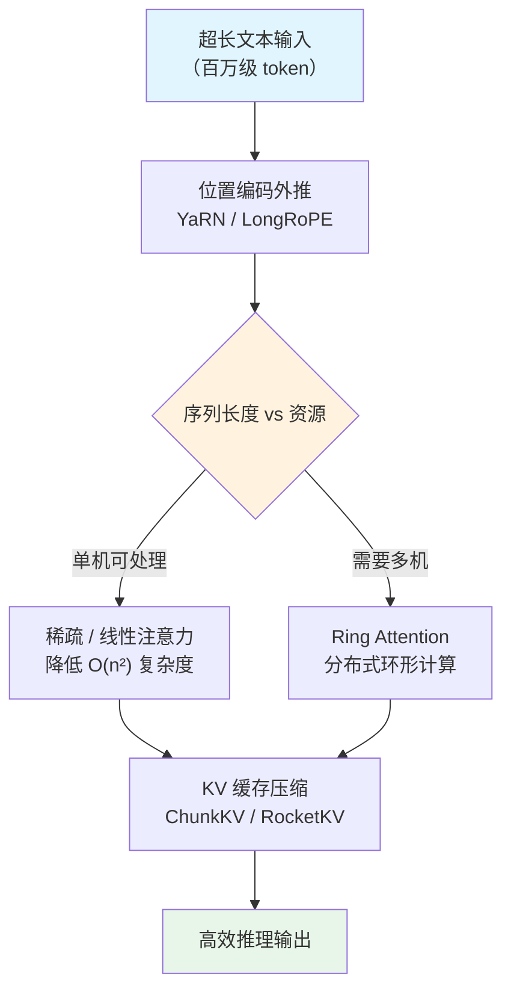

# 长上下文技术（Long Context Technology）

## 概念解释

长上下文技术是一组让大语言模型能处理超长文本输入的技术集合。它的目标是把模型的"阅读能力"从几千个 token（令牌）扩展到百万甚至千万级别。

为什么需要它？标准 Transformer（变换器）架构有两个天生的瓶颈。第一，位置编码（Position Encoding，告诉模型"这个词在第几个位置"的机制）在训练时只见过有限长度，超出范围就"不认识"了。第二，自注意力（Self-Attention）的计算量随序列长度呈平方增长——文本长 10 倍，计算量就是 100 倍。这两个瓶颈使得早期模型只能处理 2K-8K token，一篇长论文都塞不进去。

长上下文技术从三个方向同时破解这些瓶颈：**位置编码外推**让模型"认识"更远的位置，**注意力优化**降低计算的平方复杂度，**KV 缓存压缩**减少推理时的显存占用。三者配合，才有了今天 Claude 的 1M token、Gemini 的 2M token、Llama 4 Scout 的 10M token 窗口。

## 关键结构

| 技术方向 | 解决什么问题 | 代表方法 |
|---------|------------|---------|
| 位置编码外推 | 模型无法理解训练长度以外的位置 | RoPE 缩放、YaRN、LongRoPE |
| 注意力优化 | 自注意力的 O(n^2) 计算瓶颈 | 稀疏注意力、线性注意力、Ring Attention |
| KV 缓存压缩 | 推理时 KV 缓存撑爆显存 | ChunkKV、RocketKV、Infini-attention |

### 方向一：位置编码外推

Transformer 用位置编码告诉模型每个 token 的位置。目前主流方案是 RoPE（Rotary Position Embedding，旋转位置编码），它用旋转矩阵编码绝对位置，同时隐含了相对位置信息。问题在于：训练时只见过 0~4096 的位置，推理时遇到位置 100000 就"懵了"。

位置编码外推就是在不重新训练（或只做少量微调）的前提下，让模型能处理更长的位置索引。主流方案包括：

- **位置插值（Position Interpolation, PI）**：把超长位置线性压缩到训练范围内，比如把 0~32K 压缩到 0~4K
- **YaRN（Yet Another RoPE extensioN）**：对不同频率分量采用不同缩放策略，高频保持不动、低频按比例缩放，只需约 400 步微调就能扩展到 128K
- **LongRoPE**：从频率外推的角度优化，探索百万级 token 窗口

目前 DeepSeek、Qwen、LLaMA 等主流开源模型普遍使用 YaRN 进行上下文扩展。

### 方向二：注意力优化

即使位置编码能支持百万 token，标准自注意力的 O(n^2) 复杂度仍然是硬伤。注意力优化主要有三条路：

- **稀疏注意力（Sparse Attention）**：不计算所有 token 对的注意力，只关注"附近的"和"重要的"。滑动窗口、分块选择、学习式门控（如 SeerAttention）都属于这一类
- **线性注意力（Linear Attention）**：用核函数近似 softmax，把复杂度从 O(n^2) 降到 O(n)，代价是精度损失。Lightning Attention 是近期的代表
- **Ring Attention（环形注意力）**：把长序列分块分配到多台设备上，每台设备只算本地块的注意力，同时用环形通信传递 KV 块，通信和计算完全重叠。上下文长度可以随设备数量线性扩展，已实现 1 亿 token 的精确注意力计算

### 方向三：KV 缓存压缩

推理时模型会缓存所有已处理 token 的 Key 和 Value 向量（即 KV Cache），用于生成下一个 token。上下文越长，KV 缓存占用的显存越大——百万 token 的 KV 缓存可能占到 GPU 显存的 70% 以上。

KV 缓存压缩在不（或很少）损失精度的前提下减小缓存体积：

- **token 级淘汰**：丢弃注意力权重最低的 token 的 KV 对
- **语义块压缩（ChunkKV）**：以语义块而非单个 token 为单位做压缩，保留块间语义关系
- **极端压缩（RocketKV）**：两阶段策略——先粗粒度淘汰，再细粒度稀疏注意力，压缩比可达 400 倍
- **无限上下文（Infini-attention）**：Google 提出，在标准注意力中嵌入压缩记忆模块，让模型用有限内存处理无限长输入

## 核心原理

### 原理说明

长上下文处理的核心挑战可以归结为一句话：**怎样在有限的计算和内存资源下，让模型有效利用尽可能长的输入信息。**

以一个 100 万 token 的文档问答为例，处理流程如下：

1. **位置编码适配**：输入的位置索引从 0 到 999999，远超训练范围（如 4096）。YaRN 等方法对 RoPE 的频率参数做动态缩放，让模型在这些"没见过的位置"上仍能正常工作
2. **注意力计算**：如果用标准注意力，100 万 x 100 万 = 1 万亿次运算，显然不现实。稀疏注意力只计算每个 token 与附近窗口和少量"锚点"token 的关系；Ring Attention 则把序列分散到多台 GPU 上并行计算
3. **KV 缓存管理**：随着生成的推进，缓存不断增长。压缩方法定期淘汰不重要的 KV 对，或把旧的 KV 信息压缩到一个紧凑的记忆表示中
4. **输出生成**：模型基于（经过优化的）全局上下文生成回答

关键认知：这三个方向不是互相替代的"三选一"，而是**互补的技术栈**。生产系统通常三者结合使用。

### Mermaid 图解



图中展示了长上下文处理的典型决策路径。位置编码外推是必经的第一步；之后根据序列长度和硬件资源选择单机稀疏注意力还是多机 Ring Attention；最后 KV 缓存压缩贯穿整个推理过程，持续控制显存占用。

### 运行示例

以下用伪代码展示 YaRN 的核心缩放逻辑——对 RoPE 频率参数按"高频不动、低频缩放"的策略调整：

```python
import math

def yarn_rope_scaling(dim: int, base: int = 10000,
                      train_len: int = 4096, target_len: int = 131072,
                      beta_fast: float = 32.0, beta_slow: float = 1.0):
    """
    YaRN 位置编码缩放（简化版）
    dim: RoPE 维度数
    train_len: 训练时的上下文长度
    target_len: 目标上下文长度
    beta_fast / beta_slow: 高频/低频分界参数
    """
    scale = target_len / train_len  # 扩展倍数
    # 计算每个维度的原始频率
    freqs = [1.0 / (base ** (2 * i / dim)) for i in range(dim // 2)]
    # 高频阈值和低频阈值
    low_freq_cutoff = 1.0 / (train_len / beta_slow)
    high_freq_cutoff = 1.0 / (train_len / beta_fast)

    scaled_freqs = []
    for freq in freqs:
        if freq > high_freq_cutoff:
            # 高频：不缩放，保留原始分辨率
            scaled_freqs.append(freq)
        elif freq < low_freq_cutoff:
            # 低频：按比例缩放
            scaled_freqs.append(freq / scale)
        else:
            # 中间频段：平滑插值
            t = (freq - low_freq_cutoff) / (high_freq_cutoff - low_freq_cutoff)
            scaled_freqs.append(freq / (1 + (scale - 1) * (1 - t)))

    return scaled_freqs

# 示例：将 4K 窗口扩展到 128K
result = yarn_rope_scaling(dim=128, train_len=4096, target_len=131072)
print(f"缩放后频率数量: {len(result)}")
print(f"最高频率（不变）: {result[0]:.6f}")
print(f"最低频率（被缩放）: {result[-1]:.10f}")
```

上述代码对应 YaRN 论文的"NTK-by-parts"策略：高频维度保持原样以保留局部位置分辨率，低频维度按扩展比例缩放以覆盖更远距离，中间频段做平滑过渡。实际框架（如 Hugging Face Transformers）已内置此逻辑，使用时只需在配置中指定 `rope_scaling` 参数。

## 易混概念辨析

| 概念 | 与长上下文技术的区别 | 更适合关注的重点 |
|------|---------------------|------------------|
| RAG（检索增强生成） | RAG 从外部检索相关片段拼入提示，不改变模型本身的上下文能力；长上下文技术是扩展模型自身能处理的窗口大小 | 外部知识的实时注入 |
| Context Engineering（上下文工程） | 上下文工程关注"往窗口里放什么内容"的策略设计；长上下文技术关注"窗口能有多大" | 有限窗口内的信息编排 |
| Flash Attention | Flash Attention 是注意力计算的 GPU 优化实现（减少显存访问），不改变注意力的数学结果；长上下文技术中的稀疏/线性注意力改变了注意力的计算方式 | GPU 计算效率 |
| Sliding Window Attention | 滑动窗口注意力是稀疏注意力的一种具体模式，只关注固定窗口范围；长上下文技术是一个更大的技术体系 | 局部上下文的高效处理 |

核心区别：

- **长上下文技术**：扩展模型能"看到"多远，是底层能力的突破
- **RAG**：在现有窗口内补充外部知识，是应用层的策略
- **Flash Attention**：让同样的计算跑得更快，是硬件层的优化

## 适用边界与局限

### 适用场景

1. **长文档分析**：财务年报、法律合同、学术论文等动辄数万字的文档，需要模型一次性理解全文而非分段拼凑
2. **大型代码库理解**：整个项目的代码文件一起送入，让模型理解模块间依赖和全局架构。Claude 4.6 的 1M 窗口在代码库理解上表现突出
3. **长对话上下文保持**：客服、教学、咨询等场景中的多轮长对话，需要模型记住数小时前的对话内容
4. **多文档交叉引用**：同时处理多篇相关文档，进行对比、综合、交叉验证

### 不适合的场景

1. **实时低延迟场景**：长上下文的首 token 延迟（Time to First Token）与输入长度近似线性相关，百万 token 级输入可能需要等待数十秒。对延迟敏感的实时交互不适合塞入过长上下文
2. **信息高度分散的场景**：如果关键信息均匀分散在超长文本的各处，模型的"Lost in the Middle（中间遗忘）"问题会导致中段信息被忽略。此时 RAG 检索后精准注入效果更好

### 局限性

1. **窗口大小 ≠ 有效利用能力**：Llama 4 Scout 标称 10M token 窗口，但在长上下文推理基准测试中仅得 15.6%；即使是表现最好的 Claude Opus 4.6，在 1M token 上的 MRCR 召回率也只有 78.3%，意味着仍有约 22% 的相关信息被"忘记"
2. **成本随长度线性增长**：上下文翻倍，推理成本大致翻倍。部分厂商（如 OpenAI）对超长输入额外加价
3. **"Lost in the Middle"现象**：模型对输入开头和结尾的信息关注度高于中间部分，中段信息更容易被忽略。这是注意力机制的固有特性，目前没有完美解决方案

## 常见误区

| 常见误区 | 正确理解 |
|----------|----------|
| 上下文窗口越大，模型越聪明 | 窗口大小只是"能看多少"，不等于"能理解多好"。10M 窗口不意味着 10M 范围内都能精确推理，实际有效利用范围远小于标称值 |
| 位置编码扩展需要重新训练模型 | PI、NTK 等方法是纯推理时的调整；YaRN 只需几百步微调。这正是它们的实用性所在 |
| 稀疏注意力 = 丢弃部分 token | 稀疏注意力是选择性地计算 token 间的关系，每个 token 的信息仍完整保留，只是不和所有其他 token 都算一遍注意力 |
| 有了长上下文就不需要 RAG 了 | 两者互补而非替代。长上下文解决"读得下"，RAG 解决"找得到"。实际系统中，RAG 负责从海量文档中检索相关片段，长上下文负责对检索结果做深度理解 |

## 思考题

<details>
<summary>初级：为什么标准 Transformer 的自注意力在长序列上不可行？如果序列长度从 4K 增加到 1M，计算量变化多少倍？</summary>

**参考答案：**

标准自注意力的计算复杂度为 O(n^2)，其中 n 是序列长度。从 4K 到 1M，n 增加了 250 倍，计算量增加 250^2 = 62500 倍。这意味着如果 4K 序列需要 1 秒计算注意力，1M 序列在不优化的情况下需要约 17 小时。因此必须用稀疏注意力或线性注意力等技术降低复杂度。

</details>

<details>
<summary>中级：YaRN 为什么要对高频和低频采用不同的缩放策略？如果像 PI 那样统一缩放会有什么问题？</summary>

**参考答案：**

RoPE 的高频分量编码的是相邻 token 之间的细粒度位置关系（局部语序），低频分量编码的是远距离的粗粒度位置关系。PI 统一缩放会压缩高频分量，导致模型失去区分相邻位置的能力，表现为局部语义理解下降。YaRN 的"NTK-by-parts"策略保留高频不动（维持局部分辨率），只缩放低频（扩展远距离覆盖范围），在中间频段做平滑过渡，从而兼顾局部精度和远距离泛化。

</details>

<details>
<summary>中级/进阶：假设你需要构建一个处理 500 页 PDF 财报（约 50 万 token）的问答系统，GPU 只有一张 A100（80GB）。请分析应该组合使用哪些长上下文技术，并说明理由。</summary>

**参考答案：**

50 万 token 的 KV 缓存在常规配置下可能占用 40-60GB 显存，逼近单张 A100 的极限。建议组合方案：(1) 位置编码用 YaRN 扩展，因为开销极低且效果成熟；(2) 注意力计算用 Flash Attention + 局部稀疏注意力（滑动窗口 + 全局锚点 token），平衡精度与效率；(3) KV 缓存用 ChunkKV 或 RocketKV 压缩，以 10-16 倍压缩比将缓存控制在 5GB 以内；(4) 在应用层先用 RAG 检索最相关的章节，避免每次查询都处理全部 50 万 token。这样既利用了长上下文的全局理解能力，又通过 RAG 减少了实际处理量，在单卡约束下可行。

</details>

## 参考资料

1. Su, J. et al. "RoFormer: Enhanced Transformer with Rotary Position Embedding." arXiv:2104.09864, 2021. [https://arxiv.org/abs/2104.09864](https://arxiv.org/abs/2104.09864)
2. Chen, S. et al. "Extending Context Window of Large Language Models via Positional Interpolation." arXiv:2306.15595, 2023. [https://arxiv.org/abs/2306.15595](https://arxiv.org/abs/2306.15595)
3. Peng, B. et al. "YaRN: Efficient Context Window Extension of Large Language Models." ICLR 2024. [https://arxiv.org/abs/2309.00071](https://arxiv.org/abs/2309.00071)
4. Liu, H. et al. "Ring Attention with Blockwise Transformers for Near-Infinite Context." ICLR 2024. [https://arxiv.org/abs/2310.01889](https://arxiv.org/abs/2310.01889)
5. Munkhdalai, T. et al. "Leave No Context Behind: Efficient Infinite Context Transformers with Infini-attention." arXiv:2404.07143, 2024. [https://arxiv.org/abs/2404.07143](https://arxiv.org/abs/2404.07143)
6. Google AI for Developers. "Long context - Gemini API." [https://ai.google.dev/gemini-api/docs/long-context](https://ai.google.dev/gemini-api/docs/long-context)
7. Epoch AI. "LLMs now accept longer inputs, and the best models can use them more effectively." [https://epoch.ai/data-insights/context-windows](https://epoch.ai/data-insights/context-windows)
