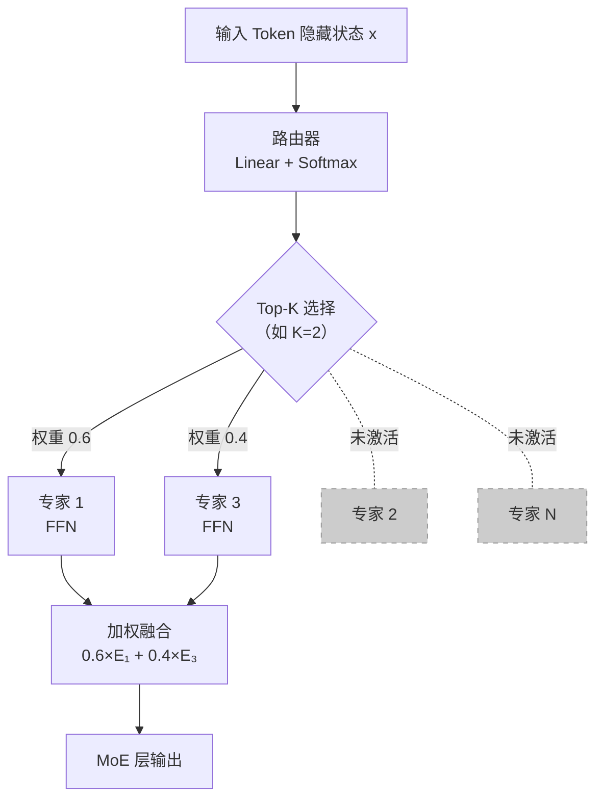

# 混合专家模型（Mixture of Experts, MoE）

## 概念解释

MoE（Mixture of Experts，混合专家模型）是一种神经网络架构设计，核心思路是：把模型中原本统一的前馈网络（FFN）拆成多个独立的"专家"子网络，再用一个"路由器"根据每个输入 Token 的特征，动态选出少数几个专家来执行计算。这样模型总参数量很大，但每次推理只激活一小部分参数，实现了"参数量大但推理成本低"的效果。

传统的大语言模型（LLM）是"稠密模型"（Dense Model）——所有参数对每个输入都参与计算。参数翻倍，推理成本也翻倍。MoE 打破了这个线性关系：DeepSeek-V3 拥有 671B 总参数，但每个 Token 只激活 37B（约 5.5%），推理成本和一个 37B 的稠密模型接近，能力却远超同级别稠密模型。

可以类比为"医院分诊"：患者（Token）进门后先经过分诊台（路由器），分诊台根据症状把患者分配给对应科室的医生（专家），而不是让所有医生同时给一个患者看病。

## 关键结构

| 结构 | 作用 | 说明 |
|------|------|------|
| 专家网络（Expert） | 执行实际计算 | 通常是独立的 FFN，各自有不同参数，在训练中逐渐学会处理不同类型的特征 |
| 路由器（Router / Gating Network） | 决定激活哪些专家 | 轻量级线性层 + Softmax，为每个 Token 生成专家权重分布 |
| Top-K 选择机制 | 控制稀疏度 | 只选得分最高的 K 个专家参与计算（K 通常为 1-8），是"稀疏激活"的关键 |
| 负载均衡机制（Load Balancing） | 防止专家利用率不均 | 确保所有专家都被充分训练，避免路由器只依赖少数"热门"专家 |

### 结构 1：专家网络（Expert）

在 Transformer 架构中，每个 Transformer 块包含自注意力层和 FFN 层。MoE 做的事就是把 FFN 层替换为多个并行的专家网络。每个专家都是一个独立的 FFN，拥有自己的参数。

关键点：专家不是人为预设"你负责数学、你负责代码"，而是在训练过程中通过梯度更新自然分化，逐渐各有擅长领域。这种分化完全由训练数据和路由机制共同驱动。

### 结构 2：路由器（Router）

路由器是 MoE 的调度核心。它接收当前 Token 的隐藏状态（Hidden State），通过一个线性层映射到"每个专家的得分"，再用 Softmax 转成概率分布。

数学表达：$G(x) = \text{Softmax}(W_r \cdot x)$，其中 $W_r$ 是路由器参数，$x$ 是 Token 的隐藏状态，输出是长度为 N（专家总数）的概率向量。

路由器和整个模型一起端到端训练，梯度会回传到路由器，让它学会"什么样的输入该分给哪个专家"。

### 结构 3：Top-K 选择与输出融合

从路由器的概率分布中选出得分最高的 K 个专家，只让这 K 个专家执行前向计算，其余专家不参与。最终输出是 K 个专家的结果按路由权重加权求和：

$$y = \sum_{i \in \text{TopK}} G(x)_i \cdot E_i(x)$$

不同模型的 K 值选择不同：Switch Transformer 用 Top-1（只选一个专家），Mixtral 8x7B 用 Top-2，DeepSeek-V3 用 Top-8（从 256 个专家中选 8 个）。

### 结构 4：负载均衡机制

如果没有约束，路由器会"偷懒"——反复把 Token 送给少数表现好的专家，其他专家得不到训练，形成恶性循环。解决方案有两种主流路线：

- **辅助损失法**（Auxiliary Loss）：在训练损失中加一项惩罚，鼓励路由器均匀分配 Token。Switch Transformer 和 Mixtral 用这种方法。
- **无辅助损失法**（Auxiliary-Loss-Free）：DeepSeek-V3 的创新。给每个专家加一个偏置项（Bias Term），不通过梯度更新，而是在训练中根据专家的被选中频率动态调整——被选少了就调高偏置，效果比辅助损失更好。

## 核心原理

### 原理说明

MoE 层的工作过程分四步：

1. **路由计算**：Token 的隐藏状态进入路由器，路由器输出一个概率分布，表示该 Token 与每个专家的匹配程度。
2. **Top-K 选择**：从概率分布中选出得分最高的 K 个专家，其余专家在本次计算中不参与。
3. **专家计算**：被选中的 K 个专家并行执行前向计算（通常是 FFN），各自输出一个结果向量。
4. **加权融合**：按路由权重对 K 个专家的输出做加权求和，得到该 Token 的最终输出。

整个机制的关键洞察是：不同的 Token 需要不同的"知识"来处理。一个关于代码的 Token 可能需要"代码专家"，一个关于历史的 Token 可能需要"常识专家"。路由器学会了根据输入特征做这种分配，实现了"按需调用"。

### Mermaid 图解



图中实线表示被激活的路径，虚线表示未激活的专家。核心要点：每个 Token 只走少数几条路径，大部分专家在本次计算中处于"休眠"状态，这就是"稀疏激活"（Sparse Activation）的含义。

### 运行示例

```python
# 最小 MoE 层实现（基于 PyTorch，纯教学用途）
import torch
import torch.nn as nn
import torch.nn.functional as F

class MoELayer(nn.Module):
    """最小化的 MoE 层：路由器 + 多专家 + Top-K 选择"""
    def __init__(self, hidden_dim, num_experts=4, top_k=2):
        super().__init__()
        self.top_k = top_k
        # 每个专家是一个简单的两层 FFN
        self.experts = nn.ModuleList([
            nn.Sequential(nn.Linear(hidden_dim, hidden_dim * 2),
                          nn.GELU(),
                          nn.Linear(hidden_dim * 2, hidden_dim))
            for _ in range(num_experts)
        ])
        # 路由器：线性层，输出每个专家的得分
        self.router = nn.Linear(hidden_dim, num_experts)

    def forward(self, x):
        # x 形状: (batch, seq_len, hidden_dim)
        scores = F.softmax(self.router(x), dim=-1)          # 路由概率
        topk_w, topk_idx = torch.topk(scores, self.top_k, dim=-1)  # Top-K 选择
        topk_w = topk_w / topk_w.sum(dim=-1, keepdim=True)  # 归一化权重

        # 计算所有专家输出并按 Top-K 索引加权融合
        all_out = torch.stack([expert(x) for expert in self.experts], dim=-2)
        # all_out 形状: (batch, seq_len, num_experts, hidden_dim)
        out = torch.zeros_like(x)
        for k in range(self.top_k):
            idx = topk_idx[..., k].unsqueeze(-1).expand_as(x)
            expert_out = all_out.gather(-2, topk_idx[..., k].unsqueeze(-1).unsqueeze(-1).expand(*x.shape[:-1], 1, x.shape[-1])).squeeze(-2)
            out += topk_w[..., k].unsqueeze(-1) * expert_out
        return out

# 验证
moe = MoELayer(hidden_dim=64, num_experts=4, top_k=2)
x = torch.randn(1, 8, 64)  # 1 条句子，8 个 Token，64 维
y = moe(x)
print(f"输入: {x.shape} → 输出: {y.shape}")  # (1, 8, 64) → (1, 8, 64)
```

上述代码展示了 MoE 的三个核心步骤：路由器计算得分、Top-K 选择专家、加权融合输出。实际生产中的 MoE 实现会用更高效的批处理和分布式通信来替代 Python 循环。

## 易混概念辨析

| 概念 | 与 MoE 的区别 | 更适合关注的重点 |
|------|---------------|------------------|
| 稠密模型（Dense Model） | 所有参数对每个输入都参与计算，参数量 = 推理成本 | 架构简单，训练稳定，适合中小规模模型 |
| 模型集成（Ensemble） | 多个独立模型分别推理后合并结果，推理成本是所有模型之和 | 提升鲁棒性，但成本随模型数量线性增长 |
| 多头注意力（Multi-Head Attention） | 每个头都参与每次计算（是"稠密"的），只是在注意力维度上分工 | 注意力层内部的并行计算，不涉及稀疏激活 |

核心区别：

- **MoE**：通过路由器动态选择子网络，同一架构内的条件计算（Conditional Computation），每个 Token 走不同路径
- **模型集成**：多个完整模型各自独立推理再合并，没有共享参数，成本是模型数量的倍数
- **多头注意力**：同一层内的并行计算，所有头都参与每个 Token 的处理，不存在"选择性激活"

## 适用边界与局限

### 适用场景

1. **大规模通用语言模型**：MoE 的最大舞台。需要处理多种任务（代码、数学、写作、问答），不同专家可以自然分化出不同能力，而推理成本保持可控。DeepSeek-V3、Mixtral、Qwen3-235B 都采用 MoE。
2. **对推理成本敏感的高智能场景**：需要强能力但预算有限时，MoE 能用较低的推理成本提供接近超大稠密模型的能力。例如 Kimi K2 有万亿参数但每次推理只用 32B。
3. **多任务和多领域学习**：不同专家自然分工处理不同领域的特征，比强制让一个稠密模型兼顾所有任务更高效。

### 不适合的场景

1. **显存极其有限的单卡部署**：虽然推理时只激活部分专家，但所有专家的参数都需要加载到显存中。671B 参数的 MoE 模型显存需求和 671B 稠密模型接近。
2. **高度专一的小模型任务**：如果任务单一且规模小，MoE 的路由机制和多专家结构反而增加了训练复杂度，不如直接用小型稠密模型。

### 局限性

1. **训练难度高**：需要精心设计负载均衡策略、路由器学习率、专家初始化等，一个细节不对就可能导致部分专家"死掉"（完全不被选中）。
2. **显存占用大**：总参数都需加载到内存，即使推理时只用一小部分。这对部署硬件提出较高要求。
3. **路由器依赖训练分布**：如果推理时的输入分布与训练时差异过大，路由器的分配决策可能不再最优。
4. **框架和工具链成熟度不足**：相比稠密模型，MoE 的分布式训练、推理优化、调试工具仍在快速发展中。

## 常见误区

| 常见误区 | 正确理解 |
|----------|----------|
| "Mixtral 8x7B 有 56B 参数"（8×7=56） | 实际总参数约 46.7B，每个 Token 激活约 12.9B。"8x7B"是品牌命名，不是简单乘法 |
| "MoE 推理很慢，因为参数量巨大" | 恰恰相反，MoE 的推理成本由激活参数量决定，而不是总参数量。DeepSeek-V3（671B）推理时只用 37B 参数，成本接近同级别稠密模型 |
| "负载均衡会自动实现，不需要特殊处理" | 这是最常见的陷阱。没有负载均衡约束，路由器会收敛到只用少数专家，大部分参数浪费。必须使用辅助损失或偏置调整等机制 |
| "专家是预先指定负责某个领域的" | 专家的分工是在训练中通过梯度自然形成的，没有人为预设。哪个专家擅长什么，完全由训练数据和路由动态决定 |

## 思考题

<details>
<summary>初级：MoE 中的"稀疏激活"是相对于什么而言的？为什么稀疏激活能降低推理成本？</summary>

**参考答案：**

"稀疏激活"是相对于"稠密模型"而言的。稠密模型中，所有参数在每次前向传播中都参与计算；MoE 的稀疏激活只让一小部分专家（Top-K）参与计算，其余专家不执行前向传播。由于推理的计算量（FLOPs）与激活的参数量成正比，只激活 K 个专家意味着计算量约等于 K 个专家的参数量之和，而不是全部专家的参数量之和。例如 DeepSeek-V3 有 256 个路由专家但只激活 8 个，计算量大幅降低。

</details>

<details>
<summary>中级：Switch Transformer 用 Top-1 路由（只选 1 个专家），Mixtral 用 Top-2，DeepSeek-V3 用 Top-8。K 值的选择涉及哪些权衡？</summary>

**参考答案：**

K 越大：激活参数更多，模型对每个 Token 的表达能力更强，精度通常更高，但推理计算量也更大，通信开销增加（分布式部署时需要在更多设备间传输数据）。K 越小：推理更快更省资源，但每个 Token 能利用的知识更有限，可能损失精度。Switch Transformer 选 K=1 是为了极致的训练效率（论文重点是验证 MoE 的可扩展性）；DeepSeek-V3 选 K=8 但配合 256 个细粒度专家（每个专家更小），总激活参数量仍然可控。K 值的选择还受专家粒度影响——专家越小越多，K 可以适当增大。

</details>

<details>
<summary>中级/进阶：一个 MoE 模型在训练时负载均衡很好，但部署到生产环境后发现某些专家几乎不被激活。可能的原因是什么？如何排查？</summary>

**参考答案：**

最可能的原因是生产环境的输入分布与训练数据分布存在偏差（Distribution Shift）。路由器是在训练数据分布上学习的，如果生产数据的领域、风格、长度等与训练数据差异较大，路由器的分配决策就不再最优。排查思路：(1) 收集生产数据的路由统计（每个专家的激活频率），与训练时的统计对比；(2) 分析被冷落的专家在训练时主要处理什么类型的输入，看生产数据中是否缺少这类输入；(3) 如果问题严重，可以在生产数据上做少量微调，让路由器适应新分布。

</details>

## 参考资料

1. Shazeer et al., 2017. "Outrageously Large Neural Networks: The Sparsely-Gated Mixture-of-Experts Layer." ICLR 2017. https://arxiv.org/abs/1701.06538 — MoE 在深度学习中的奠基论文
2. Fedus et al., 2022. "Switch Transformers: Scaling to Trillion Parameter Models with Simple and Efficient Sparsity." JMLR. https://arxiv.org/abs/2101.03961 — 首次将 MoE 大规模应用于 Transformer，提出 Top-1 路由
3. DeepSeek-AI, 2024. "DeepSeek-V3 Technical Report." https://arxiv.org/abs/2412.19437 — 671B 参数 MoE 模型，提出无辅助损失负载均衡和细粒度专家设计
4. Mistral AI, 2024. "Mixtral of Experts." https://arxiv.org/abs/2401.04088 — 首个接近 GPT-3.5 水平的开源 MoE 模型
5. Hugging Face, 2024. "Mixture of Experts Explained." https://huggingface.co/blog/moe — 高质量 MoE 技术科普
6. NVIDIA Technical Blog, 2024. "Applying Mixture of Experts in LLM Architectures." https://developer.nvidia.com/blog/applying-mixture-of-experts-in-llm-architectures/ — MoE 在 LLM 中的工程实践

---

<!-- 内容准确性自查清单：
## 事实准确性
- [x] 概念定义准确，用自己的话重新组织，未复制官方原文
- [x] 核心原理描述正确，区分了 MoE 与模型集成、多头注意力等概念
- [x] 关键结构提取合理：专家、路由器、Top-K、负载均衡四个核心组件完整
- [x] 适用边界与局限描述客观（显存占用、训练难度等）

## 图表准确性
- [x] Mermaid 图清晰展示了 Token → 路由器 → Top-K 选择 → 专家计算 → 融合的完整流程
- [x] 虚线标注了未激活的专家，准确体现稀疏激活语义
- [x] 图与文字描述一致

## 代码准确性
- [x] 最小示例展示了 MoE 层的核心三步：路由、选择、融合
- [x] 包含必要 import，代码注释用中文
- [x] 未写环境变量配置、API Key 等工程细节

## 辨析与误区
- [x] 与稠密模型、模型集成、多头注意力的区别清晰
- [x] 常见误区均为高频误解（参数量命名、推理速度、负载均衡自动性、专家预设）

## 引用准确性
- [x] 所有参考资料真实存在且链接有效
- [x] 论文作者、年份、会议/期刊信息准确
- [x] 参考资料与正文内容相关

## 内容完整性
- [x] YAML 头部所有必填字段已填写，last_updated 为当天日期
- [x] 各章节完整，无占位符残留
- [x] 包含 Mermaid 图
- [x] 整体风格为知识卡片，非工具教程
-->
