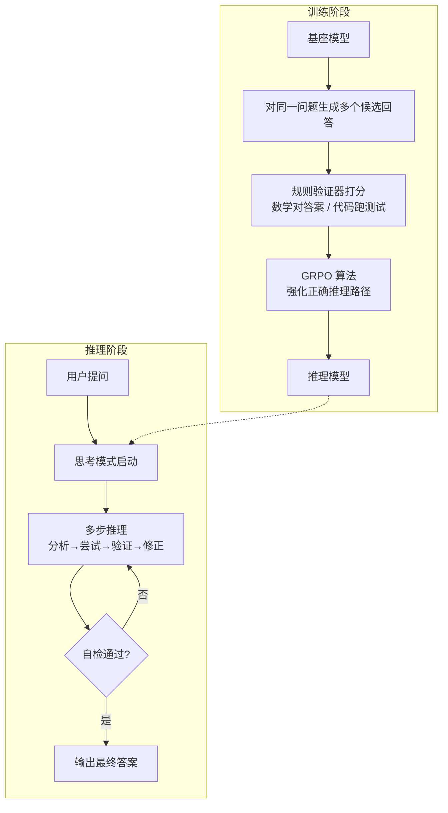

# 推理增强（Reasoning Enhancement）

## 概念解释

推理增强是指通过专门的训练方法和推理策略，让大语言模型从"直觉式一步给答案"升级为"分步思考、反复验证后再给答案"的能力提升范式。

传统 LLM 的生成方式是自回归（Autoregressive）逐词输出——模型看到问题后立刻开始写答案，中间没有"打草稿"的环节。这对简单问题没问题，但碰到数学推导、多步逻辑、代码调试等需要深度思考的任务，一步到位的准确率很低。推理增强的核心洞察是：与其砸钱把模型参数做到天文数字，不如教会模型"思考的方法"，并在回答时给它更多的计算时间去想。

推理增强在 AI 系统中的价值体现在两个层面：一是模型本身变得更聪明（训练侧），二是同一个模型面对难题时可以"想得更久"来提升准确率（推理侧）。这两者相辅相成，构成了当前 LLM 能力提升的重要方向。

## 关键结构

推理增强由两大技术维度构成，训练侧和推理侧各司其职：

| 维度 | 核心手段 | 代表技术 | 说明 |
|------|---------|---------|------|
| 训练侧增强 | 用强化学习教模型"怎么想" | RLVR、GRPO | 通过可验证奖励的强化学习，让模型自发涌现推理行为 |
| 推理侧增强 | 给模型更多时间"去想" | Test-Time Compute Scaling | 在推理阶段分配更多计算资源，让模型进行多步思考 |
| 思考格式 | 结构化的思考过程 | Chain-of-Thought（思维链） | 模型在给出答案前，先输出完整的推理步骤 |

### 训练侧：RLVR（可验证奖励的强化学习）

RLVR（Reinforcement Learning with Verifiable Rewards，可验证奖励的强化学习）是当前训练推理模型的主流方法。它的思路很直接：不用人类标注"正确的推理过程"，而是只看最终答案对不对。

传统 RLHF（人类反馈的强化学习）需要训练一个"奖励模型"来模拟人类偏好，容易被模型钻空子（Reward Hacking，奖励欺骗）。RLVR 绕过了奖励模型，直接用规则判定结果——数学题就对答案、代码题就跑测试、逻辑题就查验结论。奖励信号是二值的：对就是 1，错就是 0。

DeepSeek-R1 是 RLVR 的标杆案例。它使用 GRPO（Group Relative Policy Optimization，分组相对策略优化）算法，在纯强化学习训练中让模型自发涌现了自我验证、回溯修正等推理行为，甚至出现了被研究者称为"aha moment"的顿悟现象。

### 推理侧：Test-Time Compute Scaling（推理时计算扩展）

Test-Time Compute Scaling（推理时计算扩展）的意思是：在模型回答问题时，允许它消耗更多的计算资源来"想得更深"。

这背后的逻辑类似考试时分配答题时间——简单选择题 30 秒搞定，证明题可能需要 10 分钟。推理时计算扩展就是让模型根据问题难度，动态调整"思考时间"（即生成的 Thinking Token 数量）。

研究表明，推理准确率与 Thinking Token 数量之间存在对数线性关系：token 翻倍，准确率提升一个固定比例。但这个收益不是无限的——超过某个阈值后，过多的思考反而可能引入干扰（逆向扩展效应）。

### 思考格式：Chain-of-Thought（思维链）

Chain-of-Thought（CoT，思维链）是推理增强的外在表现形式。模型不直接输出答案，而是先生成一段"内心独白"式的推理过程，然后基于推理结果给出最终答案。

早期的 CoT 是通过提示词（Prompt）诱导的——在 prompt 里加一句"让我们一步一步思考"就能提升效果。而在推理模型（如 o1、DeepSeek-R1）中，CoT 是训练出来的内生能力，模型天然就会先想再答，无需额外提示。

## 核心原理

### 原理说明

推理增强的核心机制可以拆成"训练阶段"和"推理阶段"两个环节来理解：

**训练阶段**：以 RLVR 为例，基座模型（Base Model）对同一道数学题生成一组候选回答（通常几十到上百个），然后用规则验证器（如对比标准答案、运行代码测试）给每个回答打分（对=1，错=0）。GRPO 算法根据这批分数计算组内相对优势，更新模型参数，让模型学会偏好能得到正确结果的推理路径。不限定推理过程的具体格式，模型自己摸索出最高效的思考方式。

**推理阶段**：训练好的推理模型接收用户问题后，先进入"思考模式"（Thinking Mode），在隐藏的思维链中进行多步推理——分析问题、尝试不同解法、自我验证、必要时回溯修正。思考完成后，把最终结论整理成用户可见的回答输出。思考过程消耗的 token 就是"推理时计算"的核心开销。

### Mermaid 图解



图解要点：
- 训练阶段的关键在于"不限定过程、只看结果"，让模型自由探索推理策略
- 推理阶段的思考模式是一个内部循环，模型可以自我验证和回溯
- 虚线表示训练产出的推理模型被部署到推理阶段使用

### 运行示例

以下示例展示如何调用 OpenAI 推理模型的 Reasoning 能力，对比普通模型和推理模型的输出差异。

```python
# 基于 openai>=1.0.0 验证（截至 2026-03）
from openai import OpenAI

client = OpenAI()

question = "一个水池有两个进水管和一个出水管。A管单独注满需6小时，B管需8小时，出水管单独排空需12小时。三管同时打开，多久注满？"

# 普通模型：直接给答案
resp_normal = client.chat.completions.create(
    model="gpt-4o",
    messages=[{"role": "user", "content": question}],
)
print("普通模型：", resp_normal.choices[0].message.content[:200])

# 推理模型：先思考再给答案
resp_reasoning = client.chat.completions.create(
    model="o3-mini",  # 推理模型
    messages=[{"role": "user", "content": question}],
)
print("推理模型：", resp_reasoning.choices[0].message.content[:200])
```

普通模型直接输出答案，推理模型在内部执行多步推理（计算各管效率、合并、求解）后输出答案和完整解题过程。推理模型的 `usage.completion_tokens` 通常远大于普通模型，多出的部分就是"思考 token"。

## 易混概念辨析

| 概念 | 与推理增强的区别 | 更适合关注的重点 |
|------|----------------|----------------|
| CoT Prompting（思维链提示） | 是一种提示词技巧，让普通模型模仿推理；推理增强是训练出来的内生能力 | 提示词工程、零成本提升效果 |
| RLHF（人类反馈强化学习） | 用人类偏好训练奖励模型；RLVR 用规则验证器直接判对错，不需要奖励模型 | 对齐人类偏好、主观任务质量 |
| Agent 推理（Agent Reasoning） | Agent 的推理是在工具调用和任务规划层面；推理增强聚焦于模型内部的逻辑思考能力 | 工具使用、任务分解、多步执行 |
| 模型蒸馏（Model Distillation） | 把大推理模型的能力"压缩"到小模型中；推理增强是获得这种能力的训练方法 | 模型压缩、部署效率 |

核心区别：

- **推理增强**：关注如何让模型本身学会"想清楚再说"，涉及训练方法和推理策略
- **CoT Prompting**：不改变模型能力，只是通过提示词引导输出格式，效果上限受模型能力限制
- **RLHF**：目标是对齐人类偏好（"说得好听"），而非提升逻辑正确性（"想得正确"）
- **Agent 推理**：在模型能力之上的应用层编排，推理增强是它的底层能力支撑

## 适用边界与局限

### 适用场景

1. **数学和逻辑推理**：有明确正确答案的问题最能发挥推理增强的优势，验证信号清晰，训练和推理效果都有保障
2. **代码生成与调试**：代码可以编译运行、跑测试，天然适合 RLVR 的"结果验证"范式，推理模型在编程竞赛中表现远超普通模型
3. **科学问题求解**：涉及多步推导的物理、化学、生物学问题，推理模型可以逐步拆解，显著降低中间环节出错概率
4. **Agent 核心推理引擎**：作为 Agent 系统的"大脑"，为任务规划和决策提供更可靠的逻辑推理能力

### 不适合的场景

1. **创意写作和开放式对话**：没有"标准答案"可以验证，推理模型的优势无从发挥，反而因为"想太多"而显得啰嗦
2. **简单查询和事实检索**：问"今天天气如何"不需要多步推理，额外的思考 token 纯属浪费延迟和成本
3. **对延迟极度敏感的场景**：推理模型的思考过程会增加数秒到数十秒的响应时间，不适合实时交互或高频调用

### 局限性

1. **推理不等于知识**：推理模型擅长"想"，但不擅长"记"。对于知识密集型任务（需要大量事实记忆的问答），推理时计算扩展的收益有限
2. **思考越多不一定越好**：最新研究发现存在"逆向扩展"现象——过多的推理 token 可能让模型被无关信息干扰，反而降低准确率
3. **RLVR 仅适用于可验证任务**：只有答案可以用规则判定对错的任务才适合 RLVR 训练，对于主观评判的任务（品牌文案、情感表达），仍需依赖 RLHF

## 常见误区

| 常见误区 | 正确理解 |
|----------|----------|
| 推理模型就是普通模型加了 CoT 提示词 | 推理模型的思维链是通过 RLVR 训练出来的内生能力，不是提示词诱导的。对推理模型再加 CoT 提示，效果提升很小（约 2-3%） |
| RLVR 教会了模型新的推理能力 | 学界仍有争论。一种观点认为 RLVR 主要是"搜索压缩"——把基座模型多次采样才能碰对的路径，训练成一次就走对。模型的能力上限可能在预训练阶段就已确定 |
| 推理模型一定比普通模型好 | 推理模型在简单任务上可能"想多了"反而出错或增加不必要的成本。选模型要看任务复杂度，简单任务用快模型更划算 |
| 思考 token 越多答案越准 | 存在逆向扩展效应。Anthropic 的研究发现，过长的推理链可能让模型偏离主题、过拟合问题框架，甚至产生一些意外行为 |

## 思考题

<details>
<summary>初级：RLVR 和 RLHF 的核心区别是什么？为什么 RLVR 更适合训练推理模型？</summary>

**参考答案：**

RLHF 需要训练一个奖励模型来模拟人类偏好，奖励信号是连续的、主观的；RLVR 直接用规则验证器判定答案对错，奖励信号是二值的（0 或 1）、客观的。RLVR 更适合推理模型，原因有二：一是数学和代码等推理任务有客观标准答案，天然适合规则验证；二是神经网络奖励模型在长期训练中容易被模型"钻空子"（Reward Hacking），而规则验证器不会。

</details>

<details>
<summary>中级：某团队想用推理模型做客服问答系统，你认为合适吗？请分析利弊。</summary>

**参考答案：**

不太合适。客服场景的特点是：(1) 大部分问题较简单，不需要深度推理；(2) 用户对响应速度敏感，推理模型的"思考时间"会显著增加延迟；(3) 很多问题是事实检索型（查订单、查政策），推理增强对知识密集型任务收益有限。更好的方案是用快速模型处理常规问题，仅对需要多步逻辑判断的复杂投诉、纠纷场景路由到推理模型。

</details>

<details>
<summary>进阶：DeepSeek-R1 在训练中跳过了 SFT 阶段直接用 RL，这样做有什么好处和风险？</summary>

**参考答案：**

好处：跳过 SFT（监督微调）避免了用人工标注的推理轨迹"框住"模型的思考方式。人工标注的推理路径代表的是人类的解题思路，可能不是模型最擅长的方式。直接用 RL 让模型自由探索，可能涌现出超越人类思维定式的推理策略（DeepSeek 团队观察到的"aha moment"就是例证）。

风险：(1) 训练初期模型输出格式混乱，可读性差，需要后续额外处理；(2) 没有 SFT 做"冷启动"，RL 训练早期探索效率低，训练成本可能更高；(3) 涌现的推理行为不可控，可能产生不符合预期的输出模式。实际上 DeepSeek-R1 的最终版本还是加入了少量 SFT 数据来改善输出格式。

</details>

## 参考资料

1. OpenAI. "Learning to Reason with LLMs." https://openai.com/index/learning-to-reason-with-llms/
2. DeepSeek-AI. "DeepSeek-R1: Incentivizing Reasoning Capability in LLMs via Reinforcement Learning." arXiv:2501.12948. https://arxiv.org/abs/2501.12948
3. Wei, J., et al. (2022). "Chain-of-Thought Prompting Elicits Reasoning in Large Language Models." arXiv:2201.11903. https://arxiv.org/abs/2201.11903
4. Anthropic. "Claude's Extended Thinking." https://www.anthropic.com/news/visible-extended-thinking
5. OpenAI. "Introducing o3 and o4-mini." https://openai.com/index/introducing-o3-and-o4-mini/
6. Sebastian Raschka. "The State of Reinforcement Learning for LLM Reasoning." https://magazine.sebastianraschka.com/p/the-state-of-llm-reasoning-model-training
7. Anthropic Alignment. "Inverse Scaling in Test-Time Compute." https://alignment.anthropic.com/2025/inverse-scaling/
