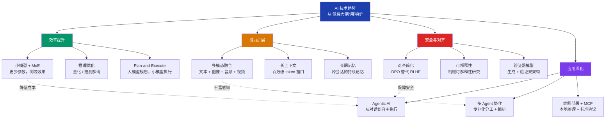

# 技术趋势（Technology Trends）

## 概念解释

技术趋势（Technology Trends）指的是 AI 和大模型领域在一段时期内最突出的技术演进方向。理解趋势不是预测未来，而是帮助开发者判断"现在该把精力花在哪里"以及"哪些能力即将变成基础设施"。

在 2023-2024 年，AI 行业的核心叙事是"规模竞赛"——谁的模型参数最多、谁的 benchmark（基准测试）分数最高。但到了 2025-2026 年，行业叙事发生了明显转向：从"做得大"变成"用得好"。推动这个转向的是三股力量：成本压力（推理费用仍然是企业落地的最大障碍）、安全需求（模型越强，出错后果越严重）、以及垂直落地要求（通用大模型无法直接满足医疗、金融等行业的专业需求）。

与传统的"大就是强"范式不同，当前的趋势是"精准胜于庞大"——通过更高效的训练方法、更智能的推理架构、更专业化的模型组合，在更低成本下实现更好的效果。Gartner 预测到 2026 年底，40% 的企业应用将集成 AI Agent，远高于 2025 年不到 5% 的水平，这标志着 AI 正从实验阶段走向大规模生产部署。

## 关键结构

当前 AI 技术趋势可以从四个维度来理解，它们不是孤立的方向，而是相互支撑的整体：

| 维度 | 核心关注点 | 典型代表 |
|------|-----------|---------|
| 效率提升 | 用更小的模型、更低的成本达到同等或更优效果 | 小模型、MoE（混合专家）、量化、推测解码 |
| 能力扩展 | 让模型能处理更多类型的信息、能记住更多东西 | 多模态融合、长上下文、长期记忆 |
| 安全与对齐 | 确保模型行为可控、可解释、符合人类价值观 | DPO 对齐、可解释性研究、隐私计算 |
| 应用深化 | 从通用对话走向垂直行业落地和自主执行 | Agentic AI、多 Agent 协作、端侧部署 |

### 维度 1：效率提升——小模型革命

"效率提升"是当前最具实际影响力的方向。IBM 预测 2026 年的主流将是"更小的推理模型，多模态且易于针对特定领域调优"。

核心思路是：不再追求一个超大的通用模型解决所有问题，而是通过强化学习微调（RLHF/RLVR）、知识蒸馏（Knowledge Distillation，用大模型的输出训练小模型）、混合专家架构（MoE，Mixture of Experts，每次只激活部分参数）等方法，让参数量更小的模型在特定任务上达到接近大模型的效果。DeepSeek-R1 是这一路线的典型代表：它通过大规模强化学习，在推理能力上接近甚至超越了部分闭源大模型，且成本远低于同级别模型。

在成本侧，"Plan-and-Execute"（规划-执行）模式正在成为标配：用一个能力强的大模型制定策略，然后由多个成本低的小模型执行具体步骤，整体成本可降低 90%。

### 维度 2：能力扩展——多模态成为基线

2026 年，多模态（Multimodal，即同时处理文本、图像、音频、视频等多种信息类型）已经不再是加分项，而是 AI 模型的基本能力。GPT-5、Gemini 3、Claude 4、Qwen 3 等新一代模型全部原生支持多模态。

能力扩展还体现在两个关键方向：

- **长上下文**（Long Context）：模型能一次处理的信息量持续增长，从早期的 4K token 到现在的百万级 token，使得"整本书理解""完整代码库分析"成为可能。
- **长期记忆**（Long-Term Memory）：Anthropic 等公司正在推动 Agent 的记忆机制改进和上下文压缩算法（Context Compression），目标是让 Agent 具备"数周级持续工作"的记忆能力，而不是每次对话都从零开始。

### 维度 3：安全与对齐——可控性升级

模型越强大，可控性就越重要。2025-2026 年的趋势是"推理优先（Reasoning-first）系统在高风险领域超越规模优先（Scale-first）模型"。

对齐算法（Alignment，让模型行为符合人类意图的技术）正在简化：从需要大量人工标注的 RLHF（基于人类反馈的强化学习）发展到更轻量的 DPO（Direct Preference Optimization，直接偏好优化），训练周期更短、成本更低。

一个新兴的实践是部署"Verifier Model"（验证器模型）——专门训练一个模型来检查另一个模型的输出逻辑是否正确，形成"生成 + 验证"的双模型架构。

### 维度 4：应用深化——从聊天到自主执行

这是 2026 年最热门的方向。"Agent"是 ICLR 2026（国际学习表征会议）提交论文中出现最频繁的关键词，标志着研究重心已从聊天机器人转向能自主规划、使用工具、执行多步任务的智能体。

关键变化包括：

- **Agentic AI（智能体化 AI）**：AI 系统从"被动回答"进化为"主动执行"，能理解意图、制定计划、调用工具、根据结果自适应调整。
- **多 Agent 系统**：单个全能 Agent 正在被专业化 Agent 团队取代。类似软件工程中"微服务架构"的思路，每个 Agent 专注一个领域，通过编排（Orchestration）协同工作。
- **MCP 协议**（Model Context Protocol，模型上下文协议）：标准化 Agent 与外部工具、数据源的连接方式，正在成为 Agent 生态的基础设施。

## 核心原理

### 原理说明

这四个维度的趋势并非各自独立，而是围绕同一个核心目标运转：**让 AI 系统从"能力展示"走向"可靠生产"**。它们之间的关系可以这样理解：

1. **效率提升**解决"用得起"的问题：小模型和推理优化让企业不再因成本而止步
2. **能力扩展**解决"用得上"的问题：多模态和长期记忆让模型能处理真实世界的复杂任务
3. **安全与对齐**解决"用得放心"的问题：可解释性和对齐技术确保模型行为在可控范围内
4. **应用深化**解决"用得好"的问题：Agentic AI 和多 Agent 架构把前三项的成果转化为实际业务价值

实际落地时，这四个维度往往是组合使用的。例如一个企业级 Agent 系统可能同时使用：小模型处理高频简单任务（效率）、多模态理解用户上传的文件（能力）、验证器模型检查输出合规性（安全）、多 Agent 分工协作完成端到端流程（应用）。

### Mermaid 图解



图中实线表示"包含"关系，虚线表示维度之间的支撑关系。四个维度不是独立选项，而是互相嵌套的完整体系：效率使应用可行，能力使应用丰富，安全使应用可信，应用将前三者转化为价值。

### 运行示例

以下用一个极简的"模型路由器"演示 Plan-and-Execute 模式的核心思路：根据任务复杂度自动选择不同规模的模型，平衡成本与效果。

```python
# 模型路由器：按任务复杂度选择模型（概念演示）

# 模型配置：名称 → (参数量, 每百万 token 成本, 适用场景)
MODELS = {
    "nano":   ("0.5B", 0.10, "简单问答、信息提取"),
    "small":  ("3B",   0.30, "摘要生成、常规分析"),
    "medium": ("13B",  0.80, "复杂推理、多步规划"),
}

def estimate_complexity(query: str) -> str:
    """根据查询特征粗略判断复杂度"""
    if len(query) < 20 and "?" in query:
        return "nano"    # 短问题 → 最小模型
    elif any(kw in query for kw in ["分析", "对比", "设计", "规划"]):
        return "medium"  # 含推理关键词 → 中型模型
    return "small"       # 默认 → 小型模型

# 演示
queries = [
    "今天天气如何？",
    "请分析这份季度报告中的核心风险点并给出应对方案。",
    "帮我总结这篇文章的要点。",
]

for q in queries:
    choice = estimate_complexity(q)
    params, cost, scope = MODELS[choice]
    print(f"查询: {q[:30]}...")
    print(f"  → 选择: {choice}（{params}）| 成本: ${cost}/M tokens | 适用: {scope}\n")
```

上述代码展示的是路由逻辑的骨架。实际生产系统中，复杂度判断会用分类器或模型自身的不确定性估计替代简单关键词匹配，模型调用则对接真实的推理 API。

## 易混概念辨析

| 概念 | 与技术趋势的区别 | 更适合关注的重点 |
|------|-----------------|----------------|
| 技术路线图（Technology Roadmap） | 路线图是某个组织或产品的具体规划和时间表，技术趋势是行业整体的演进方向 | 如果要制定产品计划，看路线图；如果要判断行业方向，看趋势 |
| Scaling Law（规模法则） | Scaling Law 描述的是"模型性能随参数/数据/算力增长的规律"，是趋势背后的一条理论依据 | Scaling Law 回答"为什么大模型有效"，趋势分析回答"下一步该往哪走" |
| 模型评测（Benchmarking） | 评测衡量的是某个模型在某个时间点的能力快照，趋势关注的是能力随时间的变化方向 | 选模型时看评测，规划技术方向时看趋势 |

核心区别：

- **技术趋势**：关注行业整体的演进方向和驱动力，帮助判断"未来什么会变成标配"
- **技术路线图**：关注具体组织的产品规划和交付节奏
- **Scaling Law**：关注模型性能增长的底层数学规律

## 适用边界与局限

### 适用场景

1. **技术选型决策**：在启动新项目时，了解当前趋势可以帮助避免选择即将过时的技术栈。例如 2026 年启动的 Agent 项目，应优先考虑多 Agent 架构而非单体大模型
2. **团队能力规划**：根据趋势判断未来 1-2 年最需要的技术能力，指导招聘和培训方向。例如当前阶段，Agent 编排能力的价值可能高于纯模型训练能力
3. **投资与资源分配**：企业决策者可以据此判断哪些方向值得加大投入，哪些方向投入产出比正在下降

### 不适合的场景

1. **具体技术实现的参考**：趋势分析是方向性的，不能直接指导"用什么框架""写什么代码"，具体实现需要查看对应的工具类或模式类知识卡片
2. **短期项目的技术决策**：如果项目周期只有 1-2 个月，追逐趋势可能反而增加风险，不如选择成熟稳定的方案

### 局限性

1. **时效性强**：AI 领域变化极快，本文描述的趋势基于 2025-2026 年的情况，6-12 个月后部分判断可能需要修正
2. **趋势 ≠ 必然**：被预测为趋势的方向并非 100% 会实现。例如"端侧部署大模型"虽然是趋势，但硬件瓶颈可能使其在某些设备类别上推迟落地
3. **幸存者偏差**：趋势报告通常聚焦成功案例和头部玩家，可能低估了失败尝试的比例和实际落地的难度

## 常见误区

| 常见误区 | 正确理解 |
|----------|----------|
| "小模型就是弱模型，只能做简单任务" | 经过针对性优化（强化学习微调、知识蒸馏）的小模型，在特定任务上可以接近甚至超越更大的模型。关键不在于参数量大小，而在于训练方法和任务匹配度。DeepSeek-R1 就是以相对较低的成本实现了前沿推理能力 |
| "多模态 = 文本 + 图片拼在一起" | 真正的多模态融合是在统一的表示空间中进行跨模态推理，而不是简单拼接。例如 VLA（视觉-语言-行动）模型可以接收图像、理解语言指令、直接输出物理动作，这是深度融合而非简单拼接 |
| "对齐问题已经被 RLHF 解决了" | 对齐是一个持续过程，不是一次性工程。模型在测试环境中表现安全，部署后可能因新场景、对抗性输入而暴露新问题。这也是为什么"验证器模型"成为新趋势——需要持续监控而非一劳永逸 |
| "追随所有趋势就是好的技术策略" | 趋势是方向参考，不是行动清单。盲目追逐所有趋势会分散资源。正确做法是根据自己的业务场景和技术阶段，选择 1-2 个最相关的方向重点投入 |

## 思考题

<details>
<summary>初级：2025-2026 年 AI 技术趋势的四个核心维度分别是什么？它们之间是什么关系？</summary>

**参考答案：**

四个核心维度是：效率提升、能力扩展、安全与对齐、应用深化。它们不是独立的方向，而是相互支撑的体系：效率提升解决"用得起"，能力扩展解决"用得上"，安全与对齐解决"用得放心"，应用深化将前三者转化为实际业务价值。在实际系统中，这四个维度通常是组合使用的。

</details>

<details>
<summary>中级：某公司要构建一个每天处理 10 万次请求的客服 Agent，该如何利用"效率提升"趋势来控制成本？</summary>

**参考答案：**

采用 Plan-and-Execute 模式 + 模型路由策略。具体做法：(1) 用分类器或小模型对用户请求做复杂度分级；(2) 80% 的简单问题（查订单、查物流）用 nano 级小模型处理，成本极低；(3) 15% 的中等问题（退换货咨询）用 small 级模型处理；(4) 5% 的复杂问题（投诉升级、多轮协商）用中型模型或转人工。这种分层架构比统一使用大模型可节省 80-90% 的推理成本。

</details>

<details>
<summary>中级/进阶：为什么 2026 年行业从"单一大模型"转向"多 Agent 专业化协作"？这种转变与软件工程的哪个历史趋势类似？</summary>

**参考答案：**

核心原因有三个：(1) 单一大模型的通用能力有上限，在专业领域（医疗、法律、金融）不如经过领域微调的专业模型；(2) 多 Agent 架构可以为不同任务匹配不同规模的模型，大幅优化成本；(3) 模块化的 Agent 可以独立升级和替换，系统维护更灵活。这与软件工程中从"单体应用"（Monolithic）到"微服务架构"（Microservices）的转变高度相似——都是把一个大而全的系统拆分为多个专业化、松耦合的组件，通过标准化协议（HTTP/gRPC 之于微服务，MCP 之于 Agent）进行协作。

</details>

## 参考资料

1. IBM. "The trends that will shape AI and tech in 2026." https://www.ibm.com/think/news/ai-tech-trends-predictions-2026
2. Machine Learning Mastery. "7 Agentic AI Trends to Watch in 2026." https://machinelearningmastery.com/7-agentic-ai-trends-to-watch-in-2026/
3. The New Stack. "5 Key Trends Shaping Agentic Development in 2026." https://thenewstack.io/5-key-trends-shaping-agentic-development-in-2026/
4. Clarifai. "Top LLMs and AI Trends for 2026." https://www.clarifai.com/blog/llms-and-ai-trends
5. Hugging Face Blog. "AI Trends 2026: Test-Time Reasoning and the Rise of Reflective Agents." https://huggingface.co/blog/aufklarer/ai-trends-2026-test-time-reasoning-reflective-agen
6. ByteByteGo. "What's Next in AI: Five Trends to Watch in 2026." https://blog.bytebytego.com/p/whats-next-in-ai-five-trends-to-watch
7. Encord. "ICLR 2026 Trends: Agentic AI, Multimodal Models & Data Governance." https://encord.com/iclr-2026/
8. OFweek. "2026 Agentic AI 十大发展趋势：技术突破与商业落地全景." https://m.ofweek.com/ai/2026-01/ART-201700-8420-30678222.html
