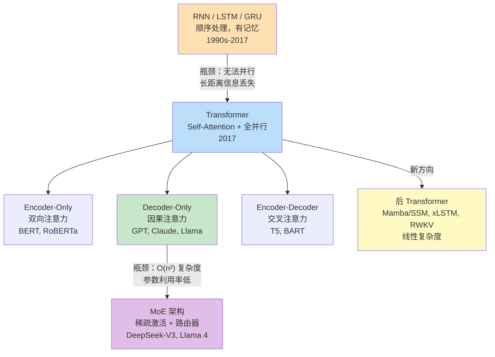
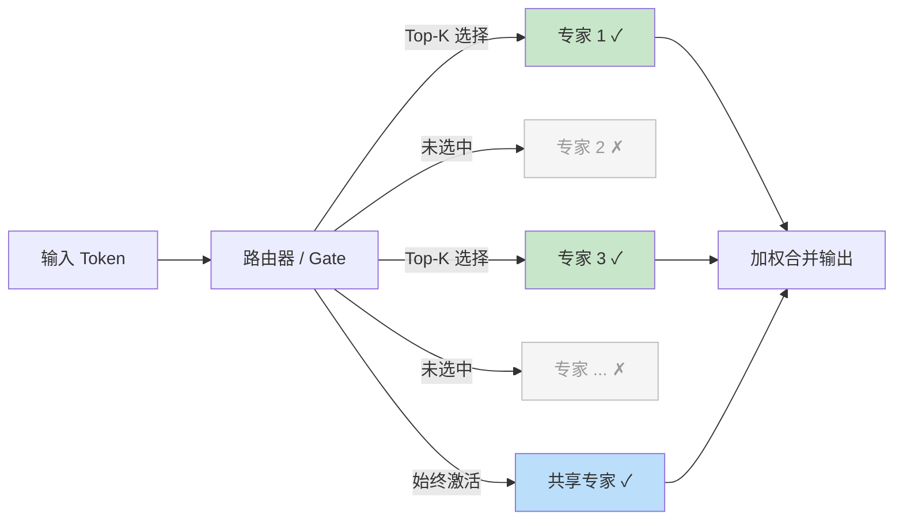

# 模型架构演进（Model Architecture Evolution）

## 概念解释

模型架构演进，指的是深度学习处理序列数据（文字、语音、时间序列等）的网络结构从 RNN（Recurrent Neural Network，循环神经网络）一路发展到 Transformer（变换器），再到当前 MoE（Mixture of Experts，混合专家）主导的整个技术路线变迁。

这条演进路线的核心驱动力是两个工程瓶颈：一是早期 RNN 无法并行训练，GPU 算力被浪费；二是长序列信息会在逐步传递中丢失（梯度消失问题）。2017 年 Google 提出的 Transformer 架构用 Self-Attention（自注意力）机制一次性解决了这两个问题，彻底取代了 RNN 成为主流骨架。

对 Agent 开发者而言，理解架构演进不是为了自己造模型，而是为了在选型时搞清楚一个关键问题：为什么现在几乎所有大语言模型（GPT、Claude、Gemini、Llama 等）都是 Decoder-Only Transformer？为什么 2025 年之后前沿模型又全部转向了 MoE？搞懂架构演进的逻辑，才能理解模型的能力边界和资源需求。

## 关键结构

模型架构演进可以划分为四个关键阶段，每个阶段解决了前一阶段的核心瓶颈：

| 阶段 | 代表架构 | 核心突破 | 时间段 |
|------|---------|---------|--------|
| 序列建模起步 | RNN / LSTM / GRU | 引入"记忆"处理变长序列 | 1990s-2017 |
| 注意力革命 | Transformer | 全并行 + 全局注意力 | 2017-2020 |
| 三大变体分化 | BERT / GPT / T5 | Encoder-Only / Decoder-Only / Encoder-Decoder 分工 | 2018-2023 |
| 效率与规模并进 | MoE / SSM | 稀疏激活 + 线性复杂度 | 2023-至今 |

### 阶段一：RNN 家族 -- 序列建模的起点

RNN 的核心思想是"带记忆的链式处理"：每处理一个词，就把当前信息和上一步的隐藏状态（Hidden State）合并，传给下一步。LSTM（Long Short-Term Memory，长短期记忆网络）在此基础上加入了门控机制（Gate），用"遗忘门"、"输入门"、"输出门"控制信息的保留和丢弃，缓解了梯度消失问题。GRU（Gated Recurrent Unit，门控循环单元）是 LSTM 的简化版本，用更少的参数达到类似效果。

但 RNN 家族有一个无法克服的硬伤：必须按顺序逐词处理，无法并行。训练一个 RNN 模型时，GPU 的数千个核心大部分在空等，只有一个在干活。

### 阶段二：Transformer -- 注意力革命

2017 年论文"Attention Is All You Need"提出的 Transformer 完全抛弃了循环结构，用 Self-Attention 让序列中任意两个位置直接"对话"。打个比方：RNN 像是一个人逐页阅读一本书，读到最后一页时前面的内容已经模糊了；Transformer 则像把整本书的所有页同时摊开在桌上，任意两页之间都能直接比较。

### 阶段三：三大变体 -- 各司其职

Transformer 的 Encoder（编码器）和 Decoder（解码器）可以单独使用或组合，形成三种主流变体。这三种变体的核心区别在于注意力的方向和训练目标不同（详见下方核心原理）。

### 阶段四：MoE 与后 Transformer 时代

标准 Transformer 的注意力复杂度是 O(n^2)，模型越大推理越慢。MoE 架构的解决思路是"不是所有参数都需要参与每次计算"：模型总参数量很大（如 DeepSeek-V3 有 6710 亿参数），但每个 Token 只激活一小部分专家网络（370 亿参数），大幅降低了实际计算量。

## 核心原理

### 原理说明

理解架构演进的核心，需要抓住三个关键机制的递进关系：

**1. Self-Attention（自注意力）如何取代循环**

Self-Attention 的核心操作：对序列中的每个位置，计算它与所有其他位置的相关性分数，然后按分数加权汇总信息。具体通过三个向量实现：
- Query（查询）：当前位置在"找什么信息"
- Key（键）：其他位置"有什么信息"
- Value（值）：如果匹配上了，"能提供什么内容"

计算公式：Attention(Q, K, V) = softmax(QK^T / sqrt(d_k)) * V

除以 sqrt(d_k)（d_k 是 Key 的维度）是为了防止点积值过大导致 softmax 输出极端化。

**2. 三大 Transformer 变体的注意力方向差异**

- **Encoder-Only（仅编码器）**：双向注意力，每个位置能看到左右所有词。代表：BERT。适合理解类任务（分类、实体识别）。
- **Decoder-Only（仅解码器）**：因果注意力（Causal Attention），每个位置只能看到自己和左边的词，看不到右边未来的词。代表：GPT、Claude、Llama。适合生成类任务。
- **Encoder-Decoder（编码器-解码器）**：编码器双向看输入，解码器因果生成输出，二者通过交叉注意力（Cross-Attention）连接。代表：T5、BART。适合翻译、摘要等输入输出结构差异大的任务。

当前大模型几乎全部采用 Decoder-Only 架构，核心原因有两个：训练数据只需要普通文本（不需要配对数据），以及推理时可以用 KV Cache 加速（已生成的 Token 不需要重新计算注意力）。

**3. MoE 如何实现"大模型、小计算"**

MoE 在 Transformer 的每一层（或交替层）中，把标准的 FFN（Feed-Forward Network，前馈网络）替换为多个"专家"FFN + 一个"路由器"（Router/Gate）。路由器根据输入 Token 的特征，选择 Top-K 个专家处理该 Token，其余专家不参与计算。

以 DeepSeek-V3 为例：总共 256 个路由专家 + 1 个共享专家，每个 Token 只激活 8 个路由专家 + 1 个共享专家，实际计算量只相当于一个 370 亿参数的稠密模型，但拥有 6710 亿参数的表达能力。

### Mermaid 图解

**架构演进全景图：**



图中的关键流转：
- RNN 到 Transformer 的跳跃是最重要的分水岭，解决了并行和长距离依赖两大问题
- 三大变体中，Decoder-Only 因训练数据门槛低和推理效率高而胜出，成为大模型时代的主流选择
- MoE 是当前前沿模型的标配（DeepSeek-V3/R1、Llama 4、Qwen3 均采用），核心收益是"总参数大、实际计算小"
- Mamba/SSM、xLSTM、RWKV 等后 Transformer 架构追求线性复杂度，目前仍在追赶 Transformer 的效果

**MoE 稀疏激活机制：**



路由器为每个 Token 计算所有专家的得分，只把 Token 发送给得分最高的 K 个专家，其余专家完全不参与计算。共享专家（Shared Expert）始终激活，负责捕获通用知识，避免路由专家之间的冗余。

### 运行示例

以下用 PyTorch 演示 Self-Attention 的核心计算过程（约 15 行），帮助理解 Q/K/V 的作用：

```python
# 基于 torch==2.0+ 验证（截至 2026-03）
import torch
import torch.nn.functional as F

# 模拟 3 个词的嵌入向量，每个 8 维
x = torch.randn(1, 3, 8)  # (batch=1, seq_len=3, d_model=8)

# Q/K/V 线性投影（实际模型中是可学习参数）
W_q = torch.randn(8, 8)
W_k = torch.randn(8, 8)
W_v = torch.randn(8, 8)

Q = x @ W_q  # 查询向量
K = x @ W_k  # 键向量
V = x @ W_v  # 值向量

# 计算注意力分数并归一化
scores = Q @ K.transpose(-2, -1) / (8 ** 0.5)  # 缩放点积
weights = F.softmax(scores, dim=-1)              # 转为概率分布
output = weights @ V                             # 加权汇总

print("注意力权重矩阵（3x3，每行是一个词对所有词的关注度）：")
print(weights.squeeze().detach())
# 每行加起来等于 1，表示当前词的注意力如何分配给序列中的每个位置
```

Q @ K 的转置得到的是一个 3x3 矩阵，第 i 行第 j 列表示"第 i 个词对第 j 个词的关注程度"。softmax 将每行归一化为概率分布，再乘以 V 完成信息汇总。实际模型中会使用多头注意力（Multi-Head Attention）将这个过程拆分到多个子空间并行执行，每个"头"学习不同的关注模式。

## 易混概念辨析

| 概念 | 与模型架构演进的区别 | 更适合关注的重点 |
|------|---------------------|------------------|
| Attention Mechanism（注意力机制） | 注意力机制是 Transformer 内部的一个组件，不等于 Transformer 本身。RNN 也可以加注意力（Seq2Seq + Attention） | 关注"注意力如何计算相关性"这个具体算法 |
| Model Scaling（模型缩放） | 架构演进讲的是"网络结构怎么设计"，模型缩放讲的是"同一架构下参数量、数据量、计算量怎么配比" | 关注 Scaling Law 和训练资源规划 |
| Model Fine-tuning（模型微调） | 架构演进是预训练阶段的基础设施选择，微调是在已有架构上调整模型行为 | 关注 LoRA、全量微调等训练后技术 |

核心区别：

- **模型架构演进**：回答"用什么骨架来建模序列数据"，是最底层的设计决策
- **注意力机制**：是 Transformer 骨架中的核心零件，但零件不等于整车
- **模型缩放**：在骨架确定后，回答"模型做多大、用多少数据训练"的工程问题

## 适用边界与局限

### 适用场景

1. **模型选型决策**：理解 Decoder-Only 为何成为主流，能帮助开发者判断何时该用生成模型（GPT 类）、何时该用理解模型（BERT 类），避免选型错误
2. **资源评估与成本估算**：了解 MoE 的稀疏激活原理后，能理解为什么 DeepSeek-V3（6710 亿参数）的推理成本远低于同等参数量的稠密模型，影响部署方案选择
3. **性能瓶颈分析**：当长文本处理出现延迟时，了解 O(n^2) 注意力复杂度的来源，才能判断该换模型还是换推理框架

### 不适合的场景

1. **不需要了解架构就能用好 API**：如果只是通过 API 调用大模型（如 OpenAI API），不需要深入架构细节也能完成大部分应用开发
2. **嵌入式/端侧极端资源受限场景**：Transformer 及其变体的内存开销仍然较大，在 MCU 等极端受限设备上，传统 RNN 或专用小模型可能仍是更务实的选择

### 局限性

1. **O(n^2) 的注意力复杂度**：标准 Self-Attention 的计算和内存消耗随序列长度平方增长。处理 100K Token 上下文时，注意力矩阵本身就需要 GB 级内存。Flash Attention、Sparse Attention 等技术只是工程缓解，没有从根本上消除这个限制
2. **位置编码的泛化瓶颈**：无论是绝对位置编码还是 RoPE（Rotary Position Embedding，旋转位置编码），模型在超出训练长度的序列上表现都会下降。虽然有位置插值（Position Interpolation）等技术，但本质上是打补丁
3. **MoE 的路由不均衡问题**：MoE 架构中，某些专家可能被过度使用（热门专家）而另一些几乎闲置，导致实际能力低于理论上限。DeepSeek 通过辅助损失函数缓解此问题，但尚未完全解决

## 常见误区

| 常见误区 | 正确理解 |
|----------|----------|
| Transformer 完全淘汰了 RNN | 不完全正确。RWKV（一种线性 RNN）在 2025 年已达到同规模 Transformer 的水平；xLSTM-7B 训练速度是同规模 Transformer 的 3.5 倍。循环结构以新形式回归 |
| 注意力权重高 = 这个词更"重要" | 注意力权重反映的是模型计算时的信息提取路径，不等于人类理解的"重要性"。有研究发现，移除注意力最高的 Token 有时对输出几乎没有影响 |
| 模型参数量越大效果一定越好 | MoE 架构已经证明"总参数量"和"激活参数量"是两回事。DeepSeek-V3 用 370 亿激活参数就达到了很多 700 亿稠密模型的水平。参数效率比绝对数量更重要 |
| Decoder-Only 胜出是因为架构本身更优 | 主要原因是工程经济性：训练只需要普通文本不需要配对数据，推理可以用 KV Cache 加速。有研究表明在同等计算量下，Encoder-Decoder 在指令跟随任务上反而更优 |

## 思考题

<details>
<summary>初级：RNN 和 Transformer 处理长文本时的核心差异是什么？</summary>

**参考答案：**

RNN 按顺序逐词处理，信息通过隐藏状态逐步传递，距离越远信息损失越大（梯度消失）。Transformer 用 Self-Attention 让任意两个位置直接计算相关性，信息传递不受距离影响。此外 RNN 必须串行计算（后一步依赖前一步），而 Transformer 全序列并行计算，训练速度快一个数量级以上。

</details>

<details>
<summary>中级：为什么当前几乎所有大语言模型都采用 Decoder-Only 架构，而不是 Encoder-Decoder？</summary>

**参考答案：**

两个核心原因：（1）训练数据门槛低 -- Decoder-Only 只需要普通文本做 Next Token Prediction，互联网上有无限量的训练数据；而 Encoder-Decoder 需要输入-输出配对数据（如翻译对），数据获取成本高得多。（2）推理效率高 -- Decoder-Only 在生成新 Token 时，已生成部分的 KV 可以缓存复用（KV Cache），不需要重新计算；而 Encoder-Decoder 每次生成都需要重新运行交叉注意力。这两个工程优势使得 Decoder-Only 在大规模场景下更实用。

</details>

<details>
<summary>中级/进阶：DeepSeek-V3 有 6710 亿参数但推理成本较低，这是怎么做到的？如果你要部署一个 MoE 模型，需要注意什么？</summary>

**参考答案：**

DeepSeek-V3 采用 MoE 架构，256 个路由专家 + 1 个共享专家，每个 Token 只激活 8+1 个专家，实际计算量相当于 370 亿参数的稠密模型。部署时需要注意：（1）虽然计算量小，但所有专家的参数都需要加载到显存中（或通过 Offloading 管理），显存需求仍然很大；（2）路由器的负载均衡问题 -- 如果某些专家被过度调用，会形成计算热点，降低吞吐量；（3）MoE 模型的通信开销 -- 在多 GPU 部署时，Token 需要被路由到不同 GPU 上的专家，跨卡通信可能成为瓶颈。

</details>

## 参考资料

1. Vaswani, A. et al. (2017). "Attention Is All You Need." NeurIPS. https://arxiv.org/abs/1706.03762
2. Jay Alammar. "The Illustrated Transformer." https://jalammar.github.io/illustrated-transformer/
3. Sebastian Raschka. "Understanding Encoder And Decoder LLMs." https://magazine.sebastianraschka.com/p/understanding-encoder-and-decoder
4. DeepSeek-AI. "DeepSeekMoE: Towards Ultimate Expert Specialization in Mixture-of-Experts Language Models." https://arxiv.org/abs/2401.06066
5. Friendli AI. "The Rise of MoE: Comparing 2025's Leading Mixture-of-Experts AI Models." https://friendli.ai/blog/moe-models-comparison
6. DataCamp. "How Transformers Work: A Detailed Exploration of Transformer Architecture." https://www.datacamp.com/tutorial/how-transformers-work
7. Rohan Paul. "Mixture-of-Experts (MoE) Architectures: 2024-2025 Literature Review." https://www.rohan-paul.com/p/mixture-of-experts-moe-architectures

---
