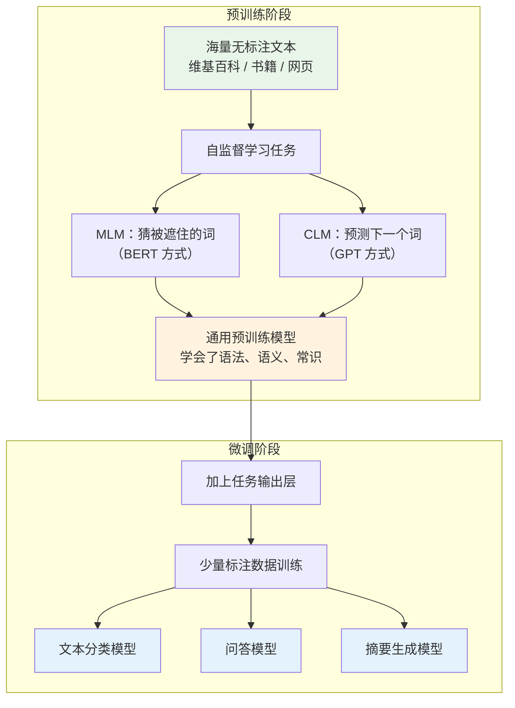

# 预训练语言模型（Pre-trained Language Model）

## 概念解释

预训练语言模型（Pre-trained Language Model, PLM）是一种"先通识教育、后专业培训"的 AI 训练方法。它先让模型在海量无标注文本上自学语言规律（预训练阶段），再用少量有标注数据把模型调教成特定任务的专家（微调阶段）。

为什么需要这种方式？在 PLM 出现之前，做一个情感分析模型需要从零开始训练，做一个问答模型又要从零开始训练，每个任务都要大量标注数据和计算资源。PLM 的思路是：语言的基础规律（语法、语义、常识）是通用的，学一次就够了，不同任务只需要在这个基础上做少量调整。

这个思路类似于人的学习过程——先上九年义务教育打好基础，再读专业课程。预训练就是"义务教育"，微调就是"专业培训"。2018 年 BERT 和 GPT 的发布标志着 NLP（Natural Language Processing，自然语言处理）正式进入了"预训练 + 微调"时代，后来的 ChatGPT、LLaMA 等大语言模型都是在这条路上的延伸。

## 关键结构

PLM 的知识体系可以从三个维度理解：**模型架构**决定了模型怎么"看"文本，**预训练任务**决定了模型怎么"学"语言，**微调策略**决定了模型怎么"用"到具体任务上。

| 维度 | 作用 | 核心问题 |
|------|------|----------|
| 模型架构 | 决定模型处理文本的方式 | Encoder、Decoder 还是两者都用？ |
| 预训练任务 | 决定模型在无标注数据上学什么 | 猜被遮住的词，还是预测下一个词？ |
| 微调策略 | 决定预训练知识怎么迁移到具体任务 | 全参数微调，还是只调一小部分？ |

### 维度 1：模型架构

三种主流架构对应三种不同的文本处理方式：

| 架构 | 代表模型 | 看文本的方式 | 擅长任务 |
|------|---------|-------------|---------|
| Encoder-only（仅编码器） | BERT、RoBERTa | 同时看左右两边的上下文（双向） | 文本分类、实体识别等理解任务 |
| Decoder-only（仅解码器） | GPT 系列、LLaMA | 只能看左边已有的文本（单向） | 文本生成、对话 |
| Encoder-Decoder（编码器-解码器） | T5、BART | 编码器双向理解输入，解码器单向生成输出 | 翻译、摘要等需要理解+生成的任务 |

### 维度 2：预训练任务

预训练任务的核心思想是**自监督学习**（Self-supervised Learning）——不需要人工标注，而是利用文本本身的结构自动生成学习信号。

| 任务 | 做法 | 代表模型 |
|------|------|---------|
| MLM（Masked Language Modeling，掩码语言模型） | 随机遮住 15% 的词，让模型猜被遮住的词 | BERT |
| CLM（Causal Language Modeling，因果语言模型） | 给前面的词，预测下一个词 | GPT |
| Span Corruption（片段损坏） | 随机删掉一段文本，让模型补全 | T5 |

### 维度 3：微调策略

| 策略 | 做法 | 适用场景 |
|------|------|---------|
| Full Fine-tuning（全参数微调） | 更新模型所有参数 | 标注数据充足、对精度要求高 |
| LoRA / QLoRA | 冻结原始参数，只训练少量新增参数 | 资源有限、需要快速适配 |
| Prompt Tuning（提示微调） | 不改模型参数，只优化输入前缀 | 超大模型、多任务共用 |
| Zero/Few-shot（零样本/少样本） | 不微调，直接用提示词引导 | GPT-3 以上的大模型 |

## 核心原理

### 原理说明

PLM 的核心机制分两步：

**第一步：预训练——在海量文本上学语言规律。** 模型读入互联网上的海量文本（维基百科、书籍、网页等），通过自监督任务学习。以 BERT 的 MLM 为例：原始句子"猫坐在垫子上"，随机遮住"垫子"变成"猫坐在 [MASK] 上"，模型需要根据上下文猜出被遮住的词。通过数十亿次这样的训练，模型学会了词义、语法、常识等通用语言知识。

**第二步：微调——用少量标注数据适配任务。** 在预训练模型的基础上加一个任务相关的输出层（如分类头），用少量标注数据训练。由于模型已经懂了语言基础，微调只需要学习"怎么把语言知识用在这个特定任务上"，所以数据量要求很低、训练速度很快。

两种核心预训练策略的区别在于信息流方向：

- **MLM（BERT 的方式）**：像做完形填空，能同时利用左右上下文，理解能力更强，但不擅长生成
- **CLM（GPT 的方式）**：像写作文，从左到右逐字生成，天然适合生成任务，但看不到右边的信息

### Mermaid 图解



图中的关键流转：上半部分是"一次投入、长期受益"的预训练过程，下半部分是"低成本、快速适配"的微调过程。同一个预训练模型可以分叉出多个不同任务的专用模型，这就是 PLM 高效的核心所在。

下图进一步对比三种架构处理文本时的信息流差异：

```mermaid
graph LR
    subgraph Encoder-only（BERT）
        direction LR
        E1["词1"] <--> E2["词2"] <--> E3["词3"]
    end

    subgraph Decoder-only（GPT）
        direction LR
        D1["词1"] --> D2["词2"] --> D3["词3"]
    end

    subgraph Encoder-Decoder（T5）
        direction LR
        T1["编码器<br/>双向理解输入"] --> T2["解码器<br/>单向生成输出"]
    end
```

Encoder-only 中每个词都能看到其他所有词（双向箭头），适合理解任务；Decoder-only 中每个词只能看到它前面的词（单向箭头），适合生成任务；Encoder-Decoder 结合了两者的优势。

### 运行示例

```python
# 演示 BERT 的掩码语言模型预测
# 基于 transformers==4.40.0 验证（截至 2025-05）
from transformers import pipeline

# 加载 MLM 预测管道
unmasker = pipeline("fill-mask", model="bert-base-uncased")

# 让模型猜被遮住的词
results = unmasker("The cat sat on the [MASK].")
for r in results[:3]:
    print(f"预测: {r['token_str']:>10s}  置信度: {r['score']:.3f}")
# 输出示例：
# 预测:      floor  置信度: 0.200
# 预测:      couch  置信度: 0.178
# 预测:       mat  置信度: 0.105
```

上述代码展示的就是 BERT 预训练时反复做的事情——根据上下文预测被遮住的词。模型能给出合理的候选词，说明它已经从预训练语料中学到了"猫""坐""上面"这些词的语义关系。

## 易混概念辨析

| 概念 | 与预训练语言模型的区别 | 更适合关注的重点 |
|------|---------------------|-----------------|
| 词向量（Word Embedding） | Word2Vec、GloVe 等词向量是静态的，每个词只有一个固定表示；PLM 是动态的，同一个词在不同上下文中表示不同 | 上下文无关 vs. 上下文相关 |
| 大语言模型（LLM） | LLM 是 PLM 发展到超大规模（百亿参数以上）的产物，涌现出推理、指令遵循等新能力；PLM 是更广泛的概念 | PLM 是基础范式，LLM 是其规模化延伸 |
| 迁移学习（Transfer Learning） | 迁移学习是一种通用方法论，PLM 是迁移学习在 NLP 领域最成功的具体实现 | 迁移学习是方法，PLM 是实例 |

核心区别：

- **预训练语言模型**：强调"两阶段训练"范式本身——先预训练、后微调
- **词向量**：只做词级别的静态表示，不涉及上下文和微调
- **大语言模型**：是 PLM 的超大规模版本，因规模涌现了新能力，通常不再需要微调
- **迁移学习**：是 PLM 背后的理论框架，PLM 是其在 NLP 中的最佳实践

## 适用边界与局限

### 适用场景

1. **标注数据稀缺的 NLP 任务**：预训练提供了强大的语言先验，微调只需要几百到几千条标注样本就能达到不错的效果，比从零训练节省 10-100 倍标注量
2. **需要快速适配多个任务**：同一个预训练模型可以微调出文本分类、命名实体识别、问答等多个专用模型，复用预训练投入
3. **通用文本理解与生成**：文本摘要、情感分析、对话系统、翻译等绝大多数 NLP 任务都受益于预训练

### 不适合的场景

1. **实时性要求极高的简单规则任务**：如果任务可以用正则表达式或关键词匹配解决，引入 PLM 反而增加不必要的延迟和复杂度
2. **训练数据与文本无关的任务**：纯数值回归、图像分类等非文本任务，PLM 的语言先验无法发挥作用

### 局限性

1. **预训练成本极高**：一次完整预训练需要数千张 GPU 运行数周，百万美元级别的投入，只有大公司和研究机构能承担
2. **知识静态化**：模型的知识冻结在预训练数据的截止时间，无法自动获取新信息。应对方案是 RAG（检索增强生成）或定期重训
3. **幻觉问题（Hallucination）**：模型学的是统计规律而非事实本身，可能生成看似合理但完全错误的内容
4. **黑盒决策**：很难解释模型为什么做出某个判断，在医疗、法律等对可解释性要求高的领域需要额外手段

## 常见误区

| 常见误区 | 正确理解 |
|----------|----------|
| 预训练就是预测下一个词 | 预训练任务有多种形式：BERT 用的是掩码预测（双向），GPT 用的是下一词预测（单向），T5 用的是片段补全。不同任务学到的能力不同 |
| 模型参数越大效果越好 | 模型大小需要匹配任务复杂度。一个 7B 参数的精调模型在特定任务上完全可能超过 70B 的通用模型，还要考虑推理成本 |
| 微调就是调整所有参数 | 实际中常用 LoRA 等参数高效方法，只调整不到 1% 的参数就能接近全参数微调的效果，大幅降低显存和时间成本 |
| BERT 和 GPT 只是大小不同 | 两者架构和训练方式完全不同：BERT 是双向编码器 + 掩码预测，适合理解任务；GPT 是单向解码器 + 下一词预测，适合生成任务 |

## 思考题

<details>
<summary>初级：BERT 和 GPT 的预训练任务有什么本质区别？各自适合什么类型的下游任务？</summary>

**参考答案：**

BERT 使用掩码语言模型（MLM），随机遮住部分词让模型根据双向上下文预测，因此擅长需要完整理解上下文的任务（分类、实体识别、问答）。GPT 使用因果语言模型（CLM），从左到右逐词预测，天然适合文本生成任务（对话、续写、摘要）。核心区别在于信息流方向：BERT 双向，GPT 单向。

</details>

<details>
<summary>中级：为什么 BERT 的掩码策略不是简单地把 15% 的词全部替换为 [MASK]，而是采用 80%/10%/10% 的混合替换？</summary>

**参考答案：**

如果全部替换为 [MASK]，模型会学到一个"作弊"策略：只在看到 [MASK] 标记时才认真预测，但实际使用时输入中没有 [MASK]，导致预训练和推理之间存在不一致（分布偏移）。80% 替换为 [MASK] 保证主要学习目标；10% 替换为随机词迫使模型不能只依赖 [MASK] 标记来判断哪些位置需要预测；10% 保持不变让模型学会对正确词也维持合理的表示。这种混合策略缓解了预训练-推理的分布差异。

</details>

<details>
<summary>中级/进阶：你的团队需要为一个垂直医学领域构建问答系统，标注数据只有 500 条。选择从零训练还是使用预训练模型？如果用预训练模型，选 BERT 类还是 GPT 类？微调策略怎么选？</summary>

**参考答案：**

必须使用预训练模型。500 条标注数据远不足以从零训练一个有效模型，但足以微调一个已经具备通用语言理解能力的 PLM。对于问答这种需要精确定位答案的理解型任务，BERT 类模型（如 PubMedBERT，已经在医学文献上做过领域预训练）更合适。微调策略上，500 条数据量偏少，建议使用 LoRA 等参数高效方法防止过拟合，而不是全参数微调。如果希望生成式回答而非抽取式回答，也可以考虑用医学领域微调过的 LLM 配合 RAG。

</details>

## 参考资料

1. Devlin, J. et al. (2018). "BERT: Pre-training of Deep Bidirectional Transformers for Language Understanding." arXiv:1810.04805. https://arxiv.org/abs/1810.04805
2. Radford, A. et al. (2019). "Language Models are Unsupervised Multitask Learners." OpenAI Blog. https://cdn.openai.com/better-language-models/language_models_are_unsupervised_multitask_learners.pdf
3. Raffel, C. et al. (2019). "Exploring the Limits of Transfer Learning with a Unified Text-to-Text Transformer." arXiv:1910.10683. https://arxiv.org/abs/1910.10683
4. Vaswani, A. et al. (2017). "Attention Is All You Need." NeurIPS 2017. https://arxiv.org/abs/1706.03762
5. Hugging Face Transformers 官方文档. https://huggingface.co/docs/transformers/
