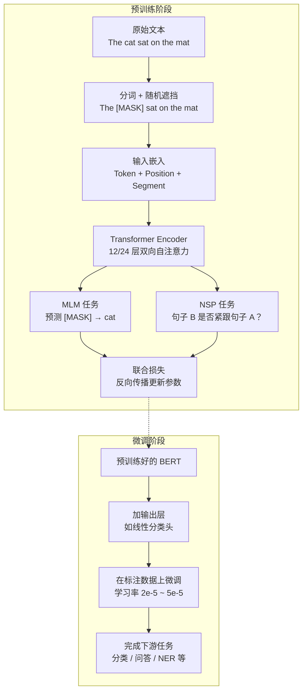
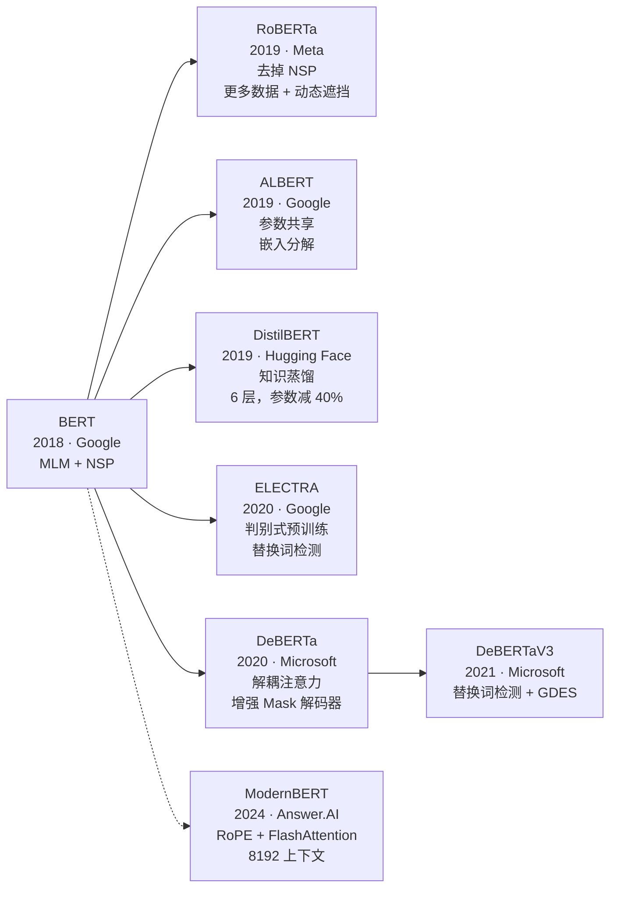

# BERT 系列模型

## 概念解释

BERT（Bidirectional Encoder Representations from Transformers，基于 Transformer 的双向编码器表示）是 Google 在 2018 年发布的预训练语言模型。它的核心思路是：把一段文本里的某些词遮住，让模型根据前后文猜出被遮住的词，从而学会理解语言。这和人做"完形填空"的过程非常相似——你读一句话，靠上下文推断空格该填什么。

BERT 之前的语言模型大多只能"从左往右"读句子（类似 GPT），或者把左右两个方向分别训练再拼起来（类似 ELMo）。这些方式在理解一个词时，要么只看到它左边的内容，要么左右信息没有真正融合。BERT 用 Transformer 的 Encoder（编码器）结构一次性让每个词同时看到左边和右边的所有词，实现了真正的双向理解。

BERT 发布后迅速刷新了 11 项 NLP（自然语言处理）任务的纪录，也催生了一大批派生模型：RoBERTa 优化了训练方法、ALBERT 压缩了参数量、DistilBERT 通过蒸馏缩小了模型体积、DeBERTa 改进了注意力机制。直到 2025 年，BERT 系列仍然是文本分类、信息检索、命名实体识别等任务的主力模型——Hugging Face 上 BERT 月下载量超过 6800 万次，仅次于另一个 Encoder 模型。

## 关键结构

| 结构 | 作用 | 说明 |
|------|------|------|
| Masked Language Modeling（MLM，遮挡语言模型） | 预训练的核心任务 | 随机遮住 15% 的词，让模型根据上下文预测被遮住的词 |
| Transformer Encoder（Transformer 编码器） | 模型的骨架 | 多层自注意力结构，每个词可以同时关注所有其他词 |
| [CLS] / [SEP] 特殊标记 | 输入格式约定 | [CLS] 标记句子开头，用于分类任务；[SEP] 分隔两个句子 |
| 输入嵌入三合一 | 将文本转为向量 | Token 嵌入 + 位置嵌入 + 段落嵌入，三者相加作为模型输入 |

### 结构 1：MLM（遮挡语言模型）

训练时随机选 15% 的 token（词片段），其中 80% 替换为 `[MASK]`，10% 替换为随机词，10% 保持不变。模型的目标是还原出原始词。这种混合策略迫使模型不能只盯着 `[MASK]` 标记，而要真正理解上下文语义。

### 结构 2：Transformer Encoder

BERT-base 由 12 层 Transformer Encoder 堆叠而成，每层包含一个多头自注意力（Multi-Head Self-Attention）模块和一个前馈网络。自注意力让句子中的每个词都能"看到"其他所有词，从而捕捉长距离依赖关系。

### 结构 3：输入嵌入三合一

每个输入 token 的最终嵌入 = Token Embedding（词义）+ Position Embedding（位置）+ Segment Embedding（属于哪个句子）。BERT 的位置嵌入是可学习的（不同于原始 Transformer 的固定正弦编码）。

## 核心原理

### 原理说明

BERT 的工作分为两个阶段：

**阶段一：预训练（Pre-training）**。在大规模无标注文本上（BooksCorpus + Wikipedia，约 33 亿词）执行两个自监督任务：

1. **MLM**：输入一段文本，随机遮住部分词，模型预测被遮住的词。只计算被遮住位置的损失。
2. **NSP**（Next Sentence Prediction，下一句预测）：输入两个句子，模型判断第二句是否是第一句的真实下文。50% 的样本是真实相邻句，50% 是随机拼凑的。

两个任务的损失相加，联合优化模型参数。

**阶段二：微调（Fine-tuning）**。拿预训练好的 BERT，在目标任务的标注数据上加一个轻量输出层（通常是一个线性分类头），用较小的学习率继续训练。由于 BERT 已经学会了通用的语言表示，微调只需少量数据和几轮迭代就能达到很好的效果。

**BERT 的两种规格**：

| 规格 | 层数 | 隐藏维度 | 注意力头数 | 参数量 |
|------|------|---------|-----------|--------|
| BERT-base | 12 | 768 | 12 | ~110M |
| BERT-large | 24 | 1024 | 16 | ~340M |

### Mermaid 图解



BERT 的核心创新在"预训练阶段"：通过 MLM 任务实现双向理解。图中从原始文本到联合损失的链路，就是 BERT 学会语言表示的完整路径。微调阶段只需冻结或微调已有参数，加一个轻量输出层即可适配具体任务。

### 运行示例

```python
# 基于 transformers==4.40+ 验证（截至 2026-03）
from transformers import pipeline

# 用 BERT 做完形填空（MLM 的直观体现）
unmasker = pipeline("fill-mask", model="bert-base-uncased")
results = unmasker("The capital of France is [MASK].")

for r in results[:3]:
    print(f"{r['token_str']:>10s}  置信度: {r['score']:.3f}")
# 输出示例：
#      paris  置信度: 0.878
#     france  置信度: 0.023
#       lyon  置信度: 0.017
```

上面的代码直接调用了 BERT 的 MLM 能力——输入一个带 `[MASK]` 的句子，模型预测最可能填入的词。`pipeline` 封装了分词、模型推理、后处理的全过程。

## BERT 派生模型对比

BERT 发布后，研究者从不同角度对其进行了改进。下面是最重要的几个派生模型：



| 模型 | 年份 | 核心改进 | 参数量 | 关键取舍 |
|------|------|---------|--------|---------|
| **BERT** | 2018 | MLM + NSP 双任务预训练 | 110M / 340M | 奠基之作，架构简洁 |
| **RoBERTa** | 2019 | 去掉 NSP，动态遮挡，10 倍数据，更大 batch | 与 BERT 相同 | 架构不变，靠训练策略提升性能 |
| **ALBERT** | 2019 | 跨层参数共享 + 嵌入分解 + SOP 替代 NSP | 18M（ALBERT-large） | 参数减少 94%，训练快 1.7 倍，性能不降 |
| **DistilBERT** | 2019 | 用 BERT-base 做老师，蒸馏出 6 层学生模型 | 66M | 体积减 40%，速度快 60%，保留 97% 性能 |
| **ELECTRA** | 2020 | 生成器替换词 + 判别器检测是否被替换（类 GAN） | 与 BERT 相同 | 同等算力下性能更优 |
| **DeBERTa** | 2020 | 解耦注意力（内容和位置分离处理）+ 增强 Mask 解码器 | 与 BERT 相同 | 首个在 SuperGLUE 上超越人类的 NLP 模型 |
| **DeBERTaV3** | 2021 | 在 DeBERTa 基础上加入替换词检测 + 梯度解耦嵌入共享 | 同上 | 用更少数据达到更高性能 |
| **ModernBERT** | 2024 | RoPE 位置编码 + FlashAttention + 局部/全局交替注意力 | 139M / 395M | 8192 token 上下文，速度比 DeBERTa 快 2 倍 |

**核心差异解读**：

- **RoBERTa** 证明了 BERT 的架构本身没有问题，性能瓶颈在训练策略——数据量、遮挡方式、batch 大小都有优化空间。
- **ALBERT** 解决的是参数效率问题：跨层共享参数让 12 层模型实际上只有 1 组参数，嵌入分解将词向量维度和隐藏层维度解耦。
- **DeBERTa** 的解耦注意力是架构层面的真正创新：普通 BERT 把"这个词是什么"和"这个词在哪"混在一起计算注意力，DeBERTa 将两者分开，分别算内容-内容、内容-位置、位置-内容三种注意力，精度更高。
- **ModernBERT** 是 2024 年 12 月发布的现代化重构，融合了 RoPE（旋转位置编码）、FlashAttention、交替局部/全局注意力等近年 Transformer 优化成果，上下文长度扩展到 8192 token，推理速度和内存效率大幅提升。

## 易混概念辨析

| 概念 | 与 BERT 系列的区别 | 更适合关注的重点 |
|------|-------------------|-----------------|
| GPT 系列 | GPT 是 Decoder-only（解码器），自回归生成文本；BERT 是 Encoder-only（编码器），理解和表示文本 | GPT 关注"生成下一个词"，BERT 关注"理解整段文本" |
| T5 / BART | Encoder-Decoder 架构，既能理解也能生成 | 需要同时做理解和生成的任务（翻译、摘要） |
| Sentence-BERT | 基于 BERT 微调的句子嵌入模型，专门用于语义相似度 | 生成高质量句子向量，用于检索和匹配 |
| Word2Vec / GloVe | 静态词向量，每个词只有一个固定向量 | BERT 输出的是上下文相关的动态向量——同一个词在不同句子中表示不同 |

核心区别：

- **BERT 系列**：Encoder-only，擅长文本理解、分类、检索、NER 等判别式任务
- **GPT 系列**：Decoder-only，擅长文本生成，但理解能力不如同规模的 Encoder 模型
- **T5 / BART**：Encoder-Decoder，通用性最强但模型更大、推理更慢

## 适用边界与局限

### 适用场景

1. **文本分类与情感分析**：BERT 的双向理解能力使其在分类任务上表现出色。取 [CLS] 向量接一个线性层即可完成分类。
2. **信息检索与 RAG**：Encoder 模型是 RAG（检索增强生成）管道中语义检索的核心组件，用于将文档和查询编码为向量进行匹配。
3. **命名实体识别（NER）**：对每个 token 的输出进行标签分类，识别人名、地名、机构名等实体。
4. **问答与阅读理解**：给定段落和问题，定位段落中答案的起止位置。
5. **轻量化部署**：DistilBERT、ALBERT 等变种适合移动端、边缘设备上的实时推理。

### 不适合的场景

1. **文本生成任务**：BERT 是 Encoder-only 架构，无法自回归生成文本。写诗、翻译、摘要等任务需要 Decoder 或 Encoder-Decoder 模型。
2. **超长文档处理**：标准 BERT 最大输入 512 token（约 300-400 个英文单词）。处理长文档需要 Longformer、BigBird 或 ModernBERT（8192 token）等专门模型。

### 局限性

1. **最大输入长度限制**：BERT 的自注意力复杂度为 O(n^2)，512 token 上限制约了长文本场景。ModernBERT 将上限提到 8192，但仍不及 Decoder 模型的上下文窗口。
2. **预训练与下游任务目标不完全对齐**：MLM 的"猜词"目标与实际任务（如定位答案跨度、判断实体边界）存在偏差，这也是 SpanBERT、ELECTRA 等变种出现的原因。
3. **静态知识**：BERT 的知识固化在预训练数据中，无法获取训练数据截止日期之后的新信息。

## 常见误区

| 常见误区 | 正确理解 |
|----------|----------|
| BERT 可以用来生成文本（写文章、翻译） | BERT 是 Encoder-only 架构，只能输出表示向量，不能自回归生成文本序列。生成任务需要 GPT、T5 等含 Decoder 的模型 |
| NSP 任务对所有下游任务都有帮助 | RoBERTa 的实验表明，去掉 NSP 后多项任务性能反而更好。NSP 对跨句理解有一定帮助，但也会分散对 MLM 的优化 |
| 参数越多、训练越久，模型一定越好 | ALBERT 用 18M 参数超越了 340M 参数的 BERT-large；DeBERTa 用一半训练数据超越了 RoBERTa。架构设计和训练策略的质量比单纯堆量更重要 |
| BERT 已经过时，被 GPT 完全取代了 | 截至 2025 年，BERT 仍是 Hugging Face 下载量第二的模型。在分类、检索、NER 等判别式任务上，Encoder 模型的性价比远高于大型 Decoder 模型 |

## 思考题

<details>
<summary>初级：BERT 的 MLM 任务中，被遮住的 15% token 为什么不全部替换成 [MASK]，而要混合使用 [MASK]（80%）、随机词（10%）、保留原词（10%）？</summary>

**参考答案：**

如果全部用 [MASK] 替换，模型会学到"只有看到 [MASK] 标记时才需要预测"，但微调和推理时输入中没有 [MASK] 标记，导致预训练和实际使用之间存在分布偏差（distribution mismatch）。混合策略让模型不能仅依赖 [MASK] 标记来判断哪些位置需要关注，而是要对所有位置都建立良好的表示，减少了预训练与微调之间的差距。

</details>

<details>
<summary>中级：RoBERTa 和 BERT 的模型架构完全相同，为什么 RoBERTa 的性能显著更高？这对实际项目有什么启示？</summary>

**参考答案：**

RoBERTa 的提升来自四个训练策略优化：去掉 NSP 任务、动态遮挡（每轮训练重新随机遮挡，而非预处理时固定）、更大的 batch size（8K vs 256）、更多的训练数据（160GB vs 16GB）。这说明在模型架构不变的情况下，训练策略的优化空间很大。实际项目中，在换更大的模型之前，应先检查数据质量、数据量、学习率调度、batch size 等训练超参数是否已经充分优化。

</details>

<details>
<summary>中级/进阶：你需要为一个电商平台构建商品评论情感分类系统，日均请求量 100 万次，要求单次推理延迟低于 50ms。你会选择 BERT 系列中的哪个模型？为什么？</summary>

**参考答案：**

推荐 DistilBERT 或 ALBERT。DistilBERT 只有 6 层、66M 参数，推理速度比 BERT-base 快约 60%，同时保留 97% 的分类性能，配合 ONNX Runtime 或 TorchScript 导出后，CPU 上单次推理可控制在 10-30ms。ALBERT-base 参数更少（12M），但跨层参数共享在实际推理时并不一定更快（因为层数不减少，只是参数复用）。如果对精度要求极高，可以先用 DeBERTa 微调获得最佳模型，再通过知识蒸馏压缩到 DistilBERT 级别的体积。ModernBERT-base 也是一个选择，它在 GPU 上的吞吐量比 BERT-base 高数倍，但需要 GPU 推理环境支持 FlashAttention。

</details>

## 参考资料

1. Devlin, J. et al. (2018). "BERT: Pre-training of Deep Bidirectional Transformers for Language Understanding." https://arxiv.org/abs/1810.04805
2. Liu, Y. et al. (2019). "RoBERTa: A Robustly Optimized BERT Pretraining Approach." https://arxiv.org/abs/1907.11692
3. Lan, Z. et al. (2019). "ALBERT: A Lite BERT for Self-supervised Learning of Language Representations." https://arxiv.org/abs/1909.11942
4. Sanh, V. et al. (2019). "DistilBERT, a distilled version of BERT: smaller, faster, cheaper and lighter." https://arxiv.org/abs/1910.01108
5. He, P. et al. (2020). "DeBERTa: Decoding-enhanced BERT with Disentangled Attention." https://arxiv.org/abs/2006.03654
6. Clark, K. et al. (2020). "ELECTRA: Pre-training Text Encoders as Discriminators Rather Than Generators." https://arxiv.org/abs/2003.10555
7. Warner, B. et al. (2024). "Smarter, Better, Faster, Longer: A Modern Bidirectional Encoder for Fast, Memory Efficient, and Long Context Finetuning and Inference." https://arxiv.org/abs/2412.13663
8. Hugging Face Transformers Documentation. https://huggingface.co/docs/transformers/model_doc/bert
