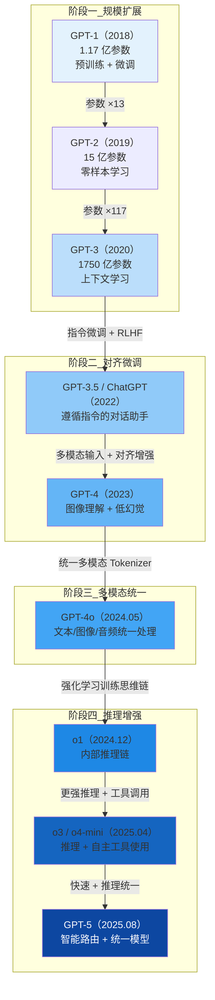

# GPT 系列模型（OpenAI）

## 概念解释

GPT（Generative Pre-trained Transformer，生成式预训练 Transformer）系列是 OpenAI 自 2018 年起持续迭代的大语言模型家族。它的核心思路是：先在海量无标注文本上做"预训练"，让模型学会语言的通用规律，再通过微调或提示来适配具体任务。

GPT 系列的出现解决了传统 NLP（自然语言处理）的一个根本矛盾——每做一个新任务就要从头标注数据、训练专用模型，成本高且不通用。GPT 用一个通用模型覆盖了翻译、问答、摘要、编程等几十种任务，极大降低了 AI 应用的开发门槛。

从 GPT-1 到当前的 GPT-5 系列，这个家族经历了四次关键跳跃：规模扩展（GPT-1 到 GPT-3）、对齐微调（GPT-3.5/ChatGPT 到 GPT-4）、多模态统一（GPT-4o）、推理增强（o1/o3 系列）。每一次跳跃都对应了一个当时必须突破的瓶颈。在 Agent 开发领域，GPT 系列既是最常用的底层推理引擎，也是理解"大模型能做什么、不能做什么"的核心参照系。

## 关键结构

GPT 系列的演进可以从四个关键阶段理解，每个阶段解决不同瓶颈：

| 阶段 | 时间跨度 | 代表模型 | 核心突破 |
|------|---------|---------|---------|
| 规模扩展期 | 2018-2020 | GPT-1 / GPT-2 / GPT-3 | 证明"参数越多、数据越大，能力越强"的 Scaling Law（规模定律） |
| 对齐微调期 | 2022-2023 | GPT-3.5 / ChatGPT / GPT-4 | 让模型"听懂人话"——通过 RLHF（基于人类反馈的强化学习）对齐人类意图 |
| 多模态统一期 | 2024 | GPT-4o / GPT-4o-mini | 文本、图像、音频用同一个模型处理，不再需要分别调用不同模型 |
| 推理增强期 | 2024-2025 | o1 / o3 / o4-mini / GPT-5 | 模型学会"先想再答"——用强化学习训练出内部思维链，大幅提升复杂推理能力 |

### 阶段一：规模扩展期（2018-2020）

GPT-1（2018）只有 1.17 亿参数，在 BooksCorpus 上训练，证明了"先预训练、再微调"这条路走得通。GPT-2（2019）扩大到 15 亿参数，展示了零样本（Zero-shot）能力——不给任何示例，模型也能完成任务。GPT-3（2020）跳到 1750 亿参数，用 3000 亿 token 训练，发现了上下文学习（In-Context Learning, ICL）——在 prompt 里放几个例子，模型就能推断任务意图，完全不需要微调。

这个阶段的核心发现是 Scaling Law：模型能力随参数量和数据量可预测地增长。

### 阶段二：对齐微调期（2022-2023）

GPT-3 虽然能力强，但它本质上只会"续写文本"——你问它问题，它可能接着编故事而不是回答。GPT-3.5 和 ChatGPT（2022 年 11 月）通过两步解决这个问题：第一步，指令微调（Instruction Fine-tuning），用问答对教模型理解"用户在问什么"；第二步，RLHF（Reinforcement Learning from Human Feedback），用人类标注者的偏好排序训练奖励模型，再用 PPO（近端策略优化）算法让模型生成更符合人类期望的回答。

GPT-4（2023 年 3 月）在此基础上进一步降低幻觉（Hallucination，模型编造不存在的事实），首次支持图像输入，推理能力显著提升。

### 阶段三：多模态统一期（2024）

GPT-4 处理图像的方式是"图文拼接"——图像先转特征向量再送给文本模型，比较别扭。GPT-4o（2024 年 5 月，"o"代表 Omni，全能）重新设计了架构，用统一的 Tokenizer（分词器）把文本、图像、音频都转成同一种 token 序列，一个 Transformer 统一处理。这让模型对跨模态内容的理解更自然，响应速度也更快。

GPT-4o-mini（2024 年 7 月）是其轻量版本，在保持多模态能力的前提下降低成本和延迟。

### 阶段四：推理增强期（2024-2025）

o1（2024 年 12 月正式发布）标志着范式转变——模型不再是"输入即输出"，而是先生成一段隐藏的思维链（Private Chain of Thought），在内部进行规划、尝试、自我检查，然后才给出答案。这种能力通过大规模强化学习训练获得，而非简单的 prompt 技巧。

o3（2025 年 4 月）和 o4-mini（2025 年 4 月）进一步强化推理能力，首次支持在推理过程中自主调用工具（网页搜索、代码执行、图像生成）。GPT-5（2025 年 8 月）则将快速响应和深度推理统一到一个模型中，内置智能路由自动判断何时需要深度思考。

## 核心原理

### 原理说明

GPT 系列的技术演进可以用三层递进关系理解：

**第一层：预训练——学会语言的通用规律。** 在海量文本上训练模型预测下一个 token，目标函数是最大化条件概率 P(下一个词 | 前面所有词)。通过这个简单目标，模型隐式学到了语法、语义、事实知识甚至基础推理能力。GPT-1 到 GPT-3 的主要变化就是不断增加参数量和训练数据量。

**第二层：对齐——让模型按人类意图行事。** 预训练后的模型只会"续写最可能的文本"，不会主动回答问题或拒绝有害请求。RLHF 的训练流程是：(1) 用指令-回答对做监督微调 → (2) 人类标注者对多个回答排序 → (3) 训练奖励模型学习人类偏好 → (4) 用 PPO 算法优化主模型使其获得更高奖励。这个过程让模型从"续写器"变成"助手"。

**第三层：推理增强——让模型学会思考。** o1/o3 的训练通过强化学习教会模型在回答前生成思维链。模型先输出一段对用户隐藏的推理过程（尝试不同策略、自我纠错），再基于推理结果给出最终答案。关键发现是：推理能力随"思考时间"（测试时计算量）的增加而持续提升，这与预训练阶段的 Scaling Law 形成互补。

### Mermaid 图解



图中每个阶段的边界代表一次范式转变：规模扩展期靠"堆参数"提升能力；对齐微调期靠"教模型听话"释放实用价值；多模态统一期打破模态壁垒；推理增强期让模型获得深度思考能力。GPT-5 最终将快速响应和深度推理合并到一个模型中，通过内置路由自动选择执行模式。

### 各版本速查表

| 模型 | 发布时间 | 参数量 | 训练数据 | 核心创新 |
|------|---------|--------|---------|---------|
| GPT-1 | 2018.06 | 1.17 亿 | BooksCorpus | 生成式预训练范式 |
| GPT-2 | 2019.02 | 15 亿 | WebText（40GB） | 零样本学习、分阶段发布 |
| GPT-3 | 2020.06 | 1750 亿 | 570GB+（Common Crawl 等） | 上下文学习（ICL） |
| GPT-3.5 / ChatGPT | 2022.11 | ~1750 亿 | + 指令数据 + 人类偏好 | RLHF、对话能力 |
| GPT-4 | 2023.03 | 未公开（传约 1-1.8 万亿） | 多模态数据 | 图像输入、降低幻觉 |
| GPT-4o | 2024.05 | 未公开 | 多模态统一训练 | 原生多模态、统一 Tokenizer |
| o1 | 2024.12 | 未公开 | + 强化学习推理数据 | 私密思维链、测试时计算扩展 |
| o3 | 2025.04 | 未公开 | + 工具使用数据 | 深度推理 + 自主工具调用 |
| o4-mini | 2025.04 | 未公开 | 同 o3 | 高效推理、成本更低 |
| GPT-4.1 | 2025.04 | 未公开 | 编码增强数据 | 编码和指令遵循优化，API 专用 |
| GPT-5 | 2025.08 | 未公开 | 多模态 + 推理 | 智能路由（快速/思考自动切换） |

### 运行示例

```python
# 基于 openai>=1.54.0 验证（截至 2026-03）
# 展示 GPT 系列三种典型用法的最小示例

from openai import OpenAI

client = OpenAI()  # 默认读取环境变量 OPENAI_API_KEY

# --- 用法 1：GPT-4o 文本生成（快速、通用） ---
resp = client.chat.completions.create(
    model="gpt-4o",
    messages=[{"role": "user", "content": "用一句话解释什么是 Transformer"}],
    max_tokens=100,
)
print(resp.choices[0].message.content)

# --- 用法 2：GPT-4o 多模态（图像 + 文本） ---
resp = client.chat.completions.create(
    model="gpt-4o",
    messages=[{
        "role": "user",
        "content": [
            {"type": "text", "text": "这张图里有什么？"},
            {"type": "image_url", "image_url": {"url": "https://upload.wikimedia.org/wikipedia/commons/4/47/PNG_transparency_demonstration_1.png"}},
        ],
    }],
)
print(resp.choices[0].message.content)

# --- 用法 3：o3 推理模型（复杂推理任务） ---
resp = client.chat.completions.create(
    model="o3",
    messages=[{"role": "user", "content": "证明 √2 是无理数，给出完整推导过程"}],
)
print(resp.choices[0].message.content)
```

三段代码分别对应 GPT 系列的三个核心能力：通用文本生成（阶段二）、多模态理解（阶段三）、深度推理（阶段四）。o3 模型不支持 `temperature` 和 `system` 消息参数，推理过程由模型内部管理。

## 易混概念辨析

| 概念 | 与 GPT 系列的区别 | 更适合关注的重点 |
|------|-------------------|-----------------|
| BERT 系列 | BERT 是"编码器"模型，擅长理解（分类、实体识别）；GPT 是"解码器"模型，擅长生成 | BERT 关注双向上下文理解，GPT 关注自回归文本生成 |
| Claude 系列（Anthropic） | 同为闭源大模型，Claude 强调安全对齐（Constitutional AI），GPT 强调通用能力和生态 | Claude 的长上下文和安全性设计；GPT 的工具生态和多模态能力 |
| Llama 系列（Meta） | Llama 是开源模型，可本地部署和微调；GPT 只能通过 API 调用 | 需要私有化部署、成本控制或深度定制时选 Llama |
| o 系列 vs GPT 系列 | 同属 OpenAI，o 系列（o1/o3）专注深度推理，GPT 系列（GPT-4o/GPT-5）侧重通用快速响应 | o 系列适合数学/编码/科学推理，GPT 系列适合内容创作/对话/通用任务 |

核心区别：

- **GPT 系列**：OpenAI 的通用大模型家族，核心关注点是"用一个模型覆盖尽可能多的任务"
- **BERT / 编码器模型**：专注理解和分类，不擅长生成，适合搜索、信息提取等场景
- **开源模型（Llama 等）**：核心差异在可控性和成本——可以本地部署、自由微调，但通常能力低于同期 GPT

## 适用边界与局限

### 适用场景

1. **通用对话和内容创作**：GPT-4o/GPT-5 在文案写作、邮件起草、报告生成等任务上效果好且响应快，是最常见的使用场景
2. **多模态理解**：需要同时处理文本和图像的任务（如图表分析、文档 OCR、视觉问答），GPT-4o 的原生多模态设计比分别调用文字模型和图像模型更自然
3. **复杂推理任务**：数学证明、算法设计、科学推理等需要多步思考的任务，o3/o4-mini 的推理增强机制显著优于通用模型
4. **Agent 应用的推理引擎**：GPT 系列的工具调用（Function Calling）和推理能力，使其成为构建 AI Agent 最常用的底层模型

### 不适合的场景

1. **实时性要求极高的场景**：o 系列推理模型的思考时间较长（几秒到几十秒），不适合需要毫秒级响应的实时系统（如高频交易）
2. **需要私有化部署的场景**：GPT 系列只能通过 OpenAI API 调用，数据会经过 OpenAI 服务器处理，在医疗、金融、军事等对数据主权有严格要求的场景，应考虑开源模型本地部署

### 局限性

1. **幻觉未完全消除**：GPT-5 虽然将幻觉率降低约 45%（启用搜索时），但在超出训练数据范围的新事实上仍可能编造。关键业务场景需搭配 RAG（检索增强生成）做事实核验
2. **知识有截止日期**：模型的知识只覆盖到训练数据的截止时间，无法感知实时信息，需配合搜索工具或 RAG 补充时效性知识
3. **推理成本高**：o3 的推理成本远高于 GPT-4o（思考 token 也计费），大规模调用时成本是重要考量因素
4. **推理过程不透明**：o 系列的思维链对用户隐藏，无法审计模型的推理过程，在需要可解释性的领域（医疗诊断、法律判决）是显著限制

## 常见误区

| 常见误区 | 正确理解 |
|----------|----------|
| "GPT 参数越大一定越强" | 不完全对。GPT-3.5 参数量与 GPT-3 相当，但通过 RLHF 后实用性远超 GPT-3；o1 的参数量未必最大，但推理能力最强。参数量是基础，但训练方法（对齐、强化学习）同样关键 |
| "ChatGPT 就是 GPT-3" | 错误。ChatGPT 最初基于 GPT-3.5（经过指令微调 + RLHF），后续默认切换到 GPT-4o，与原始 GPT-3 在能力和行为上差异巨大 |
| "o 系列可以替代 GPT-4o 用于所有任务" | 不对。o 系列在简单任务上反而更慢更贵（因为内部推理过程耗时），文案写作、日常对话等任务用 GPT-4o 或 GPT-5 的快速模式更合适。应根据任务复杂度选模型 |
| "GPT-4o 支持多模态 = 能处理所有格式" | 不完全对。GPT-4o 支持主流图像格式的输入和文本/图像输出，但不支持视频流实时处理，医学影像等专业领域仍需专用视觉模型 |

## 思考题

<details>
<summary>初级：GPT 系列四个演进阶段各解决了什么核心瓶颈？</summary>

**参考答案：**

(1) 规模扩展期解决"通用语言能力"瓶颈——证明了 Scaling Law，模型能力随参数和数据量增长。(2) 对齐微调期解决"实用性"瓶颈——通过 RLHF 让模型从"续写器"变成"遵循指令的助手"。(3) 多模态统一期解决"模态壁垒"——一个模型同时处理文本、图像、音频，不需要分别调用不同模型。(4) 推理增强期解决"复杂推理"瓶颈——通过强化学习训练内部思维链，让模型能"想清楚再回答"。

</details>

<details>
<summary>中级：你在构建一个电商客服 Agent，需要同时处理"商品图片识别""日常问答""退款金额计算"三类任务。应该如何选择 GPT 系列中的模型？</summary>

**参考答案：**

建议混合使用：日常问答用 GPT-4o（快速、成本低）；商品图片识别同样用 GPT-4o（原生多模态支持）；退款金额计算如涉及复杂规则和多步骤推导，用 o4-mini（推理能力强且成本低于 o3）。在实际系统中，可以通过一个路由层根据用户输入类型自动分发到不同模型。GPT-5 内置了类似的智能路由机制，但如果需要更精细的成本控制，手动路由更可控。

</details>

<details>
<summary>中级/进阶：o1/o3 的"推理增强"和直接在 prompt 中写 Chain-of-Thought（思维链）有什么本质区别？为什么强化学习训练出的推理能力更强？</summary>

**参考答案：**

本质区别在于：prompt 中的 CoT 是人类设计的外部引导，模型只是按照提示格式生成思考步骤，质量取决于 prompt 设计；而 o1/o3 的推理能力是通过大规模强化学习内化到模型参数中的，模型自主决定何时思考、思考多久、尝试什么策略。OpenAI 明确指出，让模型通过 RL 自行生成和优化思维链，效果优于用人类标注的思维链做监督微调。另一个关键区别是测试时计算扩展——o 系列的推理能力随"思考时间"的增加而持续提升，这是 prompt CoT 无法实现的。

</details>

## 参考资料

1. Radford, A. et al. "Improving Language Understanding by Generative Pre-Training." OpenAI, 2018. https://cdn.openai.com/research-covers/language-unsupervised/language_understanding_paper.pdf
2. Brown, T. et al. "Language Models are Few-Shot Learners." NeurIPS 2020. https://arxiv.org/abs/2005.14165
3. OpenAI. "Learning to reason with LLMs." 2024. https://openai.com/index/learning-to-reason-with-llms/
4. OpenAI. "Introducing OpenAI o3 and o4-mini." 2025. https://openai.com/index/introducing-o3-and-o4-mini/
5. OpenAI. "Introducing GPT-5." 2025. https://openai.com/index/introducing-gpt-5/
6. OpenAI. "Introducing GPT-4.1 in the API." 2025. https://openai.com/index/gpt-4-1/
7. OpenAI API Models 文档. https://platform.openai.com/docs/models
