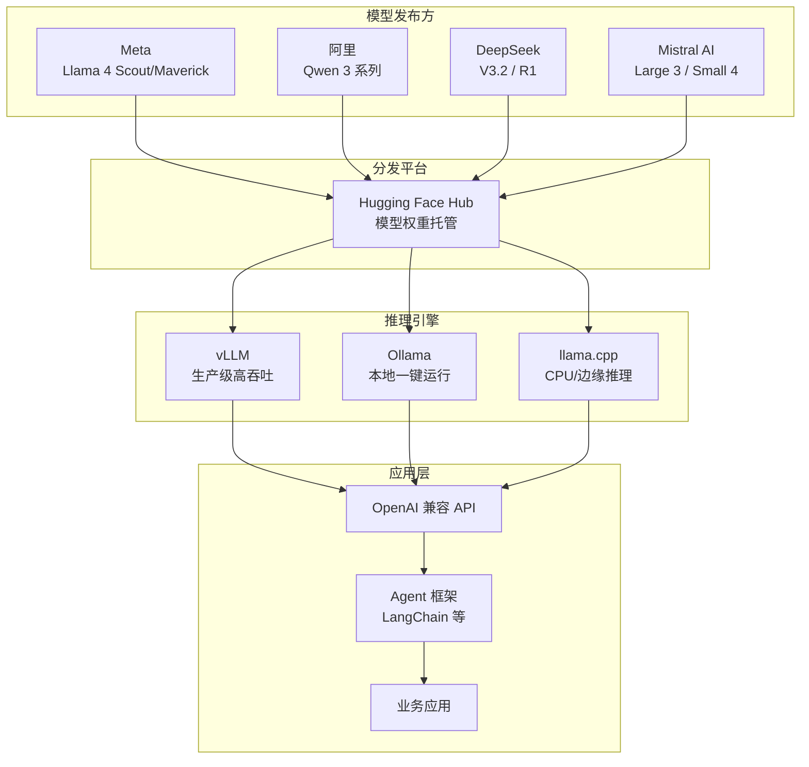

# 开源大模型生态（Open-source LLM Ecosystem）

## 概念解释

开源大模型生态是指由全球多家机构发布的、可免费获取模型权重并在本地运行的大语言模型（LLM, Large Language Model）群体，以及围绕它们形成的推理框架、微调工具和社区资源的总称。

它的出现源于三个现实痛点：商业 API 按 token 收费成本高、敏感数据上传云端有隐私风险、闭源模型无法深度定制。2023 年 Meta 开源 LLaMA 后，阿里、DeepSeek、Mistral 等机构相继跟进，到 2025 年，头部开源模型在多数基准测试上已追平甚至超越同期商业模型，开源不再是"退而求其次"的选择，而是很多场景下的首选方案。

与传统软件的开源不同，大模型开源的核心资产是**预训练权重**（Pre-trained Weights）而非源代码。用户拿到权重后，可以直接推理、量化压缩、或在领域数据上微调，无需从零训练。

## 关键结构

开源大模型生态由四层组成，从底层到应用层依次叠加：

| 层级 | 代表内容 | 作用 |
|------|---------|------|
| 模型层 | Llama 4、Qwen 3、DeepSeek V3.2、Mistral Large 3 | 提供预训练好的语言能力 |
| 推理引擎层 | vLLM、Ollama、llama.cpp、TGI | 将权重加载到 GPU/CPU 并高效执行推理 |
| 工具链层 | Hugging Face Hub、GGUF 量化、LoRA 微调 | 模型分发、压缩、适配 |
| 应用集成层 | OpenAI 兼容 API、LangChain、Agent 框架 | 将模型能力接入业务系统 |

### 模型层：四大主流系列

2025-2026 年最活跃的四大开源模型系列：

**Llama（Meta）**。Llama 4 家族于 2025 年 4 月发布，包含 Scout（109B 总参数 / 17B 激活，16 专家）和 Maverick（400B 总参数 / 17B 激活，128 专家）。Scout 支持 1000 万 token 上下文窗口，Maverick 在多项基准上超越 GPT-4o。架构上首次采用 iRoPE（交替使用 NoPE 层和 RoPE 层），这是其实现超长上下文的关键。许可证为 Llama 4 Community License，商用需标注"Built with Llama"。

**Qwen（阿里通义）**。Qwen 3 于 2025 年 4 月发布，涵盖 6 个 Dense（稠密）模型（0.6B 到 32B）和 2 个 MoE 模型（30B-A3B、235B-A22B），在 36 万亿 token、119 种语言上训练。支持"思考模式"（深度推理）和"非思考模式"（快速回答）的动态切换。全系列采用 Apache 2.0 许可证，商用无限制。后续又推出了 Qwen3-Omni 多模态版本。

**DeepSeek**。DeepSeek-V3（2024 年 12 月）和 R1（2025 年 1 月）引爆了开源推理模型赛道。V3 采用 671B 总参数 / 37B 激活的 MoE（Mixture of Experts，混合专家模型）架构，引入 MLA（Multi-head Latent Attention，多头潜在注意力）和多 token 预测。R1 首次验证了纯强化学习（RL）即可激发推理能力，性能对标 OpenAI o1。2025 年后续发布了 V3-0324、R1-0528、V3.1（混合思考/非思考模式）、V3.2（685B 参数，引入 DSA 稀疏注意力）。训练成本仅约 560 万美元，远低于同级别商业模型。

**Mistral（法国 Mistral AI）**。从 2025 年初的 Mistral Small 3（24B，Apache 2.0）起步，到 2025 年 12 月发布 Mistral Large 3（675B 总参数 / 41B 激活 MoE，256K 上下文，Apache 2.0）和 Ministral 3 系列（3B/8B/14B 稠密模型）。Devstral 2（123B）在 SWE-bench 上达到 72.2%，是开源代码 Agent 的标杆。Mistral 模型以推理速度快、多语言能力强（80+ 语言）著称。

### 推理引擎层

**vLLM**：面向生产环境的高吞吐推理引擎，核心技术是 PagedAttention（分页注意力），像操作系统管理虚拟内存一样管理 GPU 显存，吞吐量可达原生 PyTorch 的 3-10 倍。支持多 GPU 并行和 OpenAI 兼容 API。

**Ollama**：面向个人开发者的本地运行工具，一条命令即可下载并启动模型，支持 Mac/Windows/Linux。适合原型验证和低并发场景，不适合高并发生产环境。

### 工具链层

**Hugging Face Hub**：全球最大的模型托管平台，几乎所有开源模型都在此发布。提供 Transformers 库（加载和推理）、数据集托管、Open LLM Leaderboard（模型排行榜）。

**量化工具**：GGUF（llama.cpp 格式）、bitsandbytes（4-bit/8-bit 量化）、GPTQ、AWQ 等，可将模型体积压缩到原来的 1/4 ~ 1/8，使 7B 模型在消费级显卡上运行。

**微调工具**：LoRA/QLoRA（低秩适应）可在单卡上对大模型进行领域微调，PEFT 库提供统一接口。

## 核心原理

### 原理说明

开源大模型生态的核心运转机制可以分成三条主线：

**第一条主线：MoE 架构成为主流**。2024-2025 年发布的头部模型几乎全部采用 MoE 架构。其核心思路是：模型内部包含多个"专家"子网络，每次推理时只激活其中一小部分。例如 DeepSeek-V3 有 671B 总参数但每次只激活 37B，Llama 4 Maverick 有 400B 总参数但只激活 17B。这使得模型既拥有大参数量带来的知识容量，又保持了小模型的推理速度和显存占用。

**第二条主线：推理增强（Reasoning Enhancement）**。DeepSeek R1 开创了"纯 RL 训练推理能力"的范式，之后 Qwen 3 的"思考模式"、DeepSeek V3.1 的混合模式都沿袭了这一思路。模型可以在需要深度推理时启用 Chain-of-Thought（思维链），在简单问答时直接输出答案，兼顾质量和速度。

**第三条主线：工具链标准化**。模型发布格式趋向统一（safetensors 权重 + Hugging Face 托管），推理接口向 OpenAI 格式看齐（vLLM、Ollama 都提供兼容 API），量化格式以 GGUF 和 bitsandbytes 为主。这使得切换模型的成本极低——改一个模型名称字符串，其余代码不用动。

### Mermaid 图解



图中展示了从模型发布到应用集成的完整链路。四大模型系列通过 Hugging Face Hub 分发，用户根据场景选择推理引擎（vLLM 用于生产、Ollama 用于本地开发、llama.cpp 用于边缘设备），所有引擎都暴露 OpenAI 兼容 API，因此上层 Agent 框架和业务应用无需关心底层用的是哪个模型。

### 运行示例

```python
# 用 Ollama 本地运行开源模型（最简方式）
# 前置：安装 Ollama 后执行 ollama pull qwen3:8b
# 基于 openai==1.x 验证（截至 2026-03）

from openai import OpenAI

# Ollama 启动后默认监听 11434 端口，兼容 OpenAI API 格式
client = OpenAI(base_url="http://localhost:11434/v1", api_key="ollama")

response = client.chat.completions.create(
    model="qwen3:8b",  # 替换为任意已 pull 的模型名
    messages=[{"role": "user", "content": "用一句话解释什么是 MoE 架构"}],
    max_tokens=200,
)
print(response.choices[0].message.content)
# 输出示例：MoE（混合专家模型）是一种将模型拆分为多个专家子网络、
# 每次推理只激活部分专家的架构，兼顾大容量和低计算成本。
```

这段代码对应"工具链标准化"这条主线：无论底层是 Qwen、Llama 还是 DeepSeek，只要推理引擎提供 OpenAI 兼容 API，调用方式完全一致，换模型只需改 `model` 参数。

## 易混概念辨析

| 概念 | 与开源大模型生态的区别 | 更适合关注的重点 |
|------|----------------------|-----------------|
| 闭源商业 API（GPT-4o 等） | 用户无法获取权重、无法本地部署、无法微调，按 token 付费 | 开箱即用、无需运维、有 SLA 保障 |
| 开源推理框架（vLLM 等） | 推理框架是"跑模型的引擎"，模型生态是"引擎里跑的东西"，两者是工具与内容的关系 | 吞吐量优化、显存管理、部署架构 |
| 模型微调/训练 | 微调是在已有开源模型基础上用领域数据进一步训练，属于模型生态的"下游消费"环节 | 数据准备、LoRA 配置、效果评估 |
| 模型量化 | 量化是压缩模型体积的技术手段，让开源模型能在更低端硬件上运行 | 精度损失权衡、量化格式选择（GGUF/AWQ/GPTQ） |

核心区别：

- **开源大模型生态**：关注"有哪些模型可用、各自什么特点、怎么选"
- **闭源商业 API**：关注"付费换省心，但失去定制和隐私控制"
- **推理框架**：关注"怎么把模型高效跑起来"
- **微调/量化**：关注"怎么让模型更适合自己的场景和硬件"

## 适用边界与局限

### 适用场景

1. **数据敏感型应用**：医疗、金融、法律等行业要求数据不出内网，开源模型支持完全离线部署，满足隐私合规
2. **大规模推理需求**：日均百万级请求的场景下，本地部署开源模型比按 token 付费的 API 节省 70%-90% 成本
3. **领域深度定制**：需要在特定数据上微调以获得远超通用模型效果的场景，如企业知识库问答、垂直领域代码生成
4. **边缘/离线部署**：手机 App、IoT 设备、无网络环境下，3B-8B 量化模型可在消费级硬件上实时推理

### 不适合的场景

1. **团队无 ML 工程能力**：本地部署涉及 GPU 驱动、显存管理、模型加载、故障排查，运维门槛高于直接调 API
2. **追求绝对最强性能**：截至 2026 年初，在最复杂的多步推理和创意写作任务上，最新商业模型仍有微弱优势

### 局限性

1. **知识时效性**：模型训练数据有截止日期，无法获取实时信息，需配合 RAG（检索增强生成）或联网工具补充
2. **许可证差异大**：Apache 2.0（Qwen、Mistral）可自由商用，但 Llama 4 Community License 和 DeepSeek License 有收入门槛或品牌标注要求，商用前必须逐一核实
3. **MoE 模型的显存陷阱**：虽然激活参数少，但总参数的权重仍需全部加载到显存中（除非使用 offloading），671B 模型至少需要 4 张 80GB A100

## 常见误区

| 常见误区 | 正确理解 |
|----------|----------|
| "开源模型比 GPT-4 差很多，只能做简单任务" | DeepSeek V3.2、Qwen3-235B 等头部开源模型在数学、代码、推理等基准测试上已与 GPT-4o 持平甚至超越，差距已大幅缩小 |
| "MoE 模型只激活 37B 参数，所以只需要 37B 模型的显存" | MoE 架构的全部权重仍需加载到显存，671B 总参数的模型需要约 1.3TB 显存（FP16），激活参数少只降低了计算量，不降低显存占用 |
| "Apache 2.0 的模型可以随意商用，不需要看许可证" | Qwen 和 Mistral 大部分模型确实是 Apache 2.0，但 Llama 4 用 Community License（需标注品牌），DeepSeek 权重用专属许可证（营收超 100 万美元需商业授权），必须逐模型核实 |
| "本地跑开源模型一定比调 API 便宜" | 小规模使用时，GPU 硬件采购/租赁成本可能高于 API 调用费。通常日均请求量达到数千次以上，本地部署的成本优势才能体现 |

## 思考题

<details>
<summary>初级：Llama 4 Maverick 有 400B 总参数但只激活 17B，这靠的是什么架构？这种架构的好处是什么？</summary>

**参考答案：**

靠的是 MoE（Mixture of Experts，混合专家模型）架构。模型内部包含 128 个专家子网络，每次推理时路由器（Router）只选择少量专家参与计算。好处是：用大参数量积累丰富知识，但推理时只消耗小模型的计算资源，兼顾容量和速度。

</details>

<details>
<summary>中级：一家日均 5 万次请求的法律科技公司想部署开源模型，该优先考虑哪些因素来做模型选型？</summary>

**参考答案：**

需要依次考虑：(1) 中文法律文本能力——优先考虑中文训练充分的模型如 Qwen 3 或 DeepSeek；(2) 许可证——法律公司有商业收入，需排除有收入限制的许可证，Apache 2.0（Qwen）最安全；(3) 上下文长度——法律文书动辄数万字，需要 128K+ 上下文支持；(4) 部署成本——日均 5 万次需要生产级推理引擎（vLLM），MoE 模型虽然推理快但总参数对显存要求高，可能需要从 32B Dense 模型起步；(5) 数据隐私——法律文件高度敏感，必须本地部署。

</details>

<details>
<summary>中级/进阶：DeepSeek R1 用纯强化学习训练出了推理能力，而 Qwen 3 用"思考/非思考模式"切换。这两种方案各有什么优劣？在什么场景下你会选哪个？</summary>

**参考答案：**

DeepSeek R1 的纯 RL 训练方案的优势在于验证了无需人工标注推理数据也能获得强推理能力，且 R1 的蒸馏版本（1.5B-70B）可在消费级硬件上运行；劣势是早期版本存在输出冗长、语言混杂等问题。Qwen 3 的双模式切换方案优势在于灵活——简单问题走快速模式省时间，复杂问题走思考模式保质量，且全系列 Apache 2.0 许可证对商用更友好；劣势是需要调用方（或模型自身）正确判断何时启用思考模式。如果场景以数学/代码等需要深度推理的任务为主，R1 更合适；如果场景是通用对话 + 偶尔深度推理的混合型应用，Qwen 3 的双模式更实用。

</details>

## 参考资料

1. Meta AI. "The Llama 4 herd: The beginning of a new era of natively multimodal AI innovation." https://ai.meta.com/blog/llama-4-multimodal-intelligence/
2. Qwen Team. "Qwen3: Think Deeper, Act Faster." https://qwenlm.github.io/blog/qwen3/
3. DeepSeek-AI. "DeepSeek-V3 Technical Report." arXiv:2412.19437. https://arxiv.org/abs/2412.19437
4. DeepSeek-AI. "DeepSeek-R1." GitHub. https://github.com/deepseek-ai/DeepSeek-R1
5. Mistral AI. "Introducing Mistral 3." https://mistral.ai/news/mistral-3
6. Sebastian Raschka. "A Technical Tour of the DeepSeek Models from V3 to V3.2." https://magazine.sebastianraschka.com/p/technical-deepseek
7. Hugging Face. "Welcome Llama 4 Maverick & Scout on Hugging Face." https://huggingface.co/blog/llama4-release
8. vLLM Project. https://github.com/vllm-project/vllm
9. BentoML. "The Best Open-Source LLMs in 2026." https://www.bentoml.com/blog/navigating-the-world-of-open-source-large-language-models
