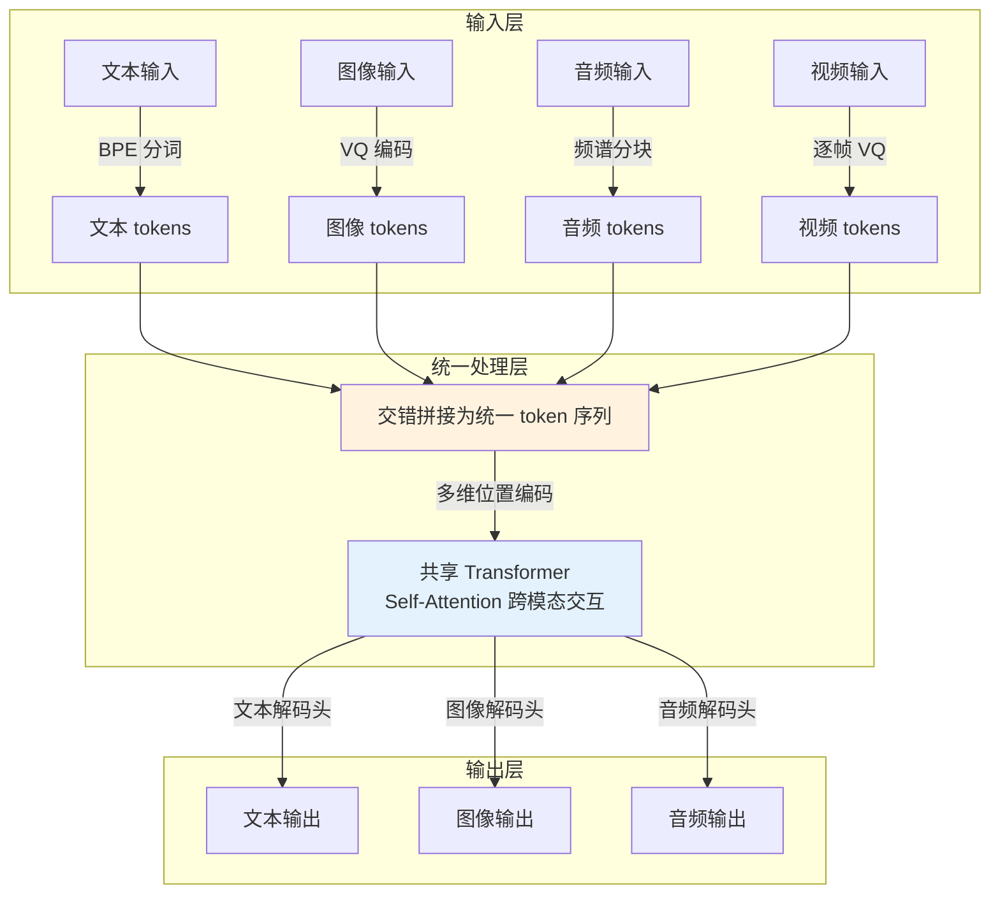

# 统一多模态模型（Unified Multimodal Models）

## 概念解释

统一多模态模型（Unified Multimodal Models）是一种用**单个神经网络**同时处理和生成文本、图像、音频、视频等多种数据类型的 AI 架构。与传统的"多个专用模型各管一摊"不同，它把所有类型的信息都转换成同一种"语言"（token 序列），然后交给同一个 Transformer（变换器）来理解和生成。

这种架构出现的原因很直接：过去的多模态 AI 是"管道式"的——先用语音识别模型把声音转成文字，再用语言模型理解文字，最后用语音合成模型把回答转成声音。每一步都丢信息、加延迟。比如说话人的语气、背景噪音、表情等丰富信号在第一步就被丢掉了。统一模型把这条管道压缩成一个端到端的网络，所有模态的信息从一开始就能相互影响。

与传统的 Late Fusion（晚期融合）方案相比，统一多模态模型采用 Early Fusion（早期融合）策略：不是各自编码后再拼接，而是在 token 层面就把不同模态混在一起处理。这让模型能学到更深层的跨模态关联——比如一个人"皱着眉头说没事"，模型能同时看到表情和听到语气，而不是分开处理后再拼凑判断。

## 关键结构

| 结构 | 作用 | 说明 |
|------|------|------|
| 统一 Tokenizer（分词器） | 把所有模态转成同一种 token | 文本用 BPE 分词，图像用 VQ（向量量化）离散化，音频用频谱编码 |
| 共享 Transformer 骨架 | 统一处理所有模态的 token | 一个模型处理混合 token 序列，不区分模态 |
| 多维位置编码 | 处理空间和时间信息 | 文本是一维序列，图像是二维网格，视频还有时间轴，需要多维编码 |
| 条件解码头 | 根据任务输出不同模态 | 文本解码头生成文字，图像解码头生成图片，音频解码头合成语音 |

### 结构 1：统一 Tokenizer

统一多模态模型的第一步是把所有输入都变成 token。文本的 tokenize 大家很熟悉，关键在于非文本模态的处理：

- **图像**：通过 VQ-VAE（Vector Quantized Variational Autoencoder，向量量化变分自编码器）把一张图片压缩成一串离散编码。例如 Chameleon 把 512x512 的图片编码为 1024 个 token，从一个 8192 大小的码本（codebook）中选取。
- **音频**：把声波转成梅尔频谱图（Mel Spectrogram），再按时间窗切成块，每块编码为一个或多个 token。
- **视频**：逐帧提取图像 token，加上时间戳信息，与对应时刻的音频 token 交错排列。

所有这些 token 最终都映射到**同一个向量空间**，维度相同、分布对齐。对 Transformer 来说，它看到的只是一个长长的 token 序列，不需要"知道"每个 token 来自哪个模态。

### 结构 2：共享 Transformer 骨架

这是整个架构的核心。所有模态的 token 进入同一个 Transformer，通过 Self-Attention（自注意力）机制相互作用。一个图像 token 可以"关注"到一个文本 token，一个音频 token 可以"关注"到一个视频帧 token。

目前主流架构采用 Decoder-Only（纯解码器）设计，和 GPT 系列一样，通过 Next-Token Prediction（下一个 token 预测）的方式统一训练。Emu3 在 Nature 上发表的论文证明：仅靠 next-token prediction，不需要 Diffusion（扩散模型）或复合架构，就能在感知和生成任务上匹配旗舰专用模型的表现。

### 结构 3：多维位置编码

文本是一维的（第 1 个词、第 2 个词......），但图像是二维的（x 坐标、y 坐标），视频还多一个时间维度。为了让 Transformer 正确理解每个 token 的"位置"，需要多维位置编码。

例如 TMRoPE（Temporal-Modal Rotary Position Embedding，时间-模态旋转位置编码）将位置信息分解为三个维度：空间 x、空间 y、时间 t。这样视频中第 3 秒的画面和第 3 秒的声音就能通过时间维度对齐，不会"错配"。

### 结构 4：条件解码头

模型的 Transformer 输出统一的隐层向量后，根据任务需求路由到不同的解码头：文本解码头输出词汇表上的概率分布，图像解码头输出像素或 VQ 码本索引，音频解码头输出频谱特征。用户可以灵活指定想要的输出模态。

## 核心原理

### 原理说明

统一多模态模型的核心工作流程可以概括为四步：

**第一步：统一编码。** 各模态的输入通过各自的 tokenizer 转换为离散 token 序列。文本用 BPE，图像用 VQ 编码器，音频用频谱分块。所有 token 被投影到同一个向量空间中，维度一致。

**第二步：交错拼接。** 不同模态的 token 在序列中交错排列（Interleaving）。例如处理一段视频时，序列可能是：`[视频帧1_tokens, 音频块1_tokens, 视频帧2_tokens, 音频块2_tokens, ...]`。这种交错让模型在处理任意位置时都能通过注意力机制看到其他模态的上下文。

**第三步：统一处理。** 混合 token 序列进入共享的 Transformer。Self-Attention 不区分模态，每个 token 都可以关注序列中所有其他 token。跨模态的关联就在这一步自然建立。

**第四步：条件生成。** Transformer 输出的隐层向量被送入对应的解码头。如果任务是"看图回答问题"，就走文本解码头；如果是"文字转语音"，就走音频解码头。一个模型，按需输出。

这种机制之所以有效，关键在于统一的 token 空间让不同模态的信息在编码阶段就完成了对齐，而不是各自处理完再硬拼。Self-Attention 的全局关注能力让跨模态推理变得自然。

### Mermaid 图解



图中核心流转：四种模态的输入各自 tokenize 后，在"交错拼接"节点汇合成一条混合 token 序列。这条序列进入共享 Transformer 进行全局 Self-Attention 计算——这是跨模态理解发生的关键环节。最后根据任务需要选择对应的解码头输出。

容易忽略的点：交错拼接不是简单的首尾拼接，而是按时间或语义对齐交错排列，确保相关的跨模态 token 在序列中彼此靠近，从而在注意力窗口内有更强的交互。

### 运行示例

```python
# 最小概念示例：展示统一 token 空间和交错编码的核心机制
# 基于 PyTorch 2.x 验证（截至 2026-03）
import torch
import torch.nn as nn

class MiniUnifiedModel(nn.Module):
    """简化版统一多模态模型，展示核心架构思路"""
    def __init__(self, embed_dim=256, vocab_size=1000, img_codebook=512):
        super().__init__()
        # 文本和图像共享同一个 embedding 空间
        self.text_embed = nn.Embedding(vocab_size, embed_dim)
        self.img_embed = nn.Embedding(img_codebook, embed_dim)
        # 模态标识 embedding（让模型区分 token 来源）
        self.modality_embed = nn.Embedding(2, embed_dim)  # 0=文本, 1=图像
        # 共享 Transformer（2 层，简化演示）
        layer = nn.TransformerEncoderLayer(
            d_model=embed_dim, nhead=4, batch_first=True
        )
        self.transformer = nn.TransformerEncoder(layer, num_layers=2)
        # 文本解码头
        self.text_head = nn.Linear(embed_dim, vocab_size)

    def forward(self, text_ids, img_ids):
        # 第一步：各模态分别 embedding + 加模态标识
        t_emb = self.text_embed(text_ids) + self.modality_embed(
            torch.zeros_like(text_ids)
        )
        i_emb = self.img_embed(img_ids) + self.modality_embed(
            torch.ones_like(img_ids)
        )
        # 第二步：交错拼接（图像 tokens 在前，文本 tokens 在后）
        merged = torch.cat([i_emb, t_emb], dim=1)
        # 第三步：统一 Transformer 处理（跨模态 Self-Attention）
        hidden = self.transformer(merged)
        # 第四步：取文本部分的输出，通过文本解码头
        text_hidden = hidden[:, img_ids.size(1):, :]
        return self.text_head(text_hidden)

# 验证运行
model = MiniUnifiedModel()
text_ids = torch.randint(0, 1000, (1, 8))   # 8 个文本 token
img_ids = torch.randint(0, 512, (1, 16))    # 16 个图像 token
logits = model(text_ids, img_ids)
print(f"输出形状: {logits.shape}")  # (1, 8, 1000)
```

这段代码展示了统一多模态模型的四步核心流程：模态 embedding、交错拼接、共享 Transformer 处理、条件解码。模态标识 embedding 让 Self-Attention 在不区分模态的前提下仍能隐式学到模态差异。实际的生产级模型在此基础上增加多维位置编码、更大的参数规模和更精细的 tokenizer。

## 易混概念辨析

| 概念 | 与统一多模态模型的区别 | 更适合关注的重点 |
|------|---------------------|------------------|
| 多模态大语言模型（MLLM） | MLLM 通常是在 LLM 基础上外接视觉/音频编码器，属于 Late Fusion，模态间交互较浅 | 如何在已有 LLM 上快速扩展视觉能力 |
| 扩散模型（Diffusion Models） | 扩散模型擅长高质量图像/视频生成，但通常只处理单一模态，不做跨模态理解 | 图像/视频生成的质量和可控性 |
| CLIP | CLIP 做的是跨模态对齐（文本和图像映射到同一空间），但不做生成，也不是统一架构 | 跨模态检索和零样本分类 |

核心区别：

- **统一多模态模型**：所有模态在同一个模型内从 token 层面混合处理，既能理解也能生成
- **多模态大语言模型**：以 LLM 为核心，外挂编码器处理其他模态，模态融合发生在较浅层
- **扩散模型**：专注于生成任务，通常只处理单一模态（图像或视频），不做跨模态理解
- **CLIP**：只做跨模态对齐和检索，不涉及生成，也不是端到端的统一架构

## 适用边界与局限

### 适用场景

1. **实时多模态交互**：语音助手、视频通话翻译等需要同时理解声音、画面和文字的场景。统一模型的端到端架构将延迟从管道式的 1-2 秒压缩到 200-300ms，接近人类对话的反应速度。
2. **多模态内容创作**：根据文字描述同时生成配图、配音的内容创作工具。统一模型能保证不同模态的输出语义一致，不会出现"文字说猫，图片画狗"的割裂。
3. **跨模态检索与理解**：用文字搜视频、用图片搜音乐、或者分析视频中"说话人的表情和语气是否一致"等需要深层跨模态推理的场景。

### 不适合的场景

1. **单一模态的极致性能需求**：如果只需要做医学影像分析或只做语音识别，专用模型在特定领域的精度通常更高。统一模型需要在多个模态间分配容量，单一模态的性能可能不如专用模型。
2. **资源极度受限的边缘部署**：虽然 MiniCPM-V 等模型在缩小，但全模态统一模型的参数量和计算需求仍远高于单模态模型。在只有文字输入的场景下，部署统一模型是浪费。

### 局限性

1. **训练成本极高**：需要海量的多模态对齐数据（文本-图像-音频-视频的配对数据）和巨大的算力。Meta 训练 Chameleon-34B 用了超过 500 万 GPU 小时。小团队几乎无法从零训练。
2. **模态不均衡问题**：现实中文本数据远多于高质量的多模态配对数据。模型容易在文本能力上很强，但图像/音频生成质量不够，或者不同模态之间的能力差距明显。
3. **可解释性差**：当输出出错时，很难判断问题出在哪个模态的处理环节。是图像 tokenizer 编码丢失了关键信息，还是 Transformer 的跨模态注意力没有正确关联？调试难度远高于单模态模型。

## 常见误区

| 常见误区 | 正确理解 |
|----------|----------|
| 统一多模态模型就是把多个模型拼在一起 | 统一模型是**单个**神经网络，所有模态的 token 在同一个 Transformer 中混合处理。与"模型拼接"（pipeline 方案）的本质区别是信息融合的深度——前者从 token 层面融合，后者只在输出层面拼接 |
| 统一模型在所有任务上都比专用模型强 | 在需要深层跨模态推理的任务上，统一模型有优势。但在纯粹的单模态任务上（如纯文本 NLP 或纯图像分类），专用模型因为可以把全部容量集中在一个模态上，性能往往更高 |
| 统一模型必须同时输入所有模态 | 统一模型可以接受任意模态组合的输入，也可以只输入文本或只输入图像。"统一"指的是架构能力，不是使用时的强制要求 |
| Early Fusion 一定比 Late Fusion 好 | Early Fusion 在跨模态推理上更强，但训练难度和数据要求也更高。对于"各模态处理相对独立"的简单任务，Late Fusion 的方案更易实现、更易调试 |

## 思考题

<details>
<summary>初级：统一多模态模型和传统管道式多模态系统的核心区别是什么？</summary>

**参考答案：**

核心区别在于信息融合的时机和深度。管道式系统分别用专用模型处理各模态（如 Whisper 做语音识别 -> GPT 做文本理解 -> TTS 做语音合成），模态间只在输出层拼接，中间过程丢失了大量跨模态信号（如语气、表情）。统一多模态模型把所有模态转成 token 后在同一个 Transformer 中混合处理，从 Self-Attention 层面就实现了跨模态交互，信息损失更小，延迟也更低。

</details>

<details>
<summary>中级：如果你的应用场景是"纯文本客服机器人"，应该选统一多模态模型还是纯语言模型？为什么？</summary>

**参考答案：**

应该选纯语言模型。原因有三：(1) 纯文本场景用不到跨模态能力，统一模型的多模态容量被浪费；(2) 同等参数规模下，纯语言模型在文本任务上通常表现更好，因为容量全部集中在语言能力上；(3) 纯语言模型的推理成本更低、部署更简单。统一多模态模型的价值在跨模态场景才能体现。

</details>

<details>
<summary>中级/进阶：Emu3 论文证明"仅靠 next-token prediction 就能统一多模态理解和生成"。这对统一多模态模型的架构设计意味着什么？</summary>

**参考答案：**

Emu3 的结论意味着统一多模态模型不一定需要 Diffusion 模块或复合架构。只要 tokenizer 足够好（能把图像、视频等高保真地转成离散 token），纯自回归的 Transformer 就能同时完成理解和生成。这大幅简化了架构设计——不需要为生成任务单独引入扩散模型，训练流程也更统一。但前提条件是需要高质量的 VQ tokenizer，以及足够大规模的多模态训练数据。实际上，后续的研究（如 Emu3.5 引入的 DiDA）表明在推理效率上，纯自回归方案仍有改进空间，混合方案也有其价值。

</details>

## 参考资料

1. OpenAI. (2024). "Hello GPT-4o." https://openai.com/index/hello-gpt-4o/
2. Meta AI. (2024). "Chameleon: Mixed-Modal Early-Fusion Foundation Models." arXiv:2405.09818. https://arxiv.org/abs/2405.09818
3. Emu3 Team, BAAI. (2025). "Multimodal learning with next-token prediction for large multimodal models." *Nature*. https://www.nature.com/articles/s41586-025-10041-x
4. AIDC-AI. (2025). "Unified Multimodal Understanding and Generation Models: A Survey." arXiv:2505.02567. https://arxiv.org/abs/2505.02567
5. Xu et al. (2025). "From Specific-MLLMs to Omni-MLLMs: A Survey on MLLMs Aligned with Multi-modalities." ACL 2025 Findings. https://arxiv.org/abs/2412.11694
6. Google DeepMind. "Gemini: A Family of Highly Capable Multimodal Models." https://deepmind.google/technologies/gemini/
