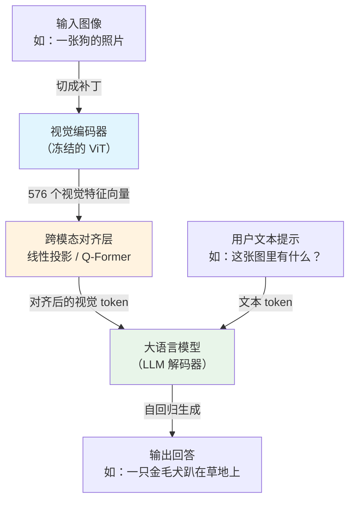
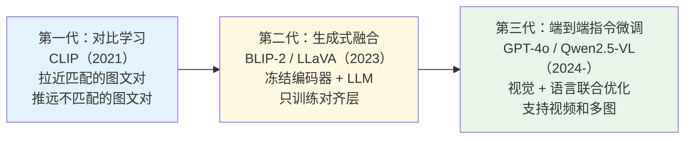

# 视觉语言模型（Vision-Language Models, VLM）

## 概念解释

视觉语言模型（Vision-Language Model，简称 VLM）是一类能同时处理图像和文本的多模态 AI 模型。输入一张图片加一句话，它就能用自然语言回答关于这张图的问题。可以把它理解成：**给大语言模型装上了一双眼睛**。

在 VLM 出现之前，计算机视觉和自然语言处理是两个割裂的世界——图像分类模型只输出类别标签（比如"狗"），文本模型对图片完全"看不见"。即使你用两个模型串联，它们各自的特征空间（Feature Space，即模型内部表示信息的数学空间）是独立的，缺少共同的"语义桥梁"。VLM 的核心思路是：一张狗的照片和"狗"这个词在概念上应该"靠近"，它通过让视觉编码器和语言模型在**统一的特征空间中对齐**，打通了图像与文字之间的语义鸿沟。

与传统方法相比，VLM 最大的变革在于：从"给每个视觉任务单独训练一个模型"，进化到"用自然语言指令驱动一个通用模型完成各种视觉理解任务"。你不需要分别训练物体检测器、场景分类器、OCR 引擎——一个 VLM 就能通过不同的提示词完成这些工作。

## 关键结构

VLM 由三个核心组件组成，缺一不可：

| 结构 | 作用 | 类比 |
|------|------|------|
| 视觉编码器（Vision Encoder） | 把图像转换成模型能理解的特征向量 | 眼睛：负责"看" |
| 跨模态对齐层（Alignment Layer） | 把视觉特征翻译成 LLM 能读懂的格式 | 翻译官：让眼睛和大脑说同一种语言 |
| 语言模型解码器（LLM Decoder） | 综合视觉和文本信息，生成自然语言回答 | 大脑：负责"想"和"说" |

### 结构 1：视觉编码器

视觉编码器通常是一个预训练的 Vision Transformer（ViT，视觉 Transformer）。它把一张图像切成若干小块（Patch，补丁），每个补丁一般是 16x16 像素，然后像处理文本 token 一样用 Transformer 提取特征。编码后，一张图像变成一组特征向量，形状大致是 `(补丁数量, 特征维度)`。

主流选择包括 ViT（CLIP 使用）、SigLIP（Gemini 使用）等。视觉编码器的质量直接决定了 VLM 能"看"到多少有效信息。

### 结构 2：跨模态对齐层

视觉编码器输出的特征和 LLM 期望的输入格式不一样——维度不同、语义空间不同。对齐层的职责就是做"翻译"，主流方案有三种：

- **线性投影（Linear Projection）**：最简单，用一个矩阵把视觉特征的维度变换成 LLM 的输入维度。LLaVA 用的就是这种方案，简单有效。
- **Q-Former（查询 Transformer）**：BLIP-2 的方案。用 32 个可学习的查询向量，通过交叉注意力（Cross-Attention）从视觉特征中提取最关键的信息，相当于一个"信息压缩器"。
- **交叉注意力融合**：在 LLM 的某些层中直接插入视觉信息，让文本 token 在生成时能实时"看到"图像特征。

### 结构 3：语言模型解码器

通常直接复用一个预训练的 LLM（如 Llama、Qwen、Vicuna 等）。它接收对齐后的视觉特征和用户的文本提示，通过自回归方式逐 token 生成回答。

实践中通常**冻结**（Freeze）LLM 的权重，只训练对齐层。好处是省算力、防止遗忘 LLM 已有的语言能力；代价是对齐层必须足够好，否则 LLM 再强也"看不懂"图像信息。

## 核心原理

### 原理说明

VLM 的工作流程可以概括为"看图 → 翻译 → 回答"三步：

1. **视觉编码**：图像送入视觉编码器（通常是冻结的 ViT），被切成补丁后编码为一组特征向量。比如一张 336x336 的图，按 14x14 补丁划分，产生 576 个特征向量。

2. **跨模态对齐**：对齐层把这些视觉特征投影到 LLM 的输入空间。以 LLaVA 为例，就是一个 MLP（多层感知机）做维度变换；以 BLIP-2 为例，32 个查询向量通过交叉注意力把 576 个视觉特征压缩成 32 个对齐向量。

3. **语言生成**：对齐后的视觉向量和用户输入的文本 token 拼接在一起，送入 LLM。LLM 同时"看到"图像信息和文字问题，逐步生成自然语言回答。

关键在于：视觉编码器和 LLM 通常都是冻结的预训练模型，整个训练过程**只学习对齐层的参数**（以及可选的 LLM 微调）。这就是为什么 VLM 可以用相对少的训练成本获得强大能力——它站在视觉和语言两个巨人的肩膀上。

### Mermaid 图解



图中核心流转：图像经视觉编码器变成特征向量，经对齐层"翻译"后与文本 token 一起送入 LLM。**对齐层是整条链路的瓶颈**——如果翻译不到位，LLM 再强也会答非所问。

### 训练范式演进

VLM 的训练方式经历了三代演进：



- **第一代**（对比学习）：CLIP 用 4 亿图文对做对比学习，让模型学会"这张图和这段文字是否匹配"。能力限于检索和零样本分类，不能自由生成文本。
- **第二代**（生成式融合）：BLIP-2 和 LLaVA 把冻结的视觉编码器接上冻结的 LLM，只训练中间的对齐层。LLaVA 的突破在于用 GPT-4 自动生成 60 万条图文指令数据，大幅降低了数据标注成本。
- **第三代**（端到端微调）：GPT-4o、Gemini 2.5、Qwen2.5-VL 等最新模型采用端到端训练，视觉和语言部分联合优化，支持多图、视频、高分辨率输入，推理能力大幅提升。

### 运行示例

```python
# 最小 VLM 推理示例
# 基于 transformers>=4.28.0 验证（截至 2026-03）
from transformers import Blip2Processor, Blip2ForConditionalGeneration
from PIL import Image
import requests

# 加载 BLIP-2 模型（约 27 亿参数的轻量版本）
model_id = "Salesforce/blip2-opt-2.7b"
processor = Blip2Processor.from_pretrained(model_id)
model = Blip2ForConditionalGeneration.from_pretrained(model_id)

# 加载图像
url = "https://huggingface.co/datasets/Salesforce/BLIP/resolve/main/dog.jpg"
image = Image.open(requests.get(url, stream=True).raw)

# 输入图像 + 文本提示，模型生成回答
inputs = processor(images=image, text="这张图里有什么？", return_tensors="pt")
output = model.generate(**inputs, max_length=50)
print(processor.decode(output[0], skip_special_tokens=True))
# 输出类似：a golden retriever laying on the grass
```

上述代码演示了 VLM 的完整推理链路：`processor` 同时处理图像和文本输入，`model.generate()` 自回归生成回答。BLIP-2 内部自动完成了视觉编码 → Q-Former 对齐 → LLM 解码三个阶段。

## 易混概念辨析

| 概念 | 与 VLM 的区别 | 更适合关注的重点 |
|------|--------------|-----------------|
| 多模态大模型（Multimodal LLM） | VLM 专指视觉+语言；多模态大模型还可能包含音频、视频、3D 等更多模态 | 关注 VLM 时聚焦视觉-文本对齐；关注多模态时看模态扩展方式 |
| 图像分类模型（Image Classifier） | 图像分类只输出固定类别标签；VLM 能生成任意自然语言回答 | 图像分类适合标签明确的封闭任务；VLM 适合开放式视觉理解 |
| OCR 模型 | OCR 专注从图像中提取文字；VLM 理解图像的完整语义（物体、关系、场景等） | 纯文字提取用 OCR 更高效；需要理解图像含义时用 VLM |
| CLIP | CLIP 做的是视觉-文本对齐（判断匹配程度）；VLM 在对齐基础上还能生成文本 | CLIP 适合检索和零样本分类；VLM 适合问答和描述生成 |

核心区别：

- **VLM**：看图 + 理解 + 生成回答，是完整的"视觉理解到语言输出"管道
- **图像分类 / OCR**：只做视觉侧的单一任务，输出固定格式
- **CLIP**：VLM 的"前辈"，解决了对齐问题但不具备语言生成能力

## 适用边界与局限

### 适用场景

1. **视觉问答（VQA）**：用户上传图片并用自然语言提问（如"这张发票的总金额是多少？"），VLM 直接理解图像并回答，无需单独的 OCR + 规则引擎管道
2. **图像描述与内容审核**：为图片自动生成描述文本（如无障碍网页的 alt 文本），或判断图片是否违反内容政策
3. **跨模态检索**：用文字搜图、用图搜图，VLM 学到的对齐表示让图文之间的相似度计算变得高效
4. **文档和表格理解**：相比纯 OCR，VLM 能理解文档的逻辑结构和含义，适合发票处理、报告解析等结构化信息提取任务

### 不适合的场景

1. **实时性要求极高的任务**：VLM 推理延迟通常在秒级，不适合自动驾驶等毫秒级响应场景，轻量检测器（如 YOLO）更合适
2. **需要像素级精确标注的任务**：VLM 的输出是自然语言，不适合实例分割、关键点检测等需要精确坐标输出的任务

### 局限性

1. **幻觉问题（Hallucination）**：VLM 可能"编造"图像中不存在的内容。比如看一张空椅子的照片，可能说"椅子上坐着一个人"。这源于 LLM 的补全倾向，图像信息不足时尤其明显
2. **空间推理能力不足**：即使是顶级 VLM，在空间关系判断（如"左边的物体比右边高吗？"）上的准确率也只有 50-60%，接近随机猜测
3. **高分辨率图像信息丢失**：多数 VLM 将图像缩放到固定尺寸（如 336x336），细小物体和精细纹理会丢失。一张 1024x1024 的图会消耗约 4096 个视觉 token，多图场景很容易撑爆上下文窗口
4. **语言偏向性**：主流 VLM 以英文数据训练为主，中文等其他语言的表现通常弱于英文

## 常见误区

| 常见误区 | 正确理解 |
|----------|----------|
| VLM 就是图像分类器 + LLM 简单串联 | VLM 的核心是深度融合，视觉和语言在内部多层交互，而不是两个模型的输出拼接 |
| 参数越多效果越好 | 对齐质量、训练数据质量的影响往往大于参数量。开源的 Qwen2.5-VL 在部分任务上已追平闭源的 GPT-4o |
| VLM 能完美理解图像中的所有细节 | VLM 受限于输入分辨率和训练数据覆盖范围，对罕见物体、极端视角、微观细节容易出错 |
| 使用 VLM 必须微调 | 预训练的 VLM（如 BLIP-2、LLaVA）在通用任务上开箱即用，微调只是为了适配特定领域 |

## 思考题

<details>
<summary>初级：VLM 为什么需要对齐层？直接把视觉编码器的输出送入 LLM 不行吗？</summary>

**参考答案：**

不行。视觉编码器和 LLM 是独立训练的，它们的特征空间维度和语义含义完全不同。视觉编码器输出的向量对 LLM 来说就是"乱码"。对齐层的作用是做"维度变换 + 语义翻译"，把视觉特征映射到 LLM 能理解的输入空间。没有对齐层，LLM 无法从视觉特征中提取任何有意义的信息。

</details>

<details>
<summary>中级：CLIP 和 LLaVA 都是 VLM，但它们的能力边界有什么本质区别？</summary>

**参考答案：**

CLIP 只做对比学习，能判断"这张图和这段文字有多匹配"，适合检索和零样本分类，但不能生成自由文本。LLaVA 在 CLIP 视觉编码器的基础上接入了 LLM，具备语言生成能力，能回答开放式问题、生成描述。本质区别在于：CLIP 是判别式模型（Discriminative），LLaVA 是生成式模型（Generative）。

</details>

<details>
<summary>中级/进阶：你要给一个电商平台设计商品图片审核系统（每天百万级图片），需要判断图片是否清晰、是否与标题匹配、是否违规。你会选择 VLM 还是传统图像分类方案？如何设计？</summary>

**参考答案：**

推荐分层架构：第一层用轻量模型（如图像质量评估模型）做清晰度过滤，速度快、成本低；第二层用 VLM 处理需要语义理解的任务（图文匹配、违规判断），因为这些任务需要同时理解图像内容和文本描述，传统分类器无法胜任。选择离线批处理而非实时推理，因为审核不需要毫秒级响应。如果准确率不达标，优先补充领域微调数据（如平台历史违规案例），用 LoRA 做参数高效微调，成本可控。

</details>

## 参考资料

1. Radford, A. et al. (2021). *Learning Transferable Visual Models From Natural Language Supervision*（CLIP 原始论文）. ICML. https://arxiv.org/abs/2103.00020
2. Li, J. et al. (2023). *BLIP-2: Bootstrapping Language-Image Pre-training with Frozen Image Encoders and Large Language Models*. ICML. https://arxiv.org/abs/2301.12597
3. Liu, H. et al. (2023). *Visual Instruction Tuning*（LLaVA 原始论文）. NeurIPS. https://arxiv.org/abs/2304.08485
4. Khan, M. et al. (2025). *Vision Language Models: A Survey of 26K Papers*. arXiv. https://arxiv.org/abs/2510.09586
5. IBM Technology. *What Are Vision Language Models (VLMs)?*. https://www.ibm.com/think/topics/vision-language-models
6. DataCamp. *Top 10 Vision Language Models in 2026*. https://www.datacamp.com/blog/top-vision-language-models

---
