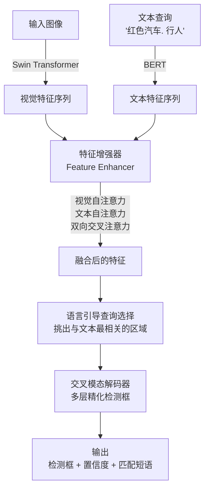
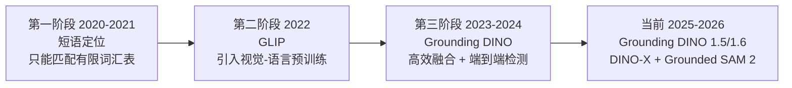

# 视觉定位与检测（Visual Grounding & Detection）

## 概念解释

视觉定位与检测（Visual Grounding & Detection）是一种将自然语言理解和目标检测结合起来的技术。简单说，你用文字告诉 AI "找出图中的红色汽车"，AI 就能在图像中把红色汽车的位置框出来，并告诉你它有多大把握。

传统的目标检测器（如 YOLO、Faster R-CNN）属于"闭集检测"（Closed-Set Detection）：训练时定义了 80 个类别（比如 COCO 数据集里的"人、车、猫、狗"），模型就只能识别这 80 类。遇到训练集里没有的物体（比如"无人机"），模型束手无策，必须重新收集数据、标注、训练，成本很高。

视觉定位与检测解决了这个问题：它不再依赖固定的类别列表，而是把"你想找什么"这件事交给自然语言来表达。模型同时理解图像内容和文字含义，通过跨模态匹配（Cross-Modal Matching，即让视觉信息和语言信息互相对齐）来定位物体。这就是所谓的"开放集检测"（Open-Set Detection）或"开放词汇检测"（Open-Vocabulary Detection, OVD）。这项技术在 Agent 系统中可以充当"视觉感知模块"，让 Agent 按照用户的自然语言指令去图像或视频中找到特定物体。

## 关键结构

视觉定位系统由四个核心组件协同工作：

| 结构 | 作用 | 说明 |
|------|------|------|
| 图像编码器 | 从图像中提取视觉特征 | 常用 Swin Transformer 或 ResNet |
| 文本编码器 | 将自然语言查询转成语义向量 | 常用 BERT 或 CLIP 文本编码器 |
| 跨模态融合模块 | 让视觉特征和语言特征互相"交流" | 通过交叉注意力机制实现 |
| 检测头 | 输出检测框坐标和置信度 | 端到端输出，不需手工规则 |

### 结构 1：图像编码器（Image Encoder）

图像编码器负责把一张图片变成一组"视觉特征"。可以理解为：把图像切成很多小块，每一块都生成一个向量来描述"这里有什么"。常见选择包括 Swin Transformer（窗口化的视觉 Transformer，兼顾效率和精度）和 ConvNeXt（改进的卷积网络）。关键是要输出多尺度特征，既能看到大物体的全貌，也能捕捉小物体的细节。

### 结构 2：文本编码器（Text Encoder）

文本编码器把用户输入的自然语言（如"红色汽车. 自行车. 行人"）转成语义向量。BERT 是最常用的选择，它能理解同义词（"汽车"和"轿车"指同一类物体）、属性修饰（"红色的大卡车"）等语义信息。文本编码器的质量直接决定了模型能理解多复杂的查询。

### 结构 3：跨模态融合模块（Cross-Modal Fusion）

这是整个系统最关键的部分。与传统方法在最后才把视觉和文本信息拼在一起不同，现代方法（如 Grounding DINO）从一开始就让两种信息互相影响：视觉特征去"问"文本特征"我这个区域是不是你要找的东西？"，文本特征去"问"视觉特征"你描述的这个概念在图里哪个位置？"。这种双向交叉注意力（Bidirectional Cross-Attention）在解码器的每一层都会进行，让语言信息逐步指导视觉特征的定位精化。

### 结构 4：检测头（Detection Head）

检测头把融合后的特征转化为最终输出：每个检测框的坐标 (x1, y1, x2, y2) 和置信度分数。与传统检测器依赖 NMS（Non-Maximum Suppression，非最大值抑制，用于去除重叠框的手工规则）不同，Grounding DINO 使用端到端方式直接输出去重后的结果。

## 核心原理

### 原理说明

视觉定位的核心机制可以分为四步：

1. **双路编码**：图像和文本分别经过各自的编码器，得到视觉特征序列和文本特征序列。两条路径独立工作，各自提取对应模态的信息。

2. **特征融合**：视觉特征和文本特征在 Feature Enhancer（特征增强器）中进行深度融合。具体做法是：视觉 token 做自注意力（互相参考图中不同区域），文本 token 做自注意力（理解查询语义），然后两边做交叉注意力（视觉问文本、文本问视觉）。这个过程在多层 Transformer 中反复进行。

3. **语言引导查询选择**：从融合后的视觉特征中，挑出与文本查询最相关的若干位置，作为候选检测框的"锚点"（Anchor）。这一步相当于先粗略定位"哪些地方可能有目标"。

4. **解码与输出**：候选锚点送入交叉模态解码器（Cross-Modality Decoder），经过多层精化，输出每个检测框的精确坐标和置信度。用户通过设置 `box_threshold`（框置信度阈值）和 `text_threshold`（文本匹配阈值）来控制输出的严格程度。

形式化表达：给定图像 $I$ 和文本查询 $T$，模型输出 $\{(bbox_i, score_i, label_i)\}$，其中 $bbox_i$ 是检测框坐标，$score_i$ 是置信度，$label_i$ 是匹配到的文本短语。

### Mermaid 图解



图中的关键流转在"特征增强器"这一步：它不是简单地把视觉和文本向量拼接，而是通过多层交叉注意力让两种模态深度交互。语言引导查询选择是另一个容易忽略的环节：它在送入解码器之前就过滤掉了大量无关区域，大幅提高了效率和精度。

### 运行示例

```python
# 基于 transformers 库调用 Grounding DINO（截至 2026-03）
# pip install transformers torch pillow

import torch
from PIL import Image
from transformers import AutoProcessor, AutoModelForZeroShotObjectDetection

# 加载模型和处理器
model_id = "IDEA-Research/grounding-dino-base"
processor = AutoProcessor.from_pretrained(model_id)
model = AutoModelForZeroShotObjectDetection.from_pretrained(model_id)

# 准备输入：一张图片 + 自然语言查询
image = Image.open("example.jpg")
text = "a red car. a person. a bicycle."  # 用句号分隔不同物体

# 推理
inputs = processor(images=image, text=text, return_tensors="pt")
with torch.no_grad():
    outputs = model(**inputs)

# 后处理：提取检测框
results = processor.post_process_grounded_object_detection(
    outputs,
    inputs.input_ids,
    box_threshold=0.3,       # 置信度低于 0.3 的框会被过滤
    text_threshold=0.25,     # 文本匹配度低于 0.25 的标签会被过滤
    target_sizes=[image.size[::-1]]
)

# 输出每个检测框的标签、置信度和坐标
for score, label, box in zip(
    results[0]["scores"], results[0]["labels"], results[0]["boxes"]
):
    print(f"{label}: {score:.1%} | 位置: {box.tolist()}")
```

上述代码通过 Hugging Face Transformers 库调用 Grounding DINO，输入一张图片和自然语言查询，输出检测框。`box_threshold` 和 `text_threshold` 两个参数控制输出的严格程度：阈值越高，输出越少但越准确；阈值越低，召回率更高但可能有误检。代码省略了可视化部分（画框到图上），实际使用时可用 OpenCV 或 matplotlib 绘制。

## 易混概念辨析

| 概念 | 与视觉定位检测的区别 | 更适合关注的重点 |
|------|---------------------|------------------|
| 传统目标检测（YOLO、Faster R-CNN） | 只能检测预定义的固定类别，不接受自然语言输入 | 实时性和推理速度 |
| 图像分类（Image Classification） | 只回答"图中有什么"，不回答"在哪里" | 整图级别的语义判断 |
| 语义分割（Semantic Segmentation） | 输出像素级标签，不以自然语言为查询条件 | 逐像素的类别标注 |
| 视觉问答（VQA） | 输出的是文本答案，不是检测框坐标 | 对图像内容的推理问答 |

核心区别：

- **视觉定位与检测**：用自然语言指定目标，输出目标在图像中的精确位置（检测框）
- **传统目标检测**：不理解自然语言，只在固定类别表中做分类+定位
- **图像分类 / VQA**：不输出空间位置信息，只输出语义或文本答案
- **语义分割**：输出像素级标注，但传统方法不接受开放词汇查询

## 适用边界与局限

### 适用场景

1. **自动化数据标注**：用自然语言描述要标注的物体（如"所有戴安全帽的人"），模型自动在大批量图像上标注检测框，比人工标注快数十倍
2. **机器人视觉指令执行**：机器人接收"捡起桌上的红色杯子"这样的自然语言指令，视觉定位模块负责在摄像头画面中定位目标物体
3. **智能视频检索**：安防场景中输入"背红色书包的人"，系统在监控视频中快速检索出匹配片段
4. **图像编辑辅助**：设计师说"选中图中所有人物"，系统自动定位并选中，配合 SAM（Segment Anything Model）可进一步做像素级分割

### 不适合的场景

1. **毫秒级实时检测**：如自动驾驶需要每帧 5ms 内完成检测，Grounding DINO 的推理速度（通常 50-200ms/帧）无法满足，此时应选择 YOLOv8 等轻量检测器
2. **极度专业的细分领域**：如病理切片中的特定细胞类型检测，通用预训练模型对这类数据了解极少，零样本效果不佳，仍需专用模型微调

### 局限性

1. **计算资源要求较高**：Grounding DINO 的高精度版本（Swin-L 骨干）需要较多 GPU 显存（约 8-16GB），不适合边缘设备直接部署。不过 Grounding DINO 1.5 Edge 版本已在优化这一问题
2. **非英语查询精度下降**：文本编码器主要在英文数据上预训练，中文、日文等查询的理解能力弱于英文。在非英语场景下建议先翻译成英文，或使用支持多语言的微调版本
3. **对模糊查询无法推理**：模型只做"语言到视觉的匹配"，不具备推理能力。比如"第三个从左数的人"这类需要空间推理的查询，单靠视觉定位模型处理不了，需要与 LLM 配合

## 常见误区

| 常见误区 | 正确理解 |
|----------|----------|
| 零样本意味着不需要微调 | 零样本能力适用于通用场景。在特定领域（医疗、工业检测），微调可将精度提升 20-40%，生产环境通常仍需微调 |
| 查询描述越详细检测越准 | 过长的描述有时反而干扰模型。"红色汽车"通常比"停在马路左边的那辆很大的鲜红色轿车"效果更好，简洁的核心特征描述优先 |
| 视觉定位能替代传统目标检测 | 两者互补而非替代。传统检测器在固定类别的实时场景（如工厂流水线）中速度更快、部署更轻量；视觉定位的优势在灵活性和零样本能力 |

## 概念演进

视觉定位技术的发展经历了三个主要阶段：



- **GLIP**（2022）：首次把 CLIP 式的视觉-语言预训练思路引入检测领域，在 27M 图文对上预训练，实现了真正的零样本开放集检测
- **Grounding DINO**（2023，ECCV 2024 正式发表）：融合了 DINO 检测器的去噪训练和查询选择机制，在 COCO 零样本上达到 52.5 AP，成为当时最强的开放集检测器
- **Grounding DINO 1.5/1.6**（2024-2025）：分为 Pro（更高精度，1.6 版 COCO 零样本 55.4 AP）和 Edge（为边缘设备优化速度）两个版本
- **DINO-X**（2025-2026）：最新演进，COCO 零样本 56.0 AP，新增"无提示检测"功能（Prompt Free Detection），不需要输入任何文本就能自动检测图中所有物体
- **Grounded SAM 2**：将 Grounding DINO 与 SAM 2 结合，实现"用文字描述，自动定位 + 像素级分割 + 视频跟踪"的完整管线

## 思考题

<details>
<summary>初级：视觉定位检测和传统目标检测（如 YOLO）的根本区别是什么？</summary>

**参考答案：**

根本区别在于输入方式和类别范围。传统目标检测在训练时就固定了能识别的类别列表（如 COCO 的 80 类），推理时只能输出这些类别的检测框。视觉定位检测的输入除了图像还有自然语言文本，用户可以用任意词汇描述想找的物体，模型通过跨模态匹配在图中定位，不受预定义类别的限制。

</details>

<details>
<summary>中级：在什么情况下，你会选择传统闭集检测器而不是 Grounding DINO？</summary>

**参考答案：**

两种典型情况：(1) 对实时性要求极高的场景（如自动驾驶需要每帧 5ms 以内），闭集检测器（如 YOLOv8）推理速度远快于 Grounding DINO；(2) 检测类别固定且明确的场景（如工厂流水线只检测 3 种缺陷），闭集检测器经过针对性训练后精度更高、部署更轻量，不需要视觉定位的灵活性。

</details>

<details>
<summary>中级/进阶：假设你要构建一个"用户说一句话，AI 就能在图中定位并分割目标物体"的系统，你会怎么设计技术方案？</summary>

**参考答案：**

采用 Grounded SAM 2 的思路，分两阶段：(1) 用 Grounding DINO 接收用户的自然语言查询，在图像中输出目标物体的检测框和置信度；(2) 将检测框作为提示（prompt）传给 SAM 2，SAM 2 在检测框范围内生成像素级分割掩码。两个模型串联使用，Grounding DINO 负责"理解语言、粗定位"，SAM 2 负责"精细分割"。如果需要处理视频，SAM 2 还能在后续帧中自动跟踪已分割的物体。

</details>

## 参考资料

1. Liu, Shilong et al. "Grounding DINO: Marrying DINO with Grounded Pre-Training for Open-Set Object Detection." ECCV 2024. https://arxiv.org/abs/2303.05499
2. Li, Liunian Harold et al. "Grounded Language-Image Pre-training (GLIP)." CVPR 2022. https://arxiv.org/abs/2112.03857
3. IDEA-Research. Grounding DINO 官方仓库. https://github.com/IDEA-Research/GroundingDINO
4. IDEA-Research. Grounded SAM 2 官方仓库. https://github.com/IDEA-Research/Grounded-SAM-2
5. Hugging Face. Grounding DINO 模型文档. https://huggingface.co/docs/transformers/en/model_doc/grounding-dino
6. IDEA-Research. Grounding DINO 1.5 API. https://github.com/IDEA-Research/Grounding-DINO-1.5-API
