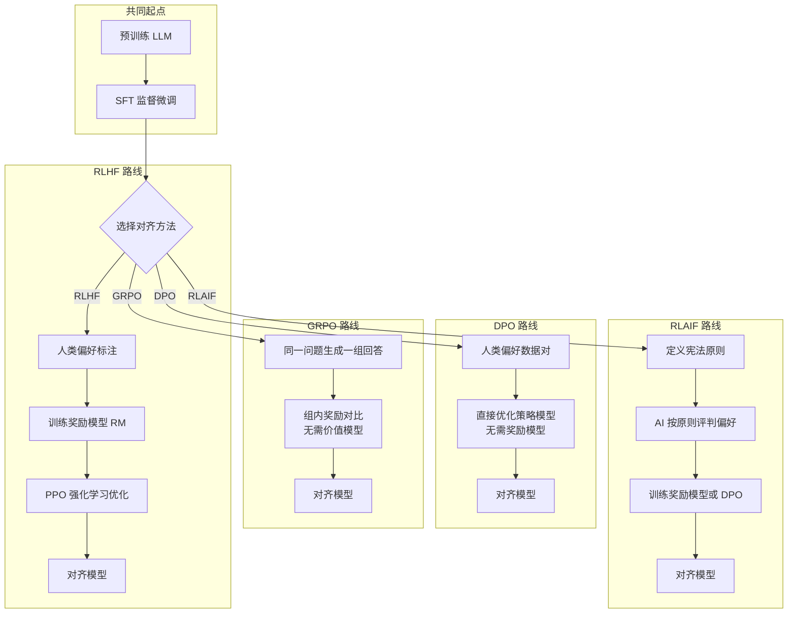

# 对齐技术（Alignment）

## 概念解释

对齐技术（Alignment）是大语言模型（LLM）预训练完成后，用来让模型"听话"的一套后训练方法。预训练阶段模型学到的是"互联网上的人通常怎么写字"，而对齐阶段要教会模型"用户问问题时，什么样的回答才算好"。

为什么需要对齐？因为预训练目标（预测下一个词）和用户真实需求之间存在鸿沟。模型在互联网语料上学到了丰富的知识，但也学到了谣言、偏见、有害内容。更关键的是，它并不理解"帮助用户"和"配合有害请求"之间的区别。对齐技术就是用人类的判断（或 AI 模拟的判断）作为信号，把模型从"能说话"调校到"说得好、说得安全"。

对齐与传统微调的区别在于信号来源：传统微调用"标准答案"做监督学习，对齐用"人类偏好排序"或"AI 反馈"做优化。这种基于偏好的训练方式更灵活——不需要给出唯一正确答案，只需告诉模型"A 回答比 B 好"，模型自己去学背后的规律。

## 关键结构

对齐技术体系可以从两个维度理解：**流程阶段**和**方法流派**。

| 维度 | 内容 | 说明 |
|------|------|------|
| SFT 阶段 | 监督微调（Supervised Fine-Tuning） | 用高质量问答对做初步对齐，教模型"好答案长什么样" |
| 偏好数据 | 人类偏好标注（Human Preference） | 对同一问题的多个回答做排序，编码"什么更好" |
| 奖励模型 | RM（Reward Model） | 学习人类偏好的打分器，给任意回答打分 |
| 策略优化 | RL 或直接优化算法 | 用奖励信号更新模型权重，让模型追求高分回答 |
| KL 约束 | KL 散度惩罚（KL Penalty） | 防止模型为追求高分而"跑偏"，保持原有能力 |

### 阶段 1：监督微调（SFT）

在几千到几万条高质量问答对上做有监督学习。这些数据通常由专业标注员撰写，涵盖多种任务类型。SFT 的作用是让模型从"补全文本"转变为"回答问题"，建立基本的对话格式和回答风格。SFT 本身数据量有限，无法覆盖所有场景，因此需要后续的偏好优化。

### 阶段 2：偏好数据收集

给定一个问题，让模型生成多个不同回答，由标注员选出"更好的那个"。这种相对评估方式比绝对打分更容易操作，标注员一致性也更高。偏好数据编码了丰富的人类价值观信息——什么叫"有帮助"、什么叫"诚实"、什么叫"安全"。

### 阶段 3：策略优化

用偏好数据（直接或通过奖励模型间接）驱动模型参数更新。不同的优化方法构成了对齐技术的主要流派，详见"核心原理"。

## 核心原理

### 原理说明

对齐的核心思路可以概括为一句话：**用偏好信号替代标准答案，驱动模型学会"什么样的回答更好"**。

具体到不同方法，区别在于"偏好信号怎么用"：

**RLHF（基于人类反馈的强化学习）** 是最经典的方案，分两步走：先用偏好数据训练一个奖励模型（Reward Model，学会给回答打分），再用强化学习算法（如 PPO）让 LLM 追求高分。PPO（Proximal Policy Optimization，近端策略优化）会同时维护策略模型、奖励模型、价值模型和参考模型，训练过程需要四个模型协同，工程复杂度高。ChatGPT、Claude 等商业模型都采用这条路线。

**DPO（Direct Preference Optimization，直接偏好优化）** 是 2023 年由斯坦福团队提出的简化方案。它的关键洞察是：可以通过一个数学变换，把奖励模型的作用"融入"到损失函数中，直接从偏好数据对优化 LLM，不需要单独训练奖励模型。训练过程退化为一个分类任务——"让模型给好答案更高概率、给差答案更低概率"。DPO 训练更稳定、资源占用更少，已成为开源社区的主流选择。

**GRPO（Group Relative Policy Optimization，组相对策略优化）** 由 DeepSeek 在 2024 年提出，用于 DeepSeek-R1 的训练。它的创新点是去掉了 PPO 中的价值模型（Critic），改用"组内对比"来估算基线：对同一个问题生成一组回答，用组内平均奖励作为基线，高于平均的回答被强化、低于平均的被削弱。这大幅降低了内存和计算开销，特别适合推理任务（如数学、代码）。

**RLAIF / Constitutional AI（基于 AI 反馈的强化学习 / 宪法 AI）** 由 Anthropic 提出，核心是用 AI 代替人类做偏好标注。预先定义一组"宪法原则"（如"有帮助、诚实、无害"），让 AI 根据这些原则评判回答的好坏，再用评判结果训练模型。人类只需设计约 10 条原则，不需要大规模标注，成本大幅降低（AI 反馈成本不到人类标注的 1%）。

### Mermaid 图解



图解要点：

- 所有方法都从 SFT 起步，区别在于后续如何利用偏好信号。
- RLHF 需要奖励模型 + RL 算法，链路最长、工程最复杂。
- DPO 跳过奖励模型，直接从偏好对优化，最简洁。
- GRPO 保留 RL 框架但去掉价值模型，用组内对比替代，适合推理场景。
- RLAIF 的创新在数据端（AI 标注代替人类），优化端可以接 PPO 或 DPO。

### 运行示例

以下用伪代码展示 DPO 的核心损失函数逻辑，帮助理解"直接从偏好对优化"的机制。

```python
import torch
import torch.nn.functional as F

def dpo_loss(policy_model, ref_model, chosen_ids, rejected_ids, beta=0.1):
    """
    DPO 损失函数核心逻辑（简化版）

    参数：
    - policy_model: 正在优化的策略模型
    - ref_model: 冻结的参考模型（通常是 SFT 后的检查点）
    - chosen_ids: 人类偏好的"好答案"的 token 序列
    - rejected_ids: 人类不偏好的"差答案"的 token 序列
    - beta: 温度参数，控制偏离参考模型的幅度
    """
    # 计算策略模型对好答案和差答案的对数概率
    policy_chosen_logp = get_log_prob(policy_model, chosen_ids)
    policy_rejected_logp = get_log_prob(policy_model, rejected_ids)

    # 计算参考模型的对数概率（不参与梯度计算）
    with torch.no_grad():
        ref_chosen_logp = get_log_prob(ref_model, chosen_ids)
        ref_rejected_logp = get_log_prob(ref_model, rejected_ids)

    # 核心公式：用参考模型做标准化后，拉大好答案和差答案的概率差
    logits = beta * (
        (policy_chosen_logp - ref_chosen_logp)
        - (policy_rejected_logp - ref_rejected_logp)
    )
    loss = -F.logsigmoid(logits).mean()
    return loss

def get_log_prob(model, input_ids):
    """计算模型对输入序列的对数概率（简化）"""
    outputs = model(input_ids)
    log_probs = F.log_softmax(outputs.logits, dim=-1)
    # 取每个位置对应 token 的对数概率并求和
    token_log_probs = log_probs.gather(-1, input_ids.unsqueeze(-1)).squeeze(-1)
    return token_log_probs.sum(dim=-1)
```

`dpo_loss` 对应 DPO 论文中的核心公式。`beta` 参数同时起到 KL 约束的作用——`beta` 越大，模型越不敢偏离参考模型。实际训练中使用 Hugging Face TRL 库的 `DPOTrainer` 即可，无需手写损失函数。

## 易混概念辨析

| 概念 | 与对齐技术的区别 | 更适合关注的重点 |
|------|-----------------|------------------|
| 微调（Fine-Tuning） | 微调用标准答案做监督学习；对齐用偏好排序做优化，不需要唯一正确答案 | 微调关注"学会特定任务"，对齐关注"学会人类偏好" |
| 安全过滤（Safety Filter） | 安全过滤是推理阶段的规则拦截（如关键词黑名单）；对齐是训练阶段改变模型本身的行为 | 过滤是外挂的"围栏"，对齐是内化的"价值观" |
| RLHF vs DPO | 都是对齐方法，但 RLHF 需要单独训练奖励模型 + RL 优化；DPO 直接从偏好对优化，更简洁 | RLHF 性能天花板更高但工程复杂，DPO 简单高效但对数据质量更敏感 |
| Instruction Tuning（指令微调） | 指令微调是 SFT 的一种形式，只是对齐流程的第一步，不包含偏好优化 | 指令微调教模型"听懂指令"，对齐进一步教模型"回答得好" |

核心区别：

- **对齐技术**：核心是利用偏好信号（人类或 AI 的"A 比 B 好"判断）优化模型行为
- **微调 / 指令微调**：核心是用标准答案做有监督学习，不涉及偏好排序
- **安全过滤**：不改变模型本身，只在输出层做拦截，容易被绕过

## 适用边界与局限

### 适用场景

1. **通用对话助手**：ChatGPT、Claude 等产品的核心训练环节。对齐让模型学会安全拒绝有害请求、在不确定时坦诚说"不知道"、保持一致的回答风格。
2. **推理模型训练**：DeepSeek-R1 用 GRPO + 可验证奖励（RLVR）训练数学和代码推理能力。对齐不只管"安全"，也管"能力"。
3. **领域模型定制**：医疗、法律等高风险领域，通过定制偏好标注标准，让模型在不确定时主动声明局限而非编造答案。

### 不适合的场景

1. **模型基础能力不足时**：对齐只能"调校"模型已有的能力，不能凭空创造新能力。如果预训练模型本身不具备某个领域的知识，对齐无法弥补。
2. **标注一致性极低的主观任务**：如果连标注员之间都很难就"什么是好答案"达成共识（例如高度主观的创意写作评分），偏好数据的噪声会导致对齐效果打折。

### 局限性

1. **标注偏见传递**：标注员的文化背景、个人偏好会被编码进模型。如果标注团队缺乏多样性，模型的"价值观"会有偏差。
2. **奖励黑客（Reward Hacking）**：模型可能学到"长答案得分高"等表面规律，而非真正理解人类偏好。例如生成冗长但无实质内容的回答来骗取高分。
3. **短期偏好 vs 长期价值**：对齐通常优化单轮问答质量，难以捕捉长期承诺或复杂权衡（如"保护隐私" vs "提供便利"）。
4. **成本门槛**：高质量 RLHF 需要数十万条人类偏好标注，成本可达数百万美元。RLAIF 和 DPO 降低了门槛，但并未完全消除。

## 常见误区

| 常见误区 | 正确理解 |
|----------|----------|
| 对齐 = 审查，就是不让模型说话 | 对齐的目标是让模型在安全前提下尽可能有帮助。好的对齐模型能在合理上下文中讨论敏感话题，而非一刀切拒绝 |
| DPO 已经全面取代 RLHF | 商业顶级模型（ChatGPT、Claude）仍以 RLHF + PPO 为主。DPO 在学术界和开源社区更流行，但 PPO 在复杂任务上性能天花板更高 |
| 对齐数据越多越好 | 数据质量比数量更重要。含噪声或标注员高度分歧的数据反而会降低模型表现。标注一致性管理是关键 |
| 对齐之后模型就"安全"了 | 对齐显著提升安全性，但无法做到绝对安全。越狱攻击（Jailbreak）、对抗性提示仍可能绕过对齐。对齐需要与推理层安全措施配合使用 |

## 思考题

<details>
<summary>初级：DPO 和 RLHF 在工程复杂度上的核心区别是什么？</summary>

**参考答案：**

RLHF 需要单独训练一个奖励模型（Reward Model），然后用 PPO 等强化学习算法做在线优化，涉及策略模型、奖励模型、价值模型、参考模型四个模型的协同；DPO 把奖励模型的作用数学上"融入"损失函数，直接从偏好对优化策略模型，只需要策略模型和参考模型两个模型，工程链路大幅简化。

</details>

<details>
<summary>中级：为什么对齐训练中需要 KL 散度约束？去掉它会发生什么？</summary>

**参考答案：**

KL 散度约束（KL Penalty）限制优化后的模型不能偏离参考模型太远。如果去掉这个约束，模型会过度追求奖励模型的高分，出现两个问题：一是奖励黑客（Reward Hacking），模型学到骗高分的表面模式（如无意义地加长回答）而非真正改善质量；二是能力退化（Catastrophic Forgetting），模型为了追求某个维度的高分而遗忘原有的知识和推理能力。在 DPO 中，beta 参数起到等价的 KL 约束作用。

</details>

<details>
<summary>中级/进阶：假设你要为一个医疗问答系统选择对齐方案，RLHF、DPO、RLAIF 三者你会如何取舍？</summary>

**参考答案：**

医疗场景对准确性和安全性要求极高，建议分阶段组合使用。首先，RLAIF 不适合作为唯一方案，因为 AI 评判在医学专业性上可能不可靠。其次，DPO 适合作为基础方案，用医学专家标注的偏好数据直接优化，实施简单且稳定。如果预算充足且追求更高性能，可以在 DPO 基础上加入 RLHF，用专家标注训练医学领域的奖励模型，再用 PPO 做精细优化。关键约束是：偏好标注必须由持证医学专家完成，标注标准需要将"在不确定时声明局限"视为高优先级偏好。

</details>

## 参考资料

1. Ouyang et al. (2022). "Training language models to follow instructions with human feedback." [arXiv:2203.02155](https://arxiv.org/abs/2203.02155) -- InstructGPT 论文，RLHF 的里程碑工作
2. Rafailov et al. (2023). "Direct Preference Optimization: Your Language Model is Secretly a Reward Model." [arXiv:2305.18290](https://arxiv.org/abs/2305.18290) -- DPO 原始论文
3. Bai et al. (2022). "Constitutional AI: Harmlessness from AI Feedback." [arXiv:2212.08073](https://arxiv.org/abs/2212.08073) -- Anthropic 宪法 AI / RLAIF 论文
4. Shao et al. (2024). "DeepSeekMath: Pushing the Limits of Mathematical Reasoning." [arXiv:2402.03300](https://arxiv.org/abs/2402.03300) -- GRPO 算法的提出
5. Wang et al. (2024). "A Comprehensive Survey of LLM Alignment Techniques." [arXiv:2407.16216](https://arxiv.org/abs/2407.16216) -- 对齐技术综合综述
6. Hugging Face Blog. "Navigating the RLHF Landscape: From Policy Gradients to PPO, GAE, and DPO." [链接](https://huggingface.co/blog/NormalUhr/rlhf-pipeline)
