# 持续学习（Continual Learning）

## 概念解释

持续学习（Continual Learning），也叫终身学习（Lifelong Learning）或增量学习（Incremental Learning），是一种让模型按顺序学习多个任务或数据分布，同时尽量不遗忘已学知识的训练范式。

为什么需要它？因为神经网络有一个致命弱点：学了新的就忘了旧的，术语叫 **灾难性遗忘**（Catastrophic Forgetting）。比如一个模型先学了情感分类任务，再学医疗问答任务，情感分类的能力会急剧下降。原因是模型的参数是全局共享的，学新任务时梯度下降会改写那些对旧任务至关重要的参数。

传统做法要么全量重训（成本极高），要么每个任务单独训一个模型（资源浪费）。持续学习的思路是：用各种策略在「学新知识」和「保旧知识」之间找到平衡，一套模型就能持续进化。在大模型时代，这个需求更加迫切——重训一个百亿参数的 LLM 成本可能高达数百万美元，而持续学习只需增量更新部分参数。

## 关键结构

持续学习的方法论可以分为五大策略流派，各自从不同角度对抗灾难性遗忘：

| 策略流派 | 核心思路 | 代表方法 |
|----------|----------|----------|
| 回放策略（Replay） | 保留旧数据，混合训练 | Experience Replay（经验回放）、Generative Replay（生成式回放） |
| 正则化策略（Regularization） | 约束重要参数不要大幅变化 | EWC（弹性权重整合）、LwF（Learning without Forgetting） |
| 架构策略（Architecture） | 为新任务分配专属参数 | Progressive Networks（渐进网络）、LoRA Adapter |
| 优化策略（Optimization） | 修改优化方向，避免冲突梯度 | OGD（正交梯度下降）、Pareto Continual Learning |
| 蒸馏策略（Distillation） | 用旧模型当老师，教新模型保留旧知识 | Self-Distillation（自蒸馏）、SDFT（自蒸馏微调） |

### 回放策略

把旧任务的一小部分数据存在缓冲区里，每次学新任务时拿出来混合训练。最直觉、最有效的方法，多项研究表明 Experience Replay 目前仍是语言模型持续学习中效果最好的策略之一。

### 正则化策略

不存旧数据，而是给模型参数加「弹簧」——对旧任务越重要的参数，弹簧拉力越大，越不容易被新任务改变。EWC 用 Fisher 信息矩阵（Fisher Information Matrix）衡量每个参数对旧任务的重要性，然后在损失函数里加惩罚项。

### 架构策略

为每个新任务开辟专属的参数子空间，旧任务的参数完全冻结，从根本上消除遗忘。LoRA（Low-Rank Adaptation，低秩适配）是大模型时代最流行的做法——冻结原始参数，只训练额外插入的低秩矩阵，参数量通常只有原模型的 0.1%~1%。

### 优化策略

从梯度方向入手，让新任务的梯度更新尽量不干扰旧任务的最优解方向。2025 年提出的 Pareto Continual Learning 框架用偏好条件方法动态调整稳定性（Stability，保旧知识）和可塑性（Plasticity，学新知识）之间的权衡。

### 蒸馏策略

让旧版本模型充当「老师」，在学新任务的同时，让新模型的输出尽量和老师保持一致。2025 年提出的 SDFT（Self-Distillation Fine-Tuning，自蒸馏微调）让同一个模型同时扮演老师和学生：老师版本看到完整示例，学生版本只看问题，训练学生去逼近老师的输出。

## 核心原理

### 原理说明

持续学习的核心矛盾可以用一个公式概括——**稳定性-可塑性困境**（Stability-Plasticity Dilemma）：

$$L_{\text{total}} = L_{\text{new}} + \lambda \cdot L_{\text{retain}}$$

- $L_{\text{new}}$：新任务的学习损失，代表可塑性
- $L_{\text{retain}}$：旧知识的保留约束，代表稳定性
- $\lambda$：权衡系数。$\lambda$ 越大越保守（旧知识保得好，新知识学得慢）；$\lambda$ 越小越激进（新知识学得快，旧知识丢得多）

不同策略本质上是用不同方式构造 $L_{\text{retain}}$：
- **EWC**：$L_{\text{retain}} = \sum_i F_i (\theta_i - \theta_i^*)^2$，其中 $F_i$ 是第 $i$ 个参数的 Fisher 信息（越大说明对旧任务越重要），$\theta_i^*$ 是旧任务训练完的参数值
- **回放**：直接把旧数据混进来，$L_{\text{retain}}$ 就是旧数据上的标准损失
- **架构隔离**：$L_{\text{retain}} = 0$，因为旧参数被冻结，根本不会变

在 LLM 场景下，持续学习分为三个阶段，对应不同的应用层次：

1. **CPT（Continual Pre-Training，持续预训练）**：用新语料继续预训练，让模型获取新的世界知识
2. **DAP（Domain-Adaptive Pre-training，领域适应预训练）**：在特定领域语料上继续预训练，适配医疗、法律等垂直场景
3. **CFT（Continual Fine-Tuning，持续微调）**：在已微调的模型上继续学习新的下游任务

### Mermaid 图解

```mermaid
graph TD
    A["已训练好的模型<br/>（掌握旧知识）"] --> B{"新任务/新数据到达"}
    B --> C["选择持续学习策略"]

    C --> D1["回放：混入旧数据"]
    C --> D2["正则化：约束关键参数"]
    C --> D3["架构隔离：分配新参数"]
    C --> D4["蒸馏：旧模型当老师"]

    D1 --> E["增量训练"]
    D2 --> E
    D3 --> E
    D4 --> E

    E --> F{"评估：新旧任务都达标？"}
    F -->|"是"| G["模型成功进化<br/>等待下一个任务"]
    F -->|"否：旧知识丢失"| H["增大 λ / 增加回放比例"]
    F -->|"否：新任务学不好"| I["减小 λ / 增加训练轮次"]
    H --> E
    I --> E

    style A fill:#e8f5e9
    style G fill:#e8f5e9
    style F fill:#fff3e0
```



图中的关键流转：从「新任务到达」到「评估达标」是一个完整的持续学习周期。如果新旧任务都达标，模型成功进化；如果旧知识丢失或新任务学不好，需要调整策略参数后重新训练。实际应用中，这个调整过程往往需要多次迭代。

### 运行示例

以下用 Python 伪代码演示 EWC 的核心机制——计算参数重要性并加惩罚项：

```python
import torch
import torch.nn.functional as F

# EWC 核心机制演示（伪代码，展示原理而非完整实现）

def compute_fisher(model, old_dataloader):
    """计算 Fisher 信息矩阵：衡量每个参数对旧任务的重要性"""
    fisher = {n: torch.zeros_like(p) for n, p in model.named_parameters()}
    model.eval()
    for batch in old_dataloader:
        model.zero_grad()
        output = model(batch["input_ids"])
        loss = F.cross_entropy(output, batch["labels"])
        loss.backward()
        for n, p in model.named_parameters():
            # 梯度的平方 ≈ 该参数对旧任务的重要性
            fisher[n] += p.grad.data ** 2
    # 取平均
    fisher = {n: f / len(old_dataloader) for n, f in fisher.items()}
    return fisher

def ewc_loss(model, fisher, old_params, lam=1000):
    """EWC 惩罚项：重要参数变化越大，惩罚越重"""
    loss = 0
    for n, p in model.named_parameters():
        # fisher[n] 大 → 该参数对旧任务重要 → 变化代价高
        loss += (fisher[n] * (p - old_params[n]) ** 2).sum()
    return lam * loss

# 持续学习训练循环（伪代码）
# fisher = compute_fisher(model, old_task_data)
# old_params = {n: p.clone() for n, p in model.named_parameters()}
# for batch in new_task_data:
#     loss_new = compute_task_loss(model, batch)
#     loss_ewc = ewc_loss(model, fisher, old_params)
#     total_loss = loss_new + loss_ewc  # 新任务损失 + EWC 惩罚
#     total_loss.backward()
#     optimizer.step()
```

`compute_fisher` 计算每个参数对旧任务的重要性（梯度平方的均值），`ewc_loss` 对重要参数的变化施加惩罚。`lam` 对应前文公式中的 $\lambda$，控制保守程度。

## 易混概念辨析

| 概念 | 与持续学习的区别 | 更适合关注的重点 |
|------|-----------------|------------------|
| Transfer Learning（迁移学习） | 迁移学习是单次的「从 A 到 B」，不关心学完 B 后 A 的性能 | 如何把一个领域的知识迁移到另一个领域 |
| Multi-Task Learning（多任务学习） | 多任务学习同时训练所有任务，数据全部可用；持续学习是按顺序学习，旧数据可能不可用 | 如何让一个模型同时做好多个任务 |
| Fine-Tuning（微调） | 微调是持续学习的一个子操作；持续学习还要额外解决遗忘问题 | 如何在预训练模型上适配下游任务 |
| Online Learning（在线学习） | 在线学习逐条处理数据流，不区分任务边界；持续学习通常有明确的任务划分 | 如何在数据流上实时更新模型 |

核心区别：

- **持续学习**：核心关注点是「学了新的不忘旧的」，本质是稳定性-可塑性的平衡问题
- **迁移学习**：只关心目标任务的性能，不管源任务的性能是否下降
- **多任务学习**：所有数据同时可见，不存在遗忘问题，但需要更多计算资源
- **微调**：是持续学习的一种手段，但朴素微调不带任何防遗忘措施

## 适用边界与局限

### 适用场景

1. **LLM 知识更新**：每隔几个月用新语料做持续预训练，让模型掌握最新的世界知识（如新闻事件、新技术）。比全量重训节省 50% 以上的算力成本
2. **垂直领域逐步扩展**：基础模型先适配医疗领域，再逐步扩展到法律、金融等领域，每次只需增量微调而不必重头训练
3. **多语言增量扩展**：模型先支持主要语言，后续通过持续微调逐步添加小语种支持，每加一种语言不影响已有语言的性能
4. **边缘设备本地适应**：手机、IoT 设备上的小模型根据用户行为做本地增量学习，在保护隐私的同时实现个性化

### 不适合的场景

1. **知识体系需要彻底重建**：如果新任务和旧任务的数据分布完全不同（如从英文 NLP 切换到蛋白质结构预测），持续学习意义不大，不如重新训练
2. **对旧任务性能零容忍**：持续学习能大幅减少遗忘但无法完全消除，如果业务要求旧任务性能完全不变，只能用独立模型或全量重训

### 局限性

1. **长序列任务累积退化**：学习 2-3 个新任务效果可控，但任务数量超过 10 个时，累积遗忘和性能漂移会变得明显（2026 年的机制分析发现 Transformer 底层 15%~23% 的注意力头会出现严重干扰）
2. **超参数调优成本高**：回放比例、正则化强度、学习率等参数需要针对具体任务组合调整，没有通用最优配置
3. **理论框架尚不成熟**：大多数方法是经验性的，尤其在百亿参数级模型上的理论分析非常有限

## 常见误区

| 常见误区 | 正确理解 |
|----------|----------|
| 在新数据上继续训练就是持续学习 | 朴素继续训练会导致灾难性遗忘。持续学习必须搭配防遗忘策略（回放、正则化、架构隔离等），否则就是普通微调 |
| 大模型参数多，不容易遗忘 | 恰恰相反。2025 年研究表明，模型越大（1B 到 7B），灾难性遗忘反而越严重。大模型更需要持续学习策略 |
| 回放缓冲区越大效果越好 | 存旧数据的 5%~10% 通常就够用，继续增大缓冲区收益递减，还会浪费存储。关键是采样策略而非数据量 |
| 正则化加强就能完全避免遗忘 | 正则化强度（$\lambda$）是个两难选择。$\lambda$ 太大确实能保住旧知识，但新任务就学不好。没有「两全其美」的 $\lambda$ 值 |

## 思考题

<details>
<summary>初级：灾难性遗忘为什么会发生？用一句话解释根本原因。</summary>

**参考答案：**

神经网络的参数是所有任务全局共享的，学新任务时梯度下降会改变对旧任务至关重要的参数权重，导致旧任务性能急剧下降。

</details>

<details>
<summary>中级：EWC 和 Experience Replay 分别适合什么场景？如果旧任务数据因隐私原因不能保留，应该选哪种？</summary>

**参考答案：**

Experience Replay 效果通常更好但需要保留旧数据；EWC 不需要存储旧数据，只需要保存一个 Fisher 信息矩阵（和模型参数同等大小）。如果旧数据因隐私原因不能保留，应该选 EWC 或其他正则化方法。另一种折中方案是 Generative Replay（生成式回放）——用生成模型合成旧任务的伪数据来代替真实数据。

</details>

<details>
<summary>中级/进阶：一家电商公司的客服 LLM 已在退货场景上微调过，现在要增加投诉处理能力。请设计一个持续学习方案，说明选用什么策略、为什么。</summary>

**参考答案：**

推荐方案：LoRA + Experience Replay 组合。具体做法：(1) 冻结基础模型参数，用 LoRA 为投诉处理任务训练低秩适配器，这样退货场景的基础能力天然被保护；(2) 从退货场景的训练数据中采样 5%~10% 存入回放缓冲区，训练投诉任务时混合回放，进一步防止 LoRA 层对退货场景的微调适配被覆盖；(3) 训练完成后在两个场景上分别评估，观察退货场景准确率下降是否在可接受范围内。选择这个组合的原因是：LoRA 从架构层面隔离参数（成本低、遗忘小），Experience Replay 从数据层面补充保障（简单有效），两者互补。

</details>

## 参考资料

1. van de Ven, G. M., et al. (2024). "Continual Learning and Catastrophic Forgetting." *arXiv preprint arXiv:2403.05175*. https://arxiv.org/abs/2403.05175
2. Kirkpatrick, J., et al. (2017). "Overcoming catastrophic forgetting in neural networks." *PNAS*, 114(13), 3521-3526. https://www.pnas.org/doi/10.1073/pnas.1611835114
3. Wang, et al. (2025). "Continual Learning of Large Language Models: A Comprehensive Survey." *ACM Computing Surveys*. https://dl.acm.org/doi/10.1145/3735633
4. Zheng, et al. (2025). "Towards Lifelong Learning of Large Language Models: A Survey." *ACM Computing Surveys*. https://dl.acm.org/doi/10.1145/3716629
5. Awesome Lifelong Learning Methods for LLM（论文集合仓库）. https://github.com/zzz47zzz/awesome-lifelong-learning-methods-for-llm
