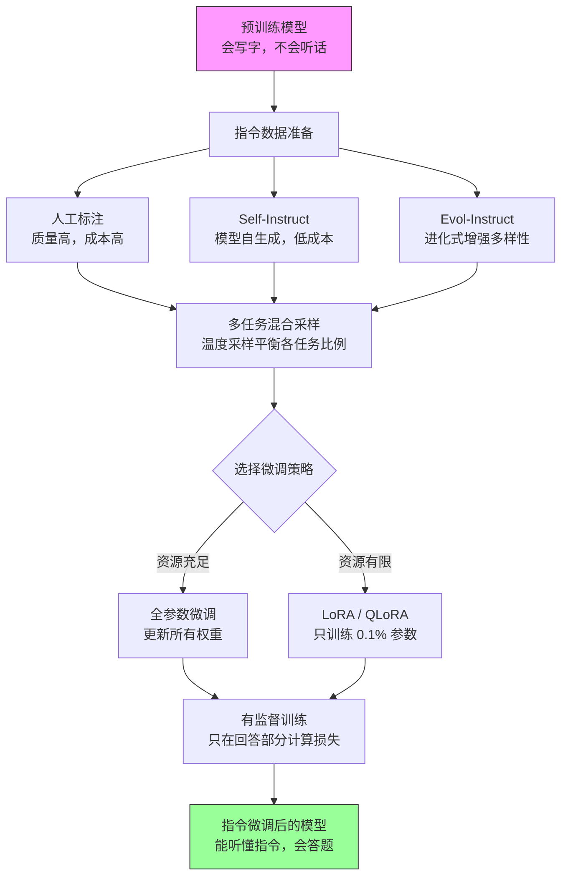

# 指令微调（Instruction Tuning）

## 概念解释

指令微调是一种对预训练大语言模型（LLM）进行二次训练的方法。它的做法很直接：准备一批"用户指令 + 期望回答"的配对数据，让模型在这些数据上做有监督学习（Supervised Learning），从而学会按照人类的要求来输出内容。

为什么需要它？因为预训练模型的训练目标是"预测下一个词"，它学到了海量知识，但并不知道怎么"听话"。你问它一个问题，它可能接着往下写一段看似相关但答非所问的文本，而不是直接回答你。指令微调就是在预训练之后加一个"教它听指令"的阶段，让模型从"会写字"变成"会答题"。

和传统的有监督微调（Supervised Fine-Tuning, SFT）相比，指令微调有两个显著不同：一是数据来自**多种任务类型**（问答、翻译、摘要、代码生成等混在一起），而不是只针对单一任务；二是训练目标是让模型获得**通用的指令理解能力**，能泛化到从未见过的新指令上，而不仅仅是在特定任务上刷高分。Google 在 2022 年的 FLAN 论文中首次大规模验证了这一思路——在 1000+ 个任务上做指令微调后，模型在全新任务上的零样本（Zero-shot）表现大幅提升。

## 关键结构

| 结构 | 作用 | 说明 |
|------|------|------|
| 指令数据集 | 提供"指令-回答"配对样本 | 数据质量决定微调效果上限 |
| 数据构建方法 | 低成本获取大量指令数据 | 人工标注、Self-Instruct、Evol-Instruct 等 |
| 损失函数设计 | 只在回答部分计算损失 | 避免模型浪费精力学"复述指令" |
| 微调策略 | 选择全参数或参数高效微调 | LoRA/QLoRA 可将显存需求降低 10 倍以上 |

### 结构 1：指令数据集

指令数据集是指令微调的核心燃料。每条数据包含三个部分：**指令**（用户想让模型做什么）、可选的**输入**（附加上下文）、**输出**（期望的模型回答）。

数据集的质量远比数量重要。研究表明，1000 条精选高质量数据的微调效果，可以超过 10 万条低质量数据（参见 LIMA 论文）。好的数据集需要同时满足三个条件：**多样性**（覆盖不同任务类型）、**准确性**（回答正确且有用）、**自然性**（指令像真实用户会问的问题）。

### 结构 2：数据构建方法

获取指令数据有三条主要路径：

- **人工标注**：成本最高但质量最可靠。OpenAI 的 InstructGPT 和 Meta 的 Llama 2 都大量使用了人工标注数据。
- **Self-Instruct（自指令生成）**：给模型提供约 175 条种子指令，让模型自己"脑补"出更多指令和回答，再过滤低质量样本。Stanford Alpaca 用这种方法花不到 500 美元就生成了 52K 条训练数据。
- **Evol-Instruct（进化指令）**：从初始指令出发，通过"增加约束、提高复杂度、切换任务类型"等变换操作，迭代生成更难、更多样的指令。WizardLM 采用了这种方法。

### 结构 3：损失函数设计

指令微调在计算损失（Loss）时只计算**回答部分**的预测误差，指令部分的损失被掩码（Mask）屏蔽为 0。

直觉理解：你希望模型学的是"怎么回答"，而不是"怎么复述问题"。虽然整个序列都经过前向传播（模型仍能看到指令），但梯度只从回答部分回传，让学习焦点集中在生成高质量响应上。

### 结构 4：微调策略

- **全参数微调（Full Fine-Tuning）**：更新模型所有参数，效果最好，但对显存要求极高（7B 模型约需 60GB+ 显存）。
- **LoRA（Low-Rank Adaptation，低秩适配）**：冻结原始权重，只训练额外插入的低秩矩阵。可训练参数量仅为原模型的 0.1% 左右，显存需求大幅下降，效果接近全参数微调。
- **QLoRA（Quantized LoRA，量化低秩适配）**：在 LoRA 基础上将模型量化到 4-bit，7B 模型只需约 6GB 显存即可微调，适合消费级 GPU。

## 核心原理

### 原理说明

指令微调的核心机制可以分为四步：

1. **数据准备**：收集或生成大量"指令-回答"配对数据，格式化为统一模板（如 `[INST] 指令内容 [/INST] 回答内容`）。数据来源可以是人工标注、Self-Instruct 自动生成、或从已有 NLP 数据集转换。

2. **多任务混合**：将来自不同任务类型（问答、翻译、摘要、代码、创意写作等）的数据按比例混合。如果某类任务数据量远大于其他类型，需要用温度采样（Temperature Sampling）来平衡，防止模型被数据量大的任务主导。温度采样的公式为：任务 i 的采样概率 $p_i = n_i^\alpha / \sum_j n_j^\alpha$，其中 $n_i$ 是任务 i 的数据量，$\alpha$ 取 0.3~0.5 时效果较好。

3. **有监督训练**：在混合数据上进行有监督学习，损失函数只计算回答部分。训练可以采用全参数微调或 LoRA 等参数高效方法。

4. **评估验证**：用从未见过的新指令测试模型，验证其泛化能力。评估指标包括自动指标（BLEU、ROUGE）和人工评分。

关键洞察：指令微调之所以能让模型泛化到新任务，是因为多任务混合训练迫使模型学习一种**通用的"指令理解元能力"**——它不是记住每条指令的答案，而是学会了"根据指令类型选择合适的回答策略"。

### Mermaid 图解



图解说明：预训练模型经过指令数据准备（三种来源）、多任务混合、微调策略选择、有监督训练四个阶段后，转变为能够理解并执行指令的模型。LoRA/QLoRA 路径是当前最主流的选择，因为它在效果和成本之间取得了很好的平衡。

### 运行示例

```python
# 基于 peft==0.4.0, transformers==4.32.0 验证（截至 2026-03）
# 演示用 LoRA 对模型做指令微调的最小流程

from peft import LoraConfig, get_peft_model, TaskType
from transformers import AutoModelForCausalLM, AutoTokenizer

# 加载预训练模型和分词器
model = AutoModelForCausalLM.from_pretrained(
    "meta-llama/Llama-2-7b-hf",
    device_map="auto",
    torch_dtype="float16"
)
tokenizer = AutoTokenizer.from_pretrained("meta-llama/Llama-2-7b-hf")

# 配置 LoRA：只训练注意力层的 Q/V 投影矩阵
lora_config = LoraConfig(
    r=8,                              # 低秩矩阵的秩，越大越接近全参数微调
    lora_alpha=32,                    # 缩放因子
    target_modules=["q_proj", "v_proj"],  # 微调目标层
    lora_dropout=0.1,
    task_type=TaskType.CAUSAL_LM
)
model = get_peft_model(model, lora_config)

# 查看可训练参数占比
trainable = sum(p.numel() for p in model.parameters() if p.requires_grad)
total = sum(p.numel() for p in model.parameters())
print(f"可训练参数：{trainable:,} / {total:,}（{100*trainable/total:.2f}%）")
# 输出示例：可训练参数：4,194,304 / 6,738,415,616（0.06%）
```

上述代码展示了 LoRA 的核心配置。`r=8` 表示低秩矩阵的秩为 8，`target_modules` 指定只微调注意力机制中的 Q 和 V 投影矩阵。最终可训练参数仅占总参数的 0.06%，但实验表明这足以让模型习得指令遵循能力。实际训练时还需要搭配指令数据集和 Trainer，此处省略训练循环部分。

## 易混概念辨析

| 概念 | 与指令微调的区别 | 更适合关注的重点 |
|------|-----------------|-----------------|
| 有监督微调（SFT） | SFT 是更广泛的概念，指令微调是 SFT 的一个子集。普通 SFT 通常针对单一任务，指令微调使用多任务混合数据，目标是通用指令理解能力 | 当你只需要模型做好一件事时，用普通 SFT |
| 预训练（Pre-training） | 预训练是在海量无标注文本上学习语言知识，目标是"预测下一个词"；指令微调是在预训练之后，用有标注数据教模型"听话" | 预训练决定模型的知识上限，指令微调决定模型的行为方式 |
| RLHF（基于人类反馈的强化学习） | RLHF 在指令微调之后进行，通过人类偏好排序来进一步对齐模型行为；指令微调只做有监督学习 | RLHF 解决"哪个回答更好"的偏好问题，指令微调解决"能不能按指令回答"的基础能力问题 |
| 提示工程（Prompt Engineering） | 提示工程不改变模型参数，只通过设计输入提示来引导模型输出；指令微调会修改模型权重 | 提示工程零成本但效果有限，指令微调需要训练但效果更持久 |

核心区别：

- **指令微调**：修改模型权重，让模型获得通用的"听指令"能力，效果永久保留
- **普通 SFT**：同样修改权重，但通常只优化单一任务，不强调跨任务泛化
- **RLHF**：在指令微调基础上进一步用偏好数据优化，属于训练流水线的下一阶段
- **提示工程**：不改权重，通过巧妙措辞引导模型，是"不训练"的替代方案

## 适用边界与局限

### 适用场景

1. **构建通用 AI 助手**：指令微调是让模型能回答各种用户问题的基础步骤。ChatGPT、Claude 等产品都经过了指令微调。适合需要处理多种任务类型的对话系统。
2. **领域专用模型定制**：在通用模型基础上，用领域特定的指令数据（如医疗问诊、法律咨询、金融分析）进行微调，可以快速获得领域专家级的回答能力。
3. **小模型能力提升**：通过在大模型生成的高质量数据上做指令微调（知识蒸馏），3B-7B 的小模型可以达到接近大模型 90% 的效果，适合部署在资源有限的环境。

### 不适合的场景

1. **模型从未见过的全新知识**：指令微调只能教模型"怎么回答"，不能给它注入新知识。如果模型预训练阶段没学到某个领域的知识，光靠指令微调是补不上的，这时候需要 RAG（检索增强生成）或继续预训练。
2. **对输出安全性有极高要求的场景**：指令微调无法完全消除有害输出，需要配合 RLHF 或 Constitutional AI 等对齐技术来进一步约束模型行为。

### 局限性

1. **数据质量敏感**：即使只有 5-10% 的低质量或有害数据混入训练集，也可能显著拉低整体效果。数据清洗是指令微调中最耗人力的环节。
2. **灾难性遗忘（Catastrophic Forgetting）**：如果微调数据分布与预训练数据差异太大，模型可能在学会新指令的同时遗忘原有知识。任务混合采样可以缓解但无法完全解决。
3. **评估困难**：不像分类任务有明确的准确率指标，"指令遵循能力"很难用单一数字衡量，往往需要人工评估或用 GPT-4 等强模型做自动评判。

## 常见误区

| 常见误区 | 正确理解 |
|----------|----------|
| 指令微调数据越多效果越好 | 数据质量远比数量重要。LIMA 论文证明 1000 条精选数据可以训出强力模型，而 Stanford Alpaca 用 52K 条 Self-Instruct 数据就达到了接近 GPT-3.5 的效果 |
| LoRA 微调效果比全参数微调差很多 | 在大多数任务上，LoRA 微调（只更新 0.1% 参数）的效果接近全参数微调，部分场景甚至更优（因为低秩约束起到了正则化作用，减少过拟合） |
| 指令微调后模型就不会说错话了 | 指令微调只教模型"按指令回答"，不教它"什么该说什么不该说"。要进一步约束模型行为，需要 RLHF 或 DPO（Direct Preference Optimization，直接偏好优化）等对齐阶段 |
| 指令微调可以给模型注入新知识 | 指令微调本质上是调整模型的行为模式，不是往模型里灌新知识。如果预训练阶段没学到的知识，指令微调也教不会 |

## 思考题

<details>
<summary>初级：指令微调和普通有监督微调（SFT）在数据格式和训练目标上有什么不同？</summary>

**参考答案：**

数据格式上，普通 SFT 通常是"输入-输出"对，针对单一任务（如情感分类的"文本-标签"对）；指令微调的数据是"指令-回答"对，指令本身描述了任务类型，且训练数据混合了多种不同任务。训练目标上，普通 SFT 优化特定任务的准确率；指令微调优化模型对各种指令的通用理解和执行能力，追求的是跨任务泛化，而非单一任务的极致性能。

</details>

<details>
<summary>中级：在进行指令微调时，为什么损失函数通常只计算回答部分而不计算指令部分？如果同时计算两部分会怎样？</summary>

**参考答案：**

只计算回答部分的损失是因为训练目标是让模型学会"怎么生成好的回答"，而不是学会"怎么复述用户的指令"。如果同时计算指令部分的损失，模型会把一部分学习能力花在记忆指令的措辞上，这对提升回答质量没有帮助，反而会稀释有效梯度信号。实际实验中，只计算回答部分损失的做法在大多数基准测试上都优于全序列损失计算。

</details>

<details>
<summary>中级/进阶：假设你有 10 万条客服问答数据和 500 条代码生成数据，要一起做指令微调。如果直接混合训练，会出什么问题？你会怎么解决？</summary>

**参考答案：**

直接混合会导致客服问答任务主导训练过程（数据量是 200:1），模型几乎学不到代码生成能力。解决方案是使用温度采样策略：设 $\alpha=0.3$，计算各任务的采样概率，这样代码生成数据的采样频率会被显著提高，接近客服数据的水平。具体地，$p_{客服} = 100000^{0.3} / (100000^{0.3} + 500^{0.3}) \approx 0.73$，$p_{代码} = 500^{0.3} / (100000^{0.3} + 500^{0.3}) \approx 0.27$。这样代码生成数据从原来的 0.5% 占比被提升到约 27%，保证模型能充分学习两种能力。

</details>

## 参考资料

1. Wei, J., et al. "Finetuned Language Models Are Zero-Shot Learners." ICLR 2022. https://arxiv.org/abs/2109.01652 — 首次系统提出指令微调（FLAN）的论文
2. Chung, H.W., et al. "Scaling Instruction-Finetuned Language Models." JMLR 2024. https://arxiv.org/abs/2210.11416 — FLAN-T5/PaLM 2 指令微调的规模化实验
3. Wang, Y., et al. "Self-Instruct: Aligning Language Models with Self-Generated Instructions." ACL 2023. https://arxiv.org/abs/2212.10560 — Self-Instruct 数据生成方法
4. Taori, R., et al. "Stanford Alpaca: An Instruction-following LLaMA Model." 2023. https://github.com/tatsu-lab/stanford_alpaca — 用 Self-Instruct 低成本训练指令模型的实践
5. Hu, E., et al. "LoRA: Low-Rank Adaptation of Large Language Models." ICLR 2022. https://arxiv.org/abs/2106.09685 — LoRA 参数高效微调方法
6. Wang, Y., et al. "Instruction Tuning for Large Language Models: A Survey." ACM Computing Surveys, 2024. https://dl.acm.org/doi/10.1145/3777411 — 指令微调领域的综述论文
