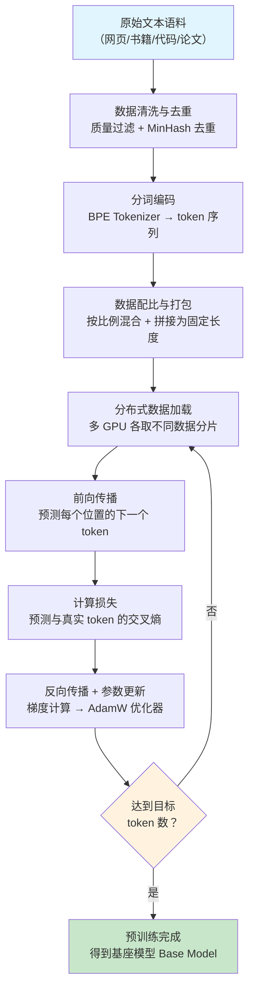

# 预训练技术（Pretraining Techniques）

## 概念解释

预训练（Pretraining）是大语言模型获得通用语言理解和生成能力的**第一阶段训练**。简单说，就是让模型在海量无标注文本上反复做"预测下一个词"的练习，从而自动学会语法规律、事实知识和基础推理能力。

为什么需要预训练？因为传统机器学习要求每个任务都有大量人工标注数据，成本极高且难以覆盖所有场景。预训练的核心洞见是：**互联网上有几乎无限的未标注文本，只要设计一个自监督任务（Self-supervised Task，即不需要人工标注、让数据自己产生监督信号的训练方式），就能从中提取通用语言知识**。预训练完成后，只需少量标注数据做微调（Fine-tuning），模型就能适配翻译、问答、摘要等各种具体任务。

与传统的"每个任务单独训练"相比，预训练范式的关键差异在于：**一次学习，多次复用**。模型只需做一次大规模预训练，获得的语言能力就能迁移到几乎所有下游任务，大幅降低了每个新任务的开发成本。

## 关键结构

预训练技术体系由四个不可或缺的环节组成：

| 环节 | 作用 | 关键指标 |
|------|------|----------|
| 数据准备 | 采集、清洗、去重、配比，构建高质量训练语料 | 数据质量决定模型能力上限 |
| 分词编码 | 将原始文本转为模型可处理的 token 序列 | 词表大小影响编解码效率 |
| 训练目标 | 定义模型"练什么题"，通常是 Next-Token Prediction | 直接决定模型学到什么能力 |
| 分布式训练 | 将计算任务分配到多张 GPU 上并行执行 | 决定能训多大的模型、训多快 |

### 环节 1：数据准备

数据准备是预训练的基石，包含四个子步骤：

- **数据采集**：从互联网（Common Crawl）、书籍、代码仓库（GitHub）、学术论文（arXiv）等多个来源收集原始文本，数据量通常在 TB 到 PB 级别。
- **数据清洗**：去除广告、乱码、重复模板页面、低质量内容。许多大模型团队在这一步投入的工程量甚至超过模型本身。
- **去重**：用 MinHash（一种近似判断两段文本是否相似的算法）等方法检测并移除重复文本，防止模型过度记忆特定内容。
- **数据配比**（Data Mixture）：按比例混合不同来源的数据。例如 LLaMA 的训练数据中，网页文本约占 67%，代码占 4.5%，学术论文占 2.5%。配比直接影响模型在不同领域的能力分布。

### 环节 2：分词编码

分词器（Tokenizer）将原始文本切分为 token（词元，模型处理的最小单位）。主流方法是 BPE（Byte Pair Encoding，字节对编码），它通过统计字符对的出现频率，逐步合并高频对来构建词表。

- 词表大小通常为 32K-128K（如 GPT-2 用 50257，LLaMA 2 用 32000）
- 词表越大，同样的文本被切成的 token 数越少，推理速度越快；但词表过大会增加 Embedding 层的参数量

### 环节 3：训练目标

当前主流 LLM 几乎全部使用 **Next-Token Prediction**（NTP，下一个词预测）作为预训练目标：给模型看一段文本的前 N 个词，让它预测第 N+1 个词。模型在数万亿 token 上反复做这个练习，逐渐掌握语言的深层规律。

近期研究（如 Meta 2024 年提出的 Multi-Token Prediction）尝试让模型一次预测后续 K 个 token，在提升训练效率和推理速度方面展现了潜力。

### 环节 4：分布式训练

训练百亿到万亿参数的模型，单张 GPU 的显存和算力远远不够，必须用分布式训练：

- **数据并行（Data Parallelism，DP）**：每张 GPU 拿不同的数据子集，各自计算梯度后汇总更新。最简单，但要求每张 GPU 能放下完整模型。
- **张量并行（Tensor Parallelism，TP）**：将单层的权重矩阵切分到多张 GPU 上。例如 4096 维的隐层分到 8 张 GPU，每张只处理 512 维。
- **流水线并行（Pipeline Parallelism，PP）**：将模型的不同层分配到不同 GPU。GPU-1 处理第 1-10 层，GPU-2 处理第 11-20 层，数据像流水线一样流过。
- **3D 并行**：同时组合 DP + TP + PP，是训练千亿参数模型的标准做法。

## 核心原理

### 原理说明

预训练的核心机制可以用一句话概括：**通过在海量文本上反复"预测下一个词"，迫使模型学会语言的统计规律和内在知识**。

具体过程如下：

1. **输入构造**：从训练语料中取出一段文本，如"今天天气真"，将其转换为 token 序列 `[今, 天, 天, 气, 真]`
2. **逐位预测**：模型依次尝试预测每个位置的下一个 token。看到"今"时预测"天"，看到"今天"时预测"天"，看到"今天天气"时预测"真"，以此类推
3. **计算损失**：将模型的预测结果与真实的下一个 token 比较，计算交叉熵损失（Cross-Entropy Loss，衡量预测概率分布与真实分布之间差距的指标）
4. **更新参数**：通过反向传播（Backpropagation）计算梯度，用优化器（通常是 AdamW）更新模型参数，让预测更准确
5. **重复训练**：在数万亿 token 上重复上述过程数百万次，模型逐渐从"随机猜测"进化为"精准预测"

**为什么"预测下一个词"这么有效？** 要准确预测下一个词，模型必须理解语法（主谓宾搭配）、语义（词义关系）、事实知识（"北京是中国的首都"）和推理逻辑（因果关系）。这个看似简单的任务，实际上要求模型压缩整个训练语料中的知识。

**Scaling Law（缩放定律）** 是预训练的理论指导。OpenAI（2020）和 DeepMind 的 Chinchilla 论文（2022）发现：模型性能与参数量、数据量、算力之间存在可预测的幂律关系。Chinchilla 的关键结论是：**模型参数量和训练数据量应按大致 1:20 的比例同步增长**（即 10B 参数的模型需要约 200B token 的数据）。这一发现直接影响了后续所有大模型的训练策略。

### Mermaid 图解



**读图要点**：

- A→D 是**数据管线**，决定训练质量的上限。许多团队在这四步投入的工程量甚至超过模型设计本身。
- E→H 是**训练循环**，在数万亿 token 上重复数百万次。每次循环处理一个 mini-batch。
- 菱形判断 I 处，"目标 token 数"由 Scaling Law 指导。提前停止会浪费算力，过度训练则收益递减。

### 运行示例

以下用 PyTorch 展示 NTP 训练目标的最小实现，省略了分布式和混合精度等工程细节：

```python
# 基于 torch==2.0+ 验证（截至 2026-03）
import torch
import torch.nn as nn

# 模拟一个极简的语言模型
vocab_size = 1000   # 词表大小
hidden_dim = 128    # 隐层维度
seq_len = 32        # 序列长度

# 最简单的模型：Embedding + 线性层
embedding = nn.Embedding(vocab_size, hidden_dim)
lm_head = nn.Linear(hidden_dim, vocab_size)

# 模拟一条训练数据（token 序列）
tokens = torch.randint(0, vocab_size, (1, seq_len))  # [1, 32]

# Next-Token Prediction 的核心逻辑
input_ids = tokens[:, :-1]   # 前 31 个 token 作为输入
labels = tokens[:, 1:]       # 后 31 个 token 作为预测目标

# 前向传播
hidden = embedding(input_ids)           # [1, 31, 128]
logits = lm_head(hidden)               # [1, 31, 1000] —— 对每个位置预测词表中每个词的概率

# 计算交叉熵损失
loss = nn.functional.cross_entropy(
    logits.reshape(-1, vocab_size),     # [31, 1000]
    labels.reshape(-1)                  # [31]
)
print(f"损失值: {loss.item():.4f}")     # 初始约 6.9（= ln(1000)，相当于随机猜测）

# 反向传播 → 更新参数（训练循环中会重复这个过程数百万次）
loss.backward()
```

`input_ids` 是前 N-1 个 token，`labels` 是后 N-1 个 token——两者错开一位，就构成了 NTP 任务。初始损失约等于 ln(vocab_size)，表示模型在随机猜测；随着训练推进，损失持续下降，模型的预测越来越准确。

## 易混概念辨析

| 概念 | 与预训练技术的区别 | 更适合关注的重点 |
|------|---------------------|------------------|
| 微调（Fine-tuning） | 预训练是从零开始在海量通用数据上训练；微调是在已有预训练模型基础上，用少量任务特定数据继续训练 | 如何用少量数据适配特定任务 |
| 指令微调（Instruction Tuning） | 预训练让模型学会语言能力；指令微调让模型学会"听从人类指令" | 如何让模型按指令格式回答问题 |
| 持续预训练（Continual Pretraining） | 基础预训练是从随机初始化开始；持续预训练是在已有预训练模型上，用新领域数据继续做 NTP | 如何让已有模型掌握新领域知识 |
| RLHF | 预训练学语言能力，RLHF 用人类偏好反馈调整模型输出风格，使其更符合人类期望 | 如何让模型输出更安全、更有用 |

核心区别：

- **预训练**：关注从零建立模型的通用语言能力，消耗算力最大、数据量最多
- **微调 / 指令微调**：关注在已有能力基础上适配特定需求，算力需求小得多
- **RLHF**：关注调整模型的行为偏好，属于训练的最后阶段

## 适用边界与局限

### 适用场景

1. **构建通用基座模型**：需要模型具备广泛的语言理解和生成能力时，预训练是必经之路。GPT、LLaMA、Qwen 等模型的核心竞争力都来自预训练阶段
2. **领域专有模型开发**：当通用模型在医疗、法律、金融等垂直领域表现不足时，可以在领域语料上做持续预训练来补充专业知识
3. **多语言能力建设**：通过在多语言混合语料上预训练，模型可以一次性获得跨语言能力，避免为每种语言单独训练

### 不适合的场景

1. **小团队快速出原型**：预训练成本极高（千亿参数模型需要数千张 GPU 训练数月），小团队应直接使用开源预训练模型做微调
2. **任务单一且数据充足**：如果只需解决一个特定任务（如情感分类），且有大量标注数据，直接微调现有模型比从零预训练高效得多

### 局限性

1. **算力门槛极高**：训练 LLaMA 70B 需要约 1720K GPU 小时（A100），成本数百万美元。这使得预训练成为少数大型机构的"专利"
2. **数据质量难以完全保证**：互联网数据天然包含偏见、错误信息和有害内容，即使经过清洗也无法完全消除，模型可能学到错误知识
3. **训练不可逆**：预训练一旦启动，中途发现数据问题只能打补丁（持续预训练）或从头重来，纠错成本极高
4. **高质量文本数据趋于耗尽**：互联网上的高质量文本已被反复使用，数据瓶颈正在成为制约预训练规模进一步增长的关键因素

## 常见误区

| 常见误区 | 正确理解 |
|----------|----------|
| "数据越多效果越好" | 数据质量比数量更重要。研究表明，经过精心清洗和去重的小数据集，训练效果可能优于数倍大小的未清洗数据。Chinchilla 论文证实了数据量与模型参数量需要匹配增长 |
| "预训练只是初始化，微调才是关键" | 预训练质量决定模型能力的上限。如果基座模型在预训练阶段没有学到某类知识，微调很难弥补这个缺失 |
| "混合精度训练会显著降低模型质量" | 现代 BF16（Brain Float 16，Google 设计的 16 位浮点格式）混合精度训练在几乎所有任务上都能匹配 FP32 的精度，同时将训练速度提升 2-3 倍。这已经是工业界的标准做法 |
| "用了 DeepSpeed / Megatron-LM 就能轻松训大模型" | 框架只是工具，真正的瓶颈是算力规模和工程经验。没有足够的 GPU 集群和训练运维能力，再好的框架也无法发挥作用 |

## 思考题

<details>
<summary>初级：为什么 Next-Token Prediction 这个看似简单的任务，能让模型学到如此丰富的知识？</summary>

**参考答案：**

要准确预测下一个词，模型必须理解多层次的语言知识：语法层面（主谓搭配、时态一致）、语义层面（词义关系、上下文含义）、事实层面（"地球绕着太阳转"）和推理层面（因果关系、逻辑推演）。本质上，NTP 任务迫使模型对训练语料中的所有知识进行压缩编码，因此模型的能力与训练数据的广度和深度直接相关。

</details>

<details>
<summary>中级：Chinchilla Scaling Law 的核心结论是什么？它对实际训练决策有什么影响？</summary>

**参考答案：**

Chinchilla 论文的核心结论是：在固定算力预算下，模型参数量和训练数据量应按大致 1:20 的比例同步增长（如 10B 参数配 200B token），而不是一味增大模型。这意味着之前许多模型（如 GPT-3 的 175B 参数只训练了 300B token）实际上"训练不足"（undertrained）。这一发现直接导致了后续模型在相同参数量下使用更多数据训练的趋势，如 LLaMA 7B 使用了 1T token，远超 Chinchilla 的建议比例，走向了"过度训练以换取更小推理成本"的路线。

</details>

<details>
<summary>中级/进阶：如果你的团队有 100 张 A100-80GB GPU，要预训练一个 70B 参数的模型，你会如何组合 DP/TP/PP 三种并行策略？为什么？</summary>

**参考答案：**

一种合理方案：TP=8（8 张 GPU 做张量并行，将每层权重切成 8 份），PP=4（4 组做流水线并行，将模型的层分成 4 段），DP≈3（剩余 GPU 做数据并行，提高吞吐量）。理由：70B 模型单层参数较大，TP=8 能确保每张 GPU 的显存放得下单层计算所需的激活和参数；PP=4 将模型总层数分为 4 段，进一步降低单卡显存需求；DP=3 增加训练吞吐量。实际中还需要配合 ZeRO 优化器来减少优化器状态的显存占用，并通过小规模实验验证显存和通信的可行性。

</details>

## 参考资料

1. Kaplan, J., et al. (2020). "Scaling Laws for Neural Language Models." *arXiv:2001.08361* — 首次系统研究模型规模与性能的幂律关系。https://arxiv.org/abs/2001.08361
2. Hoffmann, J., et al. (2022). "Training Compute-Optimal Large Language Models (Chinchilla)." *arXiv:2203.15556* — 提出数据量与参数量应同步增长的关键结论。https://arxiv.org/abs/2203.15556
3. Touvron, H., et al. (2023). "LLaMA: Open and Efficient Foundation Language Models." *arXiv:2302.13971* — 展示了数据质量和配比对预训练效果的重要性。https://arxiv.org/abs/2302.13971
4. Shoeybi, M., et al. (2019). "Megatron-LM: Training Multi-Billion Parameter Language Models Using Model Parallelism." *arXiv:1909.08053* — 张量并行和流水线并行的工程实现。https://arxiv.org/abs/1909.08053
5. Rajbhandari, S., et al. (2020). "ZeRO: Memory Optimizations Toward Training Trillion Parameter Models." *arXiv:1910.02054* — DeepSpeed 的核心优化技术。https://arxiv.org/abs/1910.02054
