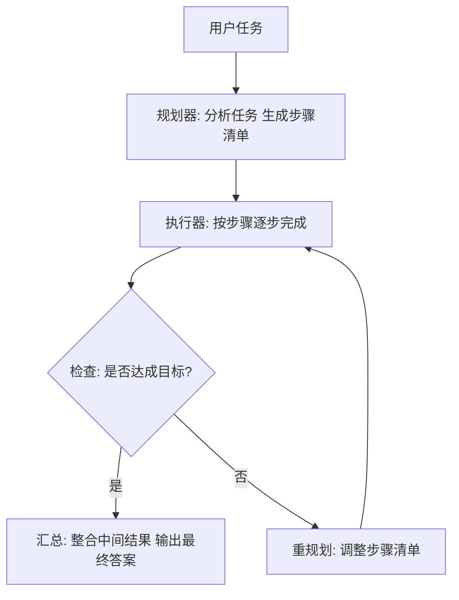

# Plan-and-Solve（计划与执行）

## 模式概述

Plan-and-Solve 是一种"**先规划，再执行**"的 Agent 设计模式。它的核心做法是：拿到一个复杂任务后，不急着动手，而是先把整个任务拆成几个明确的步骤，形成一份计划，然后再按这份计划逐步执行。

这个模式要解决的问题很具体：当模型直接处理复杂任务时，容易出现**漏步骤**（该做的步骤没做）、**计算出错**（中间结果算错了继续往下走）、**前后不一致**（做到后面忘了前面的目标）。Plan-and-Solve 通过把"想清楚要做什么"和"动手去做"拆成两个独立阶段，让每个阶段各司其职，从而提高整体完成质量。

这个思路最早由 Wang 等人在 2023 年的论文 "Plan-and-Solve Prompting" 中提出，发表于 ACL 2023。在 Agent 设计模式体系中，Plan-and-Solve 属于**单 Agent 的内部控制流模式**，后来被 LangChain 等框架吸收，演化为更通用的 Plan-and-Execute（计划与执行）架构。

> 一句话概括：复杂任务的成功率，取决于动手之前有没有先把步骤想清楚。

## 核心模块

| 模块 | 作用 | 与其他模块的关系 |
|------|------|------------------|
| 规划器（Planner） | 分析任务，生成步骤清单 | 为执行器提供路线图 |
| 执行器（Executor） | 按计划逐步完成各子任务 | 依赖规划器输出，产出中间结果 |
| 重规划 / 汇总（Replan / Summarize） | 判断是否需要调整计划，或整合最终结果 | 接收执行器的中间结果，决定继续还是结束 |

### 模块 1：规划器（Planner）

规划器的任务不是给答案，而是回答这几个问题：

- 这个任务到底要完成什么？
- 能拆成哪些子任务？
- 子任务之间有什么先后顺序？

规划器的输出是一份**步骤清单**（不是最终内容）。例如："步骤 1：收集资料 -> 步骤 2：整理要点 -> 步骤 3：比较方案 -> 步骤 4：生成结论"。

在工程实现中，规划器通常使用推理能力更强的大模型（如 GPT-4、Claude），以保证计划的合理性。

### 模块 2：执行器（Executor）

有了步骤清单后，执行器不再临时决定"接下来做什么"，而是按计划逐步执行。每一步的目标更明确，也更容易检查有没有漏掉步骤。

执行器的实现形式灵活，可以是：
- 纯 LLM 推理（文本生成）
- LLM + 工具调用（搜索、代码执行等）
- 更轻量的模型（降低成本）

Plan-and-Solve 不限定执行方式，它是一种**控制流层面的设计思路**。

### 模块 3：重规划 / 汇总（Replan / Summarize）

执行完一轮后，需要一个判断环节：当前结果是否满足目标？

- 如果满足 -> 汇总所有中间结果，生成最终答案
- 如果不满足 -> 重新调整计划，再执行一轮

这个环节在原始论文中体现为"按计划逐步求解后汇总"，在 LangGraph 等工程框架中则演化为显式的 Replan（重规划）节点，增强了对执行意外的适应能力。

## 架构图



整个流程的核心控制点：

- **规划器**在最前面，负责把复杂任务拆解为可执行步骤
- **执行器**按步骤逐步推进，每步目标明确
- **检查点**在执行后判断是否需要调整计划，这是工程实现中补充的关键环节
- **汇总**在最后面，把零散中间结果收拢为完整输出

与 ReAct 的结构差异：ReAct 是"每一步都重新思考下一步"的循环模式，Plan-and-Solve 是"先想好所有步骤再执行"的线性模式（工程实现中加入了重规划能力）。

## 工作流程

1. **步骤 1（规划）：** 接收用户任务，分析任务结构和子任务关系，输出一份有序的步骤清单。这一步的关键是把任务拆到合适粒度——太粗则执行时目标不清，太细则增加不必要的开销。
2. **步骤 2（执行）：** 按步骤清单依次执行每个子任务，每步产出一个中间结果。后面的步骤可以引用前面步骤的结果。
3. **步骤 3（检查与重规划）：** 执行完毕后检查结果是否达成目标。如果发现偏差（某步结果异常、缺少信息），调整计划并重新执行。
4. **步骤 4（汇总）：** 确认所有步骤完成后，将中间结果整合为最终答案。

终止条件：所有计划步骤执行完毕并通过检查，汇总完成。

### 执行示例

用户任务：**"帮我分析一家 AI 客服创业项目是否值得做。"**

**规划阶段输出：**
1. 明确项目所属赛道和定位
2. 分析目标用户和核心需求
3. 评估竞争格局
4. 评估商业模式可行性
5. 汇总结论和建议

**执行阶段：**
- 步骤 1 -> 结果："项目属于 AI 客服自动化赛道，主攻中小企业"
- 步骤 2 -> 结果："目标用户有客服压力但缺预算自建系统，核心需求是低成本自动化"
- 步骤 3 -> 结果："市场已有成熟产品，差异化空间主要在垂直场景"
- 步骤 4 -> 结果："SaaS 订阅模式可行，但获客成本待验证"

**汇总阶段：**
- 整合全部中间结果，输出完整结论："项目有机会，但前提是找到足够清晰的细分场景……"

整个过程体现了 Plan-and-Solve 的三段式结构：规划阶段负责拆解任务、执行阶段负责逐步产出、汇总阶段负责收拢为最终结论。

## 适用场景

### 适合的场景

1. **多步骤分析任务**：市场分析、竞品调研、投资评估——任务天然可拆分为多个阶段，按顺序推进效果最好。
2. **长内容生成**：报告、技术文档、方案——先列大纲再填内容，结构更完整、不容易写到一半跑偏。
3. **结构化问题求解**：数学题、编程题、分阶段决策——步骤之间有明确的前后依赖关系，Plan-and-Solve 天然匹配。
4. **流程型自动化任务**：数据处理管道、审批流程——"先收集、再分析、再汇总"和模式本身同构。

### 不适合的场景

1. **简单的单步任务**：翻译、润色、简短问答——直接回答更高效，规划阶段是多余开销。
2. **需要实时反应的任务**：强交互对话、即时环境反馈——固定计划无法响应实时变化，ReAct 更合适。
3. **高度探索性的开放任务**：方向完全不确定的创意发散——无法提前规划，计划容易失效。
4. **条件频繁变化的场景**：用户不断插入新要求——前面的计划很快过时，按计划执行反而僵硬。

## 典型实现

### 伪代码：Plan-and-Solve 的核心流程

```python
# Plan-and-Solve 核心流程（伪代码）

def plan_and_solve(task: str) -> str:
    # 阶段 1：规划——把任务拆成步骤清单
    plan = planner(task)
    # 示例输出: ["收集资料", "整理要点", "比较方案", "生成结论"]

    # 阶段 2：按计划逐步执行
    results = {}
    for step in plan:
        results[step] = executor(step, context=results)

    # 阶段 3：检查是否需要重规划
    if not goal_achieved(results):
        new_plan = replanner(task, results)
        # 重新执行调整后的计划...

    # 阶段 4：汇总
    return summarizer(results)
```

### 框架参考：LangGraph 的 Plan-and-Execute

LangChain 团队在 LangGraph 中实现了 Plan-and-Execute 架构，包含三个核心节点：

- **Planner 节点**：调用大模型生成步骤清单
- **Executor 节点**：逐步执行（可调用工具）
- **Replan 节点**：判断是否需要调整计划

```python
# LangGraph Plan-and-Execute 结构示意（基于 langgraph，非完整可运行代码）

from langgraph.graph import StateGraph

# 定义三个核心节点
graph = StateGraph(PlanExecuteState)
graph.add_node("planner", plan_step)       # 规划器
graph.add_node("executor", execute_step)   # 执行器
graph.add_node("replan", replan_step)      # 重规划器

# 定义流转逻辑
graph.add_edge("planner", "executor")
graph.add_conditional_edges(
    "executor",
    should_continue,  # 判断：继续执行 or 重规划 or 结束
    {"continue": "executor", "replan": "replan", "end": END}
)
graph.add_edge("replan", "executor")
```

上面这段代码展示了 LangGraph 中的图结构定义方式：三个节点通过条件边连接，`should_continue` 函数决定执行完一步后是继续、重规划还是结束。

## 优劣势分析

| 优势 | 劣势 |
|------|------|
| 步骤更完整，减少漏步骤的问题 | 对简单任务偏重，规划阶段是多余开销 |
| 最终结果更有结构，前后更一致 | 如果计划本身不合理，后续执行一路带偏 |
| 可解释性强，容易审查和调试 | 面对高变化任务时不如 ReAct 灵活 |
| 执行器可用轻量模型，节省成本 | 规划质量高度依赖模型的任务分解能力 |
| 无依赖的步骤可并行执行，提升效率 | 重规划机制增加系统复杂度 |

边界说明：Plan-and-Solve 的优势在任务结构稳定、可提前分解时最明显。当任务需要动态探索或条件频繁变化时，固定计划反而成为束缚。

## 与相关模式的对比

| 对比维度 | Plan-and-Solve | ReAct | Chain-of-Thought（思维链） |
|---------|---------------|-------|--------------------------|
| 核心思路 | 先制定完整计划，再按计划执行 | 每一步都重新思考下一步（思考-行动-观察循环） | 逐步推理，不拆分阶段 |
| 外部工具 | 执行阶段可用 | 每步都可调用 | 通常不用 |
| 适合任务 | 结构清晰、可提前分解的任务 | 需要实时信息和工具交互的任务 | 纯推理问题（数学、逻辑） |
| 灵活性 | 中等（工程实现中加入重规划后有所提升） | 高（实时适应） | 低（线性推理路径） |
| 成本 | 规划用大模型 + 执行可用小模型，整体可控 | 每步都可能调用大模型，成本较高 | 单次调用，成本最低 |
| 典型弱点 | 计划出错则全程偏差 | 容易陷入循环或偏离目标 | 漏步骤、计算错误 |

**选择建议：**
- 任务步骤清晰、依赖关系明确 -> Plan-and-Solve
- 任务需要频繁工具调用和实时反馈 -> ReAct
- 纯推理问题，无需外部工具 -> Chain-of-Thought

## 常见误区

| 常见误区 | 正确理解 |
|----------|----------|
| 只要把任务拆成步骤就是 Plan-and-Solve | 关键不只是拆分，而是规划和执行是两个独立阶段——先完成整体计划，再进入执行 |
| Plan-and-Solve 一定比 ReAct 好 | 两者解决的是不同类型的问题；动态探索型任务里 ReAct 更合适 |
| 计划写得越详细越好 | 计划太细会增加负担、降低灵活性；关键是粒度合适，能指导执行即可 |
| 有了规划阶段就不需要重规划 | 计划也可能出错，工程实现中通常需要加入检查和重规划机制 |

## 思考题

<details>
<summary>初级：Plan-and-Solve 和"直接让模型回答"相比，最核心的区别是什么？</summary>

**参考答案：**

最核心的区别是 Plan-and-Solve 把"想清楚要做什么"和"动手去做"拆成了两个独立阶段。直接回答是模型边想边答，规划和执行混在一起；Plan-and-Solve 则先产出一份完整的步骤清单，再按这份清单逐步执行。这不只是"多了几步"的区别，而是把规划独立成了一个明确的前置环节。

</details>

<details>
<summary>中级：Plan-and-Solve 原始论文解决了 Zero-shot CoT 的哪些问题？PS+ 又做了什么改进？</summary>

**参考答案：**

原始 Plan-and-Solve（PS）主要解决了 Zero-shot CoT 中的**漏步骤**问题——通过先制定计划再执行，减少推理过程中跳过关键步骤的情况。PS+（增强版）在此基础上进一步针对**计算错误**做了优化，在提示词中加入了"提取相关变量""注意计算过程"等更具体的指令，引导模型更仔细地处理中间计算。但两者都无法有效解决语义误解（Semantic Misunderstanding）问题。

</details>

<details>
<summary>中级：什么情况下 Plan-and-Solve 不如 ReAct？如何缓解这个问题？</summary>

**参考答案：**

当任务需要根据实时反馈不断调整方向时，Plan-and-Solve 不如 ReAct。例如：用户频繁插入新条件的交互任务、需要动态探索的开放任务、外部环境持续变化的场景。这类任务的共同特点是事先制定的计划很快过时，坚持按计划执行反而僵硬。缓解方式是在 Plan-and-Solve 中引入**重规划（Replan）机制**——执行完每步后检查结果，必要时调整后续计划，这也是 LangGraph 等工程框架的做法。

</details>

## 参考资料

1. Wang et al. (2023). "Plan-and-Solve Prompting: Improving Zero-Shot Chain-of-Thought Reasoning by Large Language Models." ACL 2023. https://arxiv.org/abs/2305.04091
2. Plan-and-Solve Prompting 论文官方代码仓库: https://github.com/AGI-Edgerunners/Plan-and-Solve-Prompting
3. LangChain Blog - Plan-and-Execute Agents: https://blog.langchain.com/planning-agents/
4. Learn Prompting - Plan-and-Solve 讲解: https://learnprompting.org/docs/advanced/decomposition/plan_and_solve
