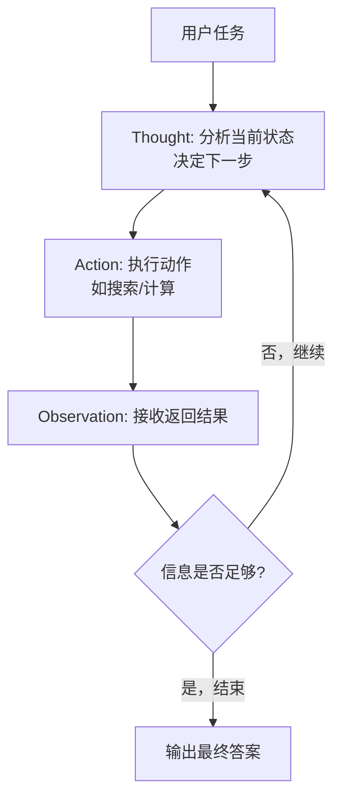

# ReAct（推理与行动协同）

## 模式概述

ReAct 是一种"边思考，边行动"的 Agent 范式。名字来自 **Re**ason（推理）+ **Act**（行动）两个词的组合，由 Yao 等人在 2022 年提出，发表于 ICLR 2023。

在 ReAct 出现之前，LLM 解决问题主要有两种路线：一种是"只想不做"——以 Chain-of-Thought（思维链，简称 CoT）为代表，模型能一步步推理，但无法访问外部信息，遇到需要实时数据的问题就容易编造答案；另一种是"只做不想"——模型直接输出动作指令，但缺乏推理能力，遇到复杂任务就容易迷失方向。ReAct 把两者结合起来：模型在推进任务时，先想清楚当前该做什么，再去执行动作，看到结果后继续思考下一步。这种交替循环正是人类解决问题的自然方式。

> 一句话概括：模型在推理和行动之间来回切换，根据外部反馈持续调整下一步，形成"带外部交互的推理循环"。

## 核心模块

ReAct 的核心是 Thought-Action-Observation 循环（简称 TAO 循环），由三个阶段交替运行：

| 模块 | 作用 | 与其他模块的关系 |
|------|------|------------------|
| Thought（思考） | 根据当前状态判断下一步该做什么 | 驱动 Action 的方向，接收 Observation 的反馈 |
| Action（行动） | 执行具体动作，通常是调用外部工具 | 由 Thought 决定调用什么，执行结果交给 Observation |
| Observation（观察） | 接收 Action 返回的结果 | 为下一轮 Thought 提供新的事实依据 |

### 模块 1：Thought（思考）

Thought 是模型的内部判断过程，不是给用户看的最终答案，而是模型在决定"下一步做什么"时的推理依据。

它通常回答这些问题：

- 当前掌握的信息够不够
- 下一步应该查什么、算什么、做什么
- 上一步得到的结果说明了什么
- 是否应该继续调用工具，还是已经可以回答

Thought 的价值不在于写出很长的推理文本，而在于帮助模型确定下一步行动方向。

### 模块 2：Action（行动）

Action 是模型真正执行的动作，最常见的形式是工具调用，例如搜索关键词、调用计算器、查询数据库、请求 API。

Action 是 ReAct 从"只会想"进入"真的去做"的关键环节。它不是机械调用，而是由 Thought 驱动的、带有明确目的的操作。

### 模块 3：Observation（观察）

Observation 是 Action 执行后返回的结果，可能是搜索结果、计算答案、API 响应，也可能是报错信息。

Observation 给模型提供了新的外部事实，让下一轮 Thought 不再只是凭空猜测，而是基于真实反馈继续推进。没有 Observation，ReAct 就失去了闭环特征，行动也就变成了盲目操作。

## 架构图



流程说明：

- **Thought** 负责决策——根据已有信息判断下一步做什么
- **Action** 负责执行——调用外部工具获取新信息
- **Observation** 负责反馈——把工具返回的结果送回给 Thought
- 控制点在于 **"信息是否足够"的判断**，这决定了循环继续还是终止
- 多数真实任务不会一轮就结束，模型往往需要多轮 TAO 迭代才能收集到足够信息

## 工作流程

1. **步骤 1（Thought）：** 模型接收用户任务（或上一轮 Observation），分析当前掌握的信息是否足够，判断下一步应该做什么。
2. **步骤 2（Action）：** 根据 Thought 的判断，执行一个具体动作——通常是调用搜索、计算、数据库查询等外部工具。
3. **步骤 3（Observation）：** 接收 Action 返回的结果，将其作为新信息加入上下文。
4. **步骤 4（循环判断）：** 模型评估当前信息是否足够回答原始问题。如果不够，回到步骤 1 继续下一轮；如果足够，输出最终答案。

循环终止条件：模型判断已获得足够信息，或达到系统设定的最大轮次。

### 执行示例

用户问：**"北京今天的气温多少？需要带伞吗？"**

**第 1 轮：**
- **Thought**：这个问题需要实时天气数据，我应该先查北京今天的天气。
- **Action**：Search["北京今天天气"]
- **Observation**：北京今天晴，最高气温 22°C，最低 10°C，无降水。

**第 2 轮：**
- **Thought**：我已经知道今天晴、无降水，可以回答是否带伞了。信息足够，直接整理答案。
- **Action**：Finish["北京今天最高 22°C，最低 10°C，晴天无降水，不需要带伞。"]

两轮循环完成任务：第 1 轮获取事实信息，第 2 轮基于事实做出判断并输出最终答案。

## 适用场景

### 适合的场景

1. **需要实时信息的任务**：查天气、新闻、股价、商品信息——模型内部知识可能过时，必须通过工具获取最新数据。
2. **需要精确计算的任务**：数学运算、数据统计、财务计算——LLM 自身计算能力有限，ReAct 可以将计算交给专用工具。
3. **需要逐步推进的探索型任务**：研究问题、收集资料、分步求解——一次无法获得所有信息，需要多轮迭代。
4. **需要根据中间结果调整策略的任务**：前一步的结果会影响后一步的方向，ReAct 的循环结构天然支持动态调整。

### 不适合的场景

1. **纯创意型任务**：写诗、编故事、发散创意——不需要工具和反馈循环，ReAct 的循环结构反而是累赘。
2. **非常简单的任务**：一句话翻译、基础问答——直接回答即可，ReAct 增加额外开销但没有收益。
3. **必须先有全局计划的复杂任务**：写完整长报告、设计复杂工作流——更适合 Plan-and-Solve（先规划后执行）模式。ReAct 逐步推进容易局部合理但整体不够完整。

## 典型实现

以下伪代码展示 ReAct 的核心循环结构：

```python
# ReAct 核心循环伪代码

def react_loop(question, tools, max_steps=5):
    """ReAct 主循环：思考 → 行动 → 观察，重复直到完成"""
    context = [question]  # 上下文：存放所有历史信息

    for step in range(max_steps):
        # 阶段 1：Thought —— 模型根据上下文判断下一步
        thought = llm.generate(
            prompt=f"根据以下信息，判断下一步该做什么：\n{context}"
        )

        # 如果模型认为信息足够，输出最终答案
        if thought.is_final_answer:
            return thought.answer

        # 阶段 2：Action —— 调用工具执行动作
        tool_name, tool_input = thought.next_action
        observation = tools[tool_name].run(tool_input)

        # 阶段 3：Observation —— 将结果加入上下文
        context.append(f"Thought: {thought}")
        context.append(f"Action: {tool_name}({tool_input})")
        context.append(f"Observation: {observation}")

    return "达到最大轮次，未能完成任务。"
```

代码中的三个阶段对应 ReAct 的 TAO 循环：`thought` 对应决策判断，`tools[tool_name].run()` 对应工具执行，`observation` 对应反馈结果。`context` 列表持续积累历史信息，供下一轮 Thought 使用。`max_steps` 防止无限循环。

如果需要在实际项目中使用 ReAct，LangGraph 提供了开箱即用的 `create_react_agent` 函数：

```python
# 基于 LangGraph 的 ReAct Agent（示意）
# 依赖：langgraph, langchain-openai

from langgraph.prebuilt import create_react_agent
from langchain_openai import ChatOpenAI

# 定义工具
def search(query: str) -> str:
    """搜索工具：查询实时信息"""
    # 实际项目中替换为真实搜索 API
    return f"搜索 '{query}' 的结果..."

# 创建 ReAct Agent
model = ChatOpenAI(model="gpt-4o-mini")
agent = create_react_agent(model, tools=[search])

# 运行
result = agent.invoke({"messages": [("user", "北京今天天气怎么样？")]})
```

LangGraph 的 `create_react_agent` 内部实现了完整的 TAO 循环逻辑，开发者只需定义工具和模型即可。

## 优劣势分析

| 优势 | 劣势 |
|------|------|
| 推理与行动协同，减少纯推理时的幻觉 | 多轮循环增加延迟和 token 消耗 |
| 根据外部反馈动态调整，灵活性高 | 上下文随轮次增长，可能超出窗口限制 |
| 推理过程和行动过程透明可追踪 | 工具质量直接影响整体效果 |
| 适合逐步推进的探索型任务 | 缺乏全局规划能力，不适合结构化大任务 |

边界说明：ReAct 的优势在任务需要动态探索时最明显；当任务结构固定、步骤明确时，循环开销反而成为负担。

## 与相关模式的对比

| 对比维度 | ReAct | Chain-of-Thought（CoT） | Plan-and-Solve |
|---------|-------|------------------------|---------------|
| 核心思想 | 推理与行动交替循环 | 逐步内部推理，不与外部交互 | 先制定完整计划，再逐步执行 |
| 外部工具 | 核心特性，必须有工具参与 | 不使用外部工具 | 可选，非必须 |
| 规划能力 | 逐步推进，短期视野 | 无显式规划 | 全局规划，长期视野 |
| 幻觉风险 | 较低——通过工具获取真实信息 | 较高——完全依赖模型内部知识 | 中等 |
| 适用场景 | 需要实时信息和工具调用的任务 | 纯逻辑推理、数学证明 | 复杂多步骤规划任务 |
| 效率 | 中等（多轮交互） | 较高（单次推理） | 较高（计划后批量执行） |

ReAct 原始论文的实验表明：在需要外部知识的任务（如 HotpotQA 事实验证）上，ReAct 明显优于纯 CoT；而在纯逻辑推理任务上，CoT 的效率更高。最佳实践是将 ReAct 与 CoT 结合使用——模型先用内部推理处理能解决的部分，遇到知识缺口时再通过工具获取外部信息。

## 常见误区

| 常见误区 | 正确理解 |
|----------|----------|
| ReAct 就是工具调用 | 工具调用只是 Action 的一种形式，核心是 Thought-Action-Observation 的闭环循环，Thought 环节的推理质量才是关键 |
| ReAct 一定比直接回答更好 | 对简单任务来说，ReAct 反而增加不必要的开销。它的价值体现在需要多步探索和外部信息的场景 |
| ReAct 和 Plan-and-Solve 差不多 | ReAct 强调实时迭代、边走边调整；Plan-and-Solve 强调前期整体规划、按计划执行。适用场景不同 |
| 只要写出 Thought 就算 ReAct | 真正的 ReAct 必须包含 Action 和 Observation 的闭环，三者缺一不可 |

## 思考题

<details>
<summary>初级：ReAct 和普通"直接回答"模式的核心区别是什么？</summary>

**参考答案：**

直接回答模式是模型拿到问题后直接基于已有知识生成答案，不调用外部工具，也不根据外部反馈调整。

ReAct 的核心区别在于它把任务拆成一个循环：先思考当前该做什么（Thought），再执行一个动作（Action），再根据返回结果（Observation）继续思考下一步。关键不是"答案写得更长"，而是把推理、行动、观察三者连接成了一个持续推进的闭环。

</details>

<details>
<summary>中级：为什么 Observation 在 ReAct 中不可或缺？</summary>

**参考答案：**

Observation 是把"行动"和"下一轮思考"连接起来的关键环节。Action 执行之后，模型必须看到结果才能判断：当前动作有没有帮助、信息是否足够、下一步继续搜索还是结束。

没有 Observation，ReAct 就退化成"有思考有行动但没有反馈"的模式——模型虽然在调用工具，但无法利用返回信息修正策略，行动变成盲目操作。

</details>

<details>
<summary>中级：什么情况下 ReAct 不如 Plan-and-Solve？</summary>

**参考答案：**

当任务需要提前规划整体结构时，例如写完整长报告、设计复杂工作流、处理有明确前后依赖的大型任务。

ReAct 每一步都在做当前最合理的选择，但缺少整体路线图，可能局部合理但整体不够完整。Plan-and-Solve 先把任务拆成全局计划再按计划推进，在结构稳定、步骤明确的复杂任务里更容易保证完整性。

</details>

## 参考资料

1. Yao, S. et al. "ReAct: Synergizing Reasoning and Acting in Language Models." ICLR 2023. https://arxiv.org/abs/2210.03629
2. ReAct 项目主页: https://react-lm.github.io/
3. ReAct 原始代码仓库: https://github.com/ysymyth/ReAct
4. LangGraph ReAct Agent 模板: https://github.com/langchain-ai/react-agent
5. LangGraph ReAct Agent 从零实现指南: https://langchain-ai.github.io/langgraph/how-tos/react-agent-from-scratch-functional/
6. Prompt Engineering Guide - ReAct Prompting: https://www.promptingguide.ai/techniques/react
