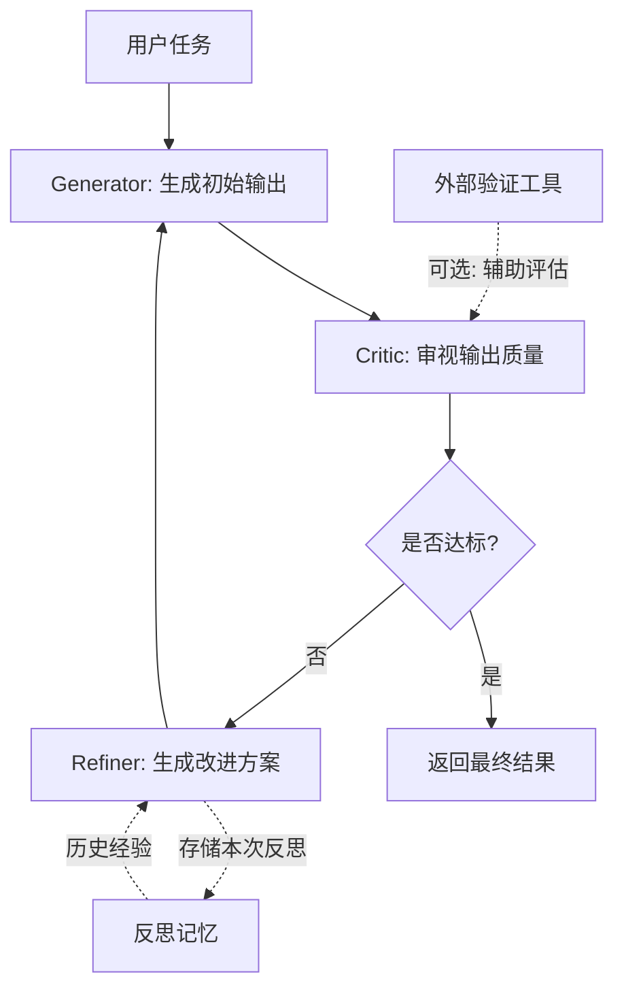

# Reflection（反思/自我纠错模式）

## 模式概述

Reflection 是一种让 Agent 自动审视自身输出、发现问题、然后迭代改进的设计模式。名字直译就是"反思"——就像人写完一篇文章后会回头检查、修改一样，Agent 在生成初始输出后，不是直接交付，而是先自我批评，再根据批评意见修改，如此反复直到满意为止。

吴恩达（Andrew Ng）将 Reflection 列为四大 Agentic Design Pattern（智能体设计模式）之首，评价它是"实现起来相对简单，却能带来惊人性能提升"的模式。在没有 Reflection 之前，LLM 只能"一次出活"——生成一个答案就结束。如果答案有问题，只能靠人类手动指出错误再让模型重来。Reflection 把这个"人工反馈"环节自动化了：让模型自己扮演批评者，自己发现问题，自己修改。

该模式的学术基础主要来自两篇论文：Shinn 等人在 2023 年提出的 Reflexion（发表于 NeurIPS 2023），通过"语言反馈"（Verbal Reinforcement）替代传统强化学习的参数更新来改进 Agent；Madaan 等人同年提出的 Self-Refine（发表于 NeurIPS 2023），展示了 LLM 可以对自身输出提供反馈并迭代精炼。

> 一句话概括：让 Agent 生成输出后自我批评、自我修正，通过"生成-反思-改进"的循环不断提升输出质量。

## 核心模块

Reflection 模式由三个核心模块组成，形成一个闭环循环：

| 模块 | 作用 | 与其他模块的关系 |
|------|------|------------------|
| Generator（生成器） | 根据任务要求生成初始输出 | 接收 Refiner 的改进指令后重新生成 |
| Critic（批评器） | 对生成器的输出进行评估和批评 | 接收 Generator 的输出，将反馈传给 Refiner |
| Refiner（改进器） | 根据批评意见制定改进方案 | 接收 Critic 的反馈，指导 Generator 下一轮生成 |

### 模块 1：Generator（生成器）

Generator 负责"干活"——根据任务描述生成具体输出，比如写代码、写文案、回答问题。第一轮是基于原始任务生成，后续轮次则是基于改进后的指令重新生成。

Generator 不需要是一个独立的模型，最常见的做法是用同一个 LLM 充当所有三个模块的角色，只是每次用不同的 Prompt（提示词）来切换角色。

### 模块 2：Critic（批评器）

Critic 负责"挑毛病"——拿到 Generator 的输出后，从正确性、完整性、效率、风格等维度进行审查，指出具体的问题。

批评的来源有三种：

- **自我批评**（Self-Critique）：用同一个 LLM 审视自己的输出，最简单但可能存在盲区
- **外部工具验证**：用代码运行器执行代码检查是否报错、用单元测试验证逻辑、用搜索引擎核实事实
- **独立 Agent 批评**：用另一个 Agent（甚至另一个模型）专门负责批评，类似论文的同行评审

### 模块 3：Refiner（改进器）

Refiner 负责"制定改进方案"——将 Critic 的批评意见整理成具体的修改指令，传回给 Generator。它不是简单地把批评转发，而是要把批评抽象为可操作的改进建议。

在很多实现中，Refiner 和 Generator 合并为一个步骤：直接把原始输出和批评意见一起交给 LLM，让它生成改进版本。

## 架构图



流程说明：

- **Generator** 根据任务（首轮）或改进方案（后续轮）生成输出
- **Critic** 对输出进行多维度评估，判断是否达标
- 达标则直接返回结果；不达标则进入 **Refiner** 生成改进方案
- **外部验证工具**（如单元测试、搜索引擎）可以辅助 Critic 提供更客观的评估
- **反思记忆**（Reflection Memory）存储历次反思结果，为后续改进提供经验参考
- 通常设置最大迭代次数（如 3 次），防止无限循环

## 工作流程

1. **步骤 1（生成）：** Generator 接收用户任务描述，生成初始输出。这一步和普通 LLM 调用没有区别。
2. **步骤 2（批评）：** Critic 拿到输出后进行评估。评估方式可以是 LLM 自我审视、运行单元测试、调用外部工具验证等。Critic 输出两样东西：一个通过/不通过的判断，以及具体的问题描述。
3. **步骤 3（判断）：** 如果 Critic 判定通过，直接返回结果。如果不通过，进入下一步。
4. **步骤 4（改进）：** Refiner 根据 Critic 的反馈生成改进方案，包括：哪里出了问题、应该如何修改、需要额外注意什么。改进方案传回 Generator，开始新一轮生成。
5. **循环终止：** 当 Critic 判定通过，或达到最大迭代次数时终止。

### 执行示例

任务：让 Agent 编写一个 Python 函数，实现"找出列表中第二大的数"。

**第 1 轮：**
- **Generator**：生成代码 `def second_max(nums): return sorted(nums)[-2]`
- **Critic**：运行测试用例。`second_max([1, 3, 3])` 期望返回 `1`，实际返回 `3`（重复最大值未处理）。判定：不通过。问题：未去重，当最大值重复出现时返回错误结果。
- **Refiner**：改进方案——先对列表去重再排序，同时考虑列表长度不足 2 的边界情况。

**第 2 轮：**
- **Generator**：根据改进方案重新生成：`def second_max(nums): unique = list(set(nums)); unique.sort(); return unique[-2] if len(unique) >= 2 else None`
- **Critic**：所有测试通过。判定：通过。
- 返回最终代码。

两轮完成任务。第 1 轮暴露了边界问题，反思后第 2 轮修复。

## 适用场景

### 适合的场景

1. **代码生成与调试**：成功标准客观明确（测试通过/不通过），失败信息具体（错误堆栈、断言失败），非常适合自动反思。Reflexion 论文在 HumanEval 基准上达到 91% pass@1 准确率。
2. **文本内容迭代优化**：写文案、写摘要、写邮件等场景，初稿往往不够精炼，通过反思循环可以逐步改善表达质量、逻辑完整性。
3. **结构化数据生成**：生成 JSON、SQL、配置文件等场景，可以通过 schema 校验或执行来验证正确性，错误反馈明确。
4. **知识问答与事实核查**：结合搜索工具验证回答的准确性，发现事实错误后修正。

### 不适合的场景

1. **实时性要求高的任务**：每轮反思需要额外的 LLM 调用，延迟会翻倍增长。对话机器人、实时翻译等场景无法承受这种延迟。
2. **不可逆操作**：执行删除数据、发送邮件、金融转账等操作后再反思已经来不及。Reflection 适合"先想后做"，不适合"做了再说"。
3. **没有客观评估标准的任务**：如"写一首有创意的诗"，缺乏明确的对错标准，Critic 很难给出有建设性的反馈，反思容易变成无效循环。
4. **Token 预算紧张的场景**：每轮迭代需要完整的生成 + 批评 + 改进，3 轮反思的 Token 消耗是单次调用的 6-10 倍。

## 典型实现

以下伪代码展示 Reflection 的核心循环逻辑：

```python
# Reflection 核心循环伪代码

def reflection_loop(task, max_rounds=3):
    """反思循环：生成 → 批评 → 改进，重复直到通过"""
    output = llm.generate(prompt=f"完成以下任务：\n{task}")

    for round in range(max_rounds):
        # 批评阶段：审视输出质量
        critique = llm.generate(
            prompt=f"审视以下输出，指出问题并给出改进建议：\n"
                   f"任务：{task}\n输出：{output}"
        )

        # 判断是否通过
        if "没有问题" in critique or "质量达标" in critique:
            return output  # 通过，返回结果

        # 改进阶段：根据批评意见重新生成
        output = llm.generate(
            prompt=f"根据以下反馈改进你的输出：\n"
                   f"任务：{task}\n当前输出：{output}\n反馈：{critique}"
        )

    return output  # 达到最大轮次，返回最后一版
```

代码中 `llm.generate` 在不同阶段扮演不同角色：第一次是 Generator，第二次是 Critic，第三次同时充当 Refiner 和 Generator。`max_rounds` 防止无限循环。实际项目中，Critic 阶段通常会结合外部验证工具（如运行测试、schema 校验）来提供更可靠的判断。

多 Agent 写法（双 Agent 互评模式）：

```python
# 双 Agent Reflection 伪代码
# 一个 Agent 负责生成，另一个专门负责批评

def dual_agent_reflection(task, max_rounds=3):
    """生成器和批评器分离的反思模式"""
    generator_prompt = "你是一个专业的内容生成助手。"
    critic_prompt = "你是一个严格的审稿人，只指出问题，不帮忙修改。"

    output = llm.generate(system=generator_prompt, user=task)

    for round in range(max_rounds):
        critique = llm.generate(
            system=critic_prompt,
            user=f"请审查以下输出：\n{output}"
        )

        if critique.indicates_pass:
            return output

        output = llm.generate(
            system=generator_prompt,
            user=f"原始任务：{task}\n当前输出：{output}\n审稿意见：{critique}\n请修改。"
        )

    return output
```

双 Agent 模式的优势在于 Critic 角色的 System Prompt 可以设定为更严格的审查标准，避免"自己评自己太宽松"的问题。吴恩达推荐这种写法，认为它"更方便在两个 Agent 之间建立讨论"。

## 优劣势分析

| 优势 | 劣势 |
|------|------|
| 实现简单，不需要额外训练或微调 | 每轮反思增加 LLM 调用次数，Token 成本翻倍 |
| 自动改进输出质量，减少人工检查 | 反思质量上限受模型能力约束，模型不懂的问题反思也发现不了 |
| 推理过程用自然语言表达，可解释性强 | 存在"自我强化偏见"——模型可能反复犯同一类错误 |
| 结合外部工具验证时效果显著提升 | 简单任务上徒增开销，一次就对的任务不需要反思 |

边界说明：Reflection 的收益在"有明确评估标准"的任务上最显著（如代码生成、格式校验）。对于主观性强的任务（如创意写作），效果取决于 Critic 的评估质量。

## 与相关模式的对比

| 对比维度 | Reflection | ReAct | Self-Refine |
|---------|-----------|-------|------------|
| 核心动作 | 生成 → 批评 → 改进，循环迭代 | 思考 → 行动 → 观察，循环推进 | 生成 → 反馈 → 精炼，线性迭代 |
| 关注点 | 提升单个输出的质量 | 通过工具交互收集信息完成任务 | 单次输出的质量打磨 |
| 外部工具 | 可选（用于辅助评估） | 必须（核心依赖工具调用） | 不使用 |
| 记忆机制 | 可积累跨任务的反思经验（Reflexion） | 仅在当前任务内追踪历史 | 无跨任务记忆 |
| 典型场景 | 代码生成调试、内容质量优化 | 信息检索、实时问答 | 文本润色、摘要改写 |
| 成本 | 中高（2-3 轮反思） | 中等（多轮工具调用） | 较低（1-2 轮精炼） |

选择建议：

- 任务有明确的对错标准、需要多轮修正 → **Reflection**
- 任务需要调用外部工具获取信息 → **ReAct**
- 只需要对输出做一轮润色 → **Self-Refine**
- 需要多个角色协作讨论 → **Reflection 的双 Agent 变体**

## 常见误区

| 常见误区 | 正确理解 |
|----------|----------|
| Reflection 就是让 LLM 多生成几次 | 关键不在于"重复生成"，而在于中间有一个明确的"批评-改进"环节。没有 Critic 的多次生成只是重复采样，不是反思 |
| 反思次数越多效果越好 | 通常 2-3 轮就能收敛。超过 3 轮后边际收益递减，甚至可能引入新问题。成本随轮次线性增长，需要权衡 |
| Reflection 等于强化学习 | Reflexion 论文用"语言反馈"替代了传统 RL 的梯度更新，不需要训练数据和参数微调。两者目标相似（通过反馈改进），但实现路径完全不同 |
| 模型一定能发现自己的错误 | 如果模型本身对某类知识存在盲区，反思也无法突破。这就是为什么结合外部工具验证（如运行测试、搜索核实）比纯自我反思更可靠 |

## 思考题

<details>
<summary>初级：Reflection 和"让用户手动指出问题再重新回答"有什么本质区别？</summary>

**参考答案：**

本质区别在于 Critic 环节是否自动化。传统做法依赖用户人工发现问题并反馈，Agent 被动修改。Reflection 让 Agent 自己扮演 Critic 角色，自动发现输出中的问题并生成改进方案，整个循环无需人类参与。这把"人工质检"变成了"自动质检"。

</details>

<details>
<summary>中级：为什么"结合外部工具的 Reflection"比"纯自我反思"更可靠？</summary>

**参考答案：**

纯自我反思依赖 LLM 自身的判断力，但模型可能对自己的错误存在盲区——它不知道自己不知道什么。结合外部工具（如运行代码检查是否报错、调用搜索引擎核实事实）可以引入客观的、模型能力之外的评估信号。例如，模型可能觉得自己写的代码逻辑正确，但运行测试后发现边界条件没处理——这种问题纯靠自我审视很难发现。

</details>

<details>
<summary>中级：什么情况下应该停止反思循环，即使输出还不完美？</summary>

**参考答案：**

三种情况应当停止：(1) 连续两轮反思后输出没有实质性改进，说明已接近模型能力上限；(2) Token 预算或延迟已超出业务容忍范围；(3) Critic 的反馈开始自相矛盾或重复，说明反思进入了无效循环。设置最大迭代次数是工程实践中的必备手段，通常 3 次是一个合理上限。

</details>

## 参考资料

1. Shinn, N. et al. "Reflexion: Language Agents with Verbal Reinforcement Learning." NeurIPS 2023. https://arxiv.org/abs/2303.11366
2. Madaan, A. et al. "Self-Refine: Iterative Refinement with Self-Feedback." NeurIPS 2023. https://arxiv.org/abs/2303.17651
3. Gou, Z. et al. "CRITIC: Large Language Models Can Self-Correct with Tool-Interactive Critiquing." ICLR 2024. https://arxiv.org/abs/2305.11738
4. Andrew Ng. "Agentic Design Patterns Part 2: Reflection." DeepLearning.AI The Batch, 2024. https://www.deeplearning.ai/the-batch/agentic-design-patterns-part-2-reflection/
5. Reflexion 项目代码仓库: https://github.com/noahshinn/reflexion
6. Self-Refine 项目代码仓库: https://github.com/madaan/self-refine
