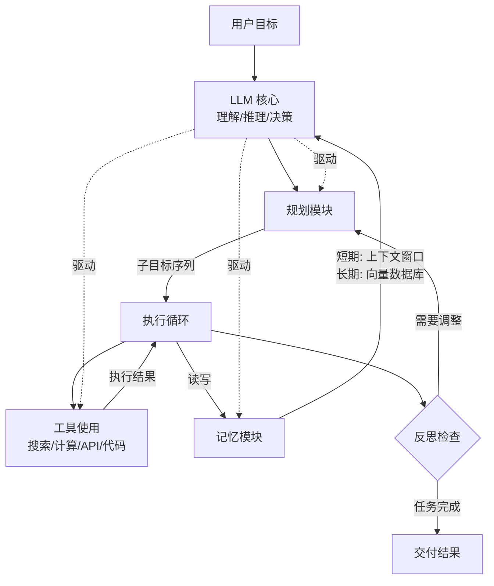

# 自主 Agent 架构（Autonomous Agent Architecture）

## 模式概述

自主 Agent 架构是一种以 LLM 为"大脑"，让 Agent 能够自主完成端到端任务的系统设计模式。它的核心理念是：给 Agent 一个目标，Agent 自己规划步骤、调用工具、根据反馈调整策略，最终交付结果——整个过程尽量减少人类的逐步干预。

这个架构的经典定义来自 OpenAI 应用研究主管 Lilian Weng 在 2023 年发表的博客文章《LLM Powered Autonomous Agents》，她提出了一个被广泛引用的公式：**Agent = LLM + 规划（Planning）+ 记忆（Memory）+ 工具使用（Tool Use）**。这个公式定义了自主 Agent 的四大核心能力，也成为后续 AutoGPT、BabyAGI、LangGraph 等框架的设计基础。

在 Agent 设计模式体系中，ReAct 解决的是"怎么让 Agent 边想边做"，Master-Worker 解决的是"怎么让多个 Agent 分工协作"，而自主 Agent 架构解决的是一个更高层次的问题：**怎么让 Agent 从接收目标到交付结果全程自主运行**。它不是某个具体的推理循环，而是一种将规划、推理、记忆、工具调用组合成完整系统的架构模式。

> 一句话概括：让 LLM 作为控制中枢，自主完成"目标理解 → 任务规划 → 逐步执行 → 反思调整 → 结果交付"的完整闭环。

## 核心模块

自主 Agent 架构由四个核心模块组成，每个模块对应 Agent 的一种关键能力：

| 模块 | 作用 | 与其他模块的关系 |
|------|------|------------------|
| LLM 核心（大脑） | 理解目标、推理决策、生成自然语言 | 驱动其他三个模块，是整个系统的控制中枢 |
| Planning（规划） | 将大目标拆解为可执行的子任务序列 | 依赖 LLM 的推理能力，指导 Tool Use 的执行顺序 |
| Memory（记忆） | 存储和检索历史信息，维持上下文连贯性 | 为 LLM 和 Planning 提供历史经验，支撑长周期任务 |
| Tool Use（工具使用） | 与外部世界交互，执行具体动作 | 接收 Planning 的指令，将执行结果反馈给 LLM |

### 模块 1：LLM 核心（大脑）

LLM 是整个架构的控制中枢，负责自然语言理解、推理判断和决策生成。所有其他模块的运转都由 LLM 驱动——规划由 LLM 生成，工具由 LLM 选择，记忆由 LLM 读写。

LLM 的能力上限直接决定了整个 Agent 系统的能力上限。如果 LLM 的推理能力不足，规划就会出错；如果 LLM 不擅长结构化输出，工具调用就容易失败。

### 模块 2：Planning（规划）

规划模块负责把用户的高层目标拆解成可执行的子任务序列。它包含两个关键能力：

**子目标分解（Subgoal Decomposition）**：将"帮我做一份竞品分析报告"这样的大目标，拆解成"确定竞品列表 → 收集各竞品数据 → 对比分析 → 撰写报告"这样的子任务链。常用的技术手段包括：
- Chain-of-Thought（思维链，简称 CoT）提示，让 LLM 逐步分解
- 任务特定指令，如"请列出完成这个目标需要的步骤"
- Tree of Thoughts（思维树，简称 ToT），探索多条可能的分解路径，选择最优方案

**反思与调整（Reflection & Refinement）**：在执行过程中，Agent 会回顾已完成的步骤，评估当前方向是否正确。如果发现走弯路了，会调整后续计划。代表性技术包括 Reflexion（让 Agent 对自己的执行轨迹进行自我批评）和 Chain of Hindsight（事后分析链，用历史执行记录来改进未来决策）。

### 模块 3：Memory（记忆）

记忆模块让 Agent 能够存储和检索信息，而不是每次都从零开始。它分为两种类型：

**短期记忆（Short-term Memory）**：对应 LLM 的上下文窗口（Context Window），存放当前任务的对话历史、已执行的步骤、中间结果。受限于窗口大小，内容会随着任务推进被截断或压缩。

**长期记忆（Long-term Memory）**：通过外部存储实现（通常是向量数据库），可以跨任务保留信息。例如，Agent 上次做竞品分析时积累的经验、用户的偏好设置、历史执行中总结的最佳实践。长期记忆的典型实现方式是将信息转化为 Embedding（向量表示）存入向量数据库，需要时通过相似度检索取回。

### 模块 4：Tool Use（工具使用）

工具使用模块让 Agent 能够突破 LLM 自身能力的限制，与外部世界交互。常见的工具类型包括：

- **搜索工具**：获取实时信息（如网页搜索、知识库检索）
- **计算工具**：执行精确计算（如 Python 解释器、计算器）
- **API 工具**：调用外部服务（如发邮件、查数据库、操作文件系统）
- **代码执行工具**：运行代码片段，处理数据

工具使用的关键挑战是：LLM 需要准确判断"什么时候该用工具"和"该用哪个工具、传什么参数"。Function Calling（函数调用）是当前主流 LLM 支持的标准化工具调用接口。

## 架构图



流程说明：

- **LLM 核心**是整个系统的控制中枢，驱动规划、工具使用和记忆三个模块
- **规划模块**将用户目标拆解为子目标序列，交给执行循环逐步完成
- **执行循环**是 Agent 的主运行循环，在此过程中调用工具、读写记忆
- **反思检查**在执行过程中评估当前进展，决定继续执行、调整计划还是交付结果
- 虚线表示 LLM 对各模块的驱动关系——所有模块的运转都依赖 LLM 的推理能力

## 工作流程

1. **步骤 1（目标接收）：** 用户输入一个高层目标（如"帮我调研 LangGraph 框架，写一份技术评估报告"）。LLM 解析用户意图，确认任务目标。
2. **步骤 2（任务规划）：** 规划模块将目标拆解为子任务序列。例如：搜索 LangGraph 官方文档 → 了解核心概念 → 对比同类框架 → 总结优劣势 → 撰写报告。
3. **步骤 3（逐步执行）：** Agent 进入执行循环，按照子任务序列逐个执行。每个子任务内部可能包含多轮 Thought-Action-Observation 循环（即 ReAct 模式）。
4. **步骤 4（记忆读写）：** 执行过程中，Agent 将中间结果存入短期记忆（上下文窗口），将重要信息写入长期记忆（向量数据库）。遇到新子任务时，先从记忆中检索相关历史信息。
5. **步骤 5（反思调整）：** 每完成一个子任务后，Agent 回顾执行过程，评估是否需要调整后续计划。如果发现某条路走不通（如搜索结果不相关），会修改剩余的子任务序列。
6. **步骤 6（结果交付）：** 所有子任务完成后，Agent 整合中间结果，生成最终产出物（如报告），交付给用户。

循环终止条件：所有子任务完成、用户主动中止、或达到系统设定的最大执行步数。

### 执行示例

用户指令：**"帮我查一下 LangGraph 和 CrewAI 哪个更适合做多 Agent 协作，给出推荐。"**

**子任务规划阶段：**
Agent 将目标拆解为 4 个子任务：(1) 搜索 LangGraph 多 Agent 能力 (2) 搜索 CrewAI 多 Agent 能力 (3) 对比两者差异 (4) 给出推荐

**执行阶段：**

子任务 1 —— 搜索 LangGraph：
- Thought：需要了解 LangGraph 的多 Agent 协作能力，先搜索官方文档。
- Action：Search["LangGraph multi-agent collaboration"]
- Observation：LangGraph 基于状态图实现 Agent 协作，支持自定义状态传递和条件分支...
- 将结果存入短期记忆。

子任务 2 —— 搜索 CrewAI：
- Thought：已获取 LangGraph 信息，现在查 CrewAI。
- Action：Search["CrewAI multi-agent features"]
- Observation：CrewAI 提供角色定义和任务分配机制，内置多种协作模式...
- 将结果存入短期记忆。

反思阶段：
- Agent 检查两个搜索结果，发现关于 LangGraph 的信息缺少具体的代码示例，决定补充搜索。

子任务 3 —— 对比分析：
- 从短期记忆中读取两个框架的信息，生成对比表格。

子任务 4 —— 输出推荐：
- 综合对比结果，给出最终推荐和理由。

## 适用场景

### 适合的场景

1. **开放式研究任务**：如"调研某个技术方向的最新进展"。任务目标明确但执行路径不固定，需要 Agent 自主规划搜索策略、汇总信息、生成报告。
2. **多步骤自动化工作流**：如"每天自动抓取竞品动态并生成周报"。涉及多个工具的串联调用，需要规划模块编排执行顺序。
3. **需要长期记忆的助手系统**：如企业内部的智能助理，需要记住用户偏好、历史交互和领域知识，在长周期内持续提供服务。
4. **复杂问题求解**：如"分析这份财报数据，找出异常指标并给出解释"。需要 Agent 综合运用搜索、计算、数据分析等多种工具，并在过程中反思和调整策略。

### 不适合的场景

1. **简单的单轮问答**：用户问"Python 的 list 怎么排序"，直接调用 LLM 回答即可。引入规划、记忆、工具使用等模块是不必要的开销。
2. **延迟敏感的实时应用**：自主 Agent 的多轮规划-执行-反思循环会带来较高延迟。对于要求毫秒级响应的在线客服、实时交易等场景不适合。
3. **高确定性的流程自动化**：如果任务的步骤完全固定（每次都是"读取文件 → 解析 → 写入数据库"），用传统的工作流引擎更可靠、更高效，不需要 LLM 做动态规划。

## 典型实现

以下伪代码展示自主 Agent 架构的核心运行机制：

```python
# 自主 Agent 架构核心循环伪代码

def autonomous_agent(goal, tools, memory, max_steps=20):
    """
    自主 Agent 主循环：规划 → 执行 → 反思，直到完成目标

    参数:
        goal: 用户的高层目标
        tools: 可用工具字典
        memory: 记忆模块（短期 + 长期）
        max_steps: 最大执行步数
    """
    # 第 1 阶段：任务规划 —— 将目标拆解为子任务
    subtasks = llm.plan(
        prompt=f"将以下目标拆解为可执行的子任务列表：\n{goal}",
        context=memory.retrieve_relevant(goal)  # 从长期记忆中检索相关经验
    )

    results = []

    for i, task in enumerate(subtasks):
        # 第 2 阶段：逐步执行 —— 每个子任务内部用 ReAct 循环
        for step in range(max_steps):
            # Thought：根据当前上下文判断下一步
            thought = llm.reason(task, memory.short_term)

            if thought.is_complete:
                results.append(thought.result)
                break

            # Action：选择并调用工具
            tool_name, params = thought.next_action
            observation = tools[tool_name].run(**params)

            # 更新短期记忆
            memory.short_term.append(f"[子任务{i}] {thought} → {observation}")

        # 第 3 阶段：反思调整 —— 评估当前进展
        reflection = llm.reflect(
            prompt=f"回顾子任务 '{task}' 的执行过程，是否需要调整后续计划？",
            context=memory.short_term
        )

        if reflection.needs_replan:
            subtasks = llm.replan(subtasks, reflection.feedback)

    # 第 4 阶段：整合交付
    final_output = llm.synthesize(goal, results)

    # 将本次执行经验存入长期记忆
    memory.long_term.store(goal, results, subtasks)

    return final_output
```

代码中的四个阶段对应自主 Agent 架构的完整闭环：`plan` 对应任务规划，内层 `for` 循环对应 ReAct 式逐步执行，`reflect` 对应反思调整，`synthesize` 对应最终整合交付。`memory` 模块贯穿始终，短期记忆维持执行上下文，长期记忆积累跨任务经验。

代表性的开源实现：
- **AutoGPT**（2023）：最早的自主 Agent 实现之一，完整实现了目标驱动的规划-执行循环
- **BabyAGI**（2023）：轻量级实现，聚焦任务优先级管理和自动子任务生成
- **LangGraph**：基于状态图的 Agent 框架，支持构建自定义的自主 Agent 工作流

## 优劣势分析

| 优势 | 劣势 |
|------|------|
| 端到端自主完成复杂任务，减少人类逐步干预 | 执行路径不可预测，调试和排错困难 |
| 规划 + 反思机制使 Agent 能处理多步骤任务 | 多轮 LLM 调用导致高延迟和高成本 |
| 长期记忆支持跨任务经验积累 | 规划质量高度依赖 LLM 能力，弱模型容易规划失败 |
| 工具使用突破 LLM 自身知识和能力限制 | 系统复杂度高，各模块之间的协调容易出问题 |
| 架构通用性强，适配多种任务类型 | 在安全敏感场景下，自主决策可能带来不可控风险 |

边界说明：自主 Agent 架构的价值在任务复杂度较高、需要多步推理和工具协作时最明显。对于简单任务，架构的复杂性反而成为负担。

## 与相关模式的对比

| 对比维度 | 自主 Agent 架构 | ReAct 模式 | Plan-and-Solve |
|---------|----------------|-----------|----------------|
| 核心思想 | LLM + 规划 + 记忆 + 工具的完整系统 | 推理与行动交替的单循环 | 先制定计划，再按计划执行 |
| 规划能力 | 完整：子目标分解 + 动态调整 | 无显式规划，逐步推进 | 有前期规划，但执行中调整能力弱 |
| 记忆机制 | 短期 + 长期记忆，跨任务积累 | 仅上下文窗口内的短期记忆 | 通常仅短期记忆 |
| 反思能力 | 内置反思和自我修正机制 | 无内置反思 | 通常无反思 |
| 自主程度 | 高：从目标到结果全程自主 | 中：单任务内自主 | 中：按计划执行 |
| 实现复杂度 | 高 | 低 | 中 |
| 适用场景 | 复杂的端到端任务 | 需要工具调用的探索型任务 | 步骤明确的多步任务 |

选择建议：如果任务只需要边想边做的工具调用，用 ReAct 就够了；如果任务步骤明确、不需要动态调整，用 Plan-and-Solve 更合适；如果任务复杂、路径不确定、需要长期记忆和动态规划，才需要完整的自主 Agent 架构。

## 常见误区

| 常见误区 | 正确理解 |
|----------|----------|
| "自主"意味着 Agent 可以不受约束地做任何事 | 自主 Agent 架构中的"自主"指的是执行过程的自动化，不是行为的无限制。生产环境中必须设置权限边界、资源限制和人类审批节点 |
| 自主 Agent 架构 = AutoGPT | AutoGPT 是这种架构的一个早期实现，但不等于架构本身。自主 Agent 架构是一种设计模式，AutoGPT、BabyAGI、LangGraph Agent 都是其具体实现 |
| 用了自主 Agent 架构就能解决一切复杂任务 | 架构提供的是能力框架，最终效果取决于：LLM 的推理能力、可用工具的质量、规划策略的合理性。架构本身不能弥补 LLM 能力的不足 |
| 记忆模块可有可无 | 记忆是自主 Agent 区别于简单 Agent 的关键。没有短期记忆，Agent 无法在多步执行中保持连贯；没有长期记忆，Agent 无法从历史中学习，每次都从零开始 |

## 思考题

<details>
<summary>初级：自主 Agent 架构与直接调用 LLM API 的本质区别是什么？</summary>

**参考答案：**

直接调用 LLM API 是单轮交互——输入问题，输出答案，没有规划、没有工具调用、没有记忆积累。

自主 Agent 架构在 LLM 基础上增加了三个关键能力：规划（把大目标拆成小步骤）、记忆（记住执行历史和过往经验）、工具使用（与外部世界交互获取信息或执行操作）。这些能力组合在一起，让 Agent 能够自主完成多步骤、跨工具的复杂任务，而不是只能做单轮问答。

</details>

<details>
<summary>中级：规划模块中的"反思与调整"为什么对自主 Agent 至关重要？</summary>

**参考答案：**

自主 Agent 的规划不可能一步到位——LLM 在初始阶段对任务的理解可能不完整，执行过程中也会遇到意料之外的情况（如搜索结果不相关、API 调用失败、发现新的约束条件）。

反思机制让 Agent 在执行过程中能够评估当前方向是否正确、已完成步骤是否有效，并据此动态调整后续计划。没有反思，Agent 会按照初始规划一条路走到黑，即使方向错了也不会修正——这正是早期 AutoGPT 常被批评"无限循环做无用功"的原因。

</details>

<details>
<summary>中级：在什么情况下，自主 Agent 架构反而不如简单的 ReAct 循环？</summary>

**参考答案：**

当任务目标单一、执行路径短、不需要跨任务记忆时。例如"查一下北京今天天气"这样的任务，ReAct 的一两轮 Thought-Action-Observation 循环就能完成。

此时引入自主 Agent 架构的规划模块（拆解子目标）、长期记忆（存储执行经验）、反思机制（评估执行过程），不但没有收益，反而增加了延迟、成本和系统复杂度。设计模式的选择应该匹配任务复杂度——杀鸡不用牛刀。

</details>

## 参考资料

1. Lilian Weng. "LLM Powered Autonomous Agents." OpenAI Blog, 2023. https://lilianweng.github.io/posts/2023-06-23-agent/
2. Wang, L. et al. "A Survey on Large Language Model based Autonomous Agents." Frontiers of Computer Science, 2024. https://arxiv.org/abs/2308.11432
3. Yao, S. et al. "ReAct: Synergizing Reasoning and Acting in Language Models." ICLR 2023. https://arxiv.org/abs/2210.03629
4. Shinn, N. et al. "Reflexion: Language Agents with Verbal Reinforcement Learning." NeurIPS 2023. https://arxiv.org/abs/2303.11366
5. AutoGPT 项目仓库: https://github.com/Significant-Gravitas/AutoGPT
6. BabyAGI 项目仓库: https://github.com/yoheinakajima/babyagi

---
