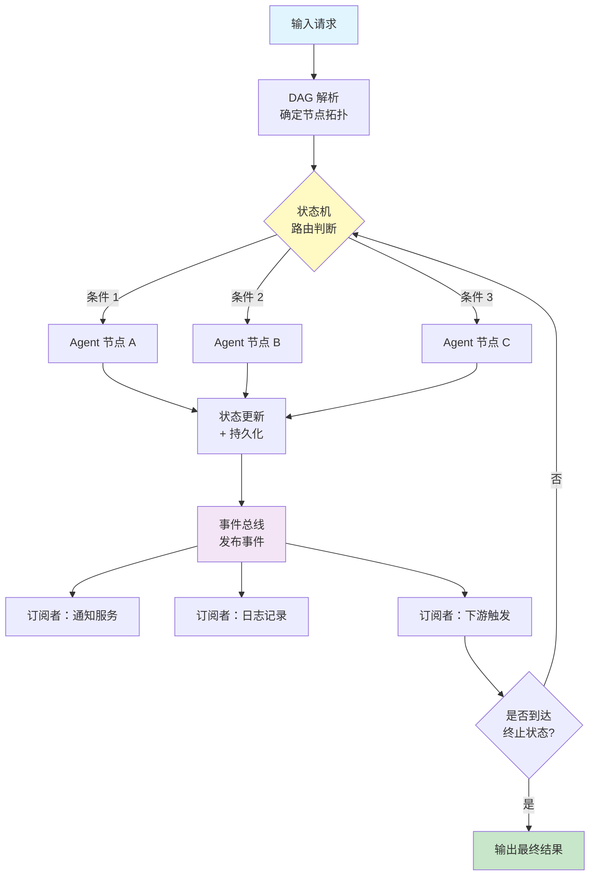

# 数据流编排模式（Data Flow Orchestration）

## 模式概述

数据流编排模式解决的核心问题是：**当多个 Agent 需要协同完成一项复杂任务时，数据该怎么流动、状态该怎么管理、出错了该怎么恢复**。

在 Agent 系统的早期实践中，常见的做法是把多个 Agent 简单串联——Agent A 的输出直接喂给 Agent B，Agent B 的输出再喂给 Agent C。这种"链式调用"对简单任务还能凑合，但遇到以下场景就会崩溃：Agent B 执行失败需要重试或回退；某个环节需要等待外部事件（比如人工审批）；多个 Agent 需要并行处理然后合并结果。数据流编排模式的思路是：借鉴数据工程领域成熟的 DAG（Directed Acyclic Graph，有向无环图）编排思想，把多 Agent 任务组织成一张有向图，每个节点是一个处理单元（Agent 或函数），边定义了数据的流向和依赖关系，再通过状态机（State Machine，管理系统在不同状态之间转换的机制）和事件驱动（Event-Driven，通过事件触发后续动作而非直接调用）来协调执行。

这是一种**企业级架构模式**，适合需要高可靠性、可审计性和故障恢复能力的生产系统。Apache Airflow、Dagster、Prefect 等数据编排工具在数据工程领域验证了这套思路的有效性，而 LangGraph、CrewAI 等框架则将其引入了 Agent 编排领域。

> 一句话概括：用有向图定义数据流向，用状态机管理执行进度，用事件驱动协调异步协同，让多 Agent 系统变得可控、可追踪、可恢复。

## 核心模块

数据流编排模式由三个支柱模块构成，三者协同工作：

| 模块 | 作用 | 与其他模块的关系 |
|------|------|------------------|
| DAG 执行图 | 定义任务节点和数据流向 | 为状态机提供"有哪些状态可以转换"的蓝图 |
| 状态机 | 追踪当前执行到哪一步、管理状态转换 | 根据 DAG 的拓扑结构决定下一步，通过事件总线通知外部 |
| 事件总线 | 解耦各模块之间的通信，支持异步协同 | 接收状态机发出的事件，分发给所有订阅者 |

### 模块 1：DAG 执行图

DAG（有向无环图）是整个编排的骨架。它回答的问题是："有哪些任务节点？它们之间的依赖关系是什么？数据从哪流到哪？"

在 DAG 中：
- **节点（Node）** 代表一个处理单元，可以是一个 Agent、一个函数、一次 API 调用
- **边（Edge）** 代表数据的流向和依赖关系——A 指向 B 意味着 B 必须等 A 完成后才能开始
- **"无环"约束** 意味着数据只能单向流动，不能形成死循环（需要循环时通过条件边实现受控的回退）

DAG 的价值在于把隐式的依赖关系变成了显式的图结构。Apache Airflow 最早将 DAG 概念引入数据管道编排，后来 Dagster 进一步提出了 Software-Defined Assets（软件定义资产）的声明式编排模式，让开发者聚焦于"要产出什么数据"而非"怎么执行任务"。

### 模块 2：状态机

状态机负责回答："系统当前在哪一步？下一步应该去哪？出错了怎么办？"

一个典型的工作流状态机包含：
- **状态集合**：所有可能的状态（如 `初始化`、`处理中`、`等待审批`、`已完成`、`已失败`）
- **转换规则**：从状态 A 到状态 B 需要满足什么条件
- **持久化**：每次状态变化都写入存储（数据库、日志），确保系统崩溃后能从最近的状态恢复

状态机的核心价值是让系统行为变得**可预测、可追溯**。在没有状态机的系统中，"系统现在在干什么"这个问题往往难以回答；有了状态机，答案永远是明确的。

### 模块 3：事件总线

事件总线（Event Bus）是模块之间的通信中枢，采用发布-订阅模式（Pub-Sub）工作：

- 状态机完成一次状态转换后，**发布**一个事件（如 `审核完成`）
- 所有订阅了该事件的处理器**自动触发**（如发送通知、更新数据库、启动下游任务）

事件总线的价值是**解耦**：新增一个处理逻辑不需要修改工作流引擎本身，只需注册一个新的事件订阅者。这让系统的扩展变得安全且低成本。

## 架构图



流程说明：

- **DAG 解析** 在系统启动时将工作流定义解析为节点拓扑结构
- **状态机路由** 根据当前状态和转换条件，决定下一步执行哪个 Agent 节点
- **Agent 节点** 执行具体的处理逻辑，产出结果
- **状态更新 + 持久化** 将执行结果和新状态写入存储，这是故障恢复的基础
- **事件总线** 将状态变化以事件的形式通知所有订阅者，实现解耦的异步协同
- **循环判断** 检查是否到达终止状态，未到达则回到状态机继续下一轮

## 工作流程

1. **步骤 1（工作流定义）：** 开发者用配置文件（YAML/JSON）或代码定义 DAG——声明有哪些节点、节点之间的依赖关系、每个节点对应什么 Agent 或处理函数、状态转换规则是什么。
2. **步骤 2（请求进入）：** 用户请求或外部事件触发工作流执行。系统创建一个执行上下文（Execution Context，携带请求参数、执行 ID、时间戳等元数据），状态设为初始状态。
3. **步骤 3（状态机路由）：** 状态机检查当前状态，遍历所有从该状态出发的转换规则，找到第一条满足条件的规则，确定下一个要执行的节点。
4. **步骤 4（节点执行）：** 被路由到的 Agent 节点执行处理逻辑——调用 LLM、查询数据库、请求外部 API 等，返回处理结果和状态码（成功/失败/需重试）。
5. **步骤 5（状态更新与持久化）：** 根据节点返回结果更新系统状态，并将新状态写入持久存储。这一步确保即使系统崩溃，也能从最近的检查点恢复。
6. **步骤 6（事件发布与异步协同）：** 状态转换触发事件发布到事件总线，订阅者各自执行副作用（发送通知、更新索引、触发下游流程等）。
7. **步骤 7（循环或终止）：** 检查当前状态是否为终止状态。如果是，返回最终结果；如果不是，回到步骤 3 继续执行。

终止条件：到达预定义的终止状态（如 `已完成`、`最终失败`），或超过最大迭代次数（防止死循环），或收到显式的中止信号。

### 执行示例

任务：一个内容审核工作流，用户提交文章后需要经过自动审核和人工审核两个环节。

**DAG 定义：**

```
节点：[自动审核 Agent, 人工审核 Agent, 发布处理, 拒绝处理]
状态：待审核 → 自动审核中 → 人工审核中 → 已发布 / 已拒绝
```

**第 1 轮（自动审核）：**
- 状态机当前状态：`待审核`，满足条件 `文章内容非空`，路由到自动审核 Agent
- 自动审核 Agent 调用 LLM 检查文章是否包含违禁词、内容是否过短，返回 `通过`
- 状态更新：`待审核` → `人工审核中`，结果持久化
- 事件发布：`自动审核完成` 事件 → 通知服务向人工审核者发送待审核提醒

**第 2 轮（人工审核）：**
- 状态机当前状态：`人工审核中`，系统暂停等待外部事件
- 10 分钟后人工审核者提交审核意见 `拒绝`
- 状态更新：`人工审核中` → `已拒绝`，结果持久化
- 事件发布：`文章被拒绝` 事件 → 通知服务向作者发送修改意见

两轮执行完成。整个过程中每一步的状态和数据都被持久化，如果系统在第 1 轮和第 2 轮之间崩溃，恢复后可以直接从 `人工审核中` 状态继续，不需要重新执行自动审核。

## 适用场景

### 适合的场景

1. **长流程、多环节的业务流程**：审批流程、订单处理、内容审核——涉及多个 Agent 串联和并联执行，需要清晰的状态追踪和严格的流程控制。
2. **需要故障恢复的关键业务**：金融交易处理、医疗数据分析——系统不能因为中途崩溃就丢失已完成的工作，状态持久化支持从检查点恢复。
3. **需要异步等待外部事件的场景**：人工审批、等待第三方 API 回调、等待文件上传完成——事件驱动架构天然支持"暂停-等待-恢复"。
4. **需要审计追溯的合规场景**：监管要求能证明"系统按照什么规则、经过什么步骤做出了这个决策"——状态机的显式设计提供了完整的执行日志。

### 不适合的场景

1. **简单的单步任务**：调用一个 API、执行一次搜索——直接函数调用就够了，引入 DAG 和状态机属于过度设计。
2. **实时性要求极高的系统**：游戏 AI、工业控制——状态持久化和事件分发引入额外延迟，毫秒级响应场景不适用。
3. **无共享状态的独立任务集**：多个互不关联的爬虫并行运行——没有数据依赖，不需要编排。

## 典型实现

以下伪代码展示数据流编排模式的三个核心组件如何协同工作：

```python
# 数据流编排模式 — 核心结构伪代码

from enum import Enum
from dataclasses import dataclass, field

# ---- 模块 1：状态定义 ----
class State(Enum):
    INIT = "初始化"
    AUTO_REVIEW = "自动审核中"
    MANUAL_REVIEW = "人工审核中"
    PUBLISHED = "已发布"
    REJECTED = "已拒绝"

# ---- 模块 2：执行上下文（贯穿整个工作流的数据容器） ----
@dataclass
class Context:
    execution_id: str
    current_state: State = State.INIT
    data: dict = field(default_factory=dict)       # 业务数据
    history: list = field(default_factory=list)     # 执行历史（用于审计和恢复）

# ---- 模块 3：事件总线 ----
class EventBus:
    def __init__(self):
        self._subscribers = {}  # {事件名: [处理函数列表]}

    def subscribe(self, event_name, handler):
        self._subscribers.setdefault(event_name, []).append(handler)

    def publish(self, event_name, context):
        for handler in self._subscribers.get(event_name, []):
            handler(context)

# ---- 模块 4：工作流引擎（状态机 + DAG 驱动） ----
class WorkflowEngine:
    def __init__(self, transitions, agents, event_bus):
        self.transitions = transitions  # 状态转换规则列表
        self.agents = agents            # {agent名: agent实例}
        self.event_bus = event_bus

    def run(self, context, max_steps=10):
        for step in range(max_steps):
            if context.current_state in (State.PUBLISHED, State.REJECTED):
                break  # 到达终止状态

            # 查找满足条件的转换规则
            for t in self.transitions:
                if t["from"] == context.current_state and t["condition"](context):
                    # 执行 Agent（如果有）
                    if t.get("agent"):
                        result = self.agents[t["agent"]].execute(context)
                        context.data.update(result)

                    # 状态转换 + 持久化（实际项目中写入数据库）
                    context.current_state = t["to"]
                    context.history.append(f"{t['from'].value} → {t['to'].value}")

                    # 发布事件
                    if t.get("event"):
                        self.event_bus.publish(t["event"], context)
                    break

        return context
```

这段伪代码对应三个核心模块：`EventBus` 实现发布-订阅通信，`WorkflowEngine` 内部的转换规则列表构成 DAG 的逻辑表达，`run` 方法中的循环实现状态机的逐步推进。`Context` 中的 `history` 列表记录了完整的状态转换轨迹，用于审计和故障恢复。

实际项目中如果使用 LangGraph，上述结构可以用更简洁的方式表达：

```python
# 基于 LangGraph 的数据流编排（示意）
# 依赖：langgraph, langchain-openai

from langgraph.graph import StateGraph, START, END
from typing import TypedDict, Annotated
import operator

class ReviewState(TypedDict):
    article: str
    auto_result: dict
    manual_result: dict
    history: Annotated[list, operator.add]

def auto_review(state: ReviewState):
    # 调用 LLM 进行自动审核
    return {"auto_result": {"status": "passed"}, "history": ["自动审核完成"]}

def manual_review(state: ReviewState):
    # 模拟人工审核
    return {"manual_result": {"decision": "approved"}, "history": ["人工审核完成"]}

def route(state: ReviewState):
    if state["auto_result"].get("status") == "passed":
        return "manual_review"
    return "reject"

# 构建 DAG
graph = StateGraph(ReviewState)
graph.add_node("auto_review", auto_review)
graph.add_node("manual_review", manual_review)
graph.add_edge(START, "auto_review")
graph.add_conditional_edges("auto_review", route)
graph.add_edge("manual_review", END)

workflow = graph.compile()
```

LangGraph 将 DAG 定义（`add_node`、`add_edge`）、状态管理（`StateGraph` + `TypedDict`）和条件路由（`add_conditional_edges`）统一在一套 API 中，开发者不需要手动实现状态机和事件总线。

## 优劣势分析

| 优势 | 劣势 |
|------|------|
| 显式设计：每个状态和转换都有明确定义，系统行为可预测 | 前期设计成本高：需要提前梳理所有状态和转换规则 |
| 可观测性强：完整的执行历史和状态日志，便于审计和问题定位 | 学习曲线陡：团队需要理解 DAG、状态机、事件驱动等概念 |
| 故障可恢复：持久化的状态支持从任意检查点恢复执行 | 状态爆炸风险：复杂业务的异常分支可能导致状态数量剧增 |
| 解耦性好：通过事件总线扩展新功能不影响已有逻辑 | 有性能开销：状态持久化和事件分发引入额外延迟 |
| 支持复杂控制流：天然处理并发、条件分支、等待外部事件 | 简单任务不划算：对"调用一个 API"这类任务属于杀鸡用牛刀 |

边界说明：这个模式的优势在业务流程复杂、需要高可靠性时最明显；当任务简单直接时，引入的复杂度反而成为负担。判断标准是——如果你的系统需要回答"当前执行到哪一步""中途崩溃了怎么恢复"这类问题，就值得考虑这个模式。

## 与相关模式的对比

| 对比维度 | 数据流编排模式 | Master-Worker 模式 | Handoff 模式 |
|---------|--------------|-------------------|-------------|
| 核心思想 | DAG + 状态机 + 事件驱动 | 中央协调器分配任务给工人 | Agent 之间直接交接控制权 |
| 数据流 | 显式定义，沿 DAG 边流动 | 由 Master 集中分发 | 随控制权一起移交 |
| 故障恢复 | 强（状态持久化，检查点恢复） | 弱（Master 故障则全局失败） | 弱（依赖交接协议） |
| 适用复杂度 | 高（复杂业务流程、长流程） | 中（任务可独立拆分的场景） | 低到中（两个 Agent 之间的权力移交） |
| 典型场景 | 订单处理、审批流程、ETL 管道 | 并行数据处理、批量任务分发 | 客服转接、诊断移交 |

选择建议：如果任务可以拆成独立子任务并行处理，Master-Worker 足够；如果涉及两个 Agent 之间的灵活权力移交，Handoff 更合适；如果流程有复杂的分支、循环、异步等待和故障恢复需求，选数据流编排模式。

## 常见误区

| 常见误区 | 正确理解 |
|----------|----------|
| 所有多 Agent 系统都需要 DAG 编排 | DAG 编排适合有明确依赖关系和流程控制需求的场景。两个 Agent 简单串联用函数调用就够了 |
| 事件驱动一定能提高性能 | 事件驱动的核心价值是解耦和灵活扩展，不是性能优化。同步事件处理反而可能比直接调用更慢 |
| 有了工作流引擎就能自动处理所有故障 | 工作流引擎提供的是恢复机制（从检查点重跑），不是自动修复。状态图本身设计错误，引擎也无能为力 |
| 状态定义越细越好 | 状态越多维护成本越高。应该用最少的必要状态表达业务逻辑，复杂分支可以通过条件边而非新增状态来处理 |

## 思考题

<details>
<summary>初级：数据流编排模式中，"DAG"的"无环"约束解决了什么问题？</summary>

**参考答案：**

"无环"约束防止数据流形成死循环。如果 Agent A 依赖 Agent B 的输出，而 Agent B 又依赖 Agent A 的输出，系统就会陷入无限等待。DAG 的无环约束在设计阶段就排除了这种可能。需要"重试"或"回退"时，通过条件边（Conditional Edge）实现受控的状态回跳，而非在 DAG 中形成真正的环。

</details>

<details>
<summary>中级：状态持久化为什么是故障恢复的关键？如果不做持久化会怎样？</summary>

**参考答案：**

状态持久化将每次状态转换的结果写入持久存储（数据库、文件系统等）。如果系统在第 5 步崩溃，恢复后可以从存储中读取到"已完成到第 4 步"的记录，直接从第 5 步重新开始，不需要从头执行。如果不做持久化，所有状态只存在于内存中，系统崩溃后所有中间结果全部丢失，只能从头开始，对于长流程任务（如月度财务结算）来说代价极大。

</details>

<details>
<summary>中级：什么情况下应该选择数据流编排模式而非简单的链式调用？</summary>

**参考答案：**

当任务满足以下任一条件时，应考虑数据流编排模式：(1) 流程中存在条件分支（不同情况走不同路径）；(2) 某些环节需要等待外部事件（人工审批、API 回调）；(3) 系统需要故障恢复能力（不能因崩溃而丢失已完成的工作）；(4) 需要完整的执行日志用于审计。如果只是 A → B → C 的固定流程且不需要恢复能力，链式调用更简单直接。

</details>

## 参考资料

1. Apache Airflow 官方文档 - DAGs 核心概念: https://airflow.apache.org/docs/apache-airflow/stable/core-concepts/dags.html
2. Dagster 数据管道架构设计模式指南: https://dagster.io/guides/data-pipeline-architecture-5-design-patterns-with-examples
3. LangGraph 官方文档 - 图概念与底层原理: https://langchain-ai.github.io/langgraph/concepts/low_level_why/
4. Prefect 工作流编排框架: https://www.prefect.io/
5. "Beyond DAGs: The Rise of Agentic Data Pipelines": https://medium.com/@nraman.n6/beyond-dags-the-rise-of-agentic-data-pipelines-c981b31dd150
