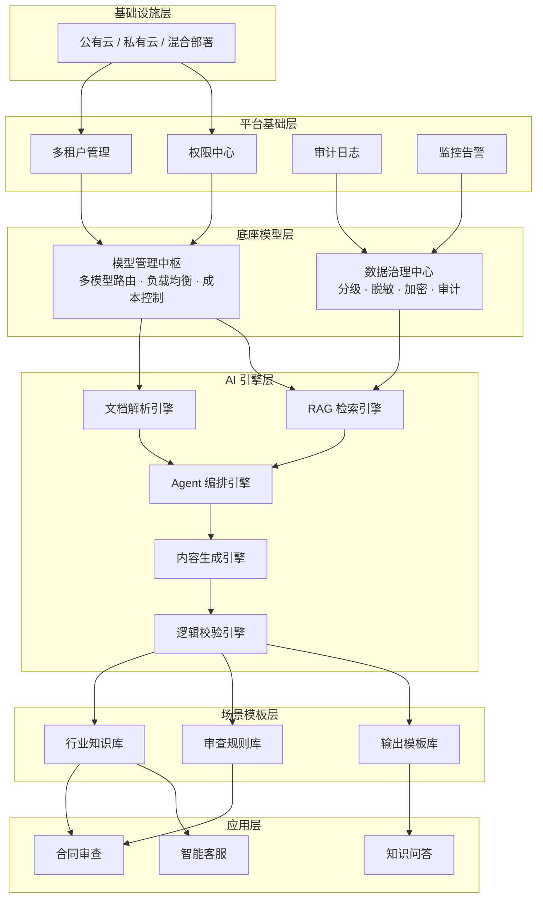

# 知识密集型架构（Knowledge-Intensive Architecture）

## 模式概述

知识密集型架构是一种面向企业级 AI 应用的分层平台设计模式。它要解决的核心问题是：当企业拥有海量的专有知识（合同、法规、内部文档、行业案例等），如何让 LLM（大语言模型）安全、准确、可控地利用这些知识来服务多个业务场景。

直接把一个 LLM 扔给业务部门用，通常会遇到三个问题。第一，LLM 不了解企业内部知识，容易产生 Hallucination（幻觉，即编造不存在的信息）。第二，各部门各搞一套 AI 系统，重复建设、难以维护。第三，敏感数据缺乏统一管控，难以满足合规要求。知识密集型架构通过将整个平台拆分为多个层级——从基础设施到数据治理、再到 AI 引擎和业务应用——让每一层各司其职、互不干扰，同时又能灵活组合。

> 一句话概括：通过分层解耦，把企业的数据治理、模型管理、AI 引擎和业务逻辑分别放在不同层级，让多个业务应用能共享同一个安全可控的知识平台。

## 核心模块

知识密集型架构采用结构型组织，按六个层级从下往上依次叠加。每一层对上层提供服务，对下层隐藏实现细节。

| 层级 | 作用 | 与其他层的关系 |
|------|------|----------------|
| 基础设施层 | 提供计算和存储资源 | 所有上层运行在此之上 |
| 平台基础层 | 提供多租户（Multi-tenant）隔离、权限、审计等企业级能力 | 为上层提供安全基座 |
| 底座模型层 | 集中管理多个 LLM 和数据安全策略 | 向上屏蔽模型差异，向下依赖基础设施 |
| AI 引擎层 | 拆分为多个独立引擎（文档解析、RAG 检索、Agent 编排等） | 由底座模型层驱动，供业务层组合调用 |
| 场景模板层 | 沉淀可复用的行业知识库、审查规则、输出模板 | 连接引擎层和应用层，标准化业务逻辑 |
| 应用层 | 面向终端用户的具体业务（合同审查、知识问答等） | 通过组合模板和引擎来实现业务功能 |

### 层级 1：基础设施层 + 平台基础层

基础设施层负责底层的云计算环境（公有云、私有云或混合部署），提供算力和存储。平台基础层在其之上搭建企业级 PaaS（Platform as a Service，平台即服务）能力，包括：

- **Multi-tenant（多租户）管理**：不同部门或客户的数据和权限完全隔离
- **AuthN / AuthZ**（认证/授权）：统一身份验证和访问控制
- **审计日志**：记录所有操作，满足合规要求
- **监控告警**、**配置中心**、**消息队列**等基础服务

这两层是整个平台的地基。它们的核心价值是让上层开发者不需要重复造轮子——安全、监控、权限等问题在这里统一解决。

### 层级 2：底座模型层

这一层解决两个关键问题：模型怎么管、数据怎么治。

**模型管理中枢**负责：
- 多模型路由（Model Routing）：根据任务复杂度把请求分配给不同的模型，简单任务用便宜的小模型，复杂任务用昂贵的大模型
- 负载均衡和降级：当某个模型 API 故障时自动切换到备用模型
- 成本控制：按租户、部门统计 Token 消耗，设置预算上限

**数据治理中心**负责：
- 数据分级：自动判断数据是公开、内部、机密还是受限
- 脱敏（Desensitization）：用规则替换敏感信息（如手机号变成 `138****5678`）
- 加密与审计：敏感数据加密存储，所有操作留痕

### 层级 3：AI 引擎层

这是整个平台的核心能力中心，由多个独立引擎组成，不同业务可以按需组合：

- **文档解析引擎**：把 PDF、Word、扫描件等转为结构化数据
- **RAG 检索引擎**：从向量数据库、知识图谱（Knowledge Graph）等多源检索相关知识
- **Agent 编排引擎**：用 ReAct 等模式驱动多步推理和工具调用
- **内容生成引擎**：基于检索结果和模板生成最终输出
- **逻辑校验引擎**：检查生成内容的格式、逻辑一致性和事实准确性

引擎之间松耦合：合同审查需要"文档解析 + RAG + 校验"，知识问答只需要"RAG + 生成"，各取所需。

### 层级 4：场景模板层 + 应用层

场景模板层沉淀可复用的业务资产：行业知识库、审查规则库、输出模板库、工作流编排定义。应用层则是面向终端用户的入口，每个应用通过组合下层的模板和引擎来解决具体业务问题（合同审查、标书编写、智能客服等）。

## 架构图



层级说明：

- **基础设施层**提供底层算力，平台基础层在其上搭建多租户隔离和安全审计能力
- **底座模型层**的模型管理中枢和数据治理中心分别处理"模型怎么调"和"数据怎么管"两个核心问题
- **AI 引擎层**把 AI 能力拆成独立模块，不同业务按需组合
- **场景模板层**沉淀可复用的业务资产，应用层通过组合模板和引擎解决具体业务

## 工作流程

以"企业合同审查"为例，说明请求从进入到输出的完整链路：

1. **步骤 1（请求进入与身份校验）：** 用户登录系统，平台基础层进行身份认证和权限检查，确认用户有权访问"合同审查"功能，操作记入审计日志。
2. **步骤 2（数据上传与安全处理）：** 用户上传合同 PDF，数据进入数据治理中心。系统自动判断数据级别（如"内部机密"），对敏感信息（金额、手机号等）进行脱敏，加密后存储。
3. **步骤 3（文档解析）：** 文档解析引擎识别 PDF 结构——段落、表格、签名区等——转为结构化数据，同时生成向量表示（Embedding）用于后续检索。
4. **步骤 4（多源知识检索）：** RAG 检索引擎从多个数据源查询相关知识：企业内部知识库（向量数据库）、法规数据库、历史审查案例。采用 Hybrid Search（混合检索）——同时使用关键词匹配和语义检索——并用 Reranker（重排模型）对结果排序。
5. **步骤 5（Agent 推理循环）：** Agent 编排引擎进入 ReAct 循环。第 1 轮：检索合同必检项规则，发现缺少提前终止条款。第 2 轮：对比标准模板，找到 5 处偏差。第 3 轮：信息足够，触发"完成"信号。
6. **步骤 6（生成与校验）：** 内容生成引擎按审查报告模板输出结果，逻辑校验引擎检查格式和逻辑一致性。校验通过后进入下一步。
7. **步骤 7（结果输出与审计）：** 对输出再次做脱敏处理，写入完整审计日志（谁、什么时间、用了哪些数据、产生了什么结论），将加密后的报告返回给用户。

终止条件：Agent 主动发出"完成"信号、达到最大推理轮次、或遇到不可恢复的系统错误。

### 执行示例

任务背景：金融企业法务部员工 Alice 需要审查一份供应商融资合同。

| 步骤 | 涉及层级 | 执行内容 |
|------|----------|----------|
| 身份校验 | 平台基础层 | 验证 Alice 身份，确认"融资合同审查"权限 |
| 数据安全 | 底座模型层 | 合同判定为"内部机密"，金额脱敏为 `[金额]`，加密存储 |
| 文档解析 | AI 引擎层 | 识别出 8 页内容、13 条条款、2 个表格 |
| 知识检索 | AI 引擎层 | 检索到"融资合同标准模板"（相关度 0.92）、"最新合规要求"（0.88） |
| Agent 推理 | AI 引擎层 | 3 轮 ReAct 循环，识别出缺少提前终止条款、违约责任界定不清等 5 处问题 |
| 报告生成 | 场景模板层 | 按"合同审查报告"模板输出 5 条修改建议，校验通过 |
| 结果返回 | 平台基础层 | 加密报告返回 Alice，审计日志记录全过程 |

## 适用场景

### 适合的场景

1. **大型企业知识管理平台**：企业有数万份文档（合同、政策、案例），需要统一管理并智能化检索。分层架构让 RAG、文档解析、权限控制各层独立运转，互不干扰。
2. **金融、法律、医疗等合规要求高的行业**：数据治理中心提供原生的分级脱敏和审计链条，不需要每个业务系统重复建设合规能力。
3. **多部门共享 AI 平台**：市场部做知识问答、法务部做合同审查、客服部做智能客服——共享底层引擎和模型管理，通过多租户隔离保证数据安全。
4. **需要同时支撑多个 Agent 应用的企业**：多个应用共享引擎层和模板层，避免重复造轮子。

### 不适合的场景

1. **快速原型验证**：只想用 LLM + RAG 做一个 Demo，六层架构过度工程。直接用 LangChain 或 LlamaIndex 几行代码就能跑通。
2. **数据量极小的场景**：知识库只有几十个文档，全文搜索就够了，不需要向量数据库、多源检索和重排。
3. **团队资源有限**：搭建完整平台需要后端基础设施、数据安全、LLM 工程等多领域专业知识。5 人以下小团队建议从简单架构起步，后续再逐步演进。

## 典型实现

以下伪代码展示底座模型层的数据治理核心逻辑——自动分级、脱敏和加密的处理流水线：

```python
# 数据治理核心流程（伪代码）
# 展示分级 → 脱敏 → 加密三步处理

import re
from enum import Enum

class DataLevel(Enum):
    PUBLIC = "public"           # 公开数据
    INTERNAL = "internal"       # 内部数据
    CONFIDENTIAL = "confidential"  # 机密数据

def classify(content: str) -> DataLevel:
    """根据内容特征自动判断数据级别"""
    sensitive_keywords = ["薪资", "身份证", "银行卡", "法律诉讼"]
    if any(kw in content for kw in sensitive_keywords):
        return DataLevel.CONFIDENTIAL
    if re.search(r"\d{11}|\d{18}", content):  # 手机号或身份证号
        return DataLevel.CONFIDENTIAL
    return DataLevel.INTERNAL

def desensitize(content: str) -> str:
    """脱敏：替换敏感信息为占位符"""
    content = re.sub(r"\d{11}", lambda m: m.group()[:3] + "****" + m.group()[-4:], content)
    content = re.sub(r"[¥￥]\d+[\.\d]*", "[金额]", content)
    return content

def process_data(content: str) -> dict:
    """完整处理链：分级 → 脱敏 → 加密"""
    level = classify(content)
    safe_content = desensitize(content) if level != DataLevel.PUBLIC else content
    encrypted = encrypt(safe_content) if level == DataLevel.CONFIDENTIAL else safe_content
    return {"level": level.value, "content": encrypted}
```

这段代码只展示了数据治理中心的核心逻辑，实际系统中还需要对接密钥管理服务（KMS）、审计日志写入、策略配置中心等。`classify` 函数对应分级、`desensitize` 对应脱敏、`encrypt`（此处省略实现）对应加密，三者串联形成完整的数据处理流水线。

## 优劣势分析

| 优势 | 劣势 |
|------|------|
| 数据治理集中在一层，所有上层应用自动获得安全保护 | 六层架构复杂度高，初期工程投入大 |
| 分层解耦，单层升级不影响其他层（如换模型只改底座模型层） | 初期 6-12 个月主要是基础设施建设，短期难见商业价值 |
| 多租户隔离，多部门共享平台、分摊成本 | 层间接口和数据流向复杂，调试排查困难 |
| AI 引擎细粒度拆分，业务可灵活组合 | 对团队的多领域专业能力要求高 |
| 模型管理中枢支持动态路由和降级，有效控制成本 | 关键层（如数据治理中心）宕机会影响整个平台 |

边界说明：这些优势在知识密集型大企业场景下最为明显。如果业务简单、数据量小、团队规模小，分层架构的复杂度反而成为负担。

## 与相关模式的对比

| 对比维度 | 知识密集型架构 | 简单 RAG + LLM | GraphRAG |
|---------|--------------|----------------|----------|
| 核心思想 | 分层企业平台，统一数据治理 + 模型管理 + 引擎组合 | 文档向量化 + 语义检索 + 生成 | 用知识图谱增强 RAG，捕捉实体关系 |
| 复杂度 | 高（六层，多模块协作） | 低（2-3 个组件） | 中等（需构建和维护知识图谱） |
| 数据治理 | 原生支持（分级、脱敏、审计） | 无 | 无（需自行补充） |
| 多租户支持 | 内置 | 无 | 无 |
| 适用场景 | 知识密集型大企业（金融、法律、咨询） | 快速原型、中小企业 | 需要多跳推理和实体关系分析的场景 |
| 团队要求 | 需要多领域高级工程师 | 初级开发者即可 | 需要图数据库和知识图谱经验 |

选型建议：快速验证从"简单 RAG + LLM"起步；需要理解实体间复杂关系时引入 GraphRAG；当企业有严格合规要求、多部门共享需求和大量知识资产时，再演进到知识密集型架构。

## 常见误区

| 常见误区 | 正确理解 |
|----------|----------|
| 六层架构可以一步到位部署，很快产生价值 | 这是长期投资。初期主要是基础设施建设，但一旦到位，后续新增业务场景的边际成本很低 |
| 层数越多越好，应该继续拆成 8 层或 10 层 | 六层是经验平衡点。层数过多会导致接口复杂度指数增长，反而降低开发效率 |
| 数据治理就是加密 | 数据治理包括分级、脱敏、合规审计、访问控制等多个环节，加密只是其中一步 |
| AI 引擎层的所有引擎都必须自研 | 可以充分利用开源方案（LlamaIndex 的文档解析、Milvus 的向量检索、RAGFlow 的端到端 RAG 管线），关键是把接口集成好 |

## 思考题

<details>
<summary>初级：为什么知识密集型架构要把数据治理放在底座模型层，而不是让每个应用自己处理？</summary>

**参考答案：**

集中到底座模型层有两个好处。第一，任何上层应用都自动获得数据保护，不会出现"某个新应用忘记做脱敏"的安全漏洞。第二，当合规策略变化时（比如新的加密标准），只需要改一个地方，不用逐个更新每个应用。分散处理则意味着多套规则、多套实现、多套潜在漏洞。

</details>

<details>
<summary>中级：AI 引擎层为什么要把能力拆成多个独立引擎，而不是做成一个大的"AI 服务"？</summary>

**参考答案：**

拆分引擎的核心好处是灵活组合。不同业务需要的 AI 能力组合不同：合同审查需要"文档解析 + RAG + 逻辑校验"，知识问答只需要"RAG + 内容生成"，图表分析需要"多模态引擎 + 数值计算"。如果做成一个大服务，每个业务都必须加载所有能力，浪费资源；而且某个引擎需要升级时，可能影响不相关的业务。细粒度拆分让每个引擎可以独立开发、独立部署、独立扩缩容。

</details>

<details>
<summary>中级：一个 50 人的创业公司想做企业知识问答产品，应该直接上知识密集型架构吗？</summary>

**参考答案：**

不建议直接上。50 人团队的工程资源有限，六层架构的初期建设周期长（6-12 个月），且需要后端基础设施、数据安全、LLM 工程等多领域人才。建议从简单 RAG + LLM 架构起步，用 LlamaIndex 或 LangChain 快速验证产品价值；当用户增长到需要多租户隔离、合规审计、多模型管理时，再逐步向分层架构演进。架构选择应匹配团队规模和业务阶段。

</details>

## 参考资料

1. Lewis, P. et al. "Retrieval-Augmented Generation for Knowledge-Intensive NLP Tasks." NeurIPS 2020. https://arxiv.org/abs/2005.11401 — RAG 的奠基论文，首次提出用检索增强生成来解决知识密集型任务
2. Microsoft Research. "GraphRAG: Unlocking LLM discovery on narrative private datasets." 2024. https://github.com/microsoft/graphrag — 微软开源的 GraphRAG 实现，用知识图谱增强 RAG
3. RAGFlow - Open-source RAG Engine. https://github.com/infiniflow/ragflow — 开源的端到端 RAG 引擎，支持文档解析和多源检索
4. Microsoft Learn. "AI Architecture - Azure Architecture Center." https://learn.microsoft.com/en-us/azure/architecture/ai-ml/ — 微软企业级 AI 架构参考
5. Haystack - End-to-End AI Orchestration Framework. https://github.com/deepset-ai/haystack — 支持 RAG 管线编排的开源框架
6. LangGraph - Build Stateful Multi-Actor Applications. https://langchain-ai.github.io/langgraph/ — LangChain 生态的状态管理和 Agent 编排框架
