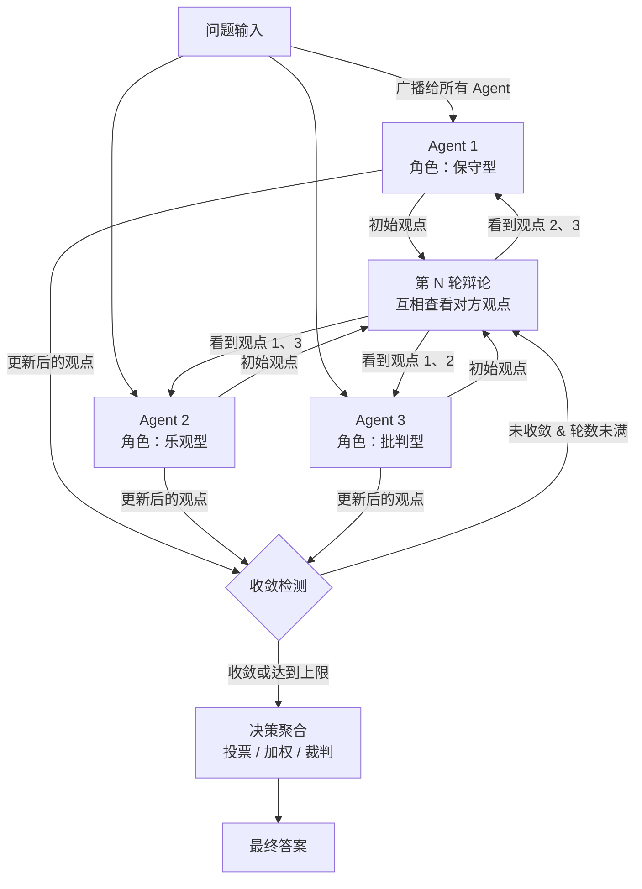

# 辩论/竞争模式（Debate & Competition）

## 模式概述

辩论/竞争模式是一种多 Agent 协作范式：多个 Agent 同时接收同一个问题，各自独立作答，然后互相看到对方的观点并展开质证。经过若干轮"提出→质疑→修正"的迭代后，通过投票或裁判机制产出最终答案。

> 一句话概括：让多个 Agent 像辩论赛一样对同一问题互相质证，用集体博弈代替单点判断，降低幻觉和推理错误。

这个思路最早由 Du 等人在 2023 年的论文 *Improving Factuality and Reasoning in Language Models through Multiagent Debate*（发表于 ICML 2024）中系统提出。核心发现是：让多个 LLM 实例各自提出答案并经过多轮辩论，在数学推理和事实验证任务上的准确率显著优于单模型。此后衍生出多个变体：MAD（Multi-Agent Debate，由 Liang 等人提出，强调发散思维）、ChatEval（用辩论做文本评估）、Free-MAD（无共识辩论，减少从众效应）等。

在 Agent 设计模式体系中，辩论模式属于**多 Agent 协作模式**的分支，与 Master-Worker（层级制分工）和 Handoff（顺序传递）并列。它的独特价值在于**对抗性验证**——Agent 之间不是分工合作，而是互相挑战，用竞争来提高输出质量。

## 核心模块

辩论模式由四个核心模块协作运行：

| 模块 | 作用 | 与其他模块的关系 |
|------|------|------------------|
| 角色初始化器 | 为每个 Agent 分配不同的角色背景和系统提示词 | 决定辩论的多样性基础，输出给观点生成器 |
| 观点生成器 | 每个 Agent 独立生成或更新自己的观点 | 接收角色定义和上一轮观点，输出到收敛检测器 |
| 收敛检测器 | 判断观点是否趋于一致或达到轮数上限 | 决定是继续辩论还是进入决策聚合 |
| 决策聚合器 | 汇总所有 Agent 的最终观点，产出最终答案 | 接收收敛检测器的终止信号和所有观点 |

### 模块 1：角色初始化器

角色初始化器负责为每个 Agent 赋予不同的"思维方式"。辩论模式的有效性高度依赖 Agent 之间的差异性——如果所有 Agent 用相同的提示词，它们大概率会给出类似的错误答案，辩论就失去意义。

常见的角色分配策略：

- **视角差异**：保守型 / 乐观型 / 批判型
- **专业差异**：不同领域的专家（如经济学家 / 工程师 / 法律顾问）
- **思维差异**：逻辑推理型 / 直觉判断型 / 证据核查型

### 模块 2：观点生成器

观点生成器是辩论的主体。在第一轮中，每个 Agent 独立回答问题；在后续轮次中，每个 Agent 会看到其他 Agent 的观点，然后决定是坚持自己的答案、修改答案，还是提出反驳。

关键设计点：每个 Agent 需要同时看到**其他所有 Agent 的观点**，而不是只看到部分信息。这样才能形成完整的信息对称博弈。

### 模块 3：收敛检测器

收敛检测器（Convergence Detector）判断辩论是否应该结束。常用的终止条件：

- **共识达成**：所有 Agent 的答案趋于一致
- **轮数上限**：通常设为 3-5 轮，超过后强制结束
- **论证停滞**：连续两轮没有 Agent 改变观点

### 模块 4：决策聚合器

决策聚合器（Decision Aggregator）负责从多个最终观点中产出一个答案。常见的聚合策略：

- **多数投票**（Majority Voting）：最多 Agent 支持的答案胜出，简单但容易被集体错误误导
- **加权投票**（Weighted Voting）：根据 Agent 在辩论中的表现动态调整权重
- **裁判制**（Judge）：由一个独立的裁判 Agent 或规则评估所有观点，选出最合理的答案

## 架构图



流程说明：

- 问题同时发送给所有 Agent，每个 Agent 独立生成初始观点
- 每轮辩论中，Agent 查看其他 Agent 的观点后更新自己的答案
- 收敛检测器决定继续辩论还是终止
- 终止后由决策聚合器产出最终答案

## 工作流程

1. **步骤 1（角色分配）：** 为每个 Agent 设置不同的系统提示词，赋予差异化的角色。同时将待讨论的问题广播给所有 Agent。
2. **步骤 2（初始作答）：** 每个 Agent 独立思考问题，生成第一轮观点。此时 Agent 之间互不可见。
3. **步骤 3（质证辩论）：** 向每个 Agent 展示其他 Agent 的观点，Agent 需要评估对方的论点，决定是接受、修改还是反驳。每个 Agent 输出更新后的观点。
4. **步骤 4（收敛检测）：** 检查所有 Agent 的答案是否趋于一致，或是否达到最大轮数。如果未满足终止条件，回到步骤 3 继续下一轮辩论。
5. **步骤 5（决策聚合）：** 辩论结束后，通过投票、加权或裁判机制产出最终答案，附带主要论据来源。

循环终止条件：答案收敛（所有 Agent 一致）、达到轮数上限（通常 3-5 轮）、或论证停滞（连续两轮无变化）。

### 执行示例

**问题**："Python 和 Go 哪个更适合构建高并发微服务？"

**第 1 轮（独立作答）：**

- **Agent A（保守型工程师）**："Go 更适合。原生 goroutine 支持高并发，编译成二进制文件部署简单，内存占用低。"
- **Agent B（创新型架构师）**："Python 配合 FastAPI + asyncio 也能处理高并发，而且开发效率更高、生态更丰富。"
- **Agent C（批判型审计师）**："两个回答都忽略了关键上下文：团队技术栈是什么？当前的并发量级是多少？没有这些信息，任何推荐都不完整。"

**第 2 轮（质证辩论）：**

- **Agent A**（回应 C）："同意需要看具体场景。但如果只看高并发本身，Go 的并发性能确实优于 Python。我补充一点：Go 在 10 万级并发连接时的内存占用大约是 Python 的 1/5。"
- **Agent B**（修正观点）："Agent A 的性能数据有说服力。我调整观点：如果并发量级在万级以上，Go 是更好的选择；如果并发量级在千级以下且开发速度优先，Python + FastAPI 是更务实的选择。"
- **Agent C**（总结）："现在两个观点已经不再对立：高并发选 Go，中低并发且重开发效率选 Python。分界线大约在万级并发。"

**第 3 轮（共识达成）：** 三个 Agent 都接受了"按并发量级选择"的结论，辩论终止。

**最终答案**："万级以上并发选 Go（性能优势明显），千级以下并发且重视开发效率选 Python + FastAPI。关键决策因素是实际并发量级和团队技术栈。"

## 适用场景

### 适合的场景

1. **需要多角度分析的决策任务**：市场分析、产品方案评估、投资决策——不同视角的 Agent 各有侧重，讨论能覆盖更全面的考量。
2. **事实验证与知识问答**：新闻核查、医学诊断辅助、法律风险评估——多个 Agent 独立判断后交叉验证，降低单模型的幻觉风险。
3. **复杂推理任务**：数学问题求解、代码 Bug 定位、论文审稿——研究表明多 Agent 辩论在数学推理上的准确率比单 Agent 高 15-20%。
4. **高风险场景**：合规审查、安全评估——批判型 Agent 能主动挑战乐观假设，发现潜在风险。

### 不适合的场景

1. **需要快速响应的场景**：客服对话、实时翻译——多轮辩论增加 10-30 秒延迟，无法满足实时性要求。
2. **答案明确无歧义的场景**："1+1 等于几""北京是哪个国家的首都"——没有讨论空间，辩论只是浪费资源。
3. **成本敏感的场景**：辩论模式的 LLM 调用量约为单 Agent 的 3-5 倍（Agent 数 x 轮数），大规模部署时成本显著。
4. **Agent 差异不足的场景**：如果所有 Agent 使用完全相同的提示词，辩论退化为"多个副本重复同一个错误"，甚至因从众效应加剧错误。ICLR 2025 的研究指出，同质化 Agent 群体中的辩论可能导致准确率下降。

## 典型实现

以下伪代码展示辩论模式的核心机制：

```python
# 辩论模式核心循环伪代码

def debate(question, agent_configs, max_rounds=3):
    """多 Agent 辩论主循环"""
    # 步骤 1：初始化 Agent，每个 Agent 有不同的系统提示词
    agents = [
        {"name": cfg["name"], "prompt": cfg["system_prompt"], "opinion": ""}
        for cfg in agent_configs
    ]

    # 步骤 2：第一轮——各自独立作答
    for agent in agents:
        agent["opinion"] = llm.generate(
            system=agent["prompt"],
            user=f"请回答以下问题：\n{question}"
        )

    # 步骤 3-4：多轮质证辩论
    for round_num in range(2, max_rounds + 1):
        for agent in agents:
            # 收集其他 Agent 的观点
            others = "\n".join(
                f"- {a['name']}: {a['opinion']}"
                for a in agents if a["name"] != agent["name"]
            )
            # 让 Agent 看到他人观点后更新自己的答案
            agent["opinion"] = llm.generate(
                system=agent["prompt"],
                user=f"其他人的观点：\n{others}\n\n请评估并更新你的答案。"
            )

        # 收敛检测（简化实现：检查答案是否一致）
        if all_opinions_converged(agents):
            break

    # 步骤 5：决策聚合——多数投票或裁判
    return aggregate(agents)
```

代码中的核心结构：外层循环控制辩论轮次；内层循环让每个 Agent 看到其他人的观点后更新自己的答案；`all_opinions_converged` 做收敛检测；`aggregate` 做最终决策聚合。实际项目中，`llm.generate` 替换为具体的 LLM API 调用。

## 优劣势分析

| 优势 | 劣势 |
|------|------|
| 多视角交叉验证，显著降低幻觉和单点错误 | LLM 调用量是单 Agent 的 3-5 倍，成本高 |
| 辩论过程透明可追踪，用户能看到各方观点和推理 | 多轮辩论增加 10-30 秒延迟，不适合实时场景 |
| 批判性角色能主动发现乐观假设中的风险 | 同质化 Agent 可能因从众效应收敛到错误答案 |
| 研究表明在数学推理任务上准确率提升 15-20% | 角色设计和收敛条件需要精心调优，实现门槛高 |

边界说明：辩论模式的收益在"有歧义、需要权衡"的问题上最大。对于答案明确的问题，额外开销没有回报。另外，ICLR 2025 的一项研究（Zhang 等人）指出，当前的 MAD 方法在多个基准测试上并未稳定超过简单的单 Agent 策略，实际效果高度依赖任务类型和 Agent 配置。

## 与相关模式的对比

| 对比维度 | 辩论/竞争模式 | Master-Worker 模式 | Handoff 模式 |
|---------|-------------|-------------------|-------------|
| 协作方式 | 平等博弈，互相质证 | 层级分工，Master 调度 Worker 执行 | 顺序传递，前一个 Agent 做完交给下一个 |
| Agent 关系 | 对等竞争 | 上下级 | 链式接力 |
| 适用任务 | 需要多角度验证的判断题 | 可分解为子任务的结构化项目 | 流水线式的分阶段处理 |
| 成本 | 高（多轮 x 多 Agent） | 中等 | 低（每个 Agent 只调用一次） |
| 可靠性优势 | 对抗验证降低单点错误 | 监督机制保证执行质量 | 各环节专注自身任务 |

选择建议：需要高可靠性判断时选辩论模式；任务可拆分成子任务时选 Master-Worker；任务有清晰的阶段划分时选 Handoff。

## 常见误区

| 常见误区 | 正确理解 |
|----------|----------|
| "多个 Agent 讨论就一定比单 Agent 更准" | 效果取决于 Agent 之间的差异性。三个用相同提示词的 Agent 辩论，等于三个副本重复同一个错误，甚至可能因从众效应更差 |
| "辩论轮数越多越好" | 研究表明 3-5 轮是最优区间。超过后收益递减，而且 Agent 可能陷入"固执循环"——双方反复坚持各自观点不再改变 |
| "简单投票是最好的聚合方式" | 如果多个 Agent 基于同一个错误假设回答，投票会强化错误。加权投票或裁判制在实践中更可靠 |
| "辩论模式适合所有任务" | 对答案明确的事实性问题（如"水的化学式是什么"），辩论没有价值。它只在需要权衡、存在歧义的问题上有优势 |

## 思考题

<details>
<summary>初级：辩论模式和"让同一个 LLM 生成三次答案然后投票"有什么本质区别？</summary>

**参考答案：**

核心区别在于**信息交互**。"生成三次然后投票"是独立采样，三次生成之间没有互相影响；辩论模式中，Agent 在每一轮都能看到其他 Agent 的观点，并据此修正自己的答案。这种交互式的质证过程让错误观点有机会被挑战和纠正，而简单的多次采样无法做到这一点。

另一个区别是**角色差异**。辩论模式给每个 Agent 赋予不同的系统提示词（如保守型 / 批判型），确保思考的多样性；而同一个模型的多次采样，思路差异主要来自随机性（temperature），多样性远不如角色差异。

</details>

<details>
<summary>中级：辩论模式中，如果所有 Agent 在第一轮就给出了相同的错误答案，后续轮次能纠正吗？</summary>

**参考答案：**

大概率不能。如果所有 Agent 初始观点一致且错误，后续辩论缺少对立观点来触发纠错，Agent 只会互相确认和强化这个错误。

这正是辩论模式的核心局限之一，也是为什么**角色差异性**如此重要。解决方案包括：故意让部分 Agent 扮演"魔鬼代言人"（Devil's Advocate）角色，强制质疑主流观点；或者引入外部知识检索工具，让 Agent 基于外部事实而非纯推理来形成观点。

</details>

<details>
<summary>中级：在什么情况下，辩论模式反而会降低答案质量？</summary>

**参考答案：**

至少三种情况下辩论可能适得其反：

1. **强模型被弱模型拉低**：如果辩论中混合了能力差距大的模型，能力强的模型可能被说服力强但逻辑错误的弱模型带偏。2025 年的研究（*Talk Isn't Always Cheap*）专门验证了这一点。
2. **从众效应**（Conformity）：LLM 天生倾向于附和对方观点，尤其是当多数 Agent 持相同错误观点时，少数正确的 Agent 可能被"说服"放弃正确答案。
3. **问题过于简单**：对于答案明确的问题，辩论增加了不必要的"思考摇摆"，反而可能从正确答案偏移到错误答案。

</details>

## 参考资料

1. Du, Y., Li, S., Torralba, A., Tenenbaum, J. B., & Mordatch, I. (2024). "Improving Factuality and Reasoning in Language Models through Multiagent Debate." ICML 2024. https://arxiv.org/abs/2305.14325
2. Liang, T., He, Z., Jiao, W., et al. (2023). "Encouraging Divergent Thinking in Large Language Models through Multi-Agent Debate." arXiv:2305.19118. https://arxiv.org/abs/2305.19118
3. Zhang, H., Cui, Z., et al. (2025). "Multi-LLM-Agents Debate - Performance, Efficiency, and Scaling Challenges." ICLR Blogposts 2025. https://iclr-blogposts.github.io/2025/blog/mad/
4. Wynn, A., Satija, H., & Hadfield, G. (2025). "Talk Isn't Always Cheap: Understanding Failure Modes in Multi-Agent Debate." arXiv:2509.05396. https://arxiv.org/abs/2509.05396
5. Multi-Agent Debate 代码仓库（ICML 2024）: https://github.com/composable-models/llm_multiagent_debate
