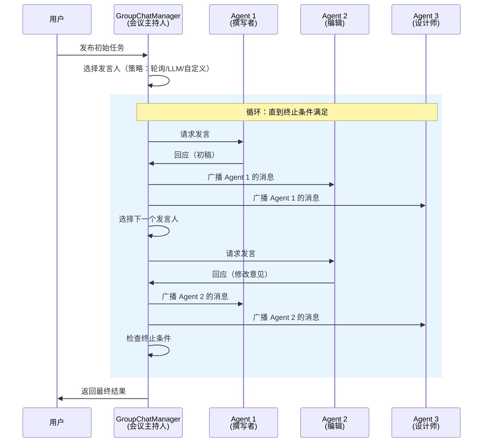

# 群聊模式（Group Chat）

## 模式概述

群聊模式是一种多 Agent 协作范式：多个拥有不同职责的 Agent 共享同一个对话上下文，由一个 GroupChatManager（群聊管理器，相当于"会议主持人"）在每一轮动态选择下一个发言者，被选中的 Agent 发言后，消息广播给所有参与者，如此循环直到任务完成。

这个模式解决的核心问题是：**当一个任务需要多个角色来回互动、迭代改进时，怎么组织它们的协作？** 传统方案要么让 Agent 排成一条流水线依次执行（Sequential，顺序模式），缺少实时反馈；要么由一个主管把任务拆成子任务分给 Worker 执行（Master-Worker，主仆模式），但 Worker 之间看不到彼此的工作。群聊模式把所有 Agent 放进同一个"会议室"，每个人都能看到所有人说了什么，主持人根据当前讨论进展决定谁来发言，形成自然的多方协作。

该模式最早在 Microsoft AutoGen 框架（Wang et al., 2023）中得到系统实现，AutoGen 0.4 版本将其进一步拆分为 RoundRobinGroupChat（轮询群聊）和 SelectorGroupChat（基于 LLM 选择的群聊）两个预置组件。AG2（AutoGen 的社区分支）也提供了类似实现。

> 一句话概括：多个 Agent 共享对话历史，由主持人逐轮选择发言者，通过多轮互动协作完成任务。

## 核心模块

群聊模式由三个核心角色协作运转：

| 模块 | 作用 | 与其他模块的关系 |
|------|------|------------------|
| GroupChatManager（群聊管理器） | 维护共享对话历史，选择下一个发言者，判断是否终止 | 是整个模式的控制中枢，协调所有 Agent |
| Agent 参与者 | 根据自身角色定位生成回应（如撰写者、编辑、审查者） | 接收 Manager 的发言邀请，发言后消息回到 Manager |
| 共享消息话题（Shared Topic） | 存储所有对话历史，所有 Agent 都能读取 | 由 Manager 维护，是信息对称的基础 |

### 模块 1：GroupChatManager（群聊管理器）

GroupChatManager 是群聊的"会议主持人"，承担三项核心职责：

- **发言人选择**：在每一轮决定哪个 Agent 来发言。选择策略（Speaker Selection Method）是可插拔的，常见的有：
  - **轮询**（Round Robin）：按预设顺序轮流，简单且不需要额外 LLM 调用
  - **LLM 智能选择**（Selector）：把当前对话历史和所有 Agent 的描述交给 LLM，让 LLM 判断"谁最适合现在发言"
  - **自定义函数**：开发者自行编写选择逻辑，比如基于规则、关键词匹配等
- **消息广播**：被选中的 Agent 发言后，Manager 把这条消息同步给所有其他 Agent，保证信息对称
- **终止判断**：每一轮结束后检查是否满足终止条件（如达到最大轮数、检测到完成信号等）

### 模块 2：Agent 参与者

每个 Agent 有自己的角色定义（通过 System Prompt 设定）和专长领域。Agent 在被选中发言时，基于完整的对话历史和自身角色定位生成回应。

关键特点：所有 Agent 看到的对话历史是相同的——Agent A 发的消息，Agent B 和 Agent C 都能完整看到。这种信息对称是群聊模式区别于 Master-Worker 模式的核心差异（Master-Worker 中 Worker 之间互相看不到对方的输出）。

### 模块 3：共享消息话题

可以理解为一块"公告板"，所有发言都写在上面，所有人都能看到。它的作用是：

- 保证信息不丢失（Agent B 不会漏掉 Agent A 说的话）
- 为下一轮发言人选择提供完整上下文
- 为终止判断提供依据（Manager 通过分析对话内容判断任务是否完成）

## 架构图



流程说明：

- **用户** 向 GroupChatManager 提交初始任务，触发群聊启动
- **GroupChatManager** 在每一轮选择一个 Agent 发言，将发言内容广播给所有其他 Agent
- 所有 Agent 始终能看到完整的对话历史，信息完全对称
- 循环持续到满足终止条件（最大轮数、完成信号、或 Manager 判断任务已完成）

## 工作流程

1. **步骤 1（初始化）：** 创建多个 Agent（各有角色定义和 System Prompt），创建 GroupChatManager 并配置发言人选择策略、最大轮数、终止条件。用户将初始任务消息发布到共享话题。
2. **步骤 2（选择发言人）：** Manager 根据当前对话状态和选择策略，从所有 Agent 中挑选一个作为本轮发言者。如果策略是轮询，直接取下一个；如果策略是 LLM 选择，将对话历史和 Agent 描述交给 LLM 判断。
3. **步骤 3（生成回应）：** 被选中的 Agent 接收到发言请求，基于完整的对话历史和自身角色定位，调用 LLM 生成回应。
4. **步骤 4（广播消息）：** Manager 将该 Agent 的回应发布到共享话题，所有其他 Agent 的对话历史同步更新。
5. **步骤 5（终止判断）：** Manager 检查是否满足终止条件——达到最大轮数、检测到终止关键词（如"FINISH"）、或连续多轮无实质进展。如果未终止，回到步骤 2 继续循环。

终止条件设计是群聊模式的难点之一。单一条件（如只靠关键词）容易误触发或漏掉。实践中通常组合使用：硬性最大轮数 + 关键词检测 + Agent 主动声明完成。

### 执行示例

任务：**"写一篇关于 AI 医疗应用的博客文章，经过编辑审查和配图方案设计"**

三个 Agent：撰写者、编辑、设计师。选择策略：LLM 智能选择。最大轮数：6。

**第 1 轮 —— LLM 判断"没有初稿就没法编辑"，选择撰写者：**
撰写者生成约 500 字的初稿，涵盖 AI 在影像诊断、治疗规划、药物发现等方向的应用。消息广播后，编辑和设计师都看到了初稿。

**第 2 轮 —— LLM 判断"初稿已有，需要编辑反馈"，选择编辑：**
编辑指出三个问题：第二段缺数据支撑、术语 CNN 未定义、结论段过短。消息广播后，撰写者知道要改什么，设计师开始构思配图。

**第 3 轮 —— LLM 判断"编辑意见需要撰写者处理"，选择撰写者：**
撰写者针对三个问题逐一修改，补充了准确率数据、添加术语定义、扩展结论。输出修改后的完整文章。

**第 4 轮 —— LLM 判断"文章已定稿，该设计师上场了"，选择设计师：**
设计师提出 4 个配图方案：开篇全景图、诊断对比图、神经网络示意图、未来展望信息图。声明"配图方案已定稿"。

Manager 检测到任务的三个目标（初稿、编辑审查、配图方案）都已完成，生成终止信号，输出最终结果汇总。

## 适用场景

### 适合的场景

1. **协作写作与内容编审**：多个角色（撰写者、编辑、校对）需要在同一篇文稿上来回迭代。群聊保证所有修改意见在统一历史中，避免信息不同步。
2. **头脑风暴与多视角分析**：需要从产品、技术、设计等多个角度评估方案时，群聊让各方在同一讨论环境中碰撞观点。
3. **代码审查与多轮改进**：开发者 Agent 写代码、审查者 Agent 找 bug、优化者 Agent 建议重构，整个过程在统一对话历史中进行。
4. **模拟团队会议与决策**：群聊天然适合模拟"项目经理 → 工程师 → QA → 产品"的会议讨论流程。

### 不适合的场景

1. **对响应速度要求极高的场景**：群聊是串行的（每轮只一个 Agent 工作），多轮累加的延迟不适合毫秒级响应需求。应改用并行 Agent 架构。
2. **高度标准化的流水线任务**：如果任务流程固定（如 ETL 数据管道），不需要 Agent 之间动态交互，用 DAG 工作流编排效率更高。
3. **Agent 数量超过 15 个**：随着参与者增多，发言人选择开销、消息广播开销、上下文长度都会膨胀。群聊最适合 3-10 个 Agent。超过 15 个应考虑分层群聊或 Agent 池架构。
4. **需要严格控制成本的场景**：每轮至少需要 1 次 LLM 调用（生成回应），如果使用 LLM 选择策略还要额外 1 次。多轮迭代的成本累积不可忽视。

## 典型实现

以下伪代码展示群聊模式的核心循环结构：

```python
# 群聊模式核心循环伪代码

def groupchat_loop(agents, task, max_rounds=6, select_strategy="round_robin"):
    """群聊主循环：选择发言人 → 生成回应 → 广播 → 终止判断"""
    history = [{"speaker": "用户", "content": task}]
    speaker_index = 0

    for round_num in range(max_rounds):
        # 阶段 1：选择发言人
        if select_strategy == "round_robin":
            current_agent = agents[speaker_index % len(agents)]
            speaker_index += 1
        elif select_strategy == "llm_selector":
            current_agent = llm_select_speaker(history, agents)

        # 阶段 2：被选中的 Agent 生成回应
        response = current_agent.generate(history)

        # 阶段 3：广播消息，更新所有 Agent 的对话历史
        history.append({"speaker": current_agent.name, "content": response})

        # 阶段 4：终止判断
        if is_finished(history):
            break

    return history
```

`history` 列表是共享消息话题的简化表示，所有 Agent 通过它看到完整对话。`select_strategy` 控制发言人选择策略。`is_finished` 检查终止条件。

如果使用 AutoGen 0.4 框架，可以直接使用预置的 `RoundRobinGroupChat` 或 `SelectorGroupChat`：

```python
# 基于 AutoGen 0.4 的群聊实现（示意）
# 依赖：pip install autogen-agentchat~=0.4

from autogen_agentchat.agents import AssistantAgent
from autogen_agentchat.teams import RoundRobinGroupChat, SelectorGroupChat
from autogen_agentchat.conditions import TextMentionTermination

# 定义 Agent
writer = AssistantAgent(name="Writer", system_message="你是撰写者...", model_client=model)
editor = AssistantAgent(name="Editor", system_message="你是编辑...", model_client=model)

# 方式 1：轮询群聊 —— 按顺序轮流发言
team_rr = RoundRobinGroupChat(
    participants=[writer, editor],
    termination_condition=TextMentionTermination("FINISH"),
    max_turns=6,
)

# 方式 2：LLM 选择群聊 —— 由 LLM 根据上下文选择下一个发言者
team_sel = SelectorGroupChat(
    participants=[writer, editor],
    model_client=model,                   # 用于选择发言人的 LLM
    termination_condition=TextMentionTermination("FINISH"),
    allow_repeated_speaker=False,         # 禁止同一 Agent 连续发言
)

# 运行
result = await team_sel.run(task="写一篇关于 AI 医疗的博客文章")
```

AutoGen 0.4 对群聊做了清晰的分类：`RoundRobinGroupChat` 适合流程明确的场景（不消耗额外 LLM 调用），`SelectorGroupChat` 适合需要动态判断的场景（每轮多一次 LLM 调用用于选择发言人）。

## 优劣势分析

| 优势 | 劣势 |
|------|------|
| 信息完全对称，所有 Agent 看到相同历史，减少沟通误差 | 串行执行，每轮只一个 Agent 工作，总耗时随轮数线性增长 |
| 发言人选择策略可插拔，从简单轮询到 LLM 智能选择均可 | Agent 数量多时，选择开销和上下文长度膨胀 |
| 过程透明可追踪，完整对话记录便于调试和审计 | LLM 调用成本随轮数累积（尤其使用 LLM 选择策略时） |
| 适合需要来回迭代的协作型任务 | 终止条件设计复杂，处理不当容易无限循环或过早终止 |

边界说明：群聊模式的优势在任务需要多角色来回互动时最明显。当任务可以拆成独立子任务并行执行时，Master-Worker 模式效率更高。

## 与相关模式的对比

| 对比维度 | Group Chat（群聊） | Master-Worker（主仆） | Sequential（顺序） |
|---------|--------|--------|--------|
| 核心思想 | 多 Agent 共享上下文，动态轮流发言 | 主 Agent 分解任务，Worker 各自执行 | Agent 按预定流程依次传递 |
| 信息流向 | 星型：所有 Agent 看到所有消息 | 树型：Worker 之间互不通信 | 链型：A → B → C |
| 执行方式 | 串行轮流 | 可并行 | 串行 |
| Agent 自主性 | 高，可互相启发和回应 | 低，Worker 只执行分配的子任务 | 低，按固定顺序处理 |
| 适用规模 | 3-10 个 Agent | 1 个 Master + 多个 Worker | 2-5 个 Agent |
| 典型场景 | 协作写作、代码审查、头脑风暴 | 数据处理、批量内容生成 | ETL 管道、审批流程 |

选择建议：需要来回互动和迭代改进 → Group Chat；任务可拆分且子任务独立 → Master-Worker；流程固定、无需交互 → Sequential。

## 常见误区

| 常见误区 | 正确理解 |
|----------|----------|
| "群聊就是让多个 Agent 同时工作，速度更快" | 群聊是串行轮流发言，每轮只有一个 Agent 在工作。它的价值是信息对称和动态协作，不是并行加速 |
| "用 LLM 选择发言人就一定比轮询好" | LLM 选择每轮多消耗一次 LLM 调用，适合需要动态判断的场景。如果发言顺序本身就是固定的（如先写后审再设计），轮询更高效 |
| "Agent 越多协作效果越好" | Agent 超过 10-15 个后，上下文拥挤、选择开销增大、对话难以收敛。实践中 3-8 个 Agent 效果最好 |
| "只要设了终止关键词就不会死循环" | 单一关键词检测容易误触发或漏掉。需要组合使用最大轮数 + 关键词 + 启发式判断 |

## 思考题

<details>
<summary>初级：群聊模式和让多个 Agent 排成一条线依次执行（Sequential 模式）的核心区别是什么？</summary>

**参考答案：**

核心区别是信息流和交互方式。Sequential 模式中，Agent A 的输出传给 Agent B，Agent B 的输出传给 Agent C，是单向链条，Agent C 看不到 Agent A 的原始输出，Agent A 也看不到 Agent B 的反馈。

群聊模式中，所有 Agent 共享同一个对话历史，每个人都能看到所有人说了什么。这使得 Agent 之间可以互相启发、来回修改，而不是单方向传递。

</details>

<details>
<summary>中级：在群聊模式中，RoundRobin（轮询）策略和 LLM Selector（LLM 智能选择）策略各自适合什么场景？</summary>

**参考答案：**

轮询策略适合发言顺序基本固定的场景，比如"撰写者 → 编辑 → 设计师"的流程已经明确，不需要 LLM 来判断谁该发言。优点是零额外 LLM 开销，缺点是不灵活。

LLM 智能选择适合发言顺序不确定、需要根据对话内容动态判断的场景，比如头脑风暴中谁提了个问题、谁最擅长回答就让谁发言。优点是灵活，缺点是每轮多消耗一次 LLM 调用。

选择的关键判断标准：如果你能在写代码前就画出发言顺序图，用轮询；如果发言顺序取决于对话的实际内容，用 LLM 选择。

</details>

<details>
<summary>中级：一个群聊有 5 个 Agent，使用 LLM 选择策略，设定最大 10 轮。假设每次 LLM 调用成本 0.01 元，总成本上限是多少？</summary>

**参考答案：**

每轮有两次 LLM 调用：一次用于选择发言人，一次用于被选中 Agent 生成回应。10 轮就是 20 次 LLM 调用，成本上限为 20 × 0.01 = 0.20 元。

如果改用轮询策略，省掉选择发言人的 LLM 调用，每轮只有 1 次，10 轮共 10 次，成本为 0.10 元——正好减半。这也是为什么在流程固定的场景下推荐轮询策略。

</details>

## 参考资料

1. Wu, Q., Bansal, G., Zhang, J., et al. "AutoGen: Enabling Next-Gen LLM Applications via Multi-Agent Conversation." arXiv:2308.08155, 2023. https://arxiv.org/abs/2308.08155
2. AutoGen 0.4 官方文档 - Selector Group Chat: https://microsoft.github.io/autogen/stable/user-guide/agentchat-user-guide/selector-group-chat.html
3. AutoGen 0.2 官方文档 - Group Chat with Customized Speaker Selection: https://microsoft.github.io/autogen/0.2/docs/notebooks/agentchat_groupchat_customized
4. AG2（AutoGen 社区分支）Group Chat 文档: https://docs.ag2.ai/latest/docs/user-guide/advanced-concepts/orchestration/group-chat/introduction/
5. AutoGen 0.4 发布博客: https://devblogs.microsoft.com/autogen/autogen-reimagined-launching-autogen-0-4/
