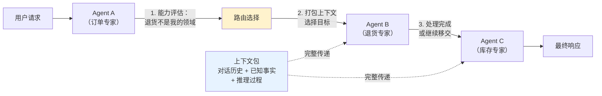

# Handoff 模式（任务移交）

## 模式概述

Handoff（任务移交）是一种多 Agent 协作模式：当一个 Agent 发现当前任务超出自己的能力范围，它会**主动把对话控制权和完整上下文一起交给另一个更合适的 Agent** 继续处理。用户不需要重新描述问题，新 Agent 接手后就能无缝接续工作。

这个模式最早由 OpenAI 在 2024 年 10 月发布的实验性框架 Swarm 中提出并演示，后来被正式纳入 OpenAI Agents SDK（Swarm 的生产级升级版），Microsoft AutoGen、Semantic Kernel 等主流框架也都支持了这一模式。Handoff 在多 Agent 体系中的定位是**对等分工型协作**——每个 Agent 是平等的专家，通过主动移交而非中央调度来完成协作。

> 一句话概括：Agent 判断自己搞不定时，把"话筒"和"笔记本"一起递给更合适的 Agent。

## 核心模块

Handoff 模式由四个核心模块协作运转：

| 模块 | 作用 | 与其他模块的关系 |
|------|------|------------------|
| 能力评估 | 判断当前任务是否在自己的专业范围内 | 评估结果决定是否触发路由选择 |
| 路由选择 | 从候选 Agent 中选出最合适的接手者 | 依赖能力评估的结果，驱动上下文打包 |
| 上下文打包 | 把对话历史、已收集信息、推理过程打包传递 | 为新 Agent 接管提供完整背景 |
| 控制权转移 | 把"活跃 Agent"身份切换到目标 Agent | 新 Agent 基于上下文包开始处理 |

### 模块 1：能力评估

每个 Agent 都有明确的专业范围（比如"订单查询""退货处理""库存管理"）。当接收到用户请求时，Agent 需要判断：这个任务我能不能处理？

判断依据通常包括：

- **工具匹配**：我有没有完成这个任务所需的工具
- **领域匹配**：这个问题是否属于我的专业领域
- **置信度**（Confidence，信心程度）：对自己能处理好这个任务的把握有多大

如果判断结果是"我搞不定"或"我只能搞定一部分"，就进入下一个模块。

### 模块 2：路由选择

确定要移交之后，需要选出最合适的目标 Agent。选择方式有三种常见做法：

- **规则匹配**：预先定义好"退货需求 → 退货 Agent"这样的映射规则，简单直接
- **LLM 推理**：让模型根据任务描述和各 Agent 的能力说明，推理出最合适的目标
- **评分排序**：对多个候选 Agent 打分，选最高分的

### 模块 3：上下文打包

这是 Handoff 区别于普通"转接电话"的关键。移交时不是只把用户的问题丢过去，而是把**完整的信息包**一起传递，通常包含：

- 完整的对话历史（用户说了什么、之前 Agent 回复了什么）
- 已收集的事实信息（比如"订单号是 xxx""产品已缺货"）
- 前一个 Agent 的推理过程（比如"我已经查了订单状态，发现需要退货处理"）

### 模块 4：控制权转移

系统把"当前活跃 Agent"切换为目标 Agent。在 OpenAI Agents SDK 中，这通过一个特殊的工具调用实现——Agent 调用 `handoff()` 函数，框架自动完成切换。新 Agent 成为对话的主角，可以继续回复用户或进一步调用自己的工具。

## 架构图



流程说明：

- Agent A 处理用户请求时，发现退货需求超出自己的范围，触发路由选择
- 路由选择确定 Agent B（退货专家）为目标，同时把上下文包传递过去
- Agent B 处理退货后，发现用户还需要库存预留，再次移交给 Agent C
- 每次移交都携带完整上下文，新 Agent 不需要用户重复提问

## 工作流程

1. **步骤 1（能力评估）：** 当前 Agent 接收用户请求，分析任务是否在自己的专业范围内。如果能处理，直接执行并回复；如果不能（或只能处理一部分），进入步骤 2。
2. **步骤 2（选择目标）：** 当前 Agent 根据任务特征，从可用的 Agent 列表中选出最合适的接手者。选择依据可以是预设规则、LLM 推理或评分排序。
3. **步骤 3（打包上下文）：** 把对话历史、已收集的事实信息、自己的推理过程打包成结构化的信息包。
4. **步骤 4（执行移交）：** 通过框架提供的 Handoff 机制，把控制权和上下文包一起交给目标 Agent。
5. **步骤 5（新 Agent 接管）：** 目标 Agent 读取上下文包，理解前因后果，继续处理任务。如果它也搞不定剩余部分，可以再次执行步骤 2-4，形成链式移交。

循环终止条件：
- 某个 Agent 成功完成任务，返回最终答案
- 达到最大移交次数限制（通常 3-5 次），触发降级处理（如转人工）
- 所有相关 Agent 都尝试过仍无法处理，返回兜底提示

### 执行示例

用户问：**"我昨天下的订单一直没收到，想退货，但这个产品快缺货了，能不能帮我预留一个新的？"**

**第 1 阶段 —— 订单 Agent 处理**

- 订单 Agent 查询订单状态：已发货，在途中
- 发现用户还要退货和预留新货，这两项超出自己的范围
- 打包已查到的订单信息，移交给退货 Agent

**第 2 阶段 —— 退货 Agent 处理**

- 退货 Agent 读取上下文，已知订单号和状态，无需重新查询
- 执行退货流程，生成退货单号 RMA-123
- 发现用户还要预留新货，这涉及库存管理，再次移交给销售 Agent

**第 3 阶段 —— 销售 Agent 完成**

- 销售 Agent 读取上下文，已知订单号、退货单号和产品信息
- 执行库存预留，生成预留单号 RES-456
- 整合所有结果，返回最终答案：退货已处理 + 新货已预留

三次移交，三个 Agent 各做自己擅长的事，用户全程只提了一个问题。

## 适用场景

### 适合的场景

1. **多部门分工的客服系统**：电商、金融、电信等行业，客户问题常涉及多个部门（订单、退货、售后、投诉）。每个部门对应一个专业 Agent，通过 Handoff 自动路由，用户不需要手动转接。
2. **线性或树形的业务流程**：保险理赔（信息采集 → 评估 → 审批 → 支付）、贷款审批、工单处理等，流程有明确的阶段划分，每个阶段由专业 Agent 负责。
3. **需要逐步精化的任务**：内容创作流程（主题规划 Agent → 研究 Agent → 写作 Agent → 编辑 Agent），每个环节专注自己的专业。

### 不适合的场景

1. **开放式讨论或头脑风暴**：任务边界模糊，无法明确分配，Handoff 容易变成"踢皮球"。这种场景更适合群聊模式（Group Chat）。
2. **需要多个 Agent 实时协作的任务**：比如代码审查需要安全专家和性能专家同时发表意见，Handoff 的单向移交不够用，需要并行协作模式。
3. **极低延迟要求的场景**：每次移交都有上下文打包和理解的开销，对毫秒级响应要求的系统不太合适。

## 典型实现

以下基于 OpenAI Agents SDK 展示 Handoff 的核心用法（基于 openai-agents 0.0.7+ 验证，截至 2025-03）：

```python
# 环境准备：
# pip install openai-agents
# export OPENAI_API_KEY="your-api-key"

from agents import Agent, Runner, handoff, function_tool

# 定义各 Agent 的专用工具
@function_tool
def search_order(order_id: str) -> str:
    """根据订单号查询订单状态"""
    return f"订单 {order_id}: 已发货，在途中，预计明天送达"

@function_tool
def process_refund(order_id: str, reason: str) -> str:
    """处理退货申请"""
    return f"退货已受理，退货单号 RMA-{order_id}，退款 7 个工作日内到账"

@function_tool
def reserve_inventory(product_name: str) -> str:
    """为客户预留库存"""
    return f"已为您预留 {product_name}，预留有效期 30 天"

# 先声明 Agent（解决循环引用）
sales_agent = Agent(
    name="SalesAgent",
    instructions="你是库存管理专家，负责产品预留和库存查询。",
    tools=[reserve_inventory],
)

refund_agent = Agent(
    name="RefundAgent",
    instructions="你是退货专家，负责退货申请。如果用户还需要预留新货，移交给 SalesAgent。",
    tools=[process_refund],
    handoffs=[handoff(sales_agent)],  # 声明可以移交给 sales_agent
)

order_agent = Agent(
    name="OrderAgent",
    instructions="你是订单查询专家。如果用户需要退货，移交给 RefundAgent。",
    tools=[search_order],
    handoffs=[handoff(refund_agent), handoff(sales_agent)],
)

# 运行
result = Runner.run_sync(
    order_agent,
    "我昨天下的订单没收到，想退货，能帮我预留个新的吗？"
)
print(result.final_output)
```

代码结构对应 Handoff 的四个核心模块：每个 Agent 的 `instructions` 定义了能力边界（能力评估），`handoffs` 参数声明了可移交的目标（路由选择），框架自动处理上下文传递和控制权切换。开发者只需定义"谁能做什么"和"可以交给谁"，运行时的移交决策由 LLM 根据 instructions 自主完成。

## 优劣势分析

| 优势 | 劣势 |
|------|------|
| 上下文完整传递，用户不需要重复提问 | 需要预先定义好每个 Agent 的能力边界 |
| 每个 Agent 专注自己的领域，易于维护和扩展 | 每次移交增加延迟（上下文打包 + 新 Agent 理解） |
| 路由可以动态决策，灵活适应不同场景 | 能力边界重叠时容易选错目标 Agent |
| 添加新 Agent 只需定义能力和移交规则 | 多步移交的调试排查比较困难 |

边界说明：Handoff 的优势在任务有明确分工边界时最明显。如果 Agent 之间的职责划分模糊，移交决策的准确性会显著下降。

## 与相关模式的对比

| 对比维度 | Handoff（任务移交） | Master-Worker（主从调度） | Group Chat（群聊协作） |
|---------|-------------------|-------------------------|----------------------|
| 控制方式 | 分布式，Agent 自主决定移交 | 集中式，Master 统一调度 | 自组织，无明确中央控制 |
| 信息流向 | 单向链式传递 | 星形（Master ↔ 各 Worker） | 广播式，所有人可见 |
| 适用流程 | 线性/树形任务流 | 需要全局规划的复杂任务 | 开放式讨论、创意协作 |
| 上下文传递 | 显式打包，精准传递 | Master 集中维护 | 共享对话历史 |
| 扩展新 Agent | 定义能力 + 移交规则即可 | 需要更新 Master 的调度逻辑 | 直接加入群聊 |

选择建议：

- 流程是**线性或树形**的（工单、审批、客服分流）→ 用 **Handoff**
- 需要一个**总指挥**来规划全局、分配子任务 → 用 **Master-Worker**
- 多个 Agent 需要**自由讨论、互相启发** → 用 **Group Chat**

## 常见误区

| 常见误区 | 正确理解 |
|----------|----------|
| Handoff 就是"把其他 Agent 当工具调用" | 工具调用中被调用者是辅助角色，结果返回给调用者。Handoff 是转交控制权，新 Agent 成为对话主角，两者的权力结构完全不同 |
| 移交后原 Agent 就"消失"了 | 原 Agent 的工作成果（查到的信息、推理结论）通过上下文包传递给了新 Agent，实际上两者通过上下文实现了协作 |
| 路由规则越详细越好 | 规则应简洁清晰。过度详细的规则容易冲突、难以维护。更好的做法是定义几条核心规则，灰色地带让 LLM 自主判断 |

## 思考题

<details>
<summary>初级：Handoff 和"把其他 Agent 当工具调用"有什么本质区别？</summary>

**参考答案：**

核心区别在于**控制权归属**。工具调用模式中，调用者始终是主角，被调用的 Agent 只是提供一个结果然后退出，对话继续由调用者主导。Handoff 模式中，控制权完整转移给了新 Agent，新 Agent 成为对话的主角，可以自主决策、调用自己的工具、甚至再次移交。打个比方：工具调用像"打电话咨询"，Handoff 像"把整个案子移交给另一个人全权处理"。

</details>

<details>
<summary>中级：Handoff 移交时传递的上下文包应该包含哪些信息？为什么不能只传用户的原始问题？</summary>

**参考答案：**

上下文包至少应包含：(1) 完整的对话历史；(2) 前一个 Agent 已收集的事实信息（如订单号、查询结果）；(3) 前一个 Agent 的推理过程和移交原因。

只传原始问题的话，新 Agent 不知道前面已经做过什么，可能重复查询、遗漏已知信息，导致效率下降和用户体验变差。完整的上下文包让新 Agent 能"接着做"而不是"从头做"。

</details>

<details>
<summary>中级：什么情况下 Handoff 模式不如 Master-Worker 模式？</summary>

**参考答案：**

当任务需要全局规划和统筹协调时。例如，一个复杂的项目管理任务需要同时考虑资源分配、时间排期、风险评估等多个维度，这些子任务之间有复杂的依赖关系。Handoff 的链式移交缺乏全局视角，每个 Agent 只看到自己这一段，容易出现局部合理但整体不优的结果。Master-Worker 由一个 Master 统筹全局，能更好地协调各子任务的执行顺序和资源分配。

</details>

## 参考资料

1. OpenAI Swarm 项目仓库（Handoff 模式的原始演示）：https://github.com/openai/swarm
2. OpenAI Agents SDK Handoffs 官方文档：https://openai.github.io/openai-agents-python/handoffs/
3. OpenAI "Orchestrating Agents: Handoffs & Routines" Cookbook：https://cookbook.openai.com/examples/orchestrating_agents
4. AutoGen Handoffs 设计模式文档：https://microsoft.github.io/autogen/dev/user-guide/core-user-guide/design-patterns/handoffs.html
5. Microsoft Semantic Kernel Handoff Agent Orchestration：https://learn.microsoft.com/en-us/semantic-kernel/frameworks/agent/agent-orchestration/handoff
