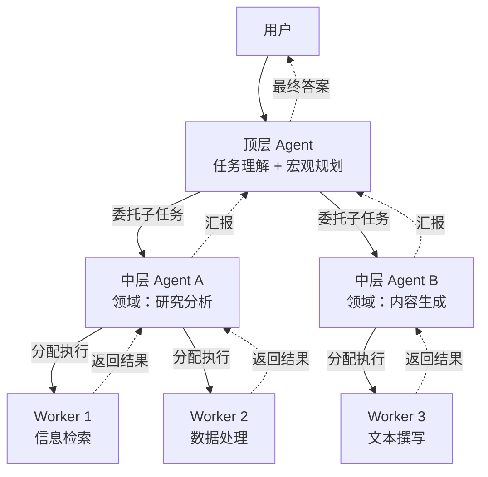

# 分层模式（Hierarchical）

## 模式概述

分层模式是一种"像公司组织架构一样"管理多个 Agent 的协作方式。核心做法是：设一个顶层 Agent 当"总经理"，它不亲自干活，而是把复杂任务拆成几块，分配给中层 Agent（"部门经理"）；中层 Agent 再进一步细化，交给底层 Agent（"一线员工"）去真正执行。执行结果沿原路逐层汇报回来，最终由顶层 Agent 汇总输出。

这种模式要解决的问题很明确：当 Agent 数量多、任务复杂时，如果只用一个 Supervisor（主管）直接管所有 Worker（执行者），Supervisor 的负担会越来越重，最终成为瓶颈。分层模式通过引入多级管理，把"一人管所有"变成"逐级管理"，让每层 Agent 只关注自己层级的事。这和企业管理中的分层授权是同一个道理。

> 一句话概括：通过多层级树状结构逐级委托任务，让每层 Agent 只负责自己层级的决策，实现大规模 Agent 系统的分治协调。

## 核心模块

分层模式属于结构型模式，核心是三个层级之间的委托与汇报关系：

| 模块 | 作用 | 与其他模块的关系 |
|------|------|------------------|
| 顶层 Agent（Top-Level） | 理解用户目标，制定宏观计划，汇总最终结果 | 向下委托给中层，接收中层的汇报 |
| 中层 Agent（Mid-Level） | 在专业领域内进一步拆解任务，协调底层执行 | 接受顶层委托，向下分配给底层，向上汇报 |
| 底层 Agent（Worker） | 调用工具和 API 执行具体操作 | 接受中层指令，返回执行结果 |

### 模块 1：顶层 Agent（Top-Level Agent）

顶层 Agent 是整个系统的入口和出口。它接收用户的原始需求，分析任务的核心目标和主要维度，制定分解策略，然后把子任务分配给中层 Agent。所有中层返回结果后，顶层负责综合整理，生成最终输出。

顶层 Agent 本身不执行具体操作。它的价值在于"看全局"——决定任务怎么拆、拆给谁、最终怎么合。

### 模块 2：中层 Agent（Mid-Level Agent）

中层 Agent 相当于"部门经理"，每个中层 Agent 通常负责一个专业领域（例如"数据分析"或"内容撰写"）。它从顶层接收子任务后，根据自己领域的特点进一步细化，然后分配给底层 Agent。底层完成后，中层负责聚合结果、检查质量，必要时安排重试。

中层是分层模式区别于简单 Supervisor-Worker（主管-执行者）模式的关键——它让系统多了一层"专业判断"。

### 模块 3：底层 Agent（Worker Agent）

底层 Agent 是真正的执行者。它根据上层给的具体指令，调用搜索工具、代码执行器、数据库查询等完成任务，把结果返回给上级。

底层 Agent 的职责边界清晰：只做被分配的事，不需要理解全局目标。

## 架构图



流程说明：

- 实线箭头表示任务的下行委托方向：顶层 → 中层 → 底层
- 虚线箭头表示结果的上行汇报方向：底层 → 中层 → 顶层
- 同一层的多个 Agent 可以并行工作，彼此互不干扰
- 控制点在于每一层的"分解策略"——分得合不合理，直接决定最终质量

## 工作流程

1. **步骤 1（任务接收与规划）：** 顶层 Agent 接收用户的原始需求，分析核心目标，识别任务的主要维度，制定分解方案。输出是一份包含若干子任务的规划清单。
2. **步骤 2（中层分解与分配）：** 各中层 Agent 分别接收自己负责的子任务，在专业领域内进一步拆解为可执行的具体操作，分配给底层 Agent。
3. **步骤 3（底层执行）：** 底层 Agent 调用工具（搜索、计算、API 调用等）完成分配的具体任务，返回执行结果。
4. **步骤 4（结果汇聚）：** 中层 Agent 收集底层结果，检查是否达标。如果某个底层任务失败或质量不足，中层可以决定重试或调整策略。汇总后向顶层报告。
5. **步骤 5（最终整合）：** 顶层 Agent 综合所有中层的汇报，进行逻辑整合和一致性检查，生成最终答案返回给用户。

终止条件：所有底层 Agent 完成执行且中层确认结果合格后，汇聚链路自动向上推进，顶层生成最终输出时流程结束。如果中层发现某个子任务结果不合格，会形成局部重试循环。

### 执行示例

任务："帮我写一份'AI 在教育领域应用'的研究报告，包括背景、技术、案例和展望。"

**顶层 Agent 规划：**
分析后确定三个维度——(1) 背景调研与文献整理 (2) 关键技术分析 (3) 报告撰写与整合。分别委托给中层 Agent A（研究方向）和中层 Agent B（写作方向）。

**中层 Agent A 分解：**
- 子任务 1：搜索近三年 AI 教育相关学术论文和行业报告 → 交给 Worker 1
- 子任务 2：分析自适应学习、智能评估等核心技术 → 交给 Worker 2

**中层 Agent B 分解：**
- 子任务 3：根据研究成果撰写报告各章节 → 交给 Worker 3

**底层执行与汇聚：**
Worker 1 返回文献列表和摘要，Worker 2 返回技术分析文档，Worker 3 输出报告初稿。中层 A 聚合出"背景与技术"章节，中层 B 聚合出"案例与展望"章节。顶层将两部分整合成完整的、风格一致的研究报告。

## 适用场景

### 适合的场景

1. **大规模多领域任务**：任务涉及多个专业领域（如同时需要代码、数据分析、文案写作），不同领域由专门的中层 Agent 负责，避免一个 Supervisor 管所有事。
2. **需要清晰审计链路的企业应用**：如医疗诊断、金融风控、合规审查——层级结构让每一步决策都可追溯，满足审计需求。
3. **Agent 数量多（几十到上百个）的系统**：单个 Supervisor 管不过来时，分层是自然的扩展方式。每增加一个新领域，只需在对应层级加一个中层 Agent 及其下属。
4. **需要分级权限的决策场景**：如财务审批流程——不同层级的 Agent 有不同的决策权限，高层有最终批准权，底层只有执行权。

### 不适合的场景

1. **简单直线型任务**：一次搜索、一次翻译、一次格式转换——分层只会增加不必要的通信开销和延迟。
2. **需要高实时性的任务**：自动驾驶决策、高频交易——多层级的委托和汇聚会引入不可接受的延迟。
3. **Agent 之间需要频繁对等协商的任务**：如头脑风暴、辩论式推理——分层模式强调上下级关系，限制了平等沟通的灵活度，这类任务更适合群聊模式（GroupChat）。

## 典型实现

以下伪代码展示分层模式的核心委托-汇聚机制：

```python
# 分层模式核心伪代码

class Agent:
    def __init__(self, name, role, children=None):
        self.name = name
        self.role = role
        self.children = children or []

    def execute(self, task):
        if not self.children:
            # 底层 Agent：直接执行
            return self.run_tool(task)
        # 非底层 Agent：分解任务，委托给下层
        sub_tasks = self.decompose(task)
        results = []
        for sub_task, child in zip(sub_tasks, self.children):
            result = child.execute(sub_task)
            results.append(result)
        # 汇聚下层结果
        return self.aggregate(results)

    def decompose(self, task):
        """调用 LLM 将任务拆分为子任务"""
        return llm.generate(f"将以下任务拆分为子任务：{task}")

    def aggregate(self, results):
        """调用 LLM 将多个子结果整合为一份报告"""
        return llm.generate(f"整合以下结果：{results}")

    def run_tool(self, task):
        """底层 Agent 调用具体工具执行任务"""
        return tool.execute(task)
```

核心结构是递归的 `execute` 方法：有下层就分解并委托，没有下层就直接执行。`decompose` 负责向下拆分，`aggregate` 负责向上汇聚。

CrewAI 框架对分层模式提供了开箱即用的支持，通过 `process="hierarchical"` 参数启用：

```python
# 基于 CrewAI 的分层模式（示意）
# 依赖：crewai（截至 2026-03 验证）

from crewai import Agent, Task, Crew, Process

# 定义执行 Agent
researcher = Agent(
    role="研究员",
    goal="搜索并整理相关资料",
    backstory="资深研究分析师",
    allow_delegation=False    # 底层不再向下委托
)

writer = Agent(
    role="撰稿人",
    goal="根据研究结果撰写报告",
    backstory="专业技术作家",
    allow_delegation=False
)

# 定义任务
research_task = Task(
    description="调研 AI 在教育领域的应用现状",
    expected_output="调研报告",
    agent=researcher
)

writing_task = Task(
    description="基于调研结果撰写完整报告",
    expected_output="研究报告终稿",
    agent=writer
)

# 创建分层 Crew——框架自动生成 Manager Agent
crew = Crew(
    agents=[researcher, writer],
    tasks=[research_task, writing_task],
    process=Process.hierarchical,    # 启用分层模式
    verbose=True
)

result = crew.kickoff()
```

CrewAI 在 `Process.hierarchical` 模式下会自动创建一个 Manager Agent（管理者 Agent），由它决定任务执行顺序和委托策略。开发者只需定义 Agent 和 Task，不需要手动编排层级关系。

LangGraph 同样支持分层模式，通过嵌套 Supervisor 实现。2025 年 2 月发布的 `langgraph-supervisor` 库提供了 `create_supervisor()` API，支持将多个 Supervisor 组合成多层级结构（supervisor of supervisors）。

## 优劣势分析

| 优势 | 劣势 |
|------|------|
| 复杂度分散——每层只管自己的事，系统容易扩展 | 多层级通信增加端到端延迟 |
| 责任边界清晰——每步决策可追溯，满足审计需求 | 架构设计比 Supervisor-Worker 复杂得多 |
| 支持专业化分工——不同中层 Agent 专注不同领域 | 层级设计不当会产生冗余（某层"只传话不干活"） |
| 天然支持分级权限管理 | 不适合需要 Agent 平等协商的场景 |

边界说明：分层模式的优势在 Agent 数量多、任务维度多的大规模系统中最明显；当 Agent 少于 5 个、任务简单时，Supervisor-Worker 模式更合适。

## 与相关模式的对比

| 对比维度 | 分层模式 | Supervisor-Worker（主管-执行者） | 群聊模式（GroupChat） |
|---------|---------|-------------------------------|---------------------|
| 核心结构 | 多层级树状组织 | 单个主管 + 多个执行者 | 所有 Agent 平等参与 |
| 适用规模 | 大规模（几十到上百个 Agent） | 中小规模（5-20 个 Agent） | 中小规模（3-10 个 Agent） |
| 任务分解 | 递归多层分解 | 一次性分解 | 无中心分解，Agent 自发协作 |
| 可扩展性 | 好——新增层级或 Agent 不影响其他部分 | 有限——主管成为瓶颈 | 一般——Agent 多了通信复杂度爆炸 |
| 可审计性 | 好——清晰的委托链路 | 中等——所有决策集中在主管 | 差——通信路径动态且众多 |
| 实时性 | 差——多层级延迟叠加 | 中等 | 中等 |

选择建议：Agent 多、任务复杂、需要审计链路 → 分层模式；Agent 少、任务明确 → Supervisor-Worker；强调平等讨论和自主协作 → 群聊模式。

## 常见误区

| 常见误区 | 正确理解 |
|----------|----------|
| 层级越多越好，能应对越复杂的任务 | 层级数应根据任务实际需要决定。过深的层级增加延迟和调试难度，通常 2-3 层就够了 |
| 分层模式和 Supervisor-Worker 本质相同 | Supervisor-Worker 是单层管理（一个主管管所有人），分层模式是多层管理（主管管经理，经理管员工），关键区别是中间层的存在 |
| 所有任务必须从顶层发起 | 在实际系统中，某些独立的子任务可以由中层 Agent 直接处理，不必每次都经过顶层 |
| 同一层的 Agent 之间不能通信 | 分层模式强调上下级关系，但不排斥同级 Agent 之间的横向协作，两者可以结合使用 |

## 思考题

<details>
<summary>初级：分层模式和 Supervisor-Worker 模式的关键区别是什么？</summary>

**参考答案：**

关键区别在于是否有中间管理层。Supervisor-Worker 是"一个主管直接管所有执行者"，属于单层管理；分层模式在主管和执行者之间插入了一层或多层"中层 Agent"，每个中层负责一个专业领域的任务拆解和协调。当 Agent 数量少、任务简单时，Supervisor-Worker 够用；当 Agent 多、任务跨多个领域时，分层模式通过分级管理来降低每一层的管理负担。

</details>

<details>
<summary>中级：在分层模式中，如果某个底层 Agent 执行失败，系统应该如何处理？</summary>

**参考答案：**

失败处理由该底层 Agent 的上级（中层 Agent）负责。中层 Agent 收到失败结果后，有几种策略：(1) 让同一个底层 Agent 重试；(2) 把任务转交给同级别的其他底层 Agent；(3) 调整任务描述后重新分配。如果中层多次重试仍然失败，应向顶层 Agent 报告异常，由顶层决定是调整整体计划还是返回部分结果。关键是每一层只处理自己能处理的异常，超出能力范围的向上层汇报。

</details>

<details>
<summary>中级：什么场景下不应该使用分层模式，而应该用群聊模式？</summary>

**参考答案：**

当任务需要多个 Agent 之间频繁、平等地交换观点时，群聊模式更合适。例如头脑风暴、方案评审、辩论式推理——这些场景的核心是"多角度碰撞"，没有明确的上下级关系。分层模式强调的是"上级分配、下级执行、逐层汇报"，如果强行套用在需要平等协商的场景上，会过度限制 Agent 之间的通信自由度，反而降低协作效率。

</details>

## 参考资料

1. Zhu, A., Dugan, L., & Callison-Burch, C. (2024). "ReDel: A Toolkit for LLM-Powered Recursive Multi-Agent Systems." EMNLP 2024 System Demonstrations. https://arxiv.org/abs/2408.02248
2. LangGraph 官方教程 - Hierarchical Agent Teams: https://langchain-ai.github.io/langgraph/tutorials/multi_agent/hierarchical_agent_teams/
3. LangGraph Supervisor 库（支持分层多 Agent）: https://github.com/langchain-ai/langgraph-supervisor-py
4. CrewAI 官方文档 - Processes: https://docs.crewai.com/concepts/processes
5. Zhang, Y. et al. (2024). "Exploration of LLM Multi-Agent Application Implementation Based on LangGraph+CrewAI." https://arxiv.org/abs/2411.18241
