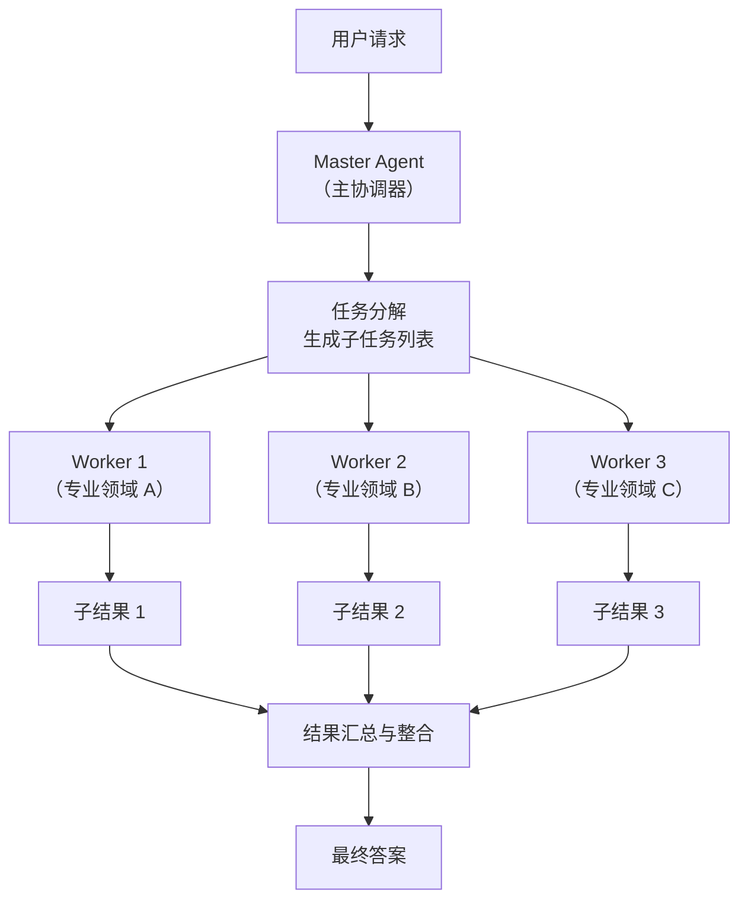

# Master-Worker 模式（主从分发）

## 模式概述

Master-Worker 是多 Agent 协作中最基础、最常用的模式之一。它的核心思路很简单：一个"主管"Agent（Master）负责接收用户请求、把复杂任务拆成若干子任务，然后分配给多个"执行者"Agent（Worker）并行处理，最后由 Master 收集所有 Worker 的结果并汇总成最终答案。

这个模式也常被叫做 Orchestrator-Worker（编排器-执行器）、Supervisor-Worker（监督者-执行器）。它的思想源自分布式计算中经典的主从架构——一个调度节点分发任务，多个工作节点并行执行。在 LLM 多智能体系统中，AutoGen、LangGraph、CrewAI 等主流框架都提供了对这种模式的原生支持。

> 一句话概括：Master 负责"拆活、派活、收活"，Worker 负责"专心干活"，通过并行执行大幅提升复杂任务的处理效率。

## 核心模块

Master-Worker 模式由三个核心角色组成，形成"分发-执行-汇总"的协作结构：

| 模块 | 作用 | 与其他模块的关系 |
|------|------|------------------|
| Master（主协调器） | 接收请求、分解任务、分配给 Worker、汇总结果 | 是整个系统的中枢，与所有 Worker 交互 |
| Worker（执行器） | 接收子任务、独立执行、返回结果 | 只与 Master 通信，Worker 之间互不通信 |
| 结果聚合器 | 收集各 Worker 的输出，合并为最终答案 | 通常由 Master 自身承担，也可独立实现 |

### 模块 1：Master（主协调器）

Master 是整个系统的"大脑"，承担四项核心职责：

1. **任务理解**：解析用户请求，明确目标、约束和期望输出
2. **任务分解**：将复杂任务拆成多个相对独立的子任务，判断哪些可以并行、哪些有先后依赖
3. **任务分配**：为每个子任务选择最合适的 Worker，发送任务描述和上下文
4. **结果汇总**：收集所有 Worker 返回的结果，进行去重、冲突解决、排序整合，输出最终答案

Master 的质量直接决定整个系统的上限——如果 Master 拆任务拆得不好，Worker 再强也救不了。

### 模块 2：Worker（执行器）

Worker 是实际干活的"专家"。每个 Worker 通常专注于一个领域（如文献检索、数据分析、代码审查），拥有该领域专用的工具集（Tool，即可调用的外部能力）和系统提示词（System Prompt，即告诉 LLM 它是谁、该做什么的指令）。

Worker 的工作流程：接收 Master 分配的子任务 → 制定执行计划 → 调用工具完成任务 → 自我检查结果质量 → 返回结构化结果。

Worker 之间互不通信，各自独立执行，这正是并行化的基础。

### 模块 3：结果聚合器

聚合器负责把多个 Worker 的输出拼成一个完整答案。它需要处理几种情况：

- **全部成功**：合并所有结果，整理成连贯的最终输出
- **部分失败**：对失败的子任务决定是重试、跳过，还是用已有结果降级输出
- **结果冲突**：不同 Worker 返回了矛盾信息时，需要做冲突解决

在简单实现中，聚合逻辑通常直接写在 Master 里；在复杂系统中，可以作为独立模块。

## 架构图



流程说明：

- **User → Master**：用户提交一个复杂请求，例如"为我生成一份 AI 技术趋势报告"
- **Master → 任务分解**：Master 分析请求后拆成多个子任务（如检索技术论文、收集应用案例、分析市场数据）
- **任务分解 → Worker**：子任务并行分配给各个专业 Worker
- **Worker → 子结果**：每个 Worker 独立执行并返回结构化结果
- **子结果 → 结果汇总**：Master 收集所有子结果，去重、排序、解决冲突
- **结果汇总 → 最终答案**：输出一份完整的、连贯的报告

关键控制点是"任务分解"——Master 在这一步决定了任务的粒度、并行策略和 Worker 分配方案。

## 工作流程

1. **步骤 1（任务分析）：** Master 接收用户请求，通过 LLM 推理理解需求的核心目标、约束条件和期望输出格式。输出一份结构化的"任务规格说明"。

2. **步骤 2（任务分解）：** Master 将任务拆成 N 个子任务。分解时需要考虑：子任务之间是否有依赖（有依赖的必须按序执行，无依赖的可以并行）；粒度是否合适（太细增加协调成本，太粗 Worker 可能处理不了）；每个子任务适合分配给哪种 Worker。

3. **步骤 3（任务分配与并行执行）：** Master 为每个子任务选定 Worker，发送任务描述、上下文和期望输出格式。多个 Worker 同时开始执行，各自独立完成分配到的工作。

4. **步骤 4（结果收集与汇总）：** Master 等待所有 Worker 返回结果。对于成功的结果进行合并整合；对于失败的任务决定是重试、换 Worker 还是跳过。最终输出完整答案。

**终止条件：**
- 所有 Worker 成功返回 → Master 汇总后输出最终答案
- 部分 Worker 失败 → 重试或降级，用已有结果合成最佳答案
- 达到最大重试次数或超时 → 返回部分结果并说明缺失项

### 执行示例

用户请求：**"帮我做一份 AI 大模型应用在医疗、金融、教育三个行业的案例分析报告"**

**第 1 步：Master 分析与分解**

```
Master 分析：
- 目标：三个行业的 AI 应用案例分析报告
- 分解策略：三个行业相互独立，可以并行

子任务列表：
  子任务 1：收集医疗行业 AI 大模型应用案例 → 分配给 Worker A（医疗研究）
  子任务 2：收集金融行业 AI 大模型应用案例 → 分配给 Worker B（金融分析）
  子任务 3：收集教育行业 AI 大模型应用案例 → 分配给 Worker C（教育研究）
```

**第 2 步：三个 Worker 并行执行（各耗时约 30 秒）**

```
Worker A（医疗）：搜索医疗 AI 案例 → 整理 5 个典型案例 → 返回结构化结果
Worker B（金融）：搜索金融 AI 案例 → 整理 4 个典型案例 → 返回结构化结果
Worker C（教育）：搜索教育 AI 案例 → 整理 3 个典型案例 → 返回结构化结果

三个 Worker 同时执行，总耗时约 30 秒（如果串行则需要 90 秒）。
```

**第 3 步：Master 汇总**

```
Master 收到三份子结果：
- 检查状态：3 个 Worker 全部成功
- 合并数据：12 个案例，按行业分类
- 补充分析：跨行业共性趋势总结
- 输出：一份包含三个行业章节 + 总结章节的完整报告
```

总耗时约 40 秒（30 秒并行执行 + 10 秒汇总），远快于串行执行的 100 秒。

## 适用场景

### 适合的场景

1. **可并行化的多维度分析任务**：如市场研究报告需要同时分析技术、市场、竞争对手三个维度。三个 Worker 并行收集数据，Master 最后整合。效率提升与维度数量成正比。

2. **需要专业化处理的异构任务**：如代码审查流程，一个 Worker 检查安全漏洞、一个检查性能问题、一个检查代码风格。每个 Worker 用专属的工具集和检查规则，质量高于通用 Agent 的"一把抓"。

3. **I/O 密集型批量操作**：如行程规划助手需要同时查询酒店、机票、景点三类信息，三个 API 请求并行发出，总耗时等于最慢的那一个请求，而非三个请求之和。

4. **需要容错降级的关键任务**：某个 Worker 失败时，Master 可以启动备选 Worker 或用部分结果降级输出，比单 Agent 的"全部重来"可靠得多。

### 不适合的场景

1. **强依赖的顺序任务**：如果每一步都必须等上一步的结果才能开始，并行化毫无意义。例如多步逻辑推理（理解问题 → 提出假设 → 验证假设），此时用 ReAct 单 Agent 更直接。

2. **过于简单的任务**：查个天气、翻译一句话，一次 LLM 调用就能搞定，拆成 Master-Worker 反而增加了通信开销和系统复杂度。

3. **子任务间需要频繁交互的任务**：如果 Worker 之间需要互相传递中间结果、反复协商，星形通信拓扑（所有通信都经过 Master 中转）会成为瓶颈。此时更适合 Handoff（移交）模式或群聊模式。

## 典型实现

以下伪代码展示 Master-Worker 的核心调度逻辑：

```python
# Master-Worker 核心调度伪代码

from concurrent.futures import ThreadPoolExecutor

def master_worker(user_request, workers):
    """
    Master-Worker 主流程
    :param user_request: 用户请求（字符串）
    :param workers: Worker 字典，key 为 worker_id，value 为执行函数
    """
    # 第 1 步：Master 分解任务
    subtasks = llm.generate(
        prompt=f"将以下请求分解为可并行的子任务：\n{user_request}"
    )

    # 第 2 步：并行分配给 Worker 执行
    results = {}
    with ThreadPoolExecutor(max_workers=len(workers)) as pool:
        futures = {
            pool.submit(workers[task.worker_id], task): task.id
            for task in subtasks
        }
        for future in futures:
            task_id = futures[future]
            results[task_id] = future.result()  # 收集每个 Worker 的结果

    # 第 3 步：Master 汇总结果
    final_answer = llm.generate(
        prompt=f"将以下子任务结果整合为完整答案：\n{results}"
    )
    return final_answer
```

代码中的三步对应 Master-Worker 的核心流程：`llm.generate` 做任务分解，`ThreadPoolExecutor` 实现并行执行，最后再用一次 `llm.generate` 做结果汇总。真实项目中，每个 Worker 内部通常还会有自己的 ReAct 循环（思考-行动-观察），这里为了突出模式结构做了简化。

如果使用 LangGraph 框架，可以用图结构更清晰地表达并行分支：

```python
# 基于 LangGraph 的 Master-Worker 示意
# 依赖：langgraph, langchain-openai

from langgraph.graph import StateGraph, START, END

# 定义节点
graph = StateGraph(dict)
graph.add_node("analyze", analyze_task)       # Master：分析任务
graph.add_node("decompose", decompose_task)   # Master：分解子任务
graph.add_node("worker_a", execute_worker_a)  # Worker A：执行子任务
graph.add_node("worker_b", execute_worker_b)  # Worker B：执行子任务
graph.add_node("worker_c", execute_worker_c)  # Worker C：执行子任务
graph.add_node("synthesize", merge_results)   # Master：汇总结果

# 定义边：先分析，再分解，然后三路并行，最后汇总
graph.add_edge(START, "analyze")
graph.add_edge("analyze", "decompose")
graph.add_edge("decompose", "worker_a")  # 并行分支 1
graph.add_edge("decompose", "worker_b")  # 并行分支 2
graph.add_edge("decompose", "worker_c")  # 并行分支 3
graph.add_edge("worker_a", "synthesize")
graph.add_edge("worker_b", "synthesize")
graph.add_edge("worker_c", "synthesize")
graph.add_edge("synthesize", END)

workflow = graph.compile()
```

LangGraph 的 `add_edge` 从 `decompose` 同时指向三个 Worker 节点，框架会自动并行执行这三个节点，等全部完成后再进入 `synthesize`。开发者只需定义每个节点的处理函数，无需手动管理线程池。

## 优劣势分析

| 优势 | 劣势 |
|------|------|
| 并行执行大幅缩短耗时，N 个独立子任务的总耗时接近 1 个 | Master 是单点瓶颈，所有决策都经过它，挂了整个系统就停 |
| 每个 Worker 可以针对特定领域优化，准确性高于通用 Agent | 任务分解质量高度依赖 Master 的能力，分不好全盘皆输 |
| 容错能力强，某个 Worker 失败可以重试或降级 | Worker 数量越多，Master 的协调开销越大，存在收益递减 |
| 职责分明，每个环节可独立监控、调试、优化 | 不适合子任务间需要频繁交互的场景，星形拓扑是通信瓶颈 |

边界说明：Master-Worker 的优势在子任务相互独立、执行时间较长的场景下最突出。如果子任务执行很快（毫秒级），通信和调度的开销可能反而超过并行带来的收益。

## 与相关模式的对比

| 对比维度 | Master-Worker | Handoff（移交） | 群聊模式 |
|---------|--------------|-----------------|---------|
| 核心思想 | Master 拆任务、派任务、收结果 | Agent 之间逐个接力传递任务 | 多个 Agent 平等讨论形成共识 |
| 通信拓扑 | 星形（所有通信经 Master 中转） | 链式（Agent 间直接通信） | 全连接（任何 Agent 可交互） |
| 并行能力 | 强，子任务天然可并行 | 弱，串行传递 | 中等，讨论轮次是串行的 |
| 适合场景 | 可并行化的多维度分析 | 有清晰顺序依赖的流水线任务 | 需要多角度讨论和集体决策 |
| 可控性 | 高，Master 集中控制 | 中等 | 低，讨论方向不完全可控 |
| 典型规模 | 3-10 个 Agent | 2-5 个 Agent | 3-8 个 Agent |

**选择建议：**

- 任务可以拆成互不依赖的子任务 → 选 Master-Worker
- 任务是"A 做完交给 B，B 做完交给 C"的流水线 → 选 Handoff
- 任务需要多角度碰撞、头脑风暴、集体评审 → 选群聊模式

## 常见误区

| 常见误区 | 正确理解 |
|----------|----------|
| Worker 越多越快 | Worker 数量有最优值。过多的 Worker 会导致 Master 的管理开销、结果汇总复杂度急剧增长，速度反而下降。需要根据任务特点找平衡点。 |
| Master 可以很"弱"，反正 Worker 会弥补 | Master 的能力是整个系统的天花板。Master 分解任务不准确，Worker 再强也收不到正确的子任务。Master 需要的是"判断力"，而非"样样精通"。 |
| 用了 Master-Worker 就一定比单 Agent 快 | 只有在子任务相互独立且执行时间较长时，并行化才有优势。如果子任务有强依赖或执行很快，通信开销反而让系统更慢。 |
| Worker 必须各不相同（异构）才有用 | Worker 可以是同构的（同一个 Agent 实例处理不同子任务），也可以是异构的（针对不同领域定制）。异构通常效果更好，但不是必须的。 |

## 思考题

<details>
<summary>初级：Master-Worker 模式中，Master 和 Worker 各自的核心职责是什么？</summary>

**参考答案：**

Master 的核心职责是"拆活、派活、收活"——接收用户请求后，把复杂任务分解为多个子任务，分配给合适的 Worker，最后收集 Worker 的结果并汇总成最终答案。

Worker 的核心职责是"专心干活"——接收 Master 分配的子任务，独立执行（通常调用专属工具），然后返回结构化结果。Worker 之间互不通信，只与 Master 交互。

</details>

<details>
<summary>中级：Master 在分解任务时，需要考虑哪些因素来决定子任务的粒度？</summary>

**参考答案：**

主要考虑三个因素：

1. **子任务间的依赖关系**：有依赖的必须按序执行，独立的可以并行。分解时要尽量让更多子任务互相独立。
2. **粒度平衡**：太粗（如只分 2 个大任务）则 Worker 负担重、不够专业；太细（如分 20 个微任务）则 Master 的调度开销大、结果汇总困难。
3. **Worker 的能力匹配**：每个子任务的范围应该在单个 Worker 的能力边界内，确保 Worker 能独立完成。

</details>

<details>
<summary>中级：在什么情况下应该放弃 Master-Worker，改用其他模式？</summary>

**参考答案：**

三种典型情况：

1. **子任务有强顺序依赖**：每一步都必须等上一步完成，并行化没有意义，此时用 ReAct 或 Handoff 更直接。
2. **子任务间需要频繁交互**：Worker 之间需要互相传递中间结果、反复协商。星形拓扑要求所有通信都经过 Master，会成为瓶颈。此时群聊模式或 Handoff 更合适。
3. **任务过于简单**：一次 LLM 调用就能完成，引入 Master-Worker 只会增加不必要的复杂度和延迟。

</details>

## 参考资料

1. Anthropic, "Building effective agents" (2024): https://www.anthropic.com/research/building-effective-agents — Anthropic 官方 Agent 构建指南，详细介绍了 Orchestrator-Workers 等多种 Agent 编排模式
2. LangGraph 官方文档 - Multi-agent Systems: https://langchain-ai.github.io/langgraph/concepts/multi_agent/ — LangGraph 框架中多 Agent 系统的实现方式，包含 Supervisor（即 Master）模式的原生支持
3. AWS Multi-Agent Orchestrator: https://github.com/awslabs/multi-agent-orchestrator — AWS 开源的多 Agent 编排框架，提供了智能路由和上下文管理能力
4. Cemri, M. et al. "Why Do Multi-Agent LLM Systems Fail?" (2025): https://arxiv.org/abs/2503.13657 — 对多 Agent 系统失败模式的系统性分析，包含 1600+ 条标注数据
