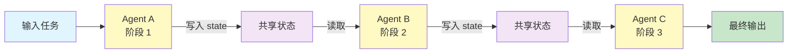
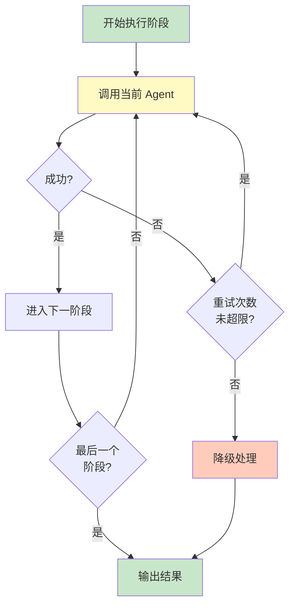

# 流水线模式（Pipeline）

## 模式概述

Pipeline（流水线）是一种多 Agent 协作模式：把一个复杂任务拆成多个阶段，每个阶段交给一个专用 Agent，按固定顺序依次执行。前一个 Agent 的输出直接成为下一个 Agent 的输入，信息单向流动，不回溯、不分支。

很多真实业务天然具有"流水线"特征——比如"写初稿 → 事实核查 → SEO 优化 → 发布"，或者"OCR 识别 → 内容提取 → 分类打标 → 入库"。如果让一个 Agent 包揽所有阶段，提示词会变得又长又杂，单个阶段的质量也很难保证。Pipeline 的做法是让每个 Agent 只管自己那一段，提示词聚焦、模型能力利用更高效，同时整体流程确定、易于调试。

> 一句话概括：多个专用 Agent 串成一条线，按固定顺序依次处理，每个 Agent 只做一件事，前一个的输出就是后一个的输入。

## 核心模块

Pipeline 由三类核心要素组成：

| 模块 | 作用 | 与其他模块的关系 |
|------|------|------------------|
| Stage Agent（阶段 Agent） | 负责流水线中某个特定阶段的处理 | 从共享状态读取上游输出，处理后写回共享状态 |
| Shared State（共享状态） | 在所有 Agent 之间传递数据的全局容器 | 每个 Agent 通过约定好的 key 读写数据 |
| Pipeline Executor（流水线执行器） | 按顺序调度各 Agent，处理错误和重试 | 控制执行流程，决定继续、重试还是中止 |

### 模块 1：Stage Agent（阶段 Agent）

每个阶段对应一个独立的 Agent，拥有自己的 System Prompt（系统提示词）、工具集和参数配置。它只需要理解本阶段的任务——比如"草稿生成 Agent"只管写初稿，"事实核查 Agent"只管验证事实。

关键设计原则：

- **单一职责**：一个 Agent 只处理一个阶段，不跨阶段操作
- **接口标准化**：所有 Agent 遵循相同的执行接口（输入状态 → 处理 → 输出状态），方便替换和复用
- **粒度适当**：按业务阶段自然划分，不要为了拆而拆。过度拆分会增加数据流转开销

### 模块 2：Shared State（共享状态）

共享状态是所有 Agent 之间传递数据的"公共黑板"。每个 Agent 通过约定好的 key（键名）从状态中读取需要的数据，处理完后把结果写回状态。

例如，草稿 Agent 把结果写入 `state["draft"]`，事实核查 Agent 从 `state["draft"]` 读取，处理后把修订版写入 `state["revised_draft"]`。这种方式让 Agent 之间不需要直接通信，只需要"认识"共享状态中的 key 就行。

### 模块 3：Pipeline Executor（流水线执行器）

执行器是流水线的"总调度"，它按顺序逐个调用各阶段的 Agent，并负责：

- **顺序控制**：严格按 Agent 列表的顺序依次执行
- **错误处理**：某个阶段失败时决定重试、降级还是中止
- **执行日志**：记录每个阶段的执行时间、输入输出、成功/失败状态

## 架构图



流程说明：

- **输入任务** 进入第一个 Agent，Agent 处理后把结果写入共享状态
- 下一个 Agent 从共享状态中读取所需数据，继续处理，再写回
- 依此类推，直到最后一个 Agent 输出最终结果
- 整个过程是**单向的**——信息只往后流，不回溯

当需要处理阶段失败的情况时，执行器的控制逻辑如下：



## 工作流程

1. **步骤 1（初始化）：** 创建共享状态对象，把用户输入写入 `state["input"]`。按顺序注册所有阶段 Agent。
2. **步骤 2（逐阶段执行）：** 执行器从第一个 Agent 开始，依次调用每个 Agent 的执行方法。Agent 从共享状态读取数据，处理后把结果写回状态。
3. **步骤 3（错误处理）：** 如果某个 Agent 执行失败，执行器按重试策略（如指数退避）重试。超过最大重试次数后，触发降级处理（使用备用 Agent、跳过该阶段、或中止管道）。
4. **步骤 4（输出）：** 最后一个 Agent 执行完成后，从共享状态读取最终结果并返回。

终止条件：所有 Agent 按顺序执行完毕，或某个 Agent 重试耗尽且无降级方案。

### 执行示例

任务：为一篇技术博客做"初稿 → 事实核查 → SEO 优化"的内容加工。

用户输入：**"写一篇关于 AI Agent 发展趋势的文章摘要"**

```
=== 初始化 ===
state = {"input": "写一篇关于 AI Agent 发展趋势的文章摘要"}

=== 阶段 1：草稿生成 Agent ===
读取: state["input"]
处理: 根据主题生成 500 字初稿
写入: state["draft"] = "AI Agent 是人工智能领域的关键方向..."

=== 阶段 2：事实核查 Agent ===
读取: state["draft"]
处理: 检查事实准确性，标注问题并修订
写入: state["revised_draft"] = "（修正时间线后的版本）..."

=== 阶段 3：SEO 优化 Agent ===
读取: state["revised_draft"]
处理: 优化关键词、标题和结构
写入: state["final_output"] = "AI Agent 发展趋势：技术突破与应用前景..."

=== 完成 ===
返回 state["final_output"]
```

三个 Agent 严格按顺序执行，每个 Agent 只做自己阶段的事，不会"回到第一步重新写"。整个过程是单向、确定的。

## 适用场景

### 适合的场景

1. **有天然阶段划分的任务**：任务本身就有明确的处理步骤，如"解析 → 提取 → 转换 → 存储"的数据处理流程，或"OCR → 内容提取 → 分类 → 入库"的文档处理。阶段之间边界清晰，适合用 Pipeline 隔离封装。
2. **多个专用 Agent 各有专长**：比如合同处理系统中，解析 Agent 负责提取条款，合规 Agent 验证法律风险，修改 Agent 生成改进意见，汇总 Agent 整合报告。每个 Agent 在自己的领域最强，Pipeline 让它们各司其职。
3. **单次处理即可满足质量要求**：不需要多轮反馈和迭代改进的任务。典型如内容发布流程"草稿 → 审核 → 优化 → 发布"，每个阶段一次完成。
4. **成本敏感且可接受一定延迟**：Pipeline 按顺序执行，不涉及并行或复杂协调，实现简单、成本可预测。适合离线报告生成、批量数据处理等场景。

### 不适合的场景

1. **需要根据中间结果动态调整流程**：如果某个阶段可能需要跳过或替换后续阶段，Pipeline 的固定顺序太僵硬。这种情况更适合 Supervisor（主管）模式或 Router（路由）模式。
2. **需要多轮反馈迭代**：如果任务需要"生成 → 评估 → 改进 → 再评估"的循环，Reflection（反思）模式更合适。Pipeline 不支持回溯。
3. **多个步骤可以并行**：如果几个处理步骤互不依赖、可以同时进行，Pipeline 的顺序执行反而是瓶颈，Master-Worker（主仆）模式的并行能力更高效。

## 典型实现

以下伪代码展示 Pipeline 的核心结构：

```python
# Pipeline 核心伪代码

class PipelineState:
    """共享状态：所有 Agent 通过 key 读写数据"""
    def __init__(self, input_data):
        self.data = {"input": input_data}

    def read(self, key):
        return self.data.get(key)

    def write(self, key, value):
        self.data[key] = value


class Pipeline:
    """流水线执行器：按顺序调度各阶段 Agent"""
    def __init__(self, agents, max_retries=2):
        self.agents = agents          # Agent 列表，按执行顺序排列
        self.max_retries = max_retries

    def run(self, input_data):
        state = PipelineState(input_data)
        for agent in self.agents:
            retries = 0
            while retries <= self.max_retries:
                try:
                    agent.execute(state)  # Agent 从 state 读取、处理、写回
                    break                 # 成功则进入下一个 Agent
                except Exception:
                    retries += 1
                    if retries > self.max_retries:
                        raise  # 超过重试上限，中止管道
        return state.read("final_output")
```

代码中 `PipelineState` 对应共享状态，`Pipeline.run()` 对应执行器的逐阶段调度逻辑。每个 `agent.execute(state)` 内部从 state 读取上游数据、处理、把结果写回 state。`max_retries` 控制单阶段的最大重试次数。

如果使用 LangGraph 框架，可以用 StateGraph 实现同样的 Pipeline 结构：

```python
# 基于 LangGraph 的 Pipeline（示意）
# 依赖：langgraph, langchain-openai

from langgraph.graph import StateGraph
from typing import TypedDict

class PipelineState(TypedDict):
    input_topic: str
    draft: str
    revised_draft: str
    final_output: str

def stage_draft(state: PipelineState) -> PipelineState:
    """阶段 1：草稿生成"""
    # 调用 LLM 生成草稿，写入 state["draft"]
    ...
    return state

def stage_review(state: PipelineState) -> PipelineState:
    """阶段 2：审核修订"""
    # 从 state["draft"] 读取，审核后写入 state["revised_draft"]
    ...
    return state

def stage_optimize(state: PipelineState) -> PipelineState:
    """阶段 3：优化输出"""
    # 从 state["revised_draft"] 读取，优化后写入 state["final_output"]
    ...
    return state

# 构建图：三个节点串联
workflow = StateGraph(PipelineState)
workflow.add_node("draft", stage_draft)
workflow.add_node("review", stage_review)
workflow.add_node("optimize", stage_optimize)
workflow.add_edge("draft", "review")      # draft → review
workflow.add_edge("review", "optimize")   # review → optimize
workflow.set_entry_point("draft")
workflow.set_finish_point("optimize")
graph = workflow.compile()
```

LangGraph 的 `add_edge` 定义了节点之间的固定顺序连接，形成线性 Pipeline。每个节点函数接收并返回同一个 `PipelineState`，通过状态中的字段传递数据。

## 优劣势分析

| 优势 | 劣势 |
|------|------|
| 结构清晰，执行顺序一目了然，新人容易理解 | 流程固定，无法根据中间结果动态调整路径 |
| 执行确定，相同输入产生相同流程，便于调试和复现 | 严格顺序执行，无法利用并行加速 |
| 每个 Agent 职责单一，可独立测试和替换 | 不支持回溯，对迭代改进型任务支持不足 |
| 成本透明，每个阶段的 token 消耗可独立统计和优化 | 所有阶段必须通过共享状态交换数据，格式需要预先约定 |

边界说明：Pipeline 的优势在任务阶段明确、顺序固定时最突出。当任务需要动态决策、并行处理或反复迭代时，它的结构反而成为约束。

## 与相关模式的对比

| 对比维度 | Pipeline（流水线） | Master-Worker（主仆） | Reflection（反思） |
|---------|-------------------|----------------------|-------------------|
| 核心思想 | 多 Agent 按固定顺序串行处理 | Master 分配任务，Worker 并行执行 | Agent 自我评估，循环迭代改进 |
| 执行方式 | 严格顺序，单向流动 | 并行 + 汇总 | 循环迭代，可多轮 |
| 信息流 | 单向，不回溯 | 扇出（分发）+ 扇入（汇总） | 闭环反馈 |
| 适用场景 | 阶段清晰、顺序固定的流程 | 多个独立子任务可并行 | 需要质量优化和迭代 |
| 实现难度 | 低 | 中等 | 中等 |
| 成本可预测性 | 高（阶段数固定） | 中等（Worker 数可变） | 低（迭代轮次不确定） |

选择建议：

- 任务有"A → B → C"的天然顺序 → **Pipeline**
- 有多个独立子任务可以同时做 → **Master-Worker**
- 单次输出质量不稳定，需要反复打磨 → **Reflection**

## 常见误区

| 常见误区 | 正确理解 |
|----------|----------|
| Pipeline 就是一个 Agent 调用多个工具 | Pipeline 是**多个 Agent 之间的协作**，每个阶段是一个完整 Agent（有自己的提示词和工具集），不是单个 Agent 内部的多步工具调用 |
| 阶段越多越好，拆得越细越好 | 阶段粒度应按业务自然划分。过度拆分会增加状态传递开销和出错概率，反而降低效率 |
| Pipeline 不能处理错误 | Pipeline 可以在执行器层实现重试、降级、备用 Agent 等错误处理策略，关键是在每个阶段预设好失败处理逻辑 |
| Pipeline 和 Chain（链）完全一样 | LangChain 中的 Chain 通常指单个 Agent 内部的提示词链式组合；Pipeline 指多个独立 Agent 组成的协作流水线，粒度更大、职责隔离更彻底 |

## 思考题

<details>
<summary>初级：Pipeline 和让一个 Agent 包揽所有任务有什么区别？</summary>

**参考答案：**

单 Agent 包揽所有任务时，提示词会变得很长且杂乱，模型在不同阶段的表现参差不齐。Pipeline 的做法是把任务拆成多个阶段，每个阶段交给一个专用 Agent，提示词更聚焦，每个阶段的质量更容易保证。同时，某个阶段有问题时可以单独定位和修复，不会影响其他阶段。

</details>

<details>
<summary>中级：如果 Pipeline 中间某个阶段需要"回到上一步重做"，该怎么处理？</summary>

**参考答案：**

严格的 Pipeline 不支持回溯——这正是它"单向流动"的核心特征。如果确实需要回溯，有两种处理方式：一是在执行器层实现"阶段级重试"，让失败的阶段重新执行自身（但不回到前面的阶段）；二是承认该任务不适合纯 Pipeline，考虑切换到 Reflection 模式（支持循环迭代）或在 Pipeline 末尾追加一个质量评估阶段，评估不通过则整条 Pipeline 重跑。后者本质上已经偏离了纯 Pipeline，更接近"Pipeline + Reflection"的混合模式。

</details>

<details>
<summary>中级：什么情况下应该从 Pipeline 切换到 Master-Worker？</summary>

**参考答案：**

当多个处理步骤之间没有依赖关系、可以并行执行时。例如"同时从三个数据源抓取数据"或"同时对一篇文章做事实核查、语法检查和格式检查"，这些任务互不依赖，Pipeline 的顺序执行会浪费时间。Master-Worker 可以让 Master 把任务分发给多个 Worker 并行处理，最后汇总结果，显著提升吞吐量。判断标准是：如果去掉阶段之间的顺序依赖，任务仍然能正确完成，就说明更适合 Master-Worker。

</details>

## 参考资料

1. Microsoft Azure - AI Agent Design Patterns: https://learn.microsoft.com/en-us/azure/architecture/ai-ml/guide/ai-agent-design-patterns — 微软 Azure 架构中心对多 Agent 编排模式的系统总结，包含 Sequential（顺序）和 Parallel（并行）等模式
2. LangGraph 官方文档 - Multi-Agent Systems: https://langchain-ai.github.io/langgraph/ — LangChain 生态中用于构建多 Agent 工作流的框架，原生支持 StateGraph 图结构
3. DeepLearning.AI - Agentic AI（Andrew Ng）: https://www.deeplearning.ai/courses/agentic-ai/ — 吴恩达关于 Agentic AI 四大设计模式的课程，涵盖 Multi-Agent Collaboration 等模式
