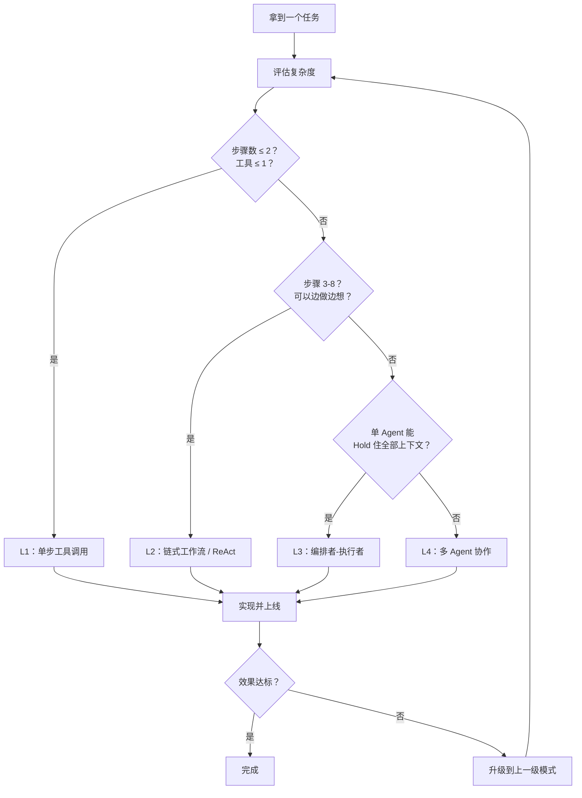

# 按复杂度选型（Pattern Selection by Complexity）

## 概念解释

按复杂度选型是一种 Agent 设计模式的决策方法：先评估任务有多复杂，再选一个刚好够用的 Agent 架构，不多不少。

为什么需要这套方法？因为开发者常犯两种错误：一是"大炮打蚊子"——简单的查天气任务也用多 Agent 协作，白白浪费 token 和时间；二是"小马拉大车"——复杂的系统设计任务只用一个简单的工具调用 Agent，根本完成不了。Anthropic 在与数十个团队合作后总结出一条核心原则：**从最简单的方案开始，只在确实需要时才增加复杂度**。

这个概念在 Agent 系统设计中扮演"选型指南"的角色。它不是一个具体的技术实现，而是一套帮你做架构决策的思维框架——在动手写代码之前，先回答"我该用什么级别的 Agent"。

## 关键结构

按复杂度选型的核心是一个**四层阶梯模型**，任务复杂度从低到高，对应的 Agent 架构也从简到繁：

| 复杂度层级 | 推荐模式 | 典型特征 | 成本量级 |
|-----------|---------|---------|---------|
| L1 简单 | 单步工具调用 | 1-2 步，1 个工具，无需推理 | 1 次 LLM 调用 |
| L2 中等 | 链式工作流 / ReAct | 3-8 步，多个工具，需要动态判断 | 3-5 次 LLM 调用 |
| L3 复杂 | 编排者-执行者（Orchestrator-Workers） | 步骤数不确定，需要先规划再执行 | 5-15 次 LLM 调用 |
| L4 极复杂 | 多 Agent 协作系统 | 跨领域、需要专业化分工、并行处理 | 数十次 LLM 调用 |

### L1：单步工具调用

最简单的模式。用户说一句话，Agent 调一个工具，直接返回结果。适合查天气、翻译、汇率换算这类"一问一答"场景。没有推理过程，就是个"智能路由器"。

### L2：链式工作流 / ReAct

任务需要多步完成，每一步的结果会影响下一步怎么走。比如用户问"对比 A 和 B 的优劣"，Agent 需要先查 A 的信息、再查 B 的信息、最后综合对比。ReAct（Reasoning + Acting，推理与行动）模式就是为这类场景设计的——Agent 在"思考-行动-观察"的循环中逐步推进。

### L3：编排者-执行者

当任务步骤太多、复杂度太高时，"边想边做"不够了，需要**先做一个整体规划，再按计划逐步执行**。Anthropic 称之为 Orchestrator-Workers（编排者-执行者）模式：一个编排者负责拆解任务和分配工作，多个执行者各自完成分配到的子任务。

### L4：多 Agent 协作系统

当单个 Agent 的上下文窗口装不下所有信息、或者任务涉及多个专业领域时，就需要多个独立 Agent 分工协作。每个 Agent 有自己的专长、工具集和提示词，通过某种协调机制（如 Handoff（任务交接）、消息队列）完成整体任务。

## 核心原理

### 原理说明

按复杂度选型的核心逻辑可以总结为三步：

**第一步：评估任务复杂度。** 从四个维度打分：
- **步骤数**：完成任务需要几步？1-2 步是简单，3-8 步是中等，8 步以上是复杂
- **工具种类**：需要调用几种不同的工具或 API？
- **推理深度**：每步之间有没有逻辑依赖？需不需要动态调整？
- **领域跨度**：任务是否涉及多个专业领域？

**第二步：匹配最低够用的模式。** 按"刚好够用"原则，选择能完成任务的最简模式。不要一上来就上多 Agent。

**第三步：验证并迭代。** 上线后如果发现当前模式搞不定（比如准确率低、经常"迷路"），再考虑升级到上一级模式。

这套方法的关键洞察是：**复杂度不是越高越好，而是越匹配越好。** 每升一级，都会带来额外的延迟、成本和调试难度。Google Cloud、Microsoft Azure 和 Anthropic 的官方指南都强调了这一点。

### Mermaid 图解



图中的核心路径是一条**从上到下的筛选链**：先问最简单的能不能搞定，不行再往下走。右侧的"升级"回路体现了渐进式升级的思想——不是一次性选定，而是可以迭代调整。

### 运行示例

用伪代码展示选型决策逻辑：

```python
def select_pattern(task):
    """根据任务特征选择合适的 Agent 模式"""
    steps = task.estimate_steps()       # 预估步骤数
    tools = len(task.required_tools())  # 所需工具数量
    needs_planning = task.needs_upfront_plan()  # 是否需要先规划
    cross_domain = task.is_cross_domain()       # 是否跨领域

    if steps <= 2 and tools <= 1:
        return "L1: 单步工具调用"
    elif steps <= 8 and not needs_planning:
        return "L2: 链式工作流 / ReAct"
    elif not cross_domain:
        return "L3: 编排者-执行者"
    else:
        return "L4: 多 Agent 协作"

# 示例判断
# "查北京天气"        → L1（1 步，1 个工具）
# "对比 Python 和 Go" → L2（多步搜索 + 综合）
# "设计电商架构"       → L3（需要规划 + 分步执行）
# "跨部门数据分析流水线" → L4（多领域、需并行）
```

伪代码省略了实际的 LLM 调用和工具执行，只展示决策逻辑。实际工程中，`estimate_steps()` 等方法通常由开发者根据业务经验人工判断，而非自动计算。

## 易混概念辨析

| 概念 | 与按复杂度选型的区别 | 更适合关注的重点 |
|------|---------------------|------------------|
| Agent 设计模式（如 ReAct、Plan-and-Solve） | 它们是"被选择的对象"，按复杂度选型是"选择的方法" | 单个模式的内部机制和实现细节 |
| 模型选型（Model Selection） | 选的是用哪个 LLM（如 GPT-4 vs Claude），不是架构模式 | 模型能力、成本、速度的对比 |
| 提示词工程（Prompt Engineering） | 优化的是单次 LLM 调用的输入质量，不涉及架构层面的复杂度分级 | 指令清晰度、上下文设计、输出格式 |

核心区别：

- **按复杂度选型**：关注的是"任务和架构的匹配"，是架构层面的决策
- **Agent 设计模式**：关注的是"某个具体模式怎么运作"，是实现层面的知识
- **模型选型**：关注的是"用哪个模型"，是资源层面的选择

## 适用边界与局限

### 适用场景

1. **项目启动阶段做架构决策**：团队拿到需求后，用这套框架快速判断该用什么级别的 Agent，避免从一开始就过度设计
2. **已有系统的性能诊断**：当前 Agent 效果不好时，可以用复杂度评估来判断是不是"模式选错了"——可能简单任务用了太重的架构，或者复杂任务用了太轻的架构
3. **团队技术对齐**：建立统一的"模式语言"，让不同背景的成员能快速达成共识："这个任务是 L2 级别的，用 ReAct 就够了"

### 不适合的场景

1. **任务复杂度频繁变化**：如果同一个入口可能接收到 L1 到 L4 各种级别的任务，静态选型就不够了，需要动态路由（Routing）机制
2. **极端延迟敏感的场景**：如果要求毫秒级响应，连 L2 的多步推理都可能太慢，这时需要的不是选型框架，而是预计算或缓存方案

### 局限性

1. **分级边界模糊**：有些任务介于 L2 和 L3 之间，很难明确归类。实际选型往往需要"试一试再调整"，而不是纯理论推导
2. **升级不是无缝的**：从 L2 升级到 L3 可能需要重写大量代码。虽然"渐进式升级"听起来很优雅，但实际工程中切换模式的成本不可忽视
3. **忽略了工具质量的影响**：工具设计得好，L1 就能解决的问题，工具设计得烂，L2 都可能搞不定。选型框架假设工具质量是稳定的，但现实中这是个重要变量

## 常见误区

| 常见误区 | 正确理解 |
|----------|----------|
| 多 Agent 一定比单 Agent 强 | 多 Agent 增加了协调开销（通常成本增加 30-50%）。单 Agent + 好工具在大多数场景下更高效。Anthropic 明确指出：最成功的实现往往用的是简单的可组合模式 |
| 选了一个模式就不能换 | 选型是可迭代的。先从最简方案上线，根据实际效果决定是否升级。很多成功的企业系统都是从单 Agent 逐步演进到多 Agent 的 |
| 复杂度只看步骤数 | 步骤数只是一个维度。还要看工具种类、推理深度、领域跨度、是否需要提前规划等。有些 3 步任务因为推理极深，也可能需要 L3 级别 |
| 用了框架就等于选对了模式 | 框架（如 LangChain、CrewAI）是实现工具，不是选型依据。Anthropic 建议先直接用 LLM API，因为很多模式只需几行代码就能实现，框架反而增加了抽象层，更难调试 |

## 思考题

<details>
<summary>初级：以下四个任务分别对应哪个复杂度层级？(a) 翻译一段英文 (b) 综合三篇论文写摘要 (c) 为 SaaS 产品设计微服务架构 (d) 查今天的股价</summary>

**参考答案：**

- (a) L1：单步工具调用，1 个翻译工具即可
- (d) L1：单步工具调用，1 个股价 API 即可
- (b) L2：需要多步（检索论文、提取要点、综合归纳），适合 ReAct
- (c) L3 或 L4：需要先规划（模块划分、接口设计、安全策略），步骤多且有全局约束。如果涉及多个专业领域（安全、合规、性能）的深度分析，可能需要 L4

</details>

<details>
<summary>中级：一个客服 Agent 目前用 ReAct 模式运行良好，但最近发现处理退款 + 物流 + 合规审查的组合问题时经常失败。应该怎么分析和决策？</summary>

**参考答案：**

先确认失败原因：是工具不够（缺少合规查询工具）、还是推理深度不够（步骤太多导致"迷路"）、还是上下文装不下（三个领域的信息量超出窗口）。

- 如果只是缺工具 → 补工具，留在 L2
- 如果是步骤太多、需要先规划 → 升级到 L3，加入显式的任务分解环节
- 如果是跨领域信息量太大、且需要并行处理 → 考虑 L4，拆成退款 Agent、物流 Agent、合规 Agent 分别处理

关键原则：先排除简单原因（工具/提示词优化），再考虑架构升级。

</details>

<details>
<summary>中级/进阶：为什么 Anthropic、Google、Microsoft 都强调"从简单开始"？如果一个团队一开始就有明确的复杂需求，是否可以直接从 L4 起步？</summary>

**参考答案：**

"从简单开始"的核心原因有三个：(1) 简单系统更容易调试和定位问题，复杂系统出错时排查链路很长；(2) 每增加一级复杂度都会带来 30-50% 的额外成本（协调开销、消息传递、冗余调用）；(3) 很多看似复杂的需求，在工具设计得当的情况下，单 Agent 就能解决。

但如果团队确实有明确的复杂需求（如已验证单 Agent 无法满足、有清晰的领域分工边界、有充足的工程资源），可以直接从 L3 或 L4 起步。关键前提是：团队对简单模式的能力边界有清晰认知，是主动选择而非盲目追求。跳过简单阶段的风险是——你可能永远不知道用更简单的方案是否就够了。

</details>

## 参考资料

1. Anthropic. "Building Effective Agents." https://www.anthropic.com/research/building-effective-agents
2. Google Cloud. "Choose a design pattern for your agentic AI system." https://docs.cloud.google.com/architecture/choose-design-pattern-agentic-ai-system
3. Microsoft Learn. "Choosing Between Building a Single-Agent System or Multi-Agent System." https://learn.microsoft.com/en-us/azure/cloud-adoption-framework/ai-agents/single-agent-multiple-agents
4. Microsoft Learn. "AI Agent Orchestration Patterns." https://learn.microsoft.com/en-us/azure/architecture/ai-ml/guide/ai-agent-design-patterns
5. OpenAI. "A Practical Guide to Building Agents." https://openai.com/business/guides-and-resources/a-practical-guide-to-building-ai-agents/
6. LangChain Blog. "Choosing the Right Multi-Agent Architecture." https://blog.langchain.com/choosing-the-right-multi-agent-architecture/
