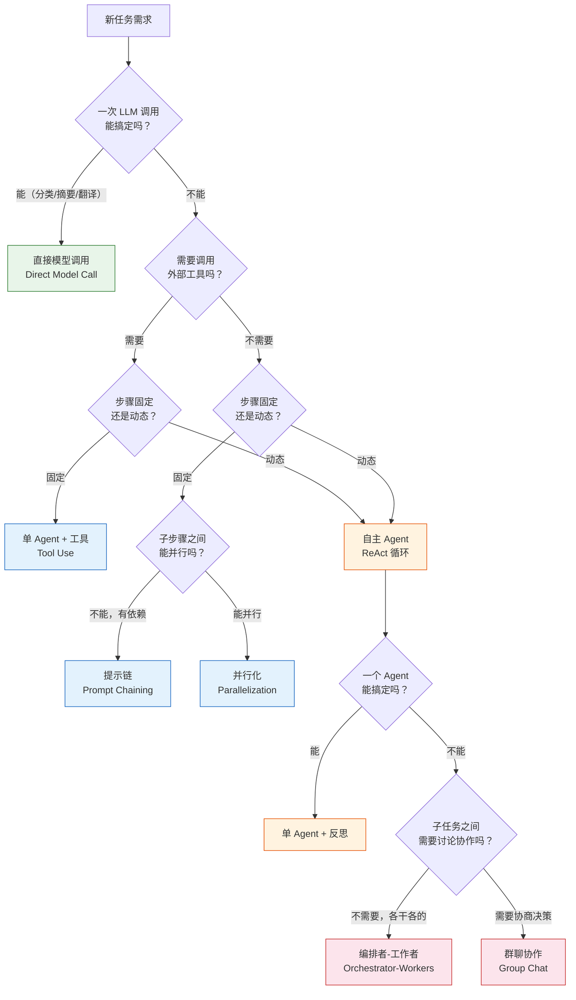

# 按场景选型（Pattern Selection by Scenario）

## 概念解释

按场景选型，就是在动手开发 Agent 之前，先搞清楚你的任务到底需要什么能力，然后选择"刚好够用"的设计模式。

这个概念之所以重要，是因为 Agent 设计模式从简单到复杂有很多层级：最简单的是一次 LLM 调用（Direct Model Call，直接模型调用），复杂的可以是十几个 Agent 协同工作的多智能体系统。选错了模式，要么过度设计——花了三个月搭建多 Agent 架构，结果一个提示链（Prompt Chaining）就能搞定；要么能力不足——用单次调用去处理需要多轮迭代的代码生成任务，效果惨不忍睹。

Anthropic 在其 Building Effective Agents 指南中明确建议："先找最简单的方案，只在必要时才增加复杂度。" Microsoft Azure 架构中心也把复杂度分成三级：直接模型调用 → 单 Agent + 工具 → 多 Agent 编排，强调"用最低复杂度满足需求"。这个原则是按场景选型的核心。

## 关键结构

选型决策围绕三个维度展开：

| 维度 | 关键问题 | 影响 |
|------|---------|------|
| 任务可分解性 | 任务能否拆成固定步骤？还是步骤本身需要动态决定？ | 决定用 Workflow（工作流）还是 Agent（自主智能体） |
| 并行度 | 子任务之间是否独立、可以同时处理？ | 决定是串行管道还是并行扇出 |
| 迭代需求 | 输出需不需要"生成→评估→改进"的反复打磨？ | 决定是否引入反思（Reflection）循环 |

### 维度 1：任务可分解性

这是最关键的判断。如果任务步骤是固定的、可预测的（比如"翻译→校对→排版"），用 Workflow 就够了——你提前把路径写死，每一步该干什么都确定。如果步骤本身需要 LLM 自己决定（比如"研究一个开放课题"），就需要 Agent 来动态规划。

### 维度 2：并行度

有些任务的子步骤互不依赖。比如审核一篇文章，可以同时检查"事实准确性""语法""政策合规性"，三路并行再汇总结果。并行处理能显著降低延迟，但需要一个汇聚机制来合并结果。

### 维度 3：迭代需求

代码生成、文学翻译这类任务，一次输出往往不够好。需要一个评估器打分、给反馈，然后生成器据此改进，循环往复直到达标。这种"评估者-优化者"（Evaluator-Optimizer）模式会增加 2-3 倍的 Token 消耗，只有在迭代确实能带来可衡量的质量提升时才值得用。

## 核心原理

### 原理说明

按场景选型的核心逻辑是一棵决策树，从最简单的方案开始，逐步升级：

1. **能不能一次调用搞定？** —— 分类、摘要、翻译这类任务，一个好的 Prompt 就足够了，不需要任何 Agent 逻辑。
2. **需不需要调用工具？** —— 如果要查数据库、调 API，就需要单 Agent + 工具（Tool Use）。大多数企业场景在这一层就能解决。
3. **步骤是固定的还是动态的？** —— 固定步骤用 Workflow（提示链、路由、并行化等），动态步骤用自主 Agent。
4. **一个 Agent 能不能搞定？** —— 如果单 Agent 的 Prompt 已经超负荷、工具太多、或者需要不同的安全边界，才升级到多 Agent 编排。

每升一级，都会增加协调开销、延迟和成本。所以选型的原则不是"越高级越好"，而是"在当前层级能解决就不要升级"。

### Mermaid 图解



图解说明：
- **绿色**（直接调用）：最低成本，适合单步骤任务
- **蓝色**（Workflow 层）：固定流程，可预测、易调试
- **橙色**（单 Agent 层）：动态决策，灵活但消耗更多 Token
- **红色**（多 Agent 层）：协调开销最大，只在单 Agent 力不从心时使用

### 运行示例

下面用伪代码展示选型逻辑的核心思路：

```python
def select_pattern(task):
    """根据任务特征选择 Agent 设计模式"""
    # 第一关：能不能一次搞定
    if task.is_single_step:
        return "direct_model_call"

    # 第二关：步骤是否固定
    if task.steps_are_predictable:
        if task.steps_are_independent:
            return "parallelization"       # 并行化
        else:
            return "prompt_chaining"       # 提示链

    # 第三关：需要多少个 Agent
    if task.single_domain and task.tool_count < 10:
        return "single_agent_with_tools"   # 单 Agent + 工具

    # 第四关：多 Agent 的协作方式
    if task.subtasks_need_discussion:
        return "group_chat"                # 群聊协作
    else:
        return "orchestrator_workers"      # 编排者-工作者
```

这段伪代码对应决策树的判断逻辑，实际选型时需要综合考虑延迟、成本和可靠性等约束。

## 易混概念辨析

| 概念 | 与按场景选型的区别 | 更适合关注的重点 |
|------|-------------------|------------------|
| 模式对比（Pattern Comparison） | 模式对比聚焦"两个模式之间有什么不同"，是横向比较；按场景选型聚焦"我的任务该用哪个"，是纵向匹配 | 已经缩小到两个候选模式时，用对比做最终决定 |
| 技术选型（Tech Stack Selection） | 技术选型选的是具体框架和工具（LangChain vs CrewAI）；按场景选型选的是抽象模式（提示链 vs 编排者-工作者） | 先定模式，再选框架——模式是"设计"，框架是"实现" |
| 复杂度评估（Complexity Assessment） | 复杂度评估只回答"这个任务有多复杂"，不回答"该用什么模式"；按场景选型把复杂度评估作为输入之一 | 作为选型的第一步，判断任务在复杂度光谱上的位置 |

核心区别：

- **按场景选型**：从任务需求出发，匹配最合适的设计模式
- **模式对比**：从模式出发，比较各自的优劣
- **技术选型**：从实现出发，选择具体的框架和工具

## 适用边界与局限

### 适用场景

1. **新项目启动阶段**：团队面对一个新需求，还没决定架构方向。用决策树快速定位起点，避免在"用不用多 Agent"这种问题上空转
2. **架构评审与方案汇报**：需要向非技术人员解释"为什么选这个方案"。决策树提供了清晰的推理路径，比"凭经验"更有说服力
3. **从原型升级到生产**：原型跑通了但扛不住真实负载。按场景选型的升级路径（如从提示链升级到编排者-工作者）提供了渐进式演进的方向

### 不适合的场景

1. **已经有成熟架构的存量系统**：这类系统的约束来自历史代码和团队能力，不是"选什么模式"能解决的
2. **高度创新或未知领域**：如果连任务本身都还没定义清楚（比如"用 AI 做点什么"），选型框架无法发挥作用——先搞清楚要解决什么问题

### 局限性

1. **决策树是简化模型**：现实中的任务往往不能干净地回答"是/否"。一个客服系统可能 80% 的请求是固定流程，但 20% 需要动态推理——这时就需要混合模式，而不是简单选一个
2. **忽略非功能性约束**：决策树主要从"功能需求"出发，但成本预算、团队技术栈、上线时间等非功能性约束同样影响选型。预算只够一个 API 的团队，再合适的多 Agent 方案也用不了
3. **模式边界不绝对**：Anthropic 的提示链和 Microsoft 的顺序编排（Sequential Orchestration）本质上是同一个东西，但名字和细节不同。不同来源的模式分类方法可能互相矛盾

## 常见误区

| 常见误区 | 正确理解 |
|----------|----------|
| 越复杂的模式效果越好 | 研究表明多 Agent 系统在并行任务上能提升 81% 性能，但在串行任务上反而会下降高达 70%。复杂度错配会适得其反 |
| 所有 Agent 都需要反思（Reflection） | 反思循环会增加 2-3 倍 Token 消耗。只有在"迭代确实能提升质量"的场景（如代码生成、文学翻译）才值得用。客服问答不需要 Agent 自己评价回答质量 |
| 先选框架再定模式 | 正确顺序是：分析任务 → 选定模式 → 再选框架。先看了 LangGraph 的文档就决定用多 Agent 编排，是本末倒置 |
| 单 Agent 不够就直接上多 Agent | 中间还有很多选项：优化 Prompt、精简工具集、引入 RAG、加路由分流。Azure 架构指南指出"单 Agent + 工具"往往是企业场景的正确默认选择 |

## 思考题

<details>
<summary>初级：Anthropic 把 Agent 系统分为 Workflow 和 Agent 两大类，它们的核心区别是什么？</summary>

**参考答案：**

Workflow（工作流）通过预定义的代码路径来编排 LLM 和工具，步骤是固定的、可预测的；Agent（自主智能体）由 LLM 动态决定自己的处理流程和工具使用，步骤是不确定的。简单说：Workflow 是"你告诉它怎么走"，Agent 是"它自己决定怎么走"。

</details>

<details>
<summary>中级：一个电商平台要做订单异常检测系统。需求是——每笔订单进来后，同时检查"支付风控""库存校验""地址合规"三个维度，任意一项不通过就拦截。应该选什么模式？为什么？</summary>

**参考答案：**

应该选并行化（Parallelization）模式，具体是"分段"（Sectioning）变体。理由：三个检查维度互相独立、不需要串行依赖，可以同时执行以降低延迟；最后用汇聚逻辑（任意一项不通过 → 拦截）合并结果。不需要多 Agent 编排，因为每个检查任务是固定的、不需要动态规划。如果三个检查结果可能冲突需要讨论，才考虑群聊模式，但这里是简单的"与"逻辑，并行化足够了。

</details>

<details>
<summary>中级/进阶：你的团队目前有一个基于提示链的文档处理系统（解析→抽取→验证→输出），运行良好。现在新需求来了：部分文档类型需要额外的"法规合规检查"步骤，而且哪些文档需要这步是不确定的。你会怎么升级？</summary>

**参考答案：**

有两种升级路径，取决于"不确定性"的程度：

（1）如果可以用规则判断（比如"合同类文档一律做合规检查"），在现有提示链中加一个路由（Routing）节点即可——先分类文档类型，再走不同的后续链路。这保持了 Workflow 的可预测性，改动最小。

（2）如果判断本身需要 LLM 理解文档内容后才能决定（比如"包含敏感条款的才做合规检查"），就需要把分类步骤升级为一个有工具访问能力的单 Agent，由它动态决定是否触发合规检查。这引入了 Agent 层的灵活性，但也增加了调试复杂度。

优先尝试方案 1，因为路由模式仍然是 Workflow，比引入 Agent 更可控。

</details>

## 参考资料

1. Anthropic. Building Effective Agents. https://www.anthropic.com/engineering/building-effective-agents
2. Microsoft Azure Architecture Center. AI Agent Orchestration Patterns (2026-02). https://learn.microsoft.com/en-us/azure/architecture/ai-ml/guide/ai-agent-design-patterns
3. Redis Blog. AI Agent Architecture Patterns: Single & Multi-Agent Systems (2026-02). https://redis.io/en/blog/ai-agent-architecture-patterns/
4. SitePoint. Agentic Design Patterns: The 2026 Guide to Building Autonomous Systems (2026-03). https://www.sitepoint.com/the-definitive-guide-to-agentic-design-patterns-in-2026
5. Microsoft ISE Developer Blog. Patterns for Building a Scalable Multi-Agent System (2025-11). https://devblogs.microsoft.com/ise/multi-agent-systems-at-scale/
