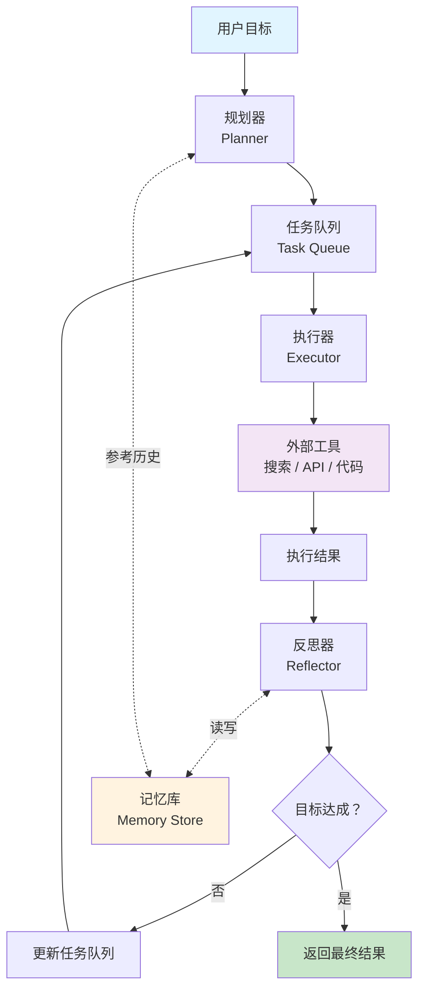

# 自主型 Agent（Autonomous Agent）

## 模式概述

自主型 Agent 是一种"给目标、不管过程"的 Agent 设计模式。用户只需提供一个高层目标（比如"帮我调研 XX 市场的竞争格局"），Agent 会自动把目标拆成一系列子任务，逐个执行，遇到问题自动调整计划，最终交付结果——中间过程不需要人工干预。

> 一句话概括：用户定义"做什么"，Agent 自己决定"怎么做"，通过规划-执行-反思的闭环循环自主完成复杂任务。

在自主型 Agent 出现之前，基于 LLM（Large Language Model，大语言模型）的系统主要有两种工作模式：一种是"被动响应型"，用户说一句 Agent 做一步，离了人就不动；另一种是 ReAct 这类"单问题循环型"，能边想边做，但只关注当前问题，缺少对多个关联任务的全局规划能力和跨任务的记忆。

自主型 Agent 在这两者基础上做了关键升级：它把**目标分解**（Goal Decomposition）、**迭代执行**、**自我反思**（Self-Reflection）和**长期记忆**（Long-term Memory）整合成一个完整闭环。代表性项目包括 AutoGPT（2023 年发布，GitHub 超 16 万星）和 BabyAGI（Yohei Nakajima 在 2023 年开源的任务管理型 Agent）。Lilian Weng（OpenAI 安全团队负责人）在 2023 年的博客文章 *LLM Powered Autonomous Agents* 中系统性地总结了这一模式的核心架构，将其归纳为 Planning + Memory + Tool Use 三大组件。

在 Agent 设计模式体系中，自主型 Agent 属于**单 Agent 模式**中的高阶形态，是 ReAct 和 Plan-and-Solve 的进一步演进。

## 核心模块

自主型 Agent 由四个核心模块协作运行：

| 模块 | 作用 | 与其他模块的关系 |
|------|------|------------------|
| 规划器（Planner） | 将高层目标拆解为有序的子任务列表 | 输出任务队列，供执行器逐个处理 |
| 执行器（Executor） | 执行单个子任务，调用外部工具获取结果 | 从任务队列取任务，执行结果交给反思器评估 |
| 反思器（Reflector） | 评估执行结果，决定是否调整后续计划 | 根据执行结果和记忆库的历史经验，更新任务队列 |
| 记忆库（Memory Store） | 存储已完成任务的结果和经验教训 | 被反思器读写，为规划器和执行器提供历史参考 |

### 模块 1：规划器（Planner）

规划器是自主型 Agent 的"大脑"。它接收用户的高层目标，利用 LLM 的推理能力分析目标的复杂度和边界，将其拆解为多个子任务，并根据依赖关系和优先级排序。

拆解的关键不只是"列清单"，而是要识别任务之间的前后依赖。例如"写竞品分析报告"这个目标，规划器需要知道"先收集信息，再做对比分析，最后写建议"——如果顺序反了，后面的任务就没有输入数据。

### 模块 2：执行器（Executor）

执行器负责实际干活。它从任务队列中取出优先级最高且依赖已满足的任务，决定需要调用哪些外部工具（如搜索引擎、API、代码解释器），执行后返回结果。

执行器本身可以看作一个小型 ReAct 循环——拿到任务后思考该用什么工具，调用工具，观察结果。

### 模块 3：反思器（Reflector）

反思器是自主型 Agent 区别于普通工具调用链的关键。每次任务执行完毕后，反思器会：

1. 评估结果是否达到预期
2. 从记忆库中检索类似的历史任务，对比本次执行的效果
3. 如果失败，生成调整方案（换个搜索关键词、拆分子任务、降级处理等）
4. 如果成功，提取关键成功因素，写入记忆库

反思器的存在让 Agent 具备了"越做越聪明"的能力——这也是 Reflexion（一种自我反思框架，Shinn & Labash 2023 年提出）的核心思想。

### 模块 4：记忆库（Memory Store）

记忆库通常基于向量数据库（Vector Database，一种通过语义相似度检索信息的数据库，如 FAISS、Pinecone）实现。它存储的不是原始聊天记录，而是结构化的任务经验：任务描述、执行结果、成功/失败标记、关键洞察。

当新任务进来时，Agent 可以通过语义检索找到相关的历史经验，避免重复尝试已知行不通的方案。这和人类"吃一堑长一智"的学习过程类似。

## 架构图



流程说明：

- **规划器**接收用户目标，拆解为子任务列表放入任务队列
- **执行器**从队列中取任务，调用外部工具执行
- **反思器**评估每次执行结果，决定是继续下一个任务、调整计划还是终止循环
- **记忆库**贯穿全程，为规划和反思提供历史经验参考
- 虚线箭头表示记忆的读写操作，实线箭头表示数据和控制的主流程

## 工作流程

1. **步骤 1：目标分析与任务分解。** 输入：用户的高层目标（如"分析竞争对手 X 公司的战略方向"）。规划器利用 LLM 分析目标复杂度，拆解为多个子任务并排定优先级和依赖关系。输出：带优先级和依赖标记的任务队列。

2. **步骤 2：选取并执行任务。** 输入：任务队列中优先级最高且依赖已完成的任务。执行器决定调用哪些工具（搜索、数据库查询、代码执行等），执行后收集结果。输出：任务执行结果和过程日志。

3. **步骤 3：反思与调整。** 输入：当前任务的执行结果 + 记忆库中的历史经验。反思器评估结果质量，判断是否需要重试、补充新任务或调整后续任务优先级。如果成功，关键经验写入记忆库。输出：更新后的任务队列和新增的记忆条目。

4. **步骤 4：终止判断。** 检查是否满足终止条件：所有核心任务已完成、达到最大迭代次数（防止无限循环）、或检测到死锁（同一任务反复失败）。如果未终止，回到步骤 2 继续。

### 执行示例

用户目标：**"分析竞争对手 X 公司 2025 年的战略方向，给出应对建议"**

**第 1 轮——规划**
```
规划器分析目标，生成任务队列：
  Task 1 (优先级 9): 搜索 X 公司 2024-2025 年新闻和产品发布
  Task 2 (优先级 8): 获取 X 公司财务报告数据
  Task 3 (优先级 7): 收集分析师对 X 公司战略的评论
  Task 4 (优先级 6): 对标分析（依赖 Task 2、Task 3）
  Task 5 (优先级 5): 生成应对建议（依赖 Task 4）
```

**第 2 轮——执行 Task 1**
```
执行器调用搜索工具 → 获得 3 条关键信息：
  - X 公司投入 $500M 进入 AI 芯片领域
  - X 公司推出面向中小企业的云平台
  - X 公司与头部厂商达成战略联盟

反思器评估：搜索结果充分，Task 1 标记完成。
发现新信息维度 → 在 Task 4 前插入补充任务：
  Task 3.5 (优先级 8): 深入研究 X 公司 AI 芯片战略细节
```

**第 3 轮——执行 Task 2**
```
执行器查询财务数据 → 2024 年营收同比增长 25%，R&D 支出占比 18%

反思器评估：R&D 投入方向与新闻信息一致，
将"X 公司战略重心转向 AI+云计算"作为关键洞察存入记忆库。
```

**后续轮次**依次执行 Task 3、Task 3.5、Task 4、Task 5。每轮反思器都会评估结果、更新记忆。最终 Task 5 基于前面所有信息生成应对建议，循环终止。

## 适用场景

### 适合的场景

1. **复杂多步骤项目**：市场调研、数据分析报告、产品设计方案。这类任务无法一步完成，需要多个子任务串联和并行，自主型 Agent 能自动规划执行流程。
2. **信息不完整的开放式问题**："研究一个陌生的技术领域""为企业做战略规划"。Agent 能在执行中发现信息缺口，主动添加补充任务，而不是卡在某一步等人工指示。
3. **需要持续学习的长期任务**：A/B 测试优化、持续的竞品监控、定期报告生成。Agent 通过记忆库积累历史经验，策略会越来越好。

### 不适合的场景

1. **简单的单次任务**：查天气、翻译一句话、获取股票价格。启动规划-执行-反思的完整循环反而增加延迟和成本，不如直接调用工具。
2. **实时性要求极高的场景**：在线客服、实时翻译、即时推荐。多轮迭代和记忆操作引入的延迟无法满足毫秒级响应要求。
3. **流程完全固定的场景**：严格按标准执行的审批流程、合规检查。每一步已经明确定义，Agent 的自主决策反而可能违反规范。

## 典型实现

以下伪代码展示自主型 Agent 的核心循环结构：

```python
# 自主型 Agent 核心循环伪代码

def autonomous_agent_loop(goal, tools, memory, max_iterations=10):
    """
    自主型 Agent 主循环

    Args:
        goal: 用户提供的高层目标
        tools: 可用的外部工具集合
        memory: 长期记忆库（向量数据库）
        max_iterations: 最大迭代次数
    """
    # 阶段 1：规划 —— 将目标拆解为子任务
    task_queue = planner.decompose(goal, memory.retrieve_similar(goal))

    for i in range(max_iterations):
        # 取出下一个可执行的任务（优先级最高 + 依赖已满足）
        task = task_queue.get_next_executable()
        if task is None:
            break  # 所有任务已完成

        # 阶段 2：执行 —— 调用工具完成任务
        result = executor.run(task, tools)

        # 阶段 3：反思 —— 评估结果，决定后续动作
        reflection = reflector.evaluate(
            task, result,
            similar_history=memory.retrieve_similar(task.description)
        )

        if reflection.success:
            task_queue.mark_completed(task)
            memory.store(task, result, insights=reflection.insights)
        else:
            if task.attempts < task.max_retries:
                task_queue.retry_with_adjustment(task, reflection.suggestion)
            else:
                task_queue.mark_failed(task)

        # 如果反思中发现了新的信息需求，补充任务
        for new_task in reflection.new_tasks:
            task_queue.add(new_task)

    # 汇总所有已完成任务的结果，生成最终输出
    return synthesize_final_result(task_queue.completed_tasks)
```

代码中三个阶段对应自主型 Agent 的核心循环：`planner.decompose()` 负责目标拆解，`executor.run()` 负责工具调用，`reflector.evaluate()` 负责结果评估和计划调整。`memory` 对象贯穿始终，提供历史经验参考。`max_iterations` 作为硬性上限防止无限循环。

实际项目中，AutoGPT 和 BabyAGI 都是这一模式的开源实现。BabyAGI 的核心只有约 100 行 Python 代码，用三个 LLM Agent 分别负责任务创建、任务优先级排序和任务执行，配合 Pinecone 向量数据库做记忆存储。

## 优劣势分析

| 优势 | 劣势 |
|------|------|
| 高自主性：用户只需给目标，不必逐步指导 | 不可预测性：Agent 的决策路径每次可能不同，调试困难 |
| 动态适应：执行中发现信息缺口能自动补充任务 | 高成本：每轮迭代涉及多次 LLM 调用，API 费用和延迟叠加 |
| 经验积累：通过记忆库越用越聪明 | 错误级联：早期一个错误决策可能导致后续任务全部偏离 |
| 适合开放式问题：不要求提前知道所有步骤 | 强依赖 LLM 质量：弱模型（如 GPT-3.5）的效果远不如强模型（如 GPT-4） |

边界说明：自主型 Agent 的优势在任务复杂度高、需要多轮探索时最明显；对于结构清晰、步骤固定的任务，这套机制反而是过度设计。

## 与相关模式的对比

| 对比维度 | 自主型 Agent | ReAct | Plan-and-Solve |
|---------|-------------|-------|----------------|
| 核心思想 | 自主分解目标、迭代执行、学习进化 | 思考-行动-观察的单问题循环 | 先制定完整计划，再逐步执行 |
| 规划能力 | 动态规划，可在执行中增删任务 | 无显式规划，逐步推进 | 一次性全局规划，执行中不调整 |
| 记忆能力 | 有长期记忆，跨任务积累经验 | 无跨任务记忆 | 无跨任务记忆 |
| 可控性 | 低——Agent 自主决策，行为难预测 | 中——循环模式固定 | 高——计划阶段可审核 |
| 典型成本 | 高（多轮迭代 x 多次 LLM 调用） | 低到中（单轮循环） | 中（两阶段调用） |
| 适用任务 | 复杂开放式任务、长期运行任务 | 需要工具辅助的单个问题 | 步骤明确的结构化任务 |

选择建议：
- 任务复杂、目标开放、需要长期运行 → 自主型 Agent
- 单个问题需要查资料或调工具 → ReAct
- 步骤明确、可以提前规划好全部流程 → Plan-and-Solve

## 常见误区

| 常见误区 | 正确理解 |
|----------|----------|
| "自主"意味着完全不需要人类参与 | 自主型 Agent 减少的是中间过程的人工干预，但仍然需要人类定义清晰的目标、设置资源上限、审核最终结果。完全无人监管的 Agent 在生产环境中风险很高 |
| 迭代轮数越多结果越好 | 过多迭代可能导致资源浪费、发散到无关方向、或陷入同一失败的重复尝试。合理的最大迭代次数和死锁检测机制是必需的 |
| 长期记忆能完全避免重复工作 | 向量数据库的语义检索不是精确匹配，可能漏掉相关经验或检索出不相关的历史记录。记忆库需要定期维护和清理 |
| 自主型 Agent 和 ReAct 是完全不同的东西 | 自主型 Agent 内部的执行器本质上就是一个 ReAct 循环。自主型 Agent 是在 ReAct 基础上增加了目标分解、任务队列管理和长期记忆这几层能力 |

## 思考题

<details>
<summary>初级：自主型 Agent 和普通的 ReAct Agent 最核心的区别是什么？</summary>

**参考答案：**

ReAct Agent 处理的是一个具体问题——接到问题后进入"思考-行动-观察"循环，解决完就结束。自主型 Agent 处理的是一个高层目标——它要先把目标拆成多个子任务，管理任务队列的优先级和依赖关系，并通过长期记忆积累跨任务的经验。核心区别在于自主型 Agent 多了"目标分解"和"跨任务记忆"两个维度。

</details>

<details>
<summary>中级：自主型 Agent 的反思器如果去掉会怎样？对系统行为有什么影响？</summary>

**参考答案：**

去掉反思器后，Agent 退化为"只管执行不管效果"的流水线。具体影响包括：（1）任务失败后无法自动重试或调整策略，只能继续下一个任务或停止；（2）执行过程中发现的新信息需求无法被识别和补充；（3）成功的经验无法被提炼和存储，记忆库失去更新来源。反思器是让 Agent 从"机械执行"升级为"自适应执行"的关键模块。

</details>

<details>
<summary>中级：什么情况下不应该使用自主型 Agent，而应该选择更简单的模式？</summary>

**参考答案：**

三种典型情况：（1）任务本身很简单，一次工具调用就能解决，如查天气、做翻译——用自主型 Agent 的启动成本远大于收益；（2）任务流程完全固定且不允许偏差，如合规审批流程——Agent 的自主决策反而可能违反规范；（3）对响应延迟要求极高，如实时客服——多轮迭代和记忆操作的延迟无法接受。核心判断标准是：如果任务不需要"动态发现新需求"和"跨任务积累经验"，自主型 Agent 就是过度设计。

</details>

## 参考资料

1. Lilian Weng. "LLM Powered Autonomous Agents." 2023. https://lilianweng.github.io/posts/2023-06-23-agent/
2. AutoGPT - GitHub 仓库: https://github.com/Significant-Gravitas/AutoGPT
3. BabyAGI - GitHub 仓库: https://github.com/yoheinakajima/babyagi
4. Shinn, N. & Labash, B. et al. "Reflexion: Language Agents with Verbal Reinforcement Learning." NeurIPS 2023. https://arxiv.org/abs/2303.11366
5. Wang, L. et al. "A Survey on Large Language Model based Autonomous Agents." arXiv 2023. https://arxiv.org/abs/2308.11432
6. IBM - What is BabyAGI: https://www.ibm.com/think/topics/babyagi
