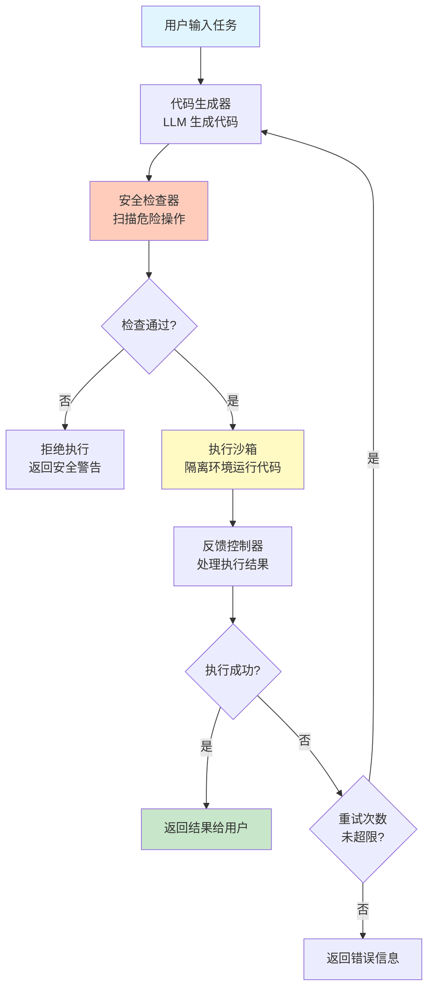

# Code Agent（代码型 Agent）

## 模式概述

Code Agent 是一种让 LLM 自主编写并执行代码来解决问题的 Agent 模式。它的核心思想是：**用代码代替预定义工具**——当 Agent 遇到任务时，不是从一个写死的工具列表里挑函数调用，而是直接生成一段可执行的代码（通常是 Python），交给隔离的沙箱（Sandbox，即安全隔离的运行环境）执行，再根据执行结果决定下一步。

在 Code Agent 出现之前，Agent 调用工具主要靠两种方式：一种是 **预定义工具调用（Function Calling）**，开发者提前写好 Search、Calculator 等函数，Agent 只能从中选；另一种是让 Agent 输出自然语言指令，由后端程序去理解执行。前者覆盖范围有限，碰到工具库没定义的需求就无能为力；后者容易产生歧义，执行不精确。Code Agent 把这两个问题一起解决了——代码既精确又灵活，能表达任何逻辑，而且 LLM 天然擅长写代码。

2023 年 OpenAI 发布 Code Interpreter（代码解释器）插件后，这种模式开始被广泛采用。2024 年的 CodeAct 论文在 ICML 上发表，实验表明用可执行代码作为 Agent 的统一行动空间，成功率比 JSON/文本格式高出最多 20%。如今 Claude Code、Open Interpreter、Cloudflare Code Mode 等产品都基于这一模式。

> 一句话概括：Agent 把"写代码并执行"作为通用工具，动态生成代码解决任意任务，用沙箱保证安全。

## 核心模块

Code Agent 由四个核心模块协作运转：

| 模块 | 作用 | 与其他模块的关系 |
|------|------|------------------|
| 代码生成器（Code Generator） | LLM 根据任务生成可执行代码 | 接收任务输入和历史反馈，输出代码给安全检查器 |
| 安全检查器（Security Validator） | 扫描代码是否包含危险操作 | 拦截危险代码，只放行安全代码给沙箱 |
| 执行沙箱（Sandbox） | 在隔离环境中运行代码 | 接收通过检查的代码，返回执行结果或错误信息 |
| 反馈控制器（Feedback Controller） | 处理执行结果，决定是返回还是重试 | 将结果反馈给代码生成器，控制循环终止 |

### 模块 1：代码生成器（Code Generator）

代码生成器是 LLM 本身。它接收用户问题和之前的执行历史（如果有的话），生成一段完整的、可以直接运行的代码。

关键要求：

- 代码必须是"自包含的"——包含所有必要的 import 语句和逻辑，复制出去就能跑
- 通常使用 Python，因为 LLM 对 Python 的生成质量最高，生态库也最丰富
- 如果上一轮执行出错，代码生成器需要根据错误信息重新生成修复后的版本

### 模块 2：安全检查器（Security Validator）

在代码交给沙箱执行之前，必须经过安全检查。这是 Code Agent 区别于"直接 eval"的关键防线。

检查内容通常包括：

- **黑名单扫描**：检测 `os.system`、`subprocess`、`eval`、`__import__` 等危险调用
- **导入白名单**：只允许使用预先批准的库（如 pandas、numpy、math）
- **文件路径限制**：禁止访问系统敏感路径（如 `/etc/passwd`、`/root/`）

### 模块 3：执行沙箱（Sandbox）

沙箱是一个隔离的代码运行环境，确保即使代码有问题也不会影响宿主系统。

常见的沙箱实现方式：

- **Docker 容器**：最常用，提供文件系统、网络、进程的完整隔离
- **云端虚拟机**：OpenAI Code Interpreter 采用 Kubernetes 沙箱
- **轻量级隔离**：Cloudflare Workers、E2B Sandbox 等提供更轻量的方案
- **进程级隔离**：用 subprocess 加超时限制，适合本地开发和测试

沙箱通常会设置 CPU 时间限制、内存上限、网络访问限制，防止代码无限循环或消耗过多资源。

### 模块 4：反馈控制器（Feedback Controller）

反馈控制器负责处理沙箱的执行结果，做出三种决策之一：

- **执行成功** → 格式化结果，返回给用户
- **执行失败但可修复** → 把错误信息反馈给代码生成器，进入下一轮重试
- **执行失败且不可修复**（如权限不足、超过重试上限） → 返回错误说明

## 架构图



流程说明：

- **代码生成器** 根据用户任务（或上一轮的错误反馈）生成代码
- **安全检查器** 是第一道防线，拦截包含危险操作的代码
- **执行沙箱** 在隔离环境中运行代码，捕获 stdout/stderr 输出
- **反馈控制器** 判断结果，决定返回用户还是重试
- 控制点在于 **重试次数限制**（通常 3-5 次），防止无限循环

## 工作流程

1. **步骤 1（任务理解）：** LLM 接收用户的自然语言问题，判断是否需要生成代码。数据分析、数学计算、文件处理等任务通常需要代码；简单知识问答可以直接回答。
2. **步骤 2（代码生成）：** LLM 根据任务需求生成一段完整的 Python 代码，包含所有必要的 import 和逻辑。如果是重试轮次，还会参考上一轮的错误信息。
3. **步骤 3（安全验证）：** 系统扫描代码是否包含危险操作（如系统命令、动态导入、敏感文件访问），不通过则拒绝执行。
4. **步骤 4（沙箱执行）：** 在隔离环境中运行代码，设置超时（如 10 秒）和内存限制，捕获输出和错误。
5. **步骤 5（结果处理）：** 执行成功则格式化输出返回用户；执行失败且重试次数未满，则将错误信息反馈给 LLM 重新生成代码。

循环终止条件：代码执行成功；错误不可修复（如权限问题）；达到最大重试次数；用户主动停止。

### 执行示例

用户问：**"分析这份 CSV 数据，找出销售额最高的产品。"**

**第 1 轮：**
- **代码生成**：LLM 生成使用 pandas 读取 CSV 并找最大值的代码
- **安全检查**：pandas 在白名单中，通过
- **沙箱执行**：报错 `ModuleNotFoundError: No module named 'pandas'`
- **反馈控制**：错误可修复，将错误信息反馈给 LLM

**第 2 轮：**
- **代码生成**：LLM 改用 Python 内置的 csv 模块重写代码
- **安全检查**：csv 是标准库，通过
- **沙箱执行**：成功输出"最高销售额: 180000, 产品: 产品C, 月份: 3月"
- **反馈控制**：执行成功，返回结果给用户

两轮完成任务。第 1 轮因为沙箱环境没装 pandas 而失败，LLM 根据错误信息自动切换到标准库方案。这种"出错 → 读错误 → 自动修复"的能力是 Code Agent 的核心优势之一。

## 适用场景

### 适合的场景

1. **数据分析与处理**：CSV 解析、数据清洗、统计计算——代码天然适合这类任务，且无需预定义数据处理工具。
2. **数学与精确计算**：微积分、线性代数、概率统计——LLM 自身计算容易出错，但生成的代码可以精确执行。
3. **文件格式转换**：图片处理、文档格式转换、数据提取——Code Agent 能动态生成处理脚本，适应各种文件格式。
4. **编程辅助与代码验证**：代码审查、Bug 修复、功能实现——生成的代码可以直接在沙箱中运行验证正确性。
5. **多步骤工作流**：需要多个操作组合的复杂任务——一段代码可以集成多个步骤，比逐一调用工具更高效。

### 不适合的场景

1. **实时性要求高的任务**：代码生成和执行有秒级延迟，不适合毫秒级响应需求（如高频交易、实时控制）。
2. **需要外部网络访问的任务**：沙箱通常有网络隔离，无法调用未授权的外部 API。
3. **需要系统级权限的任务**：硬件控制、系统配置、根目录操作等被沙箱的权限限制阻止。
4. **模糊不清的创意型任务**：如"做一个好看的 UI"，代码生成需要明确的输入和预期输出，模糊需求难以转化为具体代码。

## 典型实现

以下伪代码展示 Code Agent 的核心循环结构：

```python
# Code Agent 核心循环伪代码

def code_agent_loop(question, max_retries=3):
    """Code Agent 主循环：生成代码 → 安全检查 → 沙箱执行 → 反馈"""
    history = [question]  # 历史上下文

    for attempt in range(max_retries):
        # 阶段 1：代码生成 —— LLM 根据问题和历史生成代码
        code = llm.generate_code(
            prompt=f"用 Python 解决以下问题：\n{history}"
        )

        # 阶段 2：安全检查 —— 拦截危险操作
        is_safe, reason = security_validator.check(code)
        if not is_safe:
            return f"代码被安全检查拦截：{reason}"

        # 阶段 3：沙箱执行 —— 在隔离环境中运行
        success, stdout, stderr = sandbox.execute(code, timeout=10)

        if success:
            return stdout  # 执行成功，返回结果

        # 阶段 4：反馈 —— 将错误信息加入历史，供下一轮修复
        history.append(f"代码：{code}")
        history.append(f"执行错误：{stderr}")

    return "达到最大重试次数，任务未完成。"
```

代码中的四个阶段对应 Code Agent 的核心循环：`generate_code` 生成可执行代码，`security_validator.check` 拦截危险操作，`sandbox.execute` 在隔离环境中运行，错误信息通过 `history` 反馈给下一轮。`max_retries` 防止无限循环。

如果需要在实际项目中使用 Code Agent，可以基于 LangGraph 搭建完整工作流：

```python
# 基于 LangGraph 的 Code Agent（示意）
# 依赖：langgraph, langchain-openai

from langgraph.graph import StateGraph, END
from langchain_openai import ChatOpenAI
from typing import TypedDict, List, Any

class AgentState(TypedDict):
    query: str                  # 用户问题
    generated_code: str         # 生成的代码
    execution_result: str       # 执行结果
    error_message: str          # 错误信息
    iteration: int              # 当前轮次

def generate_code(state: AgentState) -> AgentState:
    """节点：LLM 生成代码"""
    llm = ChatOpenAI(model="gpt-4o", temperature=0)
    # ... LLM 根据 query 和 error_message 生成代码 ...
    return state

def execute_in_sandbox(state: AgentState) -> AgentState:
    """节点：沙箱执行代码"""
    # ... 在隔离环境中执行 state['generated_code'] ...
    return state

def should_retry(state: AgentState) -> str:
    """决策：成功则结束，失败且未超限则重试"""
    if state.get('execution_result'):
        return "end"
    return "retry" if state['iteration'] < 3 else "end"

# 构建工作流图
workflow = StateGraph(AgentState)
workflow.add_node("generate", generate_code)
workflow.add_node("execute", execute_in_sandbox)
workflow.set_entry_point("generate")
workflow.add_edge("generate", "execute")
workflow.add_conditional_edges("execute", should_retry,
    {"retry": "generate", "end": END})

agent = workflow.compile()
```

LangGraph 的声明式图结构将 Code Agent 的"生成 → 执行 → 判断 → 重试"循环表达为节点和边的连接，状态在节点间自动传递。

## 优劣势分析

| 优势 | 劣势 |
|------|------|
| 灵活性极高：无需预定义工具库，代码能表达任意逻辑 | 安全风险高：代码执行天然危险，必须严格沙箱隔离 |
| 精度可靠：代码执行结果确定，避免 LLM 计算幻觉 | 延迟较高：生成 + 验证 + 执行的多步骤流程耗时 |
| 自我修复：可根据错误信息自动迭代修复代码 | 部署成本高：需要维护沙箱基础设施（Docker/VM/云服务） |
| 可解释性好：代码是显式的推理过程，容易追踪调试 | 受沙箱限制：网络隔离和权限限制缩小了可用场景 |

边界说明：Code Agent 的优势在任务需要灵活计算和数据处理时最明显；当任务只需调用固定的几个 API 时，预定义工具调用（Function Calling）更简单高效。

## 与相关模式的对比

| 对比维度 | Code Agent | ReAct | Tool Use（预定义工具） |
|---------|-----------|-------|----------------------|
| 核心思想 | 代码生成 + 沙箱执行 | 思考 + 行动 + 观察循环 | 调用预定义工具函数 |
| 工具库 | 无需预定义，动态生成 | 需要预定义工具集 | 必须预先定义所有工具 |
| 灵活性 | 极高，能表达任意逻辑 | 中等，受工具库限制 | 低，受工具数量限制 |
| 安全性 | 需严格沙箱隔离 | 风险较小，可控 | 风险最小，完全可控 |
| 延迟 | 较高（多步骤） | 中等（多轮循环） | 低（直接调用） |
| 自我修复 | 强（根据错误自动修复） | 弱（靠重新思考） | 无 |
| 适用场景 | 数据分析、计算、编程 | 推理、决策、信息收集 | 固定工具的简单调用 |

Code Agent 可以与 ReAct 结合使用：ReAct 负责推理和决策，当需要计算或数据处理时，Action 阶段切换为代码生成和执行。CodeAct 论文（ICML 2024）的实验表明，这种"用代码作为统一行动空间"的方式比 JSON/文本格式的行动表达成功率高出最多 20%。

## 常见误区

| 常见误区 | 正确理解 |
|----------|----------|
| Code Agent 就是让 LLM 直接执行代码 | 直接执行 LLM 生成的代码极其危险。Code Agent 的关键在于安全检查 + 沙箱隔离，代码必须经过验证后在隔离环境中运行 |
| Code Agent 可以访问任何资源 | 沙箱环境有严格的网络隔离、文件系统隔离和权限限制，大部分系统资源不可访问 |
| 生成的代码一定能正确执行 | 首次生成的代码经常出错（缺少依赖、逻辑错误等），迭代修复机制是 Code Agent 的标配能力 |
| Code Agent 能替代所有 Agent 模式 | Code Agent 解决的是"如何执行动作"的问题，不能替代 ReAct 的推理能力或 Plan-and-Solve 的规划能力，它们解决不同层面的问题 |

## 思考题

<details>
<summary>初级：Code Agent 和传统的预定义工具调用（Function Calling）最本质的区别是什么？</summary>

**参考答案：**

预定义工具调用要求开发者提前编写所有可能用到的函数，Agent 只能从已有工具中选择。Code Agent 则让 LLM 直接生成代码作为"工具"，不受预定义工具库的限制。

最本质的区别在于：预定义工具是静态的、有限的；Code Agent 生成的代码是动态的、无限的。前者的能力边界由开发者决定，后者的能力边界由编程语言本身决定。

</details>

<details>
<summary>中级：为什么沙箱是 Code Agent 不可或缺的组成部分？没有沙箱会怎样？</summary>

**参考答案：**

LLM 生成的代码不可预测且不可信——可能包含删除文件、访问敏感数据、无限循环等危险操作，无论是恶意还是无意的。

没有沙箱意味着代码直接在宿主系统上运行，风险包括：数据泄露（代码读取敏感文件）、系统破坏（代码执行危险命令）、资源耗尽（代码无限循环或消耗大量内存）。沙箱通过文件系统隔离、网络隔离、资源限制和权限控制，将这些风险限制在一个可控的范围内。

</details>

<details>
<summary>中级：什么情况下应该选 Code Agent 而不是 ReAct？什么情况下反过来？</summary>

**参考答案：**

选 Code Agent：任务核心是计算、数据处理或编程，且无法用简单的工具调用表达。例如"分析这份 CSV 找出异常值"——需要的操作组合太多，定义为工具不现实，但一段 Python 代码就能搞定。

选 ReAct：任务核心是信息收集和推理决策，需要多轮与外部交互。例如"调研某个技术的优缺点"——需要搜索、阅读、比较、总结，这是推理驱动的任务，代码执行帮不上忙。

两者可以结合：ReAct 负责推理和决策流程，当某一步需要计算时用 Code Agent 模式执行。

</details>

## 参考资料

1. Wang, X. et al. "Executable Code Actions Elicit Better LLM Agents." ICML 2024. https://github.com/xingyaoww/code-act
2. OpenAI. "Code Interpreter." OpenAI API Documentation. https://platform.openai.com/docs/assistants/tools/code-interpreter
3. Weng, Lilian. "LLM Powered Autonomous Agents." Lil'Log Blog, 2023. https://lilianweng.github.io/posts/2023-06-23-agent/
4. Anthropic. "Claude Code Overview." Anthropic Documentation. https://docs.anthropic.com/en/docs/agents-and-tools/claude-code/overview
5. E2B. "Code Interpreter SDK." https://github.com/e2b-dev/code-interpreter
