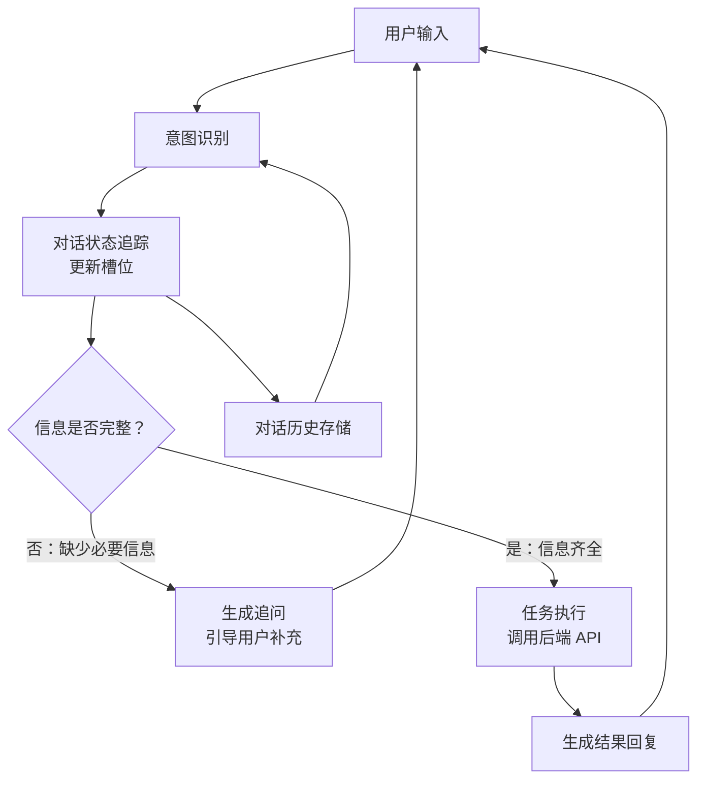

# 对话型 Agent（Conversational Agent）

## 模式概述

对话型 Agent 是一种通过**多轮对话**与用户交互、逐步理解需求并完成任务的 Agent 模式。它不是一问一答的简单问答机器人，而是能"记住"前面聊过什么、"发现"缺少什么信息、"主动"追问补全信息，最终把用户的模糊需求转变为可执行操作的系统。

最典型的场景：你对一个订餐助手说"帮我订个餐厅"，它不会直接报错说"信息不足"，而是一轮一轮地追问——"在哪个城市？""几个人？""什么时间？"——直到信息收集齐全，再帮你完成预订。这种"渐进式信息收集 + 任务执行"的模式，就是对话型 Agent 的核心价值。

在传统对话系统（如基于规则的客服机器人）中，意图识别（Intent Detection，判断用户想做什么）和槽位填充（Slot Filling，提取关键参数如时间、地点、人数）需要大量标注数据和专门训练的模型。LLM 的出现大幅降低了门槛——一个大语言模型就能同时完成理解用户意图、提取信息、生成自然回复这些工作，使得对话型 Agent 的构建变得更加灵活。

> 一句话概括：通过多轮对话逐步收集信息、理解意图、执行任务，像一个耐心的人类助手一样与用户交互。

## 核心模块

对话型 Agent 由四个核心模块协作运转：

| 模块 | 作用 | 与其他模块的关系 |
|------|------|------------------|
| 意图识别器 | 判断用户想做什么（如预订、查询、取消） | 为状态追踪器提供用户目标 |
| 对话状态追踪器 | 记录当前收集到的信息和缺少的信息 | 接收意图识别结果，驱动澄清或执行 |
| 澄清/响应生成器 | 信息不全时追问，信息齐全时回复结果 | 根据状态追踪器的判断决定输出内容 |
| 任务执行器 | 调用后端 API 完成实际操作 | 在信息收集完毕后被触发 |

### 模块 1：意图识别器（Intent Detector）

意图识别器的任务是从用户的自然语言中判断"用户到底想做什么"。比如用户说"帮我订个餐厅"，意图是"预订"；说"我的订单到哪了"，意图是"查询"。

在 LLM 时代，意图识别不再需要训练专门的分类器。把用户输入和可选意图列表一起发给 LLM，LLM 就能直接判断。同时 LLM 还能处理隐式意图——用户说"太贵了"，结合上下文可以推断出"用户想看更便宜的选项"。

### 模块 2：对话状态追踪器（Dialogue State Tracker，简称 DST）

对话状态追踪器是对话型 Agent 的"记忆中枢"。它维护一个结构化的状态对象，记录：

- **当前意图**：用户想做什么
- **已填充的槽位**：已经收集到的信息（如日期=周五、地点=北京）
- **未填充的槽位**：还需要追问的信息（如人数、菜系）
- **对话历史**：前几轮说了什么

每一轮用户输入后，DST 都会更新状态。如果用户改主意了（"算了，改成明天"），DST 也能覆盖之前的槽位值。

### 模块 3：澄清/响应生成器（Response Generator）

根据状态追踪器的判断，这个模块决定"接下来对用户说什么"：

- 如果信息不完整 → 生成追问（"请问几位用餐？"）
- 如果信息完整 → 告知执行结果（"预订成功，预订号是 XXX"）
- 如果执行失败 → 给出解释和替代方案

### 模块 4：任务执行器（Action Executor）

当所有必要信息收集完毕后，任务执行器被触发，调用真实的后端服务（如查询 API、创建订单 API）来完成用户的请求。

## 架构图



流程说明：

- 用户每一轮输入都会经过意图识别和状态更新
- 状态追踪器是核心枢纽，决定对话走向——追问还是执行
- 对话历史存储为意图识别提供上下文，使系统能理解"那个""这个"等指代
- 整个流程形成一个循环，直到任务完成或用户主动结束

## 工作流程

1. **步骤 1（意图识别）：** 用户发送一条消息，系统结合对话历史判断用户意图。第一轮通常是新意图（如"预订"），后续轮次可能是补充信息或修改之前的选择。
2. **步骤 2（槽位提取与状态更新）：** 从用户消息中提取关键信息（时间、地点、人数等），更新到对话状态中。如果用户修改了之前的信息（"改成明天"），覆盖对应槽位。
3. **步骤 3（完整性检查）：** 检查当前意图所需的所有必填槽位是否都已填充。
4. **步骤 4（分支决策）：** 信息不完整 → 生成追问，回到步骤 1 等待用户回复；信息完整 → 进入步骤 5。
5. **步骤 5（任务执行）：** 调用后端 API 执行任务（如创建预订），将结果返回给用户。

循环终止条件：任务执行成功、用户主动结束对话、或达到最大对话轮数。

### 执行示例

场景：用户要预订一家北京的餐厅。

**第 1 轮**

- 用户："我想周五在北京吃个川菜，晚上 6 点。"
- 意图识别 → 预订餐厅
- 槽位提取 → `{日期: 周五, 地点: 北京, 菜系: 川菜, 时间: 18:00}`
- 完整性检查 → 缺少"人数"
- 系统："好的，请问几位用餐？"

**第 2 轮**

- 用户："2 个人。"
- 槽位提取 → `{人数: 2}`
- 状态合并 → `{日期: 周五, 地点: 北京, 菜系: 川菜, 时间: 18:00, 人数: 2}`
- 完整性检查 → 全部填满
- 任务执行 → 查询可用餐厅，返回推荐列表
- 系统："为您找到以下餐厅：川味轩、辣道坊。请问选哪家？"

**第 3 轮**

- 用户："川味轩。"
- 任务执行 → 调用预订 API
- 系统："预订成功！周五 18:00，川味轩，2 人，预订号 BK20260325001。"

三轮对话完成任务。系统在每一轮都理解上下文、记住历史、主动引导用户补充缺失信息。

## 适用场景

### 适合的场景

1. **任务型对话**：餐厅预订、机票购买、挂号预约——需要收集多个信息槽位后执行操作的场景，是对话型 Agent 的主战场。
2. **需要澄清的交互**：用户说"帮我买个手机"，系统需要追问品牌、预算、配置偏好。对话型 Agent 的渐进式信息收集正好适合。
3. **业务流程引导**：表单填写、审批流程、需求收集——系统按步骤引导用户完成，允许回退和修改。

### 不适合的场景

1. **单轮即时查询**："今天天气怎样"这类问题不需要多轮对话，用简单的 QA 系统更高效。对话状态管理在这里是多余的开销。
2. **开放域闲聊**：没有明确意图和槽位结构的自由聊天，对话状态追踪无从下手，纯生成式模型更合适。
3. **复杂推理任务**：数学推导、代码生成这类任务需要的是深度推理能力，不是多轮信息收集，更适合 ReAct 或 Plan-and-Solve 等模式。

## 典型实现

以下伪代码展示对话型 Agent 的核心循环结构：

```python
# 对话型 Agent 核心循环伪代码

def conversational_agent_loop(slot_definitions, max_turns=10):
    """对话型 Agent 主循环：识别意图 → 填充槽位 → 追问或执行"""
    state = {
        "intent": None,           # 当前意图
        "confirmed_slots": {},    # 已收集的信息
        "unfilled_slots": [],     # 待收集的信息
        "history": []             # 对话历史
    }

    for turn in range(max_turns):
        user_input = get_user_input()

        # 阶段 1：意图识别 + 槽位提取（LLM 一次调用完成）
        intent, slots = llm.extract(
            user_input=user_input,
            context=state["history"]
        )

        # 阶段 2：更新对话状态
        if intent != state["intent"]:
            state["intent"] = intent
            state["unfilled_slots"] = slot_definitions[intent].copy()

        state["confirmed_slots"].update(slots)
        for slot in slots:
            if slot in state["unfilled_slots"]:
                state["unfilled_slots"].remove(slot)

        # 阶段 3：判断信息是否完整
        if state["unfilled_slots"]:
            # 信息不完整 → 追问
            response = llm.generate_clarification(state["unfilled_slots"])
        else:
            # 信息完整 → 执行任务
            result = execute_task(state["intent"], state["confirmed_slots"])
            response = llm.generate_response(result)

        state["history"].append((user_input, response))
        send_to_user(response)
```

代码中的三个阶段对应架构图的核心流程：`llm.extract()` 同时完成意图识别和槽位提取，状态更新部分维护对话记忆，最后根据槽位完整性决定追问还是执行。`max_turns` 防止无限循环。

实际项目中，LangChain 的 `ConversationBufferWindowMemory`（对话窗口记忆）可以管理历史上下文，LangGraph 可以用状态图实现更复杂的对话流转控制。

## 优劣势分析

| 优势 | 劣势 |
|------|------|
| 支持多轮交互，能渐进式收集信息 | 对话轮次增多时，LLM 可能遗忘早期信息 |
| 主动追问，减少用户"猜系统需要什么"的负担 | 每个新业务场景需要定义新的意图和槽位 |
| 允许用户随时修改之前的选择 | 调试困难，问题可能出在意图识别、槽位提取、状态更新等多个环节 |
| 对话过程自然，接近真人交互体验 | 长对话的上下文管理成本高（token 消耗和存储） |

边界说明：对话型 Agent 的优势在需要收集多个信息字段的任务型场景最明显；当任务本身只需要一轮交互时，多轮对话机制反而是额外开销。

## 与相关模式的对比

| 对比维度 | 对话型 Agent | ReAct | Tool-Use Agent |
|---------|-------------|-------|---------------|
| 核心驱动力 | 用户交互，多轮信息收集 | 内部推理循环，边想边做 | 工具调用，获取外部数据 |
| 交互频率 | 每轮都与用户交互 | 主要内部迭代，最终输出给用户 | 通常单轮或少数几轮 |
| 状态管理 | 核心特性，维护意图+槽位+历史 | 通过上下文列表维护 | 较轻量 |
| 典型场景 | 预订、客服、表单引导 | 信息检索、逐步探索 | API 调用、数据查询 |

选择指引：需要和用户来回对话、逐步收集信息 → 对话型 Agent；需要调用工具逐步推进探索 → ReAct；只需要简单调用几个工具 → Tool-Use Agent。

## 常见误区

| 常见误区 | 正确理解 |
|----------|----------|
| 对话型 Agent 就是聊天机器人 | 聊天机器人通常指开放域闲聊。对话型 Agent 有明确的任务目标、意图识别和状态管理，目的是完成特定业务操作，不是无目的地聊天。 |
| 保存完整聊天记录就是"上下文管理" | 真正的上下文管理包括历史压缩、关键信息提取、窗口化裁剪等。把所有历史塞进 prompt 会导致 token 爆炸和性能下降。 |
| 槽位填完就不能改了 | 用户随时可以修改之前的选择（"改成明天""不，是 3 个人"）。好的对话型 Agent 必须支持槽位的动态更新和覆盖。 |

## 思考题

<details>
<summary>初级：对话型 Agent 和普通问答系统的核心区别是什么？</summary>

**参考答案：**

普通问答系统处理的是一问一答的单轮交互，不维护对话历史，每次请求都是独立的。

对话型 Agent 的核心区别在于它维护跨轮次的对话状态——记住之前聊过什么、收集了哪些信息、还缺什么信息。它能在多轮交互中逐步推进任务，而不是每轮都从零开始。

</details>

<details>
<summary>中级：为什么对话状态追踪器（DST）是对话型 Agent 的核心模块？</summary>

**参考答案：**

DST 是连接"理解"和"行动"的桥梁。它把每一轮的意图识别结果和槽位提取结果汇总成一个结构化的全局状态，决定了系统的下一步动作——追问还是执行。

没有 DST，系统就无法判断"信息是否已经收集完毕"，也无法处理用户的修改和回退。意图识别和槽位提取只是单轮的局部理解，DST 把它们串成跨轮次的全局理解。

</details>

<details>
<summary>中级：在什么情况下，对话型 Agent 不如 ReAct 模式？</summary>

**参考答案：**

当任务不需要与用户多轮交互，而是需要 Agent 自己去搜索、计算、逐步探索时。例如"北京今天会下雨吗"这种需要调用天气 API 获取实时数据的任务，用户只关心最终结果，不需要参与中间过程。

ReAct 的 Thought-Action-Observation 循环适合 Agent 自主推进的探索型任务，对话型 Agent 的多轮追问机制在这种场景下反而拖慢效率。

</details>

## 参考资料

1. Thoughtworks - 如何借助 LLM 设计任务型对话 Agent：https://www.thoughtworks.com/zh-cn/insights/blog/machine-learning-and-ai/how-to-design-task-based-dialogue-Agent-with-LLM
2. ACM Computing Surveys - A Survey on Recent Advances in LLM-Based Multi-turn Dialogue Systems (2025)：https://dl.acm.org/doi/full/10.1145/3771090
3. arXiv - Evaluating LLM-based Agents for Multi-Turn Conversations: A Survey (2025)：https://arxiv.org/abs/2503.22458
4. LangChain 官方文档 - 代理教程：https://python.langchain.com/docs/tutorials/agents
5. Pinecone 学习系列 - LangChain Conversational Memory：https://www.pinecone.io/learn/series/langchain/langchain-conversational-memory/
