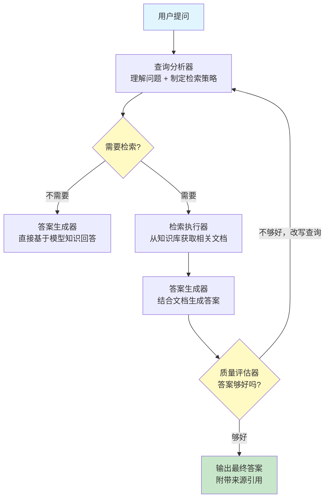

# RAG Agent（检索增强型 Agent）

## 模式概述

RAG Agent 是一种把 Agent（智能体）的自主决策能力和 RAG（Retrieval-Augmented Generation，检索增强生成）的知识检索能力结合起来的设计模式。它也被称为 Agentic RAG（智能体式检索增强生成）。

要理解 RAG Agent 解决的问题，先看两个前置概念：

- **RAG**：让 LLM（Large Language Model，大语言模型）在回答问题之前，先从外部知识库中检索相关文档，再基于这些文档生成答案。这样可以减少模型"编造答案"（即幻觉）的问题。
- **Agent**：能够自主规划、执行动作、根据反馈调整策略的 AI 系统。

传统的 Naive RAG（朴素检索增强生成）有一个明显的短板：流程是固定的——不管问题难不难，都先检索固定数量的文档，然后一次性生成答案。它不会判断"这个问题需不需要检索""检索到的内容够不够好""要不要换个关键词再查一次"。

RAG Agent 的做法是：把一个 Agent 放在 RAG 流程的指挥位置上，让它来做所有关键决策——何时检索、查什么、查几次、什么时候停。Agent 变成了一个懂得"什么时候需要查资料、查什么、查到的够不够用"的知识工作者，而不是盲目执行固定流水线。

> 一句话概括：RAG Agent = Agent 的决策能力 + RAG 的检索能力，让知识问答从"固定流水线"升级为"智能决策循环"。

## 核心模块

RAG Agent 由四个核心模块组成，它们形成一个"检索-生成-验证"的闭合循环：

| 模块 | 作用 | 与其他模块的关系 |
|------|------|------------------|
| 查询分析器 | 理解用户问题，判断是否需要检索 | 向检索执行器发出检索指令，或直接跳到答案生成器 |
| 检索执行器 | 根据策略从知识库中获取相关文档 | 接收查询分析器的指令，将结果传给答案生成器 |
| 答案生成器 | 将检索到的文档与问题结合，生成答案 | 接收检索执行器的文档，将答案传给质量评估器 |
| 质量评估器 | 判断答案是否足够好，决定是结束还是再检索一轮 | 不满意时，反馈给查询分析器触发新一轮检索 |

### 模块 1：查询分析器

查询分析器是 RAG Agent 区别于 Naive RAG 的第一个关键点。它负责理解用户问题的性质，做出三个判断：

- **是否需要检索**：常识性问题（如"1+1 等于几"）不需要检索，知识密集型问题（如"2025 年发布了哪些新的 LLM"）需要检索。
- **用什么方式检索**：关键词精确匹配、语义相似度搜索，还是两者混合。
- **查询词是否需要改写**：用户的原始提问可能太笼统或太口语化，需要改写成更适合检索的表述。

### 模块 2：检索执行器

检索执行器负责实际的文档获取工作。根据查询分析器的指令，它可以使用不同的检索方式：

- **关键词检索**（如 BM25）：按关键词精确匹配，适合事实性查询
- **语义检索**（基于 Embedding 向量）：按语义相似度匹配，适合概念性查询
- **混合检索**：同时使用关键词和语义两种方式，取两者之长

检索执行器还负责对结果去重、按相关性排序、必要时做 Rerank（重排序）。

### 模块 3：答案生成器

答案生成器将用户的原始问题和检索到的文档一起交给 LLM，生成最终答案。它的 Prompt（提示词）通常包含明确的指令：基于给定的上下文回答问题，如果上下文中没有相关信息就说明无法回答，而不是编造。

### 模块 4：质量评估器

质量评估器是 RAG Agent 区别于 Naive RAG 的第二个关键点。它对生成的答案进行质量检查，主要评估三个维度：

- **完整性**：答案是否覆盖了问题的所有方面
- **准确性**：答案是否与检索到的文档一致，有没有矛盾
- **可信度**：答案的每个关键论断是否有文档支撑

如果评估不通过，质量评估器会将反馈送回查询分析器，触发新一轮检索——可能是换个关键词重新查，也可能是扩大检索范围。

## 架构图



流程说明：

- **查询分析器** 是起点，负责理解问题并判断是否需要外部检索
- **"需要检索？"** 是第一个决策点——简单问题跳过检索直接回答，知识密集型问题进入检索流程
- **检索执行器** 从向量数据库或其他知识源获取文档
- **答案生成器** 将文档和问题交给 LLM 生成答案
- **"答案够好吗？"** 是第二个决策点——如果质量评估不通过，循环回到查询分析器进行查询改写和重新检索
- 最终答案带有来源引用，支持溯源

## 工作流程

1. **步骤 1（查询分析）：** Agent 接收用户问题，分析问题类型（事实查询、概念理解、时间敏感信息等），判断是否需要检索，以及用什么方式检索。
2. **步骤 2（检索执行）：** 根据分析结果，使用合适的检索方式（关键词/语义/混合）从知识库获取 top-k 篇相关文档。
3. **步骤 3（答案生成）：** 将用户问题和检索到的文档一起送入 LLM，生成带有来源引用的答案。
4. **步骤 4（质量评估）：** Agent 评估答案的完整性、准确性、可信度。如果通过，输出最终答案；如果不通过，改写查询后回到步骤 1。

循环终止条件：答案质量达标，或达到最大迭代次数（通常 2-3 轮）。

### 执行示例

用户问：**"LangGraph 和 CrewAI 在多 Agent 协作方面有什么区别？"**

**第 1 轮：**
- **查询分析**：问题涉及两个框架的对比，属于知识密集型问题，需要检索。使用混合检索，查询词："LangGraph CrewAI 多 Agent 协作 对比"。
- **检索执行**：从知识库中获取 5 篇相关文档，包含 LangGraph 文档片段和 CrewAI 文档片段。
- **答案生成**：基于检索结果，生成两个框架的对比分析。
- **质量评估**：答案覆盖了 LangGraph 的图结构特点，但缺少 CrewAI 的角色定义机制细节——不通过。

**第 2 轮：**
- **查询改写**：针对缺失的信息，改写查询为"CrewAI Agent 角色定义 任务分配机制"。
- **检索执行**：获取更多关于 CrewAI 角色系统的文档。
- **答案生成**：补充 CrewAI 的角色定义细节，生成更完整的对比。
- **质量评估**：答案同时覆盖了两个框架的核心差异——通过。

最终输出带有文档来源引用的对比分析。两轮循环完成任务：第 1 轮建立整体框架，第 2 轮补充细节。

## 适用场景

### 适合的场景

1. **知识密集型问答**：用户问题需要从大量文档中准确提取信息，如企业内部知识库问答、技术文档查询。Agent 的自适应检索能力比固定流程更能应对多样化的问题。
2. **需要可溯源答案的场景**：医疗、法律、财务等领域，答案必须标明"依据来自哪份文档"。RAG Agent 在检索过程中天然记录文档来源。
3. **多跳推理问题**：一个问题需要先查 A 再根据 A 的结果去查 B，如"这家公司的 CEO 之前在哪工作过"——需要先查 CEO 是谁，再查这个人的履历。多轮检索机制天然支持这种场景。
4. **时间敏感的信息查询**：需要获取最新数据的问题。Agent 能判断"这个问题需要最新信息"，主动选择联网搜索而非只查本地知识库。

### 不适合的场景

1. **要求低延迟的场景**：多轮迭代和质量评估引入额外延迟。如果系统要求毫秒级响应，应使用 Naive RAG 或直接 LLM 调用。
2. **纯创意生成任务**：写诗、编故事等任务主要靠 LLM 的创造力，检索反而可能引入干扰。
3. **问题类型高度一致的场景**：如果所有问题都是同一类型（如"查询某个产品的价格"），固定流程的 Naive RAG 更高效，不需要 Agent 的决策开销。

## 典型实现

以下伪代码展示 RAG Agent 的核心决策循环：

```python
# RAG Agent 核心循环伪代码

def rag_agent(question, knowledge_base, max_rounds=3):
    """RAG Agent 主循环：分析 → 检索 → 生成 → 评估，循环直到满意"""
    query = question  # 当前查询（可能被改写）
    all_docs = []     # 累积的检索文档

    for round in range(max_rounds):
        # 阶段 1：查询分析——判断是否需要检索
        analysis = llm.analyze(query)
        if not analysis.need_retrieval and round == 0:
            return llm.generate(question)  # 简单问题直接回答

        # 阶段 2：检索执行——从知识库获取文档
        docs = knowledge_base.retrieve(
            query=analysis.optimized_query,
            method=analysis.retrieval_method,  # keyword / semantic / hybrid
            top_k=analysis.top_k
        )
        all_docs.extend(docs)

        # 阶段 3：答案生成——结合文档生成答案
        answer = llm.generate(
            prompt=f"基于以下文档回答问题：\n文档：{all_docs}\n问题：{question}"
        )

        # 阶段 4：质量评估——判断答案是否足够好
        evaluation = llm.evaluate(answer, question, all_docs)
        if evaluation.is_satisfactory:
            return answer  # 质量达标，返回答案

        # 不满意，改写查询进入下一轮
        query = llm.rewrite_query(question, evaluation.feedback)

    return answer  # 达到最大轮次，返回当前最佳答案
```

四个阶段对应 RAG Agent 的四个核心模块：`llm.analyze` 对应查询分析器，`knowledge_base.retrieve` 对应检索执行器，`llm.generate` 对应答案生成器，`llm.evaluate` 对应质量评估器。`max_rounds` 限制最大迭代次数以防无限循环。

## 优劣势分析

| 优势 | 劣势 |
|------|------|
| 按需检索：简单问题少检索，复杂问题多检索，平衡了质量和成本 | 系统复杂度高：比 Naive RAG 多了决策器和评估器，调试更困难 |
| 迭代改进：答案不满意时自动改写查询重新检索，持续优化答案质量 | 延迟增加：多轮迭代带来更多 LLM 调用和检索操作 |
| 可溯源：答案带有明确的文档来源，便于审计和验证 | 依赖检索质量：知识库本身不完整时，再好的决策也补不回来 |
| 支持多跳推理：多轮检索天然支持需要分步获取信息的复杂问题 | 评估标准难定义：什么叫"答案够好"需要针对具体场景调优 |

边界说明：RAG Agent 的优势在问题多样化、知识库庞大时最明显；如果问题类型单一且检索质量已经很好，Naive RAG 的简单流程反而更合适。

## 与相关模式的对比

| 对比维度 | RAG Agent | Naive RAG | ReAct |
|---------|----------|-----------|-------|
| 核心思想 | Agent 决策 + 迭代检索 | 固定流程：检索 → 生成 | 推理与行动交替循环 |
| 是否判断要不要检索 | 是，动态决策 | 否，每次都检索 | 是，但不专门针对检索优化 |
| 迭代能力 | 支持多轮检索与查询改写 | 单轮，一次检索一次生成 | 支持多轮推理与工具调用 |
| 检索优化 | 针对检索场景深度优化（改写、重排、评估） | 无 | 通用工具调用，不针对检索优化 |
| 适用场景 | 知识密集型问答、需要溯源的场景 | 简单 QA、低延迟场景 | 通用规划与推理任务 |
| 复杂度 | 中高 | 低 | 中 |
| 延迟 | 较高（多轮） | 最低（单轮） | 取决于步骤数 |

选型建议：

- 选 **RAG Agent**：知识库大、问题多样、需要可溯源答案
- 选 **Naive RAG**：问题类型一致、要求低延迟、检索质量已经足够
- 选 **ReAct**：问题不仅需要检索，还需要计算、API 调用等多种工具

RAG Agent 可以看作 ReAct 在知识检索领域的专项优化版本——它继承了 ReAct 的迭代循环思想，但在检索策略、查询改写、答案评估等方面做了针对性的增强。

## 常见误区

| 常见误区 | 正确理解 |
|----------|----------|
| RAG Agent 就是用 Agent 框架包一层 RAG | 核心不是"包一层"，而是让 Agent 真正参与检索的决策——判断是否检索、用什么方式检索、检索结果好不好、要不要重新检索 |
| RAG Agent 一定比 Naive RAG 好 | 对简单问题和固定场景来说，Naive RAG 更快更稳定。RAG Agent 的优势在复杂、多样化的知识问答场景 |
| 迭代次数越多效果越好 | 通常 2-3 轮就够了。过多迭代可能引入矛盾信息、增加成本，收益递减明显 |
| RAG Agent 能弥补知识库的不足 | Agent 再聪明也只能检索知识库里有的东西。知识库本身的覆盖度和质量是基础 |

## 思考题

<details>
<summary>初级：RAG Agent 和 Naive RAG 的核心区别是什么？</summary>

**参考答案：**

核心区别在于"谁来做决策"。Naive RAG 是固定流程——每次都先检索固定数量的文档，再一次性生成答案，没有判断和反馈。RAG Agent 把一个 Agent 放在了流程的指挥位置上，由它来决定要不要检索、怎么检索、检索结果好不好、要不要再来一轮。简单来说，Naive RAG 是流水线工人，RAG Agent 是带有判断力的知识工作者。

</details>

<details>
<summary>中级：RAG Agent 的"质量评估 → 查询改写 → 重新检索"循环是如何工作的？</summary>

**参考答案：**

答案生成后，质量评估器会检查三个方面：完整性（是否覆盖了问题的所有层面）、准确性（是否与检索文档一致）、可信度（关键论断是否有文档支撑）。如果某个维度不达标，评估器会生成具体的反馈信息（如"缺少 CrewAI 的角色定义细节"），查询分析器基于这个反馈改写查询词（如从"LangGraph CrewAI 对比"改为"CrewAI Agent 角色定义机制"），然后检索执行器用新查询词检索。新检索到的文档会与之前的文档合并，答案生成器基于更丰富的上下文重新生成答案。这个循环通常设置最大轮次（2-3 轮）防止无限迭代。

</details>

<details>
<summary>中级：在什么情况下应该选择 Naive RAG 而不是 RAG Agent？</summary>

**参考答案：**

三种典型情况：（1）问题类型高度一致——如果所有用户问的都是"查询某产品的参数"这类结构化查询，固定流程的 Naive RAG 足够且更高效；（2）延迟要求严格——多轮迭代的 RAG Agent 延迟是 Naive RAG 的数倍，实时对话场景可能无法接受；（3）检索质量已经足够好——如果知识库质量高、Embedding 模型效果好、一次检索就能拿到高质量文档，Agent 的决策和评估环节就是多余的开销。

</details>

## 参考资料

1. Singh, A. et al. "Agentic Retrieval-Augmented Generation: A Survey on Agentic RAG." arXiv:2501.09136, 2025. https://arxiv.org/abs/2501.09136
2. LangChain 官方教程：Adaptive RAG. https://python.langchain.com/docs/tutorials/adaptive_rag/
3. LangChain 官方文档：Build an Agentic RAG with LangGraph. https://python.langchain.com/docs/tutorials/graph_rag/
4. IBM 官方博客：What is agentic RAG? https://www.ibm.com/think/topics/agentic-rag
5. Asai, A. et al. "Self-RAG: Learning to Retrieve, Generate, and Critique through Self-Reflection." ICLR 2024. https://arxiv.org/abs/2310.11511
