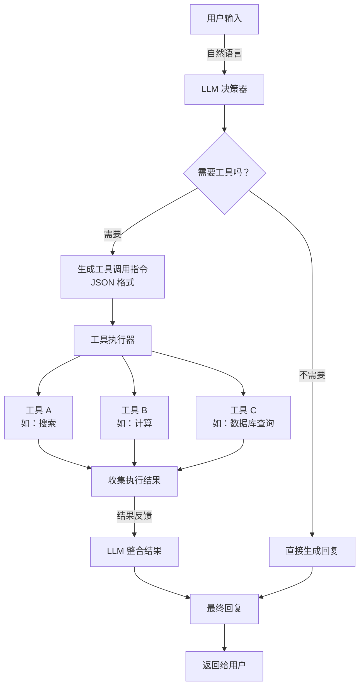
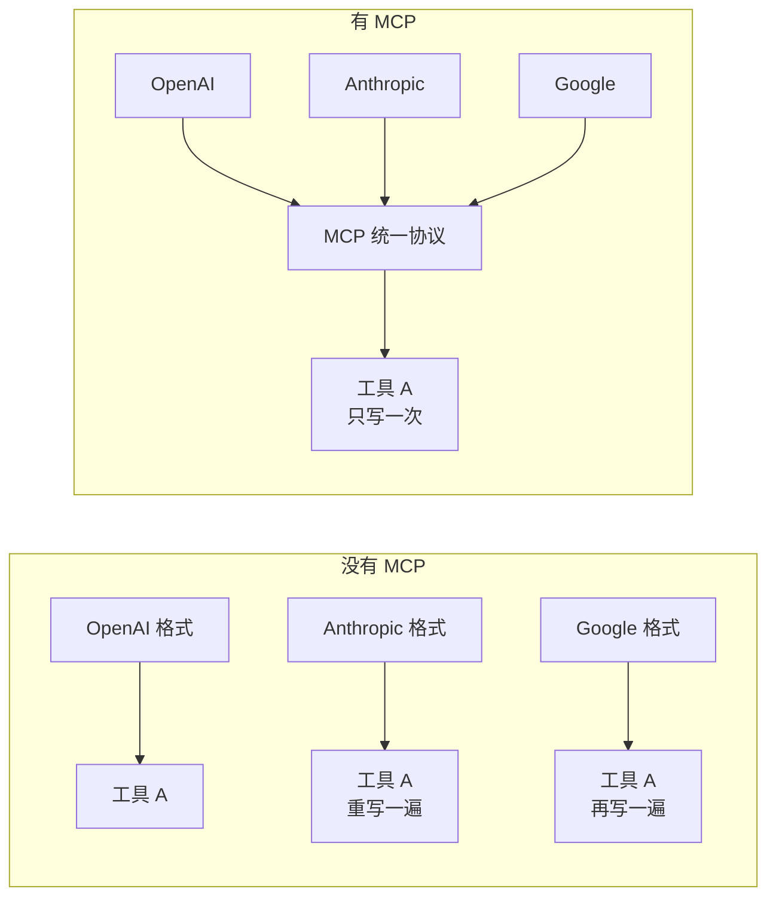

# 工具型 Agent（Tool Agent）

## 模式概述

Tool Agent 是一种让 LLM（大语言模型）通过**结构化的工具调用指令**与外部系统交互的设计模式。简单来说，LLM 本身只会"说话"，不会"动手"——它不能查数据库、不能调 API、不能做精确计算。Tool Agent 的做法是：给 LLM 一份"工具清单"，LLM 看完用户问题后，决定该用哪个工具、传什么参数，然后把这个决定以 JSON 格式输出，由外部程序去执行，最后把结果喂回 LLM 生成最终回复。

这个模式之所以重要，是因为它解决了一个根本问题：**LLM 的知识是静态的（训练数据有截止日期），能力是有限的（不能直接操作外部系统）**。通过工具调用，LLM 就像一个"会指挥的大脑"——自己不干活，但知道该让谁干、怎么干。自 OpenAI 2023 年 6 月推出 Function Calling（函数调用）API、Anthropic 2024 年 11 月发布 MCP（Model Context Protocol，模型上下文协议）以来，工具调用已成为 LLM 与外部世界交互的行业标准。

> 一句话概括：LLM 负责"想"（决定调用哪个工具、传什么参数），外部程序负责"做"（执行工具），两者通过结构化 JSON 协作完成任务。

## 核心模块

Tool Agent 由四个核心模块协作运行：

| 模块 | 作用 | 与其他模块的关系 |
|------|------|------------------|
| 工具定义（Tool Definition） | 用 JSON Schema 描述每个工具的名称、功能、参数 | 提供给 LLM 作为"工具清单"，指导工具选择 |
| LLM 决策器 | 分析用户输入，决定是否调用工具及调用哪个 | 读取工具定义做决策，输出工具调用指令给执行器 |
| 工具执行器（Tool Executor） | 接收 LLM 的调用指令，实际执行工具函数 | 执行 LLM 指定的工具，将结果返回给结果整合器 |
| 结果整合器 | 将工具执行结果喂回 LLM，生成最终回复 | 连接执行结果和最终输出 |

### 模块 1：工具定义（Tool Definition）

工具定义是整个模式的基础。每个工具需要三样东西：

- **名称（name）**：工具的唯一标识，如 `search_web`、`query_database`
- **描述（description）**：一段自然语言说明，告诉 LLM 这个工具能干什么、什么时候该用它。描述写得好不好，直接决定 LLM 能不能选对工具
- **参数架构（parameters）**：用 JSON Schema（一种描述 JSON 数据结构的标准格式）定义工具需要哪些参数、每个参数是什么类型、哪些必填

工具定义的质量是 Tool Agent 成败的关键——描述模糊或参数约束不严，LLM 就容易选错工具或传错参数。

### 模块 2：LLM 决策器

LLM 拿到用户输入和工具定义后，需要做两个判断：

1. **要不要调工具**：如果问题用 LLM 自身知识就能回答（如"什么是光合作用"），就直接回复，不调工具
2. **调哪个工具、传什么参数**：如果需要外部信息（如"今天北京天气怎么样"），LLM 生成结构化的工具调用指令

现代 LLM（如 GPT-4o、Claude 3.5、Gemini）已在训练阶段内置了这种"理解工具定义并生成调用指令"的能力，不需要额外的提示工程技巧。

### 模块 3：工具执行器（Tool Executor）

执行器是"真正干活"的模块。它拿到 LLM 的 JSON 调用指令后：

1. 根据工具名查找对应的可执行函数
2. 校验参数是否合法
3. 执行函数，捕获返回值或异常
4. 如果支持并行调用（Parallel Tool Calls），可同时执行多个工具

### 模块 4：结果整合器

工具执行完毕后，需要把结果喂回 LLM，让它基于新信息生成用户能理解的自然语言回复。这一步是"从数据到答案"的桥梁。

## 架构图



流程说明：

- **LLM 决策器** 是核心控制点，决定走"直接回复"还是"工具调用"路径
- 工具执行器与 LLM 是**解耦**的——新增工具只需在工具定义中添加条目，不需要重新训练模型
- 多个工具可以**并行执行**，提高吞吐量
- 整个流程通常只需 2 次 LLM 调用：第 1 次生成工具调用指令，第 2 次基于结果生成回复

## 工作流程

1. **步骤 1（工具注册）：** 在 Agent 启动前，将所有工具的名称、描述、参数架构注册到工具定义表中。这一步决定了 LLM 能"看到"哪些工具。
2. **步骤 2（意图判断 + 工具选择）：** 用户输入到达后，LLM 同时接收用户消息和工具定义列表。LLM 分析用户意图，判断是否需要工具。如果需要，输出包含工具名和参数的 JSON 指令；如果不需要，直接生成回复。
3. **步骤 3（工具执行）：** 执行器解析 LLM 的 JSON 指令，查找并调用对应的工具函数。支持并行执行多个工具、参数校验和错误重试。
4. **步骤 4（结果整合）：** 将工具执行结果格式化后喂回 LLM，LLM 基于原始问题和工具结果生成最终的自然语言回复。

**循环与终止：** 标准 Tool Agent 是单轮的（一次工具调用就够了）。但在"多步工具链"场景下（如先查用户信息，再查订单），应用层可以让流程回到步骤 2 继续迭代。终止条件通常是：所有工具调用完成、达到最大轮次、或用户主动中断。

### 执行示例

用户问：**"帮我查一下产品 SKU_001 的价格，然后算一下打 8 折是多少钱。"**

**第 1 轮：**

LLM 分析：需要两步操作——先查价格，再计算折扣。先调用数据库查询工具。

```
LLM 输出工具调用：
{
  "tool": "query_database",
  "arguments": {"product_id": "SKU_001", "info_type": "price"}
}

执行结果：{"status": "success", "value": 299.99}
```

**第 2 轮：**

LLM 拿到价格 299.99，继续调用计算工具。

```
LLM 输出工具调用：
{
  "tool": "calculator",
  "arguments": {"expression": "299.99 * 0.8"}
}

执行结果：{"status": "success", "result": 239.992}
```

**第 3 轮：**

LLM 整合两轮结果，生成最终回复：

> "产品 SKU_001 的原价是 299.99 元，打 8 折后价格为 239.99 元。"

## 适用场景

### 适合的场景

1. **实时信息查询**：天气、股价、新闻、物流状态——LLM 训练数据有截止日期，必须通过工具获取最新信息。
2. **数据库查询和数据分析**：SQL 查询、报表生成、数据统计——参数结构明确，Tool Agent 的 JSON Schema 约束能保证参数精准。
3. **API 编排和服务集成**：电商场景中同时调用库存、支付、物流 API——多个工具可并行执行，吞吐量高。
4. **客服和虚拟助手**：查订单、发起退货、查 FAQ——典型的"根据用户意图调用对应后端服务"场景，响应延迟低。
5. **精确计算任务**：数学运算、金融计算、单位换算——LLM 自身计算能力有限，交给专用计算工具更可靠。

### 不适合的场景

1. **需要复杂多步推理的任务**：学术论文分析、开放式探索——Tool Agent 强调"快速决策"，缺少 ReAct 那样的逐步推理过程，难以应对需要反复推敲的复杂问题。
2. **工具数量极多（>50 个）的场景**：当工具定义太多，LLM 的工具选择准确率会明显下降。此时需要引入工具分类器或检索增强工具选择（先用向量搜索找出最相关的几个工具再给 LLM）。
3. **需要完整审计追踪的关键业务**：金融交易、医疗决策——Tool Agent 的快速决策特性意味着中间推理步骤较少，不方便做完整的"为什么做这个决定"的审计记录。

## 典型实现

以下是一个最小实现示例，展示 Tool Agent 的核心机制：工具定义 → LLM 调用 → 工具执行 → 结果整合。

```python
# 最小实现示例：Tool Agent 核心流程
# 依赖：openai>=1.3.0（截至 2025-03）

import json
from openai import OpenAI

# ① 工具定义：用 JSON Schema 描述每个工具
tools = [
    {
        "type": "function",
        "function": {
            "name": "search_web",
            "description": "搜索互联网获取实时信息，如新闻、天气、产品信息等",
            "parameters": {
                "type": "object",
                "properties": {
                    "query": {
                        "type": "string",
                        "description": "搜索关键词"
                    }
                },
                "required": ["query"]
            }
        }
    },
    {
        "type": "function",
        "function": {
            "name": "calculator",
            "description": "执行数学计算，输入数学表达式",
            "parameters": {
                "type": "object",
                "properties": {
                    "expression": {
                        "type": "string",
                        "description": "数学表达式，如 '2 * 3 + 5'"
                    }
                },
                "required": ["expression"]
            }
        }
    }
]

# ② 工具执行器：根据工具名执行对应函数
def execute_tool(name: str, args: dict) -> str:
    if name == "search_web":
        # 实际项目中替换为真实搜索 API
        return f"搜索 '{args['query']}' 的结果：相关信息已获取"
    elif name == "calculator":
        import math
        safe_env = {"sqrt": math.sqrt, "abs": abs, "__builtins__": {}}
        result = eval(args["expression"], safe_env)
        return str(result)
    return "未知工具"

# ③ Tool Agent 主流程
def tool_agent(user_message: str):
    client = OpenAI()  # 需设置 OPENAI_API_KEY 环境变量
    messages = [{"role": "user", "content": user_message}]

    # 第 1 次调用 LLM：判断是否需要工具
    response = client.chat.completions.create(
        model="gpt-4o-mini",
        messages=messages,
        tools=tools,
        tool_choice="auto"  # 让 LLM 自主决定
    )

    msg = response.choices[0].message

    # 如果 LLM 决定调用工具
    if msg.tool_calls:
        messages.append(msg)  # 保存 LLM 的决策
        for tc in msg.tool_calls:
            # 执行工具
            result = execute_tool(
                tc.function.name,
                json.loads(tc.function.arguments)
            )
            # 将结果加入对话
            messages.append({
                "role": "tool",
                "tool_call_id": tc.id,
                "content": result
            })

        # 第 2 次调用 LLM：基于工具结果生成回复
        final = client.chat.completions.create(
            model="gpt-4o-mini",
            messages=messages
        )
        return final.choices[0].message.content

    # 如果不需要工具，直接返回回复
    return msg.content
```

代码说明：

- `tools` 列表是工具定义，遵循 OpenAI Function Calling 的 JSON Schema 格式
- `execute_tool` 是工具执行器，根据工具名分发到对应函数
- `tool_agent` 是主流程：第 1 次 LLM 调用做决策，工具执行后第 2 次 LLM 调用整合结果
- `tool_choice="auto"` 表示由 LLM 自主判断是否需要调用工具

## 优劣势分析

| 优势 | 劣势 |
|------|------|
| 响应快：通常只需 1-2 次 LLM 调用，延迟低 | 推理过程不透明：无法看到 LLM 选择工具的详细理由 |
| 成本低：相比 ReAct 的多轮推理，token 消耗少 | 工具选择可能出错：工具超过 50 个时准确率下降 |
| 参数精准：JSON Schema 约束减少参数幻觉 | 复杂多步任务受限：多步协调需要应用层额外编码 |
| 易扩展：新增工具只需添加定义，无需重训模型 | 依赖工具定义质量：描述不清则调用出错 |
| 支持并行：多个工具可同时执行 | 事务性弱：不适合需要严格审计的业务 |

## 与相关模式的对比

| 对比维度 | Tool Agent | ReAct | Plan-and-Solve |
|---------|-----------|-------|----------------|
| 核心思想 | 单步工具选择 + 执行 | Thought-Action-Observation 循环 | 先整体规划，再分步执行 |
| LLM 调用次数 | 通常 1-2 次 | 多次（每步一次，平均 3-5 次） | 1 次规划 + N 次执行 |
| 延迟 | 低 | 较高 | 中等 |
| 推理透明度 | 低（无可见推理过程） | 高（每步都有 Thought） | 中等（有规划步骤） |
| 适用任务 | 明确的工具调用、实时查询 | 需要动态探索的复杂推理 | 结构化的多步骤任务 |
| 成本 | 低 | 高 | 中等 |

选择建议：任务简单且工具明确时用 Tool Agent；需要边想边做、动态调整时用 ReAct；需要先制定全局计划再执行时用 Plan-and-Solve。实际生产中，Tool Agent 常作为 ReAct 和 Plan-and-Solve 的底层基础设施——后两者在执行动作时，底层仍然是 Tool Agent 的工具调用机制。

## 关键概念：Function Calling 与 MCP

### Function Calling（函数调用）

Function Calling 是 LLM 厂商提供的原生工具调用能力。OpenAI 于 2023 年 6 月首次推出，随后 Anthropic、Google 等厂商跟进。核心流程是：

1. 开发者用 JSON Schema 定义工具
2. LLM 根据用户输入判断是否需要调用工具
3. LLM 输出结构化的调用指令（工具名 + 参数 JSON）
4. 开发者的代码执行工具，将结果返回 LLM

2024 年 8 月，OpenAI 进一步推出 Structured Outputs（结构化输出）功能，通过设置 `strict: true` 确保 LLM 生成的参数 100% 符合 JSON Schema 定义，进一步提高了调用的可靠性。

### MCP（Model Context Protocol，模型上下文协议）

MCP 是 Anthropic 于 2024 年 11 月发布的开放标准协议，被形象地比喻为"AI 领域的 USB-C 接口"。它要解决的核心问题是：**不同 LLM 厂商的 Function Calling 格式不统一**（OpenAI 一套格式、Anthropic 一套格式、Google 又一套），导致开发者每接一个新模型就要改一遍代码。

MCP 通过定义统一的工具描述和调用协议，让同一个工具定义可以被不同的 LLM 使用。2025 年 3 月，OpenAI Agent SDK 也宣布支持 MCP 协议，标志着行业正在走向工具调用的统一标准。



## 常见误区

| 常见误区 | 正确理解 |
|----------|----------|
| Tool Agent 就是简单的函数调用 | Tool Agent 是一种完整的设计模式，包含工具定义、选择决策、执行管理、结果整合等环节，函数调用只是其中执行环节的一部分 |
| 工具越多越强大 | 工具过多（超过 50 个）反而会导致 LLM 选择困惑，准确率下降。应该按场景动态选择相关工具子集 |
| Tool Agent 不需要推理能力 | LLM 仍然需要推理能力来判断"该不该调工具""调哪个""参数怎么填"。区别只是推理过程不像 ReAct 那样显式展示 |
| 有了 MCP 就不需要 Function Calling 了 | MCP 是工具调用的统一协议层，底层实现仍然依赖各厂商的 Function Calling 能力。两者是互补关系，不是替代关系 |

## 思考题

<details>
<summary>初级：Tool Agent 和"让 LLM 直接回答"有什么本质区别？</summary>

**参考答案：**

直接回答模式下，LLM 只能基于训练数据中的知识生成回复，无法获取实时信息或操作外部系统。

Tool Agent 的本质区别是引入了"工具调用"环节：LLM 不再只是"说"，还能通过工具去"做"——查数据库、调 API、做计算。LLM 负责决策（调什么工具、传什么参数），外部程序负责执行，两者通过结构化 JSON 协作。

</details>

<details>
<summary>中级：为什么工具的 description 写得好不好至关重要？</summary>

**参考答案：**

LLM 选择工具时，主要依据就是每个工具的 description。如果描述模糊（如"处理数据"），LLM 就无法判断什么场景该用这个工具；如果两个工具的描述太相似，LLM 就容易选错。

好的 description 应该清晰说明：这个工具干什么、适合什么场景、不适合什么场景。例如，"使用 Google Search 搜索实时网络信息，适合查询新闻、天气、产品价格，不包括学术论文"就比"搜索工具"好得多。

</details>

<details>
<summary>中级：什么情况下应该用 Tool Agent 而不是 ReAct？</summary>

**参考答案：**

当满足以下条件时优先用 Tool Agent：任务目标明确（如"查个价格""算个折扣"）、需要用的工具确定无歧义、对响应延迟敏感、不需要展示推理过程。

当任务需要动态探索（如"帮我研究一下这个课题"）、需要根据中间结果调整策略、或需要透明的推理过程供审计时，应该用 ReAct。

实际上两者不是对立的：ReAct 在执行 Action 时，底层通常就是 Tool Agent 的工具调用机制。Tool Agent 是基础设施，ReAct 是在此之上增加了推理循环。

</details>

## 参考资料

1. OpenAI. "Function Calling." OpenAI Platform Documentation. https://platform.openai.com/docs/guides/function-calling
2. Anthropic. "Introducing the Model Context Protocol." 2024-11-25. https://www.anthropic.com/news/model-context-protocol
3. MCP 官方文档. https://modelcontextprotocol.io
4. OpenAI. "A Practical Guide to Building Agents." 2025. https://platform.openai.com/docs/guides/agents
5. Google Cloud. "Choose a design pattern for your agentic AI system." Cloud Architecture Center. https://cloud.google.com/architecture/choose-design-pattern-agentic-ai-system
