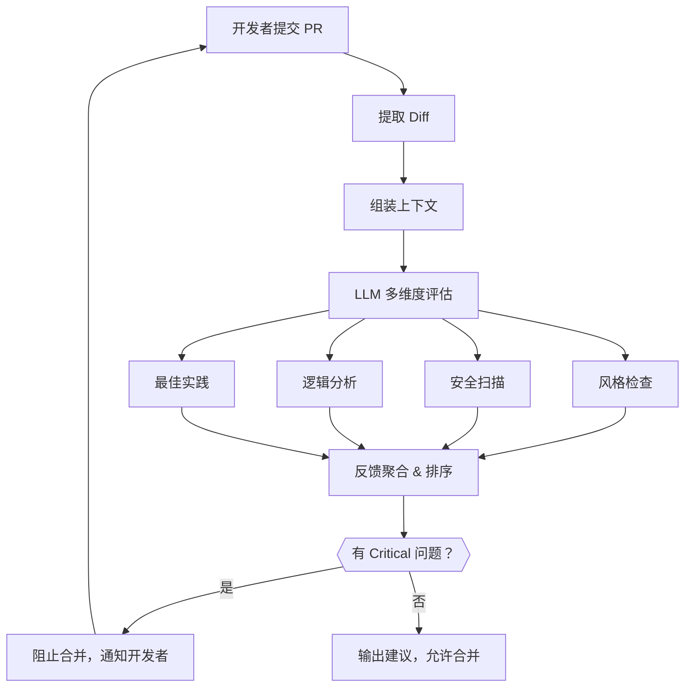

# AI 代码审查（AI Code Review）

## 概念解释

AI 代码审查是指在 Pull Request（拉取请求，简称 PR）流程中引入大语言模型（LLM），让 AI 自动阅读代码变更并给出审查意见。它扮演的角色类似于"永不下班的初级审查员"——自动完成风格检查、安全扫描、常见 Bug 识别等初筛工作，把高级工程师从重复劳动中解放出来。

传统代码审查完全依赖人工。人工审查有两个核心瓶颈：一是速度慢，PR 提交后往往要等几小时甚至一天才有人看；二是质量不稳定，不同审查者的标准和关注点不同，有的人抠风格、有的人看逻辑，覆盖面难以保证。传统的静态分析工具（Static Analysis，如 ESLint、SonarQube）虽然能自动化，但只能按预设规则匹配，无法理解代码的语义意图。

AI 代码审查的核心突破在于：LLM 经过海量代码训练后，既能理解代码"写了什么"（语法），也能推测代码"想做什么"（语义）。这使得它能发现"函数名叫 validate 但实际没做验证"这类人才能看出的微妙问题，而不仅仅是"变量未使用"这种机械检查。

## 关键结构

AI 代码审查系统的运转依赖以下几个核心环节：

| 环节 | 作用 | 说明 |
|------|------|------|
| Diff 提取（差异提取） | 获取 PR 中的代码变更 | 解析新增行、删除行、修改行，构建分析输入 |
| 上下文组装 | 拼接变更周边的代码 | 仅看 diff 不够，还需函数签名、类定义等周围信息 |
| LLM 评估 | 多维度审查代码质量 | 风格、安全、逻辑、最佳实践并行评估 |
| 反馈排序 | 按严重程度输出建议 | 区分"必须修"和"建议改"，减少信息过载 |

### 环节 1：Diff 提取

PR 提交时，系统通过 Git 或平台 API 拿到 diff（差异文本）。diff 里包含每个文件的新增行（`+` 开头）和删除行（`-` 开头）。好的提取器还会识别代码的逻辑边界——比如这几行属于哪个函数，函数属于哪个类。

### 环节 2：上下文组装

只看 diff 中那几行改动，AI 很容易误判。比如一个新增的 `return None` 看上去没问题，但如果上面的 if 分支已经 return 了，这行就是死代码。上下文组装的目标是把"改动周围足够多的信息"拼进 LLM 的输入，同时不超出 Token（令牌）限制。常见策略是优先加载同一函数的完整代码，再酌情加载同文件其他相关定义。

### 环节 3：LLM 评估

拼好上下文后，系统将代码和审查指令一起发给 LLM。指令通常要求 LLM 从风格规范、安全隐患、逻辑正确性、最佳实践四个维度分别评估，并以结构化格式（如 JSON）返回结果。不同的 Prompt（提示词）写法直接决定审查质量。

### 环节 4：反馈排序

LLM 返回的建议可能有十几条，不能一股脑甩给开发者。系统按严重程度分级：Critical（严重）级问题阻止合并、High（高）级问题需修复后合并、Medium/Low（中/低）级作为改进建议。只有分级清晰，开发者才愿意持续使用。

## 核心原理

### 原理说明

AI 代码审查的运转核心是"Diff + 上下文 → LLM → 结构化反馈"这条管线：

1. **输入**：PR 的 diff 文本 + 变更周边的上下文代码
2. **处理**：LLM 同时从风格、安全、逻辑、实践四个维度评估代码
3. **输出**：按严重程度排序的审查意见列表，附具体行号和修复建议
4. **关键判断**：发生在反馈排序环节——Critical 级问题直接阻断合并流程

与传统静态分析的本质区别：静态分析靠规则匹配（"如果出现 eval() 就报警"），AI 审查靠语义理解（"这段代码在拼 SQL 且没有参数化，可能存在注入风险"）。前者只能检查已知模式，后者能发现未被规则覆盖的新问题。

### Mermaid 图解



图中的关键流转：LLM 评估是并行四路检查、最终汇总排序的过程。Critical 问题形成闭环——必须修复后重新提交，才能继续合并。

### 运行示例

以下用 Python 伪代码展示 AI 代码审查的最小核心逻辑——"拿到 diff、调 LLM、拿回结构化结果"。

```python
# 基于 openai>=1.0 验证（截至 2026-03）
from openai import OpenAI
import json

def ai_review(diff_text: str, context: str = "") -> dict:
    """对一段代码 diff 进行 AI 审查，返回结构化结果"""
    client = OpenAI()  # 从环境变量读取 OPENAI_API_KEY

    prompt = f"""你是代码审查专家。请从以下 4 个维度评估代码变更，返回 JSON：
- style: 风格问题列表
- security: 安全隐患列表（含 severity 字段）
- logic: 逻辑缺陷列表
- suggestion: 改进建议列表

【代码变更】
{diff_text}

【项目上下文】
{context or '无'}
"""
    resp = client.chat.completions.create(
        model="gpt-4o",
        messages=[{"role": "user", "content": prompt}],
        temperature=0.2,
        response_format={"type": "json_object"},
    )
    return json.loads(resp.choices[0].message.content)

# 用法示例
diff = """+def verify_token(token):
+    return token == "hardcoded_secret"
"""
result = ai_review(diff, context="Python Web 项目，安全要求高")
# result["security"] 会包含"硬编码密钥"的告警
```

上述代码只展示了核心调用链路。实际产品中还需要加入 diff 解析、上下文拼接、反馈排序、CI/CD 集成等工程模块，此处省略。

## 易混概念辨析

| 概念 | 与 AI 代码审查的区别 | 更适合关注的重点 |
|------|---------------------|------------------|
| 静态分析（Static Analysis） | 基于预定义规则做模式匹配，不理解语义 | 已知规则的高速检测（如未使用变量、格式错误） |
| Linter（代码检查器） | 静态分析的子集，只关注代码风格和格式 | 缩进、命名、import 顺序等风格统一 |
| AI 代码生成 | 生成新代码，而非审查已有代码 | Copilot 自动补全、根据注释生成函数 |
| SAST（静态应用安全测试） | 专注安全漏洞检测，规则来自漏洞数据库 | SQL 注入、XSS、硬编码密钥等已知漏洞模式 |

核心区别：

- **AI 代码审查**：用 LLM 的语义理解力，对代码变更做综合评估（风格 + 安全 + 逻辑 + 实践）
- **静态分析 / Linter**：按固定规则匹配，速度快但无法发现规则以外的问题
- **SAST**：与 AI 审查可互补——SAST 覆盖已知漏洞模式，AI 审查覆盖语义层面的隐患

## 适用边界与局限

### 适用场景

1. **高频 PR 团队**：每天几十上百个 PR，人工审查来不及。AI 做初筛，人工只看 AI 标记的高风险变更
2. **开源项目维护**：大量外部贡献者提交的 PR，AI 作为第一道关卡快速评估代码质量
3. **安全合规要求高的行业**：金融、医疗等需要逐条审计的场景，AI 审查生成结构化报告辅助合规

### 不适合的场景

1. **架构级重构决策**：AI 只能看局部 diff，无法判断"这次重构方向是否正确"
2. **业务逻辑正确性验证**：AI 不了解具体业务规则（如"订单金额不能为负"），这类问题仍需人工把关

### 局限性

1. **LLM 幻觉（Hallucination）**：AI 可能给出看似合理但错误的建议，特别是面对它训练数据中少见的代码模式
2. **上下文窗口限制**：超大 PR（数千行变更）可能超出 LLM 的 Token 上限，导致部分代码无法被分析
3. **成本累积**：每次 PR 调用 LLM API 都有费用，大团队每月可能产生可观的成本

## 常见误区

| 常见误区 | 正确理解 |
|----------|----------|
| AI 审查可以完全替代人工审查 | AI 擅长初筛（风格、已知漏洞、常见 Bug），但架构决策、业务逻辑验证、技术权衡仍需人工判断 |
| 用了 AI 审查就不需要写测试了 | AI 审查是静态分析，无法发现运行时才暴露的问题。单元测试和集成测试不可省略 |
| 模型越大审查效果越好 | 审查质量更多取决于 Prompt 设计和上下文质量。精心调优的中等模型常优于随意调用的顶级模型 |
| AI 审查结果 100% 可信 | LLM 是概率模型，存在幻觉风险。安全关键问题必须人工复核 |

## 思考题

<details>
<summary>初级：AI 代码审查和传统 Linter 最本质的区别是什么？</summary>

**参考答案：**

Linter 基于预定义规则做模式匹配，只能发现规则库中已有的问题（如命名不规范、缩进错误）。AI 代码审查基于 LLM 的语义理解，能发现规则未覆盖的语义层问题（如"函数名叫 validate 但逻辑里没做验证"），但也因此存在幻觉风险。

</details>

<details>
<summary>中级：一个 3000 行的大 PR 提交后，AI 审查可能出现什么问题？如何缓解？</summary>

**参考答案：**

主要问题是超出 LLM 的上下文窗口限制，导致部分代码无法被分析，审查结果不完整。缓解方案：(1) 按文件或函数粒度分批发送给 LLM，分别审查再汇总；(2) 用分层上下文策略——优先加载与变更直接相关的上下文，远离变更的代码酌情省略；(3) 从流程上鼓励小 PR，避免单个 PR 积累过多变更。

</details>

<details>
<summary>进阶：你的团队每天 50 个 PR，计划引入 AI 代码审查。如何评估上线后是否真正有效？</summary>

**参考答案：**

核心指标：(1) PR 平均合并时间是否缩短；(2) 人工审查者每个 PR 平均花费时间是否减少；(3) 线上 Bug 数量是否下降（说明 AI 确实拦住了问题）；(4) AI 建议的采纳率——如果开发者大量忽略 AI 建议，说明误报率太高，需要调优 Prompt 或审查规则；(5) 月度 API 成本是否在预算范围内。建议先对 20% 的 PR 灰度上线，对比有 AI 审查和无 AI 审查两组的数据差异。

</details>

## 参考资料

1. GitHub Docs. (2026). 通过 GitHub Copilot 配置自动代码评审. https://docs.github.com/zh/copilot/using-github-copilot/code-review/configuring-automatic-code-review-by-copilot
2. GitHub Blog. (2025). New public preview features in Copilot code review. https://github.blog/changelog/2025-10-28-new-public-preview-features-in-copilot-code-review-ai-reviews-that-see-the-full-picture/
3. Sentry Docs. (2026). AI Code Review. https://docs.sentry.io/product/ai-in-sentry/ai-code-review/
4. CodeRabbit. (2026). AI Code Reviews 官方网站. https://coderabbit.com/
5. Digital Applied. (2025). AI Code Review Automation: Complete Guide 2025. https://www.digitalapplied.com/blog/ai-code-review-automation-guide-2025
