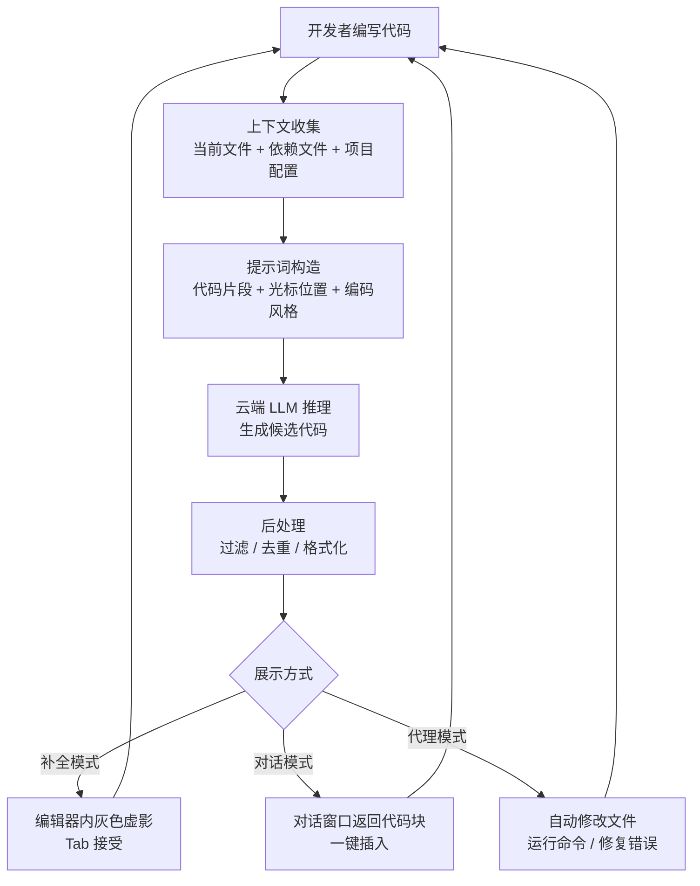

# AI 编码助手（AI Coding Assistants）

## 概念解释

AI 编码助手是一类内置大语言模型（LLM, Large Language Model）的开发工具，它能读懂你正在写的代码，实时给出补全建议、生成新代码、甚至自动执行跨文件的修改任务。可以把它理解为"坐在你旁边、随时能看到你屏幕的编程搭档"。

为什么需要它？传统的 IDE 智能提示只能基于符号表做简单匹配，比如输入 `str.` 后列出字符串方法。但它不理解你要做什么。AI 编码助手的区别在于：它能根据上下文推断你的意图，直接生成整段逻辑代码，而不只是列个方法列表。

与手动查文档、复制 StackOverflow 代码相比，AI 编码助手把"想到 -> 写出来"的时间压缩了一个量级。据行业数据，使用 AI 编码助手的开发者编码速度平均提升 30%-50%。

## 关键结构

AI 编码助手的能力可以拆成三层，从基础到高级依次叠加：

| 能力层 | 做什么 | 典型体验 |
|--------|--------|----------|
| 代码补全（Completion） | 预测你接下来要写的代码，实时弹出建议 | 输入函数签名后，自动补全整个函数体 |
| 对话生成（Chat） | 通过自然语言描述需求，AI 生成整段代码 | 在对话框输入"写一个分页查询接口"，AI 给出完整实现 |
| 代理执行（Agent） | 自主完成多步骤任务：分析代码库、修改多个文件、运行测试、修复错误 | 告诉 AI"把项目从 Express 迁移到 Fastify"，它自动改配置、改路由、跑测试 |

### 代码补全

最基础也最常用的能力。开发者在编辑器中正常写代码，AI 在后台持续分析上下文，以灰色虚影或浮窗的形式展示建议。按 Tab 接受，按 Esc 忽略。好的补全引擎能做到毫秒级响应，几乎感觉不到延迟。

### 对话生成

开发者用自然语言描述需求，AI 生成完整代码块。这比补全更"主动"——你不需要先写出部分代码，直接说清楚你要什么就行。适合处理新功能、陌生框架、或需要大量样板代码（Boilerplate Code，指重复性的模板代码）的场景。

### 代理执行

2025-2026 年的标志性进步。代理（Agent）模式下，AI 不再只是给建议，而是自己动手：读取项目文件、修改代码、执行命令、查看错误日志、再修复——形成一个自动化的"编码-测试-修复"循环。这是从"辅助写代码"到"自主完成编码任务"的关键跳跃。

## 核心原理

### 原理说明

AI 编码助手的工作核心是一个"收集上下文 -> 构造提示词 -> 模型推理 -> 展示结果"的循环：

1. **上下文收集**：工具读取当前文件、光标位置、相关依赖文件、项目配置等信息。不同工具的策略不同——有的只看当前文件前后几百行，有的会扫描整个项目建立索引。
2. **提示词构造**：将收集到的上下文组装成一条结构化的提示词（Prompt），包含代码片段、编辑历史、编码风格等。这一步的质量直接决定 AI 输出的质量。
3. **模型推理**：提示词发送到云端大语言模型（如 Claude、GPT 系列），模型生成候选代码。
4. **后处理与展示**：对模型输出进行过滤、去重、格式化，以补全建议或对话回复的形式呈现给开发者。

其中，**上下文窗口**（Context Window，模型一次能处理的文本长度上限）是关键瓶颈。窗口越大，AI 能"看到"的项目信息越多，生成的代码越贴合实际。2026 年主流模型的上下文窗口已达到 128K-200K tokens，足以覆盖大部分单模块的完整代码。

### Mermaid 图解

三种展示方式对应三层能力：补全模式最轻量、对话模式适合生成新代码、代理模式适合复杂的多步骤任务。无论哪种模式，核心都是"上下文 -> 提示词 -> 模型推理"这条链路。

### 主流工具对比

2026 年 AI 编码助手市场已形成三种主要形态：

| 维度 | GitHub Copilot | Cursor | Claude Code |
|------|---------------|--------|-------------|
| 形态 | VS Code / JetBrains 插件 | AI 原生 IDE（基于 VS Code） | 终端命令行工具 |
| 核心优势 | GitHub 生态深度集成，团队协作 | 多模型灵活切换，项目上下文优化 | 自主代理能力强，多文件深度重构 |
| 模型支持 | GPT 系列 + Claude 等多模型 | OpenAI / Anthropic / Google 等 | Anthropic Claude 系列 |
| 起步价格 | $10/月（Pro） | $20/月（Pro） | $100/月（Max） |
| 最适合 | 已在 GitHub 生态的团队 | 追求编辑器内 AI 体验的开发者 | 复杂架构级重构和大型代码库 |

> 补充：Windsurf（原 Codeium 出品）也是 2025-2026 年的热门选手，定位类似 Cursor，以 Cascade 代理能力为特色。JetBrains Junie 则为 JetBrains IDE 用户提供原生 AI 代理体验。

## 易混概念辨析

| 概念 | 与 AI 编码助手的区别 | 更适合关注的重点 |
|------|---------------------|------------------|
| 传统 IDE 智能提示 | 基于符号表的静态匹配，不理解编程意图，只能推荐已有的 API | 类型补全、方法列表等确定性提示 |
| ChatGPT 等通用聊天 AI | 不集成在编辑器中，缺少项目上下文，无法直接操作代码文件 | 通用问答、学习概念、非代码场景 |
| 低代码/无代码平台 | 通过可视化拖拽生成应用，目标用户是非程序员 | 业务人员快速搭建简单应用 |
| AI 代码审查工具 | 专注代码质量检查（安全漏洞、性能问题），不负责生成代码 | 合规审计、安全扫描、质量把关 |

核心区别：

- **AI 编码助手**：嵌入开发环境，理解项目上下文，既能生成代码也能执行修改
- **通用聊天 AI**：脱离编辑器工作，需要手动复制粘贴代码，无法感知项目全貌
- **传统 IDE 智能提示**：只做确定性匹配，不具备生成能力

## 适用边界与局限

### 适用场景

1. **重复性代码加速**：样板代码、CRUD 接口、数据校验等高重复场景，AI 补全可节省大量时间
2. **跨技术栈快速上手**：从 React 切到 Vue、从 Django 切到 FastAPI，AI 能直接生成目标框架的惯用写法，缩短学习曲线
3. **大规模重构与迁移**：代理模式可批量修改文件、自动跑测试，把数天的迁移工作压缩到几小时
4. **测试用例与文档生成**：AI 擅长识别边界条件，能自动生成覆盖正常/异常路径的测试代码和清晰注释

### 不适合的场景

1. **核心架构设计决策**：选择微服务还是单体、用什么消息队列——这类需要业务判断的决策不应依赖 AI
2. **高安全性关键路径**：加密算法实现、金融交易核心逻辑等不容出错的代码，必须人工逐行审查

### 局限性

1. **幻觉问题**（Hallucination）：AI 可能生成看起来正确但实际不存在的 API 或函数签名，生产代码必须手动验证
2. **上下文理解有天花板**：即使上下文窗口很大，AI 仍可能遗漏项目特有的业务约定和架构规则
3. **依赖网络与云服务**：主流工具都依赖云端推理，离线或高度保密环境受限
4. **许可证合规风险**：AI 训练数据可能包含 GPL 等强许可证开源代码，生成的代码存在合规隐患

## 常见误区

| 常见误区 | 正确理解 |
|----------|----------|
| AI 编码助手会替代程序员 | AI 是效率放大器，不是替代品。它加速重复工作，但架构设计、需求分析、质量把关仍需人来做 |
| 选最贵的工具就能获得最好效果 | 效果取决于上下文理解和 IDE 集成深度，不只是模型强不强。Cursor 受欢迎正是因为上下文优化好 |
| AI 生成的代码可以直接上线 | AI 输出通常是 80% 完成度的草稿，需要审查、测试、调整，尤其涉及业务逻辑和安全性时 |
| 所有编码任务都该交给 AI | 补全、模板生成、重构是 AI 的强项；架构设计、性能调优、安全决策仍需人工判断 |

## 思考题

初级：AI 编码助手的三层能力（补全、对话、代理）分别解决什么问题？

**参考答案：**

补全解决"写已知代码太慢"的问题，预测并自动填充下一段代码；对话解决"从零开始写新功能"的问题，用自然语言描述需求即可获得完整代码；代理解决"多文件复杂任务靠人工太繁琐"的问题，AI 自主执行编辑、测试、修复的完整流程。

中级：为什么上下文窗口大小对 AI 编码助手如此重要？窗口越大就一定越好吗？

**参考答案：**

上下文窗口决定了模型一次能"看到"多少代码。窗口太小，AI 只能看到当前文件片段，容易生成不符合项目整体结构的代码。但窗口越大并不意味着效果越好：一方面推理成本随窗口增大而增加（更慢、更贵）；另一方面，塞入过多无关代码可能干扰模型的注意力，反而降低输出质量。好的工具会智能筛选最相关的上下文，而不是简单地塞满窗口。

中级/进阶：你的团队要将一个 50 个文件的 Node.js 项目从 Express 迁移到 Fastify。应该选择补全模式还是代理模式？为什么？

**参考答案：**

应选代理模式。原因：Express 到 Fastify 的迁移涉及路由语法、中间件注册方式、配置文件等多处系统性变更，跨越几十个文件。补全模式只能逐行辅助，开发者需要自己定位每个需修改的位置。代理模式则可以：(1) 自动扫描所有相关文件；(2) 批量替换路由声明和中间件写法；(3) 运行测试套件检查兼容性；(4) 根据测试失败自动修复问题。当然，代理完成后仍需人工审查关键业务逻辑是否被正确迁移。

## 参考资料

1. GitHub Copilot 官方文档：https://docs.github.com/en/copilot
2. Cursor 官方文档：https://docs.cursor.com/
3. Claude Code 官方文档：https://docs.anthropic.com/en/docs/claude-code
4. SitePoint - AI Coding Tools 2026 Comparison Guide：https://www.sitepoint.com/ai-coding-tools-comparison-2026/
5. Qodo - Top 15 AI Coding Assistant Tools to Try in 2026：https://www.qodo.ai/blog/best-ai-coding-assistant-tools/
