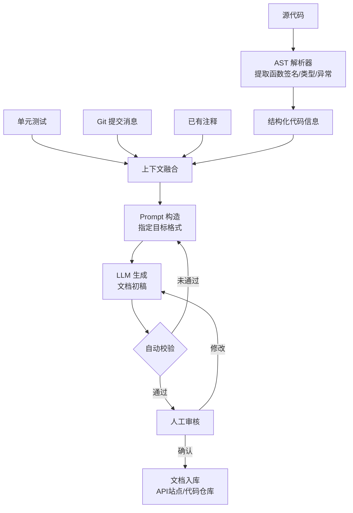

# AI 辅助文档生成（AI Documentation Generation）

## 概念解释

AI 辅助文档生成，是指利用大语言模型（LLM，Large Language Model）分析代码的结构和语义，自动产出代码注释、API 接口文档、版本更新日志（CHANGELOG）等技术文档的工程实践。

传统软件开发中，文档编写有三个老大难问题：文档跟不上代码变化（一改代码忘改文档）、手写文档太慢（几百个接口全靠手敲）、不同人写的文档风格不统一（有的详细有的敷衍）。AI 辅助文档生成的核心思路是——让 LLM 充当"自动文档员"，它读懂代码后直接输出初稿，开发者只需审核和微调，而不是从零开始写。

与传统的模板填空式文档工具不同，LLM 能理解代码的逻辑意图，而不仅仅是机械提取函数名和参数列表。例如，它能从一个函数的异常处理代码中推断出"这个函数在输入为空时会报错"，并主动写进文档里。

## 关键结构

AI 辅助文档生成的完整链路可以拆成四个核心环节：

| 环节 | 作用 | 说明 |
|------|------|------|
| 代码解析 | 提取结构化信息 | 从源码中提取函数签名、参数类型、返回值、异常等 |
| 上下文融合 | 补充语义信息 | 结合注释、测试用例、Git 提交消息等多源信息 |
| LLM 生成 | 产出文档初稿 | 根据 Prompt（提示词）和目标格式生成文档内容 |
| 审查反馈 | 质量把关 | 自动校验 + 人工审核，确保准确后合并 |

### 环节 1：代码解析

通过 AST（Abstract Syntax Tree，抽象语法树）解析器或语言服务器，从代码中提取函数名、参数列表、类型注解（Type Hints）、返回类型、异常抛出等结构化信息。这一步的产出是机器可读的"代码骨架"，为后续 LLM 生成提供精确输入。

### 环节 2：上下文融合

单看代码本身信息有限。这一步将多个信息源汇总：

- **已有注释**：开发者写的行内注释和旧 Docstring（文档字符串）
- **单元测试**：测试用例揭示函数的典型输入输出和边界条件
- **Git 提交消息**：说明这段代码为什么被修改，提供业务背景
- **类型提示**：`Optional[List[User]]` 这类类型信息暗示"可能为空"

融合多源信息后，LLM 生成的文档质量远高于只看代码本身。

### 环节 3：LLM 生成

将解析结果和上下文打包成 Prompt，发给 LLM，指定目标文档格式（如 NumPy Docstring、Javadoc、OpenAPI 等）。LLM 根据代码逻辑和上下文，输出符合格式要求的文档初稿。

### 环节 4：审查反馈

生成的文档并非直接可用。需要经过：
- **自动校验**：检查参数数量是否匹配、返回类型是否一致、格式是否符合规范
- **人工审核**：开发者确认业务逻辑描述是否准确，补充 LLM 无法推断的设计意图

## 核心原理

### 原理说明

AI 辅助文档生成的核心机制分三步：

1. **输入**：将待文档化的代码及其上下文信息（注释、测试、Git 历史）组织成结构化的 Prompt
2. **处理**：LLM 同时理解代码的语法结构和语义意图，根据指定的文档格式规范生成内容
3. **输出**：产出符合特定规范的文档（Docstring、API 文档、CHANGELOG 等）

关键判断发生在 Prompt 构造阶段——不同类型的文档需要不同的 Prompt 策略。生成 Docstring 时侧重参数说明和异常处理；生成 CHANGELOG 时侧重变更分类和影响范围；生成 API 文档时侧重请求参数和响应格式。

这套机制能解决文档滞后问题的根本原因是：代码变更本身就是触发文档更新的信号。通过 CI/CD 集成，每次代码提交都可以自动触发文档重新生成。

### Mermaid 图解



- **A-C**：代码解析阶段，将源码转化为结构化信息
- **D-G → E**：多源信息融合，补充语义上下文
- **H-I**：LLM 生成阶段，Prompt 决定输出格式和质量
- **J-K**：双重审查，自动校验拦截格式错误，人工审核把关业务准确性
- 自动校验未通过时会回到 Prompt 构造步骤重新生成，形成反馈闭环

### 运行示例

以下用 Python + OpenAI API 演示最小文档生成流程：从一个函数自动生成 NumPy 风格的 Docstring。

```python
# 基于 openai==1.30.0 验证（截至 2026-03）
import ast
import inspect
from openai import OpenAI

def extract_func_info(source: str) -> dict:
    """从函数源码中提取签名信息"""
    tree = ast.parse(source)
    func = tree.body[0]  # 取第一个函数定义
    params = [arg.arg for arg in func.args.args if arg.arg != 'self']
    return {"name": func.name, "params": params, "source": source}

def generate_docstring(func_info: dict) -> str:
    """调用 LLM 生成 NumPy 风格 Docstring"""
    client = OpenAI()  # 从环境变量读取 OPENAI_API_KEY
    prompt = f"""为以下函数生成 NumPy 风格的 Docstring，包含 Parameters、Returns、Raises、Examples。
函数名: {func_info['name']}
参数: {func_info['params']}
源码:
{func_info['source']}
只返回 Docstring 内容。"""

    resp = client.chat.completions.create(
        model="gpt-4o-mini",
        messages=[
            {"role": "system", "content": "你是 Python 文档生成助手，输出 NumPy 风格 Docstring。"},
            {"role": "user", "content": prompt}
        ],
        temperature=0.3
    )
    return resp.choices[0].message.content

# ---- 使用示例 ----
sample_code = '''
def calculate_discount(price: float, rate: float) -> float:
    if rate < 0 or rate > 1:
        raise ValueError("折扣率必须在 0-1 之间")
    return price * (1 - rate)
'''

info = extract_func_info(sample_code.strip())
docstring = generate_docstring(info)
print(docstring)
```

`extract_func_info` 用 `ast` 模块做最小化的代码解析；`generate_docstring` 将解析结果打包成 Prompt 发给 LLM。实际工程中会额外融合测试用例和 Git 信息，并加入自动校验步骤。

## 易混概念辨析

| 概念 | 与 AI 辅助文档生成的区别 | 更适合关注的重点 |
|------|--------------------------|------------------|
| 代码补全（Code Completion） | 代码补全生成的是代码本身，文档生成的产出是说明性文字 | 写代码时的实时建议 |
| 静态分析工具（Linter/Type Checker） | 静态分析检查代码是否符合规范，不生成文档内容 | 代码质量和类型安全 |
| API 网关文档（如 Swagger UI） | 只展示接口定义，不能自动生成业务描述和使用示例 | 接口的结构化展示和调试 |

核心区别：

- **AI 辅助文档生成**：核心是"理解代码意图后自动撰写说明文字"
- **代码补全**：核心是"根据上下文续写代码"，两者输出物不同
- **静态分析**：核心是"检查代码是否有问题"，不产出面向人类的文档
- **API 网关文档**：核心是"结构化展示已有定义"，不涉及内容撰写

## 适用边界与局限

### 适用场景

1. **批量补充缺失文档**：老项目有大量函数缺少 Docstring，AI 可以批量扫描并生成初稿，几百个函数几分钟搞定
2. **API 文档自动同步**：REST/GraphQL 接口频繁变更，用 AI 从代码自动生成 OpenAPI 文档，避免手工维护的同步问题
3. **CHANGELOG 自动生成**：项目遵循 Conventional Commits（约定式提交）规范，AI 根据 Git 提交消息自动生成分类清晰的更新日志
4. **新人接手遗留代码**：新员工面对没有文档的老代码，AI 快速生成关键函数的说明，加速理解

### 不适合的场景

1. **架构设计文档**：设计文档需要解释"为什么这样设计"、权衡取舍、方案对比，这些信息不在代码里，AI 无法推断
2. **高度定制化的业务规则说明**：涉及多个系统交互、特殊行业规则的业务逻辑，单靠代码 AI 理解不透彻

### 局限性

1. **依赖代码质量**：如果代码命名混乱、缺少类型提示、逻辑纠缠不清，AI 生成的文档质量也会很差。垃圾进，垃圾出
2. **业务语义盲区**：AI 能看懂代码做了什么，但不一定知道为什么这么做。涉及业务背景的描述仍需人工补充
3. **API 调用成本**：大规模使用云端 LLM 生成文档会产生费用。可考虑用本地模型（如 CodeLlama）降低成本
4. **幻觉风险**：LLM 可能生成看似合理但实际不准确的描述，必须经过人工审核

## 常见误区

| 常见误区 | 正确理解 |
|----------|----------|
| AI 生成的文档可以直接用，不需要审核 | AI 输出的是初稿，尤其是业务逻辑描述和边界条件说明，必须经开发者确认后才能合并 |
| 有了 AI 文档生成就不用手写文档了 | Docstring 和 API 文档可以大幅自动化，但设计文档、架构决策说明仍需人工撰写 |
| 只要把代码扔给 AI 就能出好文档 | 代码本身的质量（命名规范、类型注解、合理注释）直接影响生成质量，烂代码出不了好文档 |
| CHANGELOG 自动生成不需要提交规范 | 自动 CHANGELOG 依赖规范化的 Git 提交消息（如 Conventional Commits），乱写的 commit message 生成不出有用的日志 |

## 思考题

<details>
<summary>初级：AI 辅助文档生成的四个核心环节是什么？为什么"上下文融合"比"只看代码"效果更好？</summary>

**参考答案：**

四个环节：代码解析、上下文融合、LLM 生成、审查反馈。上下文融合通过引入单元测试、Git 提交消息、已有注释等多源信息，能补充代码本身无法表达的业务意图和使用场景，让 LLM 生成的文档更准确、更完整。

</details>

<details>
<summary>中级：一个 Python 项目有 200 个函数缺少 Docstring，你打算用 AI 批量生成。在生成之前，你应该先做哪些准备工作来提升生成质量？</summary>

**参考答案：**

至少做三件事：(1) 统一代码的类型注解（Type Hints），让 AI 能准确识别参数和返回类型；(2) 确定目标 Docstring 格式（Google/NumPy/Sphinx），在 Prompt 中明确指定；(3) 准备几个高质量的 Docstring 示例作为 Few-shot（少样本学习），让 LLM 学习目标风格。此外，建立 PR 审核流程，确保生成的文档经过人工确认后才合并。

</details>

<details>
<summary>中级/进阶：团队决定在 CI/CD 流水线中集成 AI 文档生成，每次代码提交自动更新文档。请分析这个方案的优势和需要注意的风险。</summary>

**参考答案：**

优势：文档与代码始终同步，消除手动维护的滞后问题；新增/修改的函数自动获得文档更新。风险：(1) LLM 幻觉可能引入不准确的描述，如果没有审核环节就直接合并到主分支会造成误导；(2) 每次提交都调 LLM API 会增加构建时间和成本，建议只对有变更的文件触发生成；(3) 需要设计好回退机制，当生成质量异常时能快速恢复。推荐做法：AI 生成的文档以 PR 形式提交，经人工审核后再合并。

</details>

## 参考资料

1. Conventional Commits 规范：[https://www.conventionalcommits.org/](https://www.conventionalcommits.org/)
2. conventional-changelog 工具（GitHub）：[https://github.com/conventional-changelog/conventional-changelog](https://github.com/conventional-changelog/conventional-changelog)
3. OpenAI API 文档：[https://platform.openai.com/docs/](https://platform.openai.com/docs/)
4. Mintlify 文档生成平台：[https://mintlify.com/](https://mintlify.com/)
5. Swimm 代码文档同步工具：[https://swimm.io/](https://swimm.io/)

---
