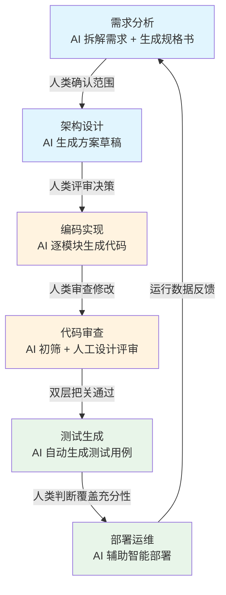
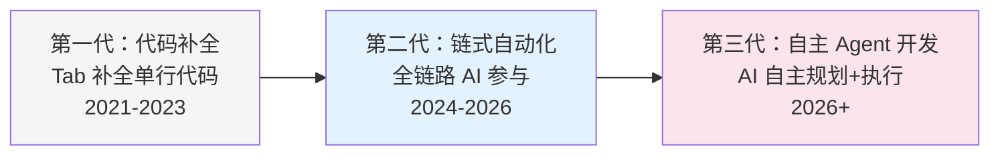

# AI 驱动开发流程（AI-Driven Development Workflow）

## 概念解释

AI 驱动开发流程是指在软件开发的每个阶段——需求分析、架构设计、编码实现、测试验证、部署运维——都由 LLM（Large Language Model，大语言模型）深度参与的工作范式。开发者的角色从"逐行写代码的人"转变为"指挥 AI 并把关质量的决策者"。

这个范式出现的原因很直接：传统开发中，大量时间花在了写模板代码（boilerplate，即重复性的"脚手架"代码）、梳理文档、编写测试这类机械劳动上，真正需要创意和判断的架构决策反而只占一小部分。LLM 恰好擅长处理模式匹配和文本生成，正好能接管这些低创造性工作。

与传统"代码补全"（如早期的 Tab 补全）不同，AI 驱动开发流程强调的是**全链路参与**：AI 不只帮你补一行代码，而是从需求阶段就开始介入——帮你拆解需求、设计架构、生成实现、审查代码、编写测试。到 2025-2026 年，这一范式已经从"新奇的尝试"演变为工程团队的主流实践，催生了 Vibe Coding（氛围编程）、Spec-Driven Development（规格驱动开发）等新方法论。

## 关键结构

AI 驱动开发流程由 6 个核心阶段组成，每个阶段都有明确的"AI 做什么"和"人做什么"的分工：

| 阶段 | AI 的角色 | 人的角色 |
|------|----------|---------|
| 需求分析 | 拆解需求、追问边界 case、生成规格书草稿 | 确认范围、做最终取舍 |
| 架构设计 | 生成架构方案、ER 图、API 规范 | 评审方案、做技术选型决策 |
| 编码实现 | 生成代码框架和业务逻辑 | 审查逻辑、修改不合理的地方 |
| 代码审查 | 秒级扫描安全漏洞、风格问题、性能隐患 | 聚焦高层设计评审 |
| 测试生成 | 自动生成单元测试、边界用例 | 判断覆盖是否充分 |
| 部署运维 | 预测构建失败、选择部署时机 | 做最终发布决策 |

### 阶段 1：需求分析——Spec-Driven Development

Spec-Driven Development（规格驱动开发）是这一范式的起点，也是影响最大的环节。核心思路是：在写任何代码之前，先让 AI 协助生成一份清晰的需求规格书（Specification）。规格书越清楚，后续 AI 生成代码的质量就越高——这是一条被反复验证的铁律。

一份 AI 友好的规格书至少包含：用户故事、验收标准、边界 case、数据模型草图、主要 API 契约。

### 阶段 2：架构设计——AI 出方案，人做决策

AI 根据规格书自动生成架构方案草稿（包括系统分层、数据库设计、API 规范、部署拓扑），人类架构师评审并做最终技术选型。关键是**人类保持决策权**，AI 提供选项和理由。

### 阶段 3：编码实现——从 Vibe Coding 到工程化生成

2025 年初，Andrej Karpathy（前特斯拉 AI 总监、OpenAI 联合创始人）提出了 Vibe Coding（氛围编程）：用自然语言描述需求，让 AI 生成代码，开发者只需"感受氛围"看结果是否对。到 2026 年，这个概念已经从随意的实验演化为结构化的 AI-First Development（AI 优先开发）方法论，配合 Claude Code、Cursor 等工具，开发者可以逐模块地让 AI 生成实现代码。

### 阶段 4-6：审查、测试与部署的自动化

AI 代码审查在秒级完成初筛（安全漏洞、命名规范、复杂度），把人工审查的精力释放到高层设计问题上。测试生成覆盖 happy path（正常流程）和 edge case（边界情况）。CI/CD（持续集成/持续部署）环节中 AI 可预测构建失败并辅助智能部署。

## 核心原理

### 原理说明

AI 驱动开发流程的核心机制建立在三个支柱上：

**支柱一：规格清晰度决定代码质量**

这是最关键的原理。LLM 的代码生成不是"凭空创造"，而是"根据输入规格做模式匹配"。输入越清晰，输出越准确。模糊的需求（如"做一个好用的系统"）会导致 AI 生成泛泛而谈的代码；清晰的规格（包含具体的数据模型、API 契约、边界条件）会导致可直接使用的实现。

**支柱二：Human-in-the-Loop（人在回路中）**

每个阶段都保留人类决策点。AI 不是自动运行的流水线，而是"提供草稿，等待人类审批"的协作模式。这确保了最终产出的质量和可控性。

**支柱三：Continuous Feedback Loop（持续反馈回路）**

部署后的运行数据（性能指标、错误日志、用户反馈）回流到需求阶段，驱动下一轮迭代。这使得整个流程不是单向的瀑布，而是螺旋上升的循环。

### Mermaid 图解



图中蓝色阶段是"规划层"（决定做什么），橙色阶段是"实现层"（把想法变成代码），绿色阶段是"质量层"（确保做对了）。最关键的流转是最底部从 F 回到 A 的反馈回路——这保证了整个流程是持续改进的循环，而不是一次性交付。

下面这张图展示了 AI 驱动开发范式的三代演进：



当前行业主流处于第二代，即"链式自动化"阶段：每个环节都有 AI 参与，但人类保持最终决策权。第三代"自主 Agent 开发"是前沿方向，期望 AI Agent 能接受高级目标后自动完成全流程。

### 运行示例

```python
# 最小示例：展示"规格驱动"的核心思路
# 并非完整项目，仅说明"清晰规格 → AI 生成"的机制

spec = {
    "功能": "用户投票系统",
    "数据模型": {
        "Poll": ["id", "title", "options", "status"],
        "Vote": ["id", "poll_id", "user_id", "option_index"]
    },
    "API": [
        "POST /polls         # 创建投票",
        "POST /polls/{id}/votes  # 提交投票（每人限一次）",
        "GET  /polls/{id}/results # 查看结果",
    ],
    "边界条件": [
        "同一用户不能重复投票",
        "已关闭的投票拒绝新投票",
        "选项索引越界时返回 400",
    ],
}

# 实际开发中，将 spec 作为 prompt 上下文传给 LLM
# LLM 基于 spec 生成数据模型、路由、业务逻辑、测试用例
# 规格越清晰 → 生成质量越高 → 人工修改越少
prompt = f"基于以下规格书生成 Flask API 实现：\n{spec}"
print(f"规格书字段数: {len(spec)}")
print(f"边界条件数: {len(spec['边界条件'])}")
# 输出:
# 规格书字段数: 4
# 边界条件数: 3
```

上述示例仅展示规格书的数据结构。实际工作中，将这份规格书嵌入 prompt 传给 Claude 或 GPT，LLM 会基于此生成完整的路由代码、数据校验和测试用例。规格中"边界条件"字段对生成质量影响最大——缺少它，AI 生成的代码通常只覆盖正常流程。

## 易混概念辨析

| 概念 | 与 AI 驱动开发流程的区别 | 更适合关注的重点 |
|------|------------------------|----------------|
| Vibe Coding（氛围编程） | Vibe Coding 是编码阶段的一种风格（用自然语言描述、AI 生成），AI 驱动开发流程覆盖全链路 | 编码阶段如何与 AI 交互 |
| Agentic Workflow（智能体工作流） | Agentic Workflow 强调 AI Agent 自主规划和执行任务，AI 驱动开发流程目前仍以人为主导 | Agent 的自主决策和工具调用能力 |
| DevOps / CI/CD | DevOps 是软件交付的自动化基础设施，AI 驱动开发流程是在 DevOps 之上叠加 AI 能力 | 流水线自动化、基础设施即代码 |
| Pair Programming（结对编程） | 传统结对是两个人类协作，AI 驱动开发是人+AI 的协作，AI 永远不累且可并行 | 实时协作中的沟通与知识共享 |

核心区别：

- **AI 驱动开发流程**：关注"全链路每个阶段如何引入 AI 参与"，是一个完整的工作范式
- **Vibe Coding**：仅关注编码阶段的交互风格，是全链路中的一个环节
- **Agentic Workflow**：关注 Agent 的自主性和工具调用，是 AI 驱动开发的进化方向

## 适用边界与局限

### 适用场景

1. **标准化程度高的项目（CRUD 应用、微服务、内部工具）**：这类项目有大量模板代码和重复模式，AI 生成效率最高，规格也容易写清楚
2. **快速验证想法的 MVP 阶段**：从概念到可运行原型的速度大幅加快，适合初创团队和产品实验
3. **测试覆盖要求严格的系统（金融、医疗）**：AI 自动生成边界用例，可以快速将覆盖率从 60% 提到 85% 以上

### 不适合的场景

1. **需求极度模糊的探索性项目**：如果连要做什么都说不清，AI 生成的代码只会增加混乱——规格驱动的前提是"有规格可写"
2. **高度创新、无先例的算法开发**：LLM 的训练数据来自已有代码，对全新的算法或协议设计帮助有限

### 局限性

1. **规格书编写本身需要经验**：写出 AI 友好的规格书是一项技能，初学者可能写出的规格比写代码还慢
2. **LLM 服务依赖**：API 调用费用、速率限制、服务中断都会影响开发节奏；离线模型精度通常不如商用 API
3. **生成代码的可维护性风险**：AI 生成的代码可能使用冷门写法或过度设计，后续维护者理解成本较高
4. **合规与溯源**：某些行业对代码来源有严格要求，AI 生成的代码来源混杂，可能无法通过审计

## 常见误区

| 常见误区 | 正确理解 |
|----------|----------|
| "用了 AI 就不需要写需求文档了" | 恰恰相反，需求规格书是 AI 驱动开发的**最重要输入**。文档写得越清楚，AI 产出越好；省略规格等于让 AI 猜，结果必然要大量返工 |
| "AI 生成的代码可以直接上线" | AI 生成的代码语法通常正确，但逻辑 bug、安全漏洞仍然存在。"AI 初筛 + 人工审查"的双层把关是必须的 |
| "AI 会取代开发者" | AI 取代的是"逐行写模板代码"这件事，不是开发者本人。需求理解、架构判断、取舍决策这些高层能力反而更重要了 |
| "所有项目都能用 AI 提速" | 标准化高、重复多的项目提速最明显；需求模糊或高度创新的项目，AI 效果有限甚至可能拖慢进度 |

## 思考题

<details>
<summary>初级：AI 驱动开发流程中，哪个环节对最终代码质量影响最大？为什么？</summary>

**参考答案：**

需求分析阶段（Spec-Driven Development）影响最大。因为 LLM 是基于输入规格做模式匹配的，规格越清晰（包含数据模型、API 契约、边界条件），生成的代码越准确、返工越少。规格模糊时，后续每个环节都要花更多时间修正，成本是指数级放大的。

</details>

<details>
<summary>中级：一个团队刚开始实践 AI 驱动开发，但发现 AI 生成的代码质量很差、需要大量修改。最可能的原因是什么？应该如何改善？</summary>

**参考答案：**

最可能的原因是规格书质量差——需求描述过于模糊，缺少数据模型、API 契约、边界条件等关键信息。改善方法：(1) 在写代码前先投入时间写清晰的规格书，包含用户故事、验收标准、边界 case；(2) 给 AI 提供充分的上下文（已有代码、架构约定、编码规范）；(3) 逐模块生成而不是一次性生成整个系统。

</details>

<details>
<summary>中级/进阶：你的团队正在开发一个医疗数据分析平台，需要满足 HIPAA 合规要求。请分析在这个场景下使用 AI 驱动开发的利弊，并说明需要在哪些环节加强人工把关。</summary>

**参考答案：**

利：AI 可以快速生成测试用例（尤其是边界和异常情况），提升测试覆盖率，这对医疗系统尤其重要。弊：(1) HIPAA 合规要求代码可审计可溯源，AI 生成代码的来源混杂可能无法通过审计；(2) 涉及患者数据的代码不能发送到外部 API，需要使用本地部署的模型。需要加强把关的环节：代码审查阶段必须增加合规专家审查；测试阶段需要人工验证隐私保护逻辑是否完备；部署阶段需要确认没有数据泄漏风险。

</details>

## 参考资料

1. Karpathy, A. "Vibe Coding." X/Twitter, 2025-02. 提出 Vibe Coding 概念的原始帖子. https://x.com/karpathy/status/1886192184808149383
2. Piskala, D. "Spec-Driven Development: From Code to Contract in the Age of AI Coding Assistants." arXiv:2602.00180, 2026-01. https://arxiv.org/abs/2602.00180
3. AWS DevOps Blog. "Open-Sourcing Adaptive Workflows for AI-Driven Development Life Cycle (AI-DLC)." 2025-11. https://aws.amazon.com/blogs/devops/open-sourcing-adaptive-workflows-for-ai-driven-development-life-cycle-ai-dlc/
4. SitePoint. "Vibe Coding Guide 2026: AI-First Development." 2026-03. https://www.sitepoint.com/vibe-coding-2026-complete-guide/
5. Anthropic. "Claude Code Documentation." https://docs.anthropic.com/en/docs/claude-code
