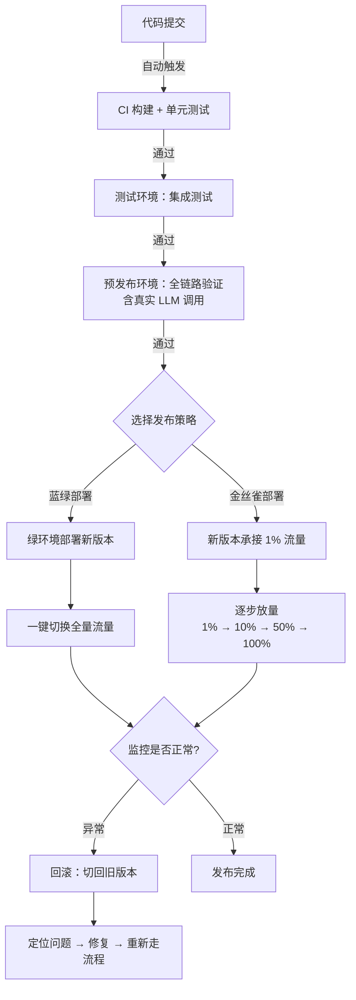

# Agent CD 部署（持续部署）

## 概念解释

CD（Continuous Deployment/Delivery，持续部署/交付）是一种自动化的软件发布方式：代码通过测试后，由流水线自动推送到各个环境，最终以可控的策略上线到生产环境。它的核心不是"快速部署"，而是"安全地、可回滚地、分阶段地"将新版本交付给用户。

传统部署方式是"停服 → 替换 → 重启"，一旦新版本出问题，只能手动回滚，耗时且影响全体用户。Agent 应用比传统应用更复杂——它依赖 LLM 模型、Prompt 模板、外部工具调用，任何一个环节变化都可能影响输出质量。因此 Agent 应用比普通 Web 应用更需要 CD 流程来控制发布风险。

CD 的关键思想是：**部署不是一瞬间的切换，而是一个可观测、可中断、可回滚的过程**。通过多环境分层验证和灰度发布策略，让每次上线都像调旋钮一样可控。

## 关键结构

CD 流程由四个核心环节组成，缺一不可：

| 环节 | 作用 | Agent 场景下的特殊性 |
|------|------|---------------------|
| 环境分层 | 代码在多个环境中逐级验证 | Agent 需要在预发布环境测试真实 LLM 调用 |
| 配置管理 | 不同环境使用不同参数和密钥 | LLM Key、模型选择、Prompt 版本都需要按环境隔离 |
| 发布策略 | 控制新版本的上线方式和节奏 | Agent 输出具有随机性，需更长观察期 |
| 回滚机制 | 出问题时快速恢复到上一版本 | 模型切换或 Prompt 变更也需要支持回滚 |

### 环节 1：环境分层

Agent 应用通常需要四层环境：

- **开发环境（Dev）**：开发者日常编码调试，通常用 Mock LLM（模拟模型，不消耗真实 API 额度）或低成本模型
- **测试环境（Test）**：运行自动化测试，验证业务逻辑正确性
- **预发布环境（Staging）**：模拟真实生产配置，用真实 LLM 做全链路验证
- **生产环境（Prod）**：承载真实用户流量，要求最高可靠性

关键原则：各环境配置同源但参数隔离——同一套代码，不同的模型、密钥、数据库地址。

### 环节 2：配置管理

Agent 应用的配置比传统 Web 应用更复杂，需要管理：

- **模型相关**：LLM 选择（GPT-4 / Claude / 开源模型）、温度参数、最大 Token 数
- **密钥相关**：API Key、数据库连接串——这些**绝不能写进代码或容器镜像**，必须通过密钥管理工具（如 Vault、K8s Secrets）动态注入
- **Prompt 版本**：Prompt 模板也是配置的一部分，变更 Prompt 等价于变更业务逻辑

### 环节 3：发布策略

两种主流策略：蓝绿部署和金丝雀部署（详见下方"核心原理"）。

### 环节 4：回滚机制

回滚（Rollback）是在新版本出问题时，将流量切回旧版本的操作。好的回滚机制要做到：
- **秒级切换**：不需要重新构建和部署，直接切流量
- **数据兼容**：新旧版本的数据格式必须兼容，否则回滚后数据出错
- **自动触发**：监控指标超过阈值时自动回滚，不依赖人工判断

## 核心原理

### 原理说明

CD 的整体运转逻辑可以概括为一句话：**代码从提交到上线，经过层层自动验证，最终通过可控策略到达用户**。

整个流程分为两个阶段：

**阶段一：逐环境推进**。代码提交后，CI 系统自动构建并运行测试；通过后推送到测试环境做集成验证；再推送到预发布环境做全链路验证（包括真实 LLM 调用）。每一层都是一道关卡，不通过就不往下走。

**阶段二：生产发布**。预发布验证通过后，选择蓝绿或金丝雀策略上线。发布期间持续监控关键指标（响应时间、错误率、Agent 输出质量），发现异常立即回滚。

两种发布策略的核心区别：

- **蓝绿部署（Blue-Green Deployment）**：维持两套完整环境，"蓝"跑旧版本，"绿"跑新版本。验证通过后一键切换全部流量。优点是切换和回滚都极快（只需改负载均衡指向），缺点是资源消耗翻倍。
- **金丝雀部署（Canary Deployment）**：新版本先承接少量流量（如 1%），逐步增加（1% → 10% → 50% → 100%）。优点是风险精细可控，缺点是需要流量分割机制和更长的观察周期。

### Mermaid 图解



图中关键流转说明：
- 左侧纵向链路是**逐环境推进**过程，每一层都是自动化的质量关卡
- 右侧分叉点是**策略选择**——蓝绿（全量切换）或金丝雀（逐步放量）
- 无论哪种策略，都汇聚到同一个"监控判断"节点——这是整个流程的安全阀

### 运行示例

以下伪代码展示金丝雀部署的核心逻辑——逐步放量 + 监控判断 + 自动回滚：

```python
# 金丝雀部署核心逻辑（伪代码，展示概念机制）

# 灰度阶段定义：每阶段的流量百分比和观察时长
stages = [
    {"canary_percent": 1,   "observe_minutes": 10},
    {"canary_percent": 10,  "observe_minutes": 30},
    {"canary_percent": 50,  "observe_minutes": 60},
    {"canary_percent": 100, "observe_minutes": 0},
]

for stage in stages:
    # 设置流量分配比例
    set_traffic_weight(stable=100 - stage["canary_percent"],
                       canary=stage["canary_percent"])

    # 观察期内持续检查指标
    if stage["observe_minutes"] > 0:
        metrics = collect_metrics(duration=stage["observe_minutes"])

        # 核心判断：错误率或延迟超标则立即回滚
        if metrics.error_rate > 0.05 or metrics.p99_latency > 3000:
            rollback_to_stable()  # 一键回滚
            break

# 以上逻辑对应三个核心机制：
# 1. 流量分割：按百分比将请求分配给新旧版本
# 2. 观察窗口：每个阶段留出时间收集真实指标
# 3. 自动回滚：指标异常时无需人工干预，直接切回旧版本
```

## 易混概念辨析

| 概念 | 与 Agent CD 部署的区别 | 更适合关注的重点 |
|------|----------------------|-----------------|
| CI（持续集成） | CI 关注"代码合并后能否通过构建和测试"，CD 关注"通过测试后如何安全上线" | 自动化构建、测试覆盖率 |
| CD Delivery vs CD Deployment | Delivery（交付）= 代码随时可发布但需人工批准；Deployment（部署）= 完全自动发布 | 是否需要人工审批环节 |
| 滚动更新（Rolling Update） | 滚动更新逐个替换实例，无流量分割；金丝雀部署按流量百分比分割 | K8s 原生默认策略 vs 需 Istio 等工具支持 |
| Feature Flag（功能开关） | Feature Flag 在代码层控制功能可见性；CD 部署策略在基础设施层控制流量 | 代码层面 vs 基础设施层面 |

核心区别：

- **Agent CD 部署**：关注的是"新版本如何安全地从测试环境到达生产环境的用户"
- **CI**：只管到"代码能否通过测试"这一步，不涉及上线策略
- **滚动更新**：没有流量百分比的精细控制，无法做"先让 1% 用户试用"
- **Feature Flag**：在同一个版本内部控制功能开关，不涉及部署和环境切换

## 适用边界与局限

### 适用场景

1. **Agent 模型升级**：从 GPT-3.5 切换到 GPT-4，需要用金丝雀策略先让小部分用户验证效果（准确率、成本、延迟），避免全量翻车
2. **Prompt 模板迭代**：Prompt 变更对 Agent 输出影响巨大，通过灰度发布逐步验证新 Prompt 在真实场景中的表现
3. **多 Agent 系统变更**：涉及多个 Agent 协作的系统，任何单点变更都可能影响全局流程，需要灰度观察
4. **框架版本升级**：LangChain、CrewAI 等框架的大版本升级，通过蓝绿部署快速验证兼容性，不兼容可秒级回退

### 不适合的场景

1. **早期原型阶段**：用户量极少（如内部测试 10 人），直接部署即可，建设 CD 流程的投入远大于收益
2. **紧急热修复**：线上严重 Bug 需要立即修复时，走完整灰度流程太慢，应走紧急发布通道（但事后仍需补走验证流程）

### 局限性

1. **资源成本**：蓝绿部署需要双倍基础设施，对中小团队是显著的成本压力
2. **Agent 输出的随机性**：即使灰度期间指标正常，放量后不同用户输入可能触发新的异常模式，监控指标无法覆盖所有边缘情况
3. **数据库变更的复杂性**：如果新版本涉及数据库 Schema 变更，蓝绿部署中新旧版本需要同时兼容新旧数据结构，增加开发复杂度
4. **监控体系依赖**：金丝雀部署的效果完全取决于监控指标的准确性。如果关键指标（如 Agent 输出质量）难以量化，灰度判断就失去了依据

## 常见误区

| 常见误区 | 正确理解 |
|----------|----------|
| CD 就是"自动部署到生产" | CD 是完整的自动化交付流程，生产发布通常需要灰度策略控制，不是盲目全量推送 |
| 蓝绿部署一定优于金丝雀 | 蓝绿切换快但资源消耗大；金丝雀风险控制精细但需更长观察期和流量分割工具。选择取决于团队资源和应用特点 |
| 密钥可以打包进镜像 | API Key、数据库密码等敏感信息必须通过密钥管理工具动态注入，绝不能写入代码或镜像 |
| 部署成功 = 上线成功 | 容器启动成功不等于应用健康，应用健康不等于 Agent 输出质量达标。需要全链路健康检查 |
| 改了 Prompt 不算部署 | Prompt 变更等同于业务逻辑变更，应走与代码变更相同的 CD 流程，包括灰度发布和回滚预案 |

## 思考题

<details>
<summary>初级：蓝绿部署和金丝雀部署的核心区别是什么？各自的回滚方式有何不同？</summary>

**参考答案：**

蓝绿部署维持两套完整环境，发布时一键切换全部流量，回滚只需将流量切回旧环境（秒级）。金丝雀部署逐步增加新版本的流量占比（1% → 10% → 100%），回滚时将流量比例归零并删除金丝雀实例。蓝绿是"全量切换 + 全量回滚"，金丝雀是"渐进放量 + 渐进收回"。

</details>

<details>
<summary>中级：你的 Agent 应用要从 GPT-3.5 升级到 GPT-4，API 成本增加 10 倍。设计一个灰度方案，说明在灰度期间需要监控哪些指标。</summary>

**参考答案：**

建议采用金丝雀部署，分 4 个阶段放量：1%（观察 1 小时）→ 5%（观察半天）→ 25%（观察 1 天）→ 100%。监控指标包括：(1) 功能指标——Agent 任务完成率、输出准确率；(2) 性能指标——P99 延迟、Token 使用量；(3) 成本指标——单次请求平均成本、日总成本；(4) 异常指标——错误率、幻觉率（Agent 输出与事实不符的比例）。如果 GPT-4 在准确率上提升不足以抵消 10 倍成本增加，应在灰度期间就暂停升级计划。

</details>

<details>
<summary>中级/进阶：Agent 应用的 CD 流程和传统 Web 应用的 CD 流程相比，有哪些独特挑战？如何应对？</summary>

**参考答案：**

Agent 应用的 CD 至少面临三个传统 Web 应用没有的挑战：(1) **输出不确定性**——同样的输入，LLM 可能给出不同输出，传统的"输入 A 必须输出 B"式断言测试不完全适用，需要引入模糊匹配和语义评估；(2) **多维版本管理**——除了代码版本，还有模型版本和 Prompt 版本，三者的排列组合使得回滚策略更复杂；(3) **质量指标难量化**——传统应用看错误率和延迟就够了，Agent 还需要评估输出的准确性、相关性、安全性，这些指标的自动化采集和判断门槛更高。应对方式：建立 Agent 专用的评估流水线（Eval Pipeline），将输出质量评估纳入灰度判断条件。

</details>

## 参考资料

1. [Kubernetes 官方文档 - Deployments](https://kubernetes.io/docs/concepts/workloads/controllers/deployment/) - Deployment 资源与滚动更新机制
2. [Istio 官方文档 - 流量管理](https://istio.io/latest/docs/concepts/traffic-management/) - 服务网格中的流量分割与金丝雀部署
3. [AWS 蓝绿部署白皮书](https://docs.aws.amazon.com/whitepapers/latest/blue-green-deployments/welcome.html) - 蓝绿部署的架构模式与实施方案
4. [Continuous Delivery - Martin Fowler](https://martinfowler.com/bliki/ContinuousDelivery.html) - CD 概念的经典定义与辨析
5. [JFrog - Continuous Delivery 概述](https://jfrog.com/learn/continuous-delivery/) - CD 流程的行业实践总结
