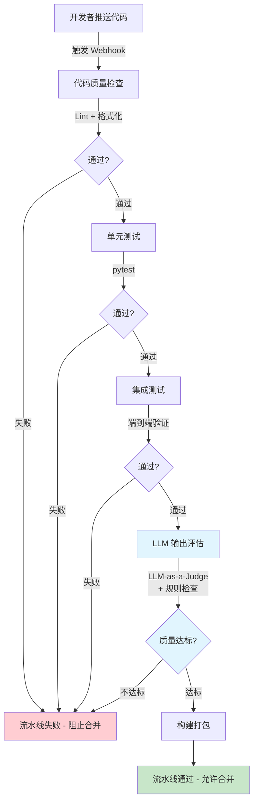

# Agent CI 流水线（Agent CI Pipeline）

## 概念解释

Agent CI 流水线是一种专门为 Agent / LLM 应用设计的持续集成（Continuous Integration，简称 CI）流程。它在传统软件 CI 的基础上，增加了一个关键环节：**LLM 输出评估**——用自动化手段判断 Agent 的回答"够不够好"。

传统软件的输出是确定性的：同样的输入一定得到同样的输出，所以可以用 `assert output == expected` 做精确断言。但 Agent 应用的核心是 LLM，同一个问题每次回答可能不一样，传统断言方式失效。如果没有专门的评估机制，"Agent 回答变差了"这类问题只能靠人工抽检才能发现，等上线后才暴露就晚了。

Agent CI 流水线的核心思路是：把"语义质量检查"也变成自动化的门禁（Quality Gate），像代码格式检查和单元测试一样，在每次代码提交时自动运行。只有全部通过，代码才能合并。

## 关键结构

Agent CI 流水线由五个阶段串联组成，前三个和传统 CI 一样，后两个是 Agent 项目特有的。

| 阶段 | 作用 | Agent 项目特殊性 |
|------|------|-----------------|
| 代码质量检查 | Lint + 格式化，秒级完成 | 无特殊差异 |
| 单元测试 | 验证单个函数/模块的逻辑 | 需要覆盖 Prompt 模板拼接、输出解析器等 |
| 集成测试 | 验证多组件协作的端到端流程 | 需要验证 LLM + 工具调用 + 记忆的完整链路 |
| LLM 输出评估 | 用评分机制判断 Agent 回答的语义质量 | **Agent CI 的核心创新**，传统 CI 没有这一环 |
| 构建打包 | 生成可部署的制品（Docker 镜像等） | 无特殊差异 |

### 阶段 1-3：传统 CI 部分

这三个阶段和普通软件项目的 CI 基本一致：

- **代码质量检查**：用 Ruff、Pylint 等工具做静态分析，用 Black 做格式化检查，秒级完成，失败立即阻断。
- **单元测试**：用 pytest 验证每个函数的行为。Agent 项目中需要特别测试 Prompt 模板是否能正确格式化、输出解析器是否能正确解析 LLM 返回结果、工具函数是否返回预期数据结构。
- **集成测试**：把 Agent 的多个组件组合起来，验证端到端流程能跑通。比如：用户提问 -> Agent 思考 -> 调用工具 -> 返回答案。集成测试通常比单元测试慢（秒到分钟级），因为涉及真实的组件交互。

### 阶段 4：LLM 输出评估（核心创新）

这是 Agent CI 流水线和传统 CI 的根本区别。三种主流评估方法：

**方法一：LLM-as-a-Judge（LLM 当裁判）**
用一个评估模型（通常比主 Agent 的模型更强，如 GPT-4o）来给主 Agent 的输出打分。评估模型根据预定义的评分标准（准确性、完整性、安全性等）输出一个分数，分数低于阈值则判定失败。

**方法二：规则检查**
定义硬性规则，如答案不能为空、长度不能超过某个上限、必须包含特定关键词、不能包含敏感信息等。这类检查速度快、成本为零，适合做初步筛选。

**方法三：混合评估**
先用规则快速筛掉明显不合格的输出（如空答案、包含错误代码），再用 LLM-as-a-Judge 做深层语义评估。这是生产环境中最常见的做法。

### 阶段 5：构建打包

所有检查通过后，生成可部署的制品（Docker 镜像、Python Wheel 包等），可选地推送到预发布环境做最后的冒烟测试（Smoke Test，即快速验证核心功能是否可用的简单测试）。

## 核心原理

### 原理说明

Agent CI 流水线的核心逻辑可以归纳为一句话：**分层防御，逐级收紧**。

五个阶段按执行速度从快到慢排列。最快的检查（Lint，秒级）放在最前面，最慢的检查（LLM 评估，分钟级）放在最后面。如果第一步就失败了，后面的步骤全部跳过，节省时间和 API 调用成本。

具体运作过程：

1. 开发者推送代码到远程仓库，触发 CI 流水线
2. 代码质量检查立即启动，如果不通过则直接打回
3. 单元测试和集成测试按顺序运行，验证功能正确性
4. LLM 输出评估环节：用一组预设的测试用例（Golden Dataset，即预先准备好的标准问答对）驱动 Agent 生成回答，然后用评估器打分
5. 所有分数达到阈值（如 >= 0.8），流水线通过；任何一项不达标，流水线失败，阻止合并

关键设计决策：LLM 评估放在最后一步，因为它最贵也最慢。先让便宜快速的检查筛掉大部分问题，只有"代码写得没问题"的提交才有资格进入评估环节。

### Mermaid 图解



图中浅蓝色标注的"LLM 输出评估"环节是 Agent CI 与传统 CI 的核心区别。每个阶段的失败都会直接终止流水线并阻止代码合并，越早失败越好——这就是"分层防御"的含义。

### 运行示例

以下用伪代码展示 LLM 输出评估的核心机制（评估器如何判断一个回答的质量）：

```python
# 基于 deepeval==2.0 验证（截至 2026-03）
from deepeval import evaluate
from deepeval.metrics import GEval, AnswerRelevancyMetric
from deepeval.test_case import LLMTestCase, LLMTestCaseParams

# 1. 准备测试用例：输入问题 + Agent 实际输出 + 标准答案
test_case = LLMTestCase(
    input="RAG 的三个阶段是什么？",
    actual_output="RAG 包括检索、增强和生成三个阶段",  # Agent 实际输出
    expected_output="检索（Retrieval）、增强（Augmentation）、生成（Generation）",
)

# 2. 定义评估指标：事实准确性，阈值 0.8
accuracy = GEval(
    name="事实准确性",
    criteria="判断实际输出与预期输出在事实层面是否一致",
    evaluation_params=[
        LLMTestCaseParams.ACTUAL_OUTPUT,
        LLMTestCaseParams.EXPECTED_OUTPUT,
    ],
    threshold=0.8,  # 分数 >= 0.8 才算通过
)

# 3. 运行评估（内部调用 LLM-as-a-Judge 打分）
results = evaluate(test_cases=[test_case], metrics=[accuracy])
```

`GEval` 内部会调用一个评估模型（默认 GPT-4o），让它根据 `criteria` 字段定义的标准来打分。`threshold=0.8` 表示分数低于 0.8 的回答判定为不合格。实际项目中通常会定义多个指标（准确性、相关性、安全性等），全部达标才算通过。

## 易混概念辨析

| 概念 | 与 Agent CI 流水线的区别 | 更适合关注的重点 |
|------|--------------------------|-----------------|
| 传统 CI 流水线 | 只处理确定性输出，用精确断言判对错 | 代码逻辑正确性 |
| CD 流水线（持续部署） | 关注的是"如何部署到生产环境"，是 CI 之后的下游环节 | 部署策略（金丝雀发布、蓝绿部署等） |
| MLOps 流水线 | 关注模型训练、调参、版本管理的全流程 | 模型本身的生命周期 |
| LLM 评估（Eval） | 是 Agent CI 流水线中的一个环节，不是完整的流水线 | 评估指标设计和评分方法 |

核心区别：

- **Agent CI 流水线**：关注"每次代码提交后，Agent 的整体质量是否达标"，是一个完整的自动化门禁流程
- **传统 CI 流水线**：只检查代码逻辑，无法处理"回答好不好"这类语义问题
- **LLM 评估**：只负责打分，是 Agent CI 流水线中的一个子步骤

## 适用边界与局限

### 适用场景

1. **多人协作的 Agent 项目**：多个开发者频繁提交代码，需要自动化机制保证每次提交不会让 Agent 质量下降。这是 Agent CI 最核心的应用场景。
2. **对输出质量有硬性要求的 Agent 应用**：如金融顾问、医疗助手、法律咨询等场景，Agent 的错误回答可能造成严重后果，需要在上线前用评估环节拦截质量问题。
3. **频繁迭代 Prompt 或工具的项目**：修改一个 Prompt 模板可能导致其他场景的回答变差（Prompt 回归），CI 流水线中的评估环节能自动检测这类回归。

### 不适合的场景

1. **个人实验性项目**：如果只是一个人在探索 Agent 原型，搭建完整 CI 流水线的投入产出比太低，手动测试更高效。
2. **输出评估标准极度模糊的场景**：如创意写作类 Agent，"写得好不好"很难定义客观标准，评估器的打分可信度不高。

### 局限性

1. **LLM 评估有成本**：每次评估都要调用 LLM API，频繁提交的项目评估费用可观。常见的缓解方法是评估采样（不是每次提交都全量评估）或只在 PR 合并时触发评估。
2. **评估存在误判**：LLM-as-a-Judge 本身也可能犯错——好答案被判为差（假阴性，False Negative），差答案被判为好（假阳性，False Positive）。需要定期人工审核评估结果来校准。
3. **评估标准定义困难**：对于"回答是否有帮助"这类主观指标，不同评估器可能给出不同分数。需要团队投入时间定义和调优评分标准。

## 常见误区

| 常见误区 | 正确理解 |
|----------|----------|
| LLM 输出不可预测，所以没法测试 | LLM 输出虽然非确定性，但可以通过评分指标（准确性、完整性、安全性等）来量化质量。DeepEval、Promptfoo 等工具已提供成熟方案。 |
| 单元测试覆盖率越高越好 | 高覆盖率不等于高质量。对 Agent 应用，集成测试和 LLM 输出评估往往比单元测试覆盖率更能反映真实质量。 |
| LLM 评估太贵，不值得放在 CI 里 | 可以用采样策略（每 N 次提交评估一次）或分层策略（PR 合并时才触发）来控制成本。在 CI 阶段发现问题的成本远低于上线后修复。 |
| CI 流水线越快越好，应该跳过慢的步骤 | 速度和可靠性需要平衡。推荐的做法是：开发者本地跑快速检查（Lint + 单元测试），CI 服务器跑完整检查（含集成测试 + LLM 评估）。 |

## 思考题

<details>
<summary>初级：Agent CI 流水线和传统 CI 流水线的核心区别是什么？为什么需要这个区别？</summary>

**参考答案：**

核心区别是增加了 LLM 输出评估环节。传统 CI 只能检查确定性逻辑（函数返回值是否等于预期值），但 Agent 的核心是 LLM，同一个输入每次输出可能不同，传统的精确断言无法判断"回答够不够好"。LLM 输出评估通过评分机制（LLM-as-a-Judge、规则检查等）把语义质量也纳入自动化检查，填补了这个空白。

</details>

<details>
<summary>中级：如果你的 Agent CI 流水线中 LLM 评估环节经常误判（好答案被判差），你会怎么排查和优化？</summary>

**参考答案：**

排查方向：1) 检查评分标准（criteria）是否定义过于严格或含糊，导致评估模型理解偏差；2) 检查 Golden Dataset 中的标准答案是否过于狭窄，导致合理但表述不同的回答被判错；3) 检查评估阈值是否设置过高。优化手段：调整评分标准的措辞使其更精确、扩充标准答案的多样性、适当降低阈值、引入多个评估指标取加权平均而非单一指标一票否决。

</details>

<details>
<summary>中级/进阶：你的团队正在开发一个客服 Agent，Prompt 模板频繁迭代。请设计 CI 流水线中的 LLM 评估环节，包括评估什么指标、如何控制成本、如何处理评估失败。</summary>

**参考答案：**

评估指标至少包括：1) 事实准确性（回答是否与知识库一致）；2) 回答相关性（是否切题）；3) 安全性（是否泄露用户隐私、是否产生有害内容）；4) 格式规范性（是否按要求格式输出）。成本控制：只在 PR 合并时触发全量评估，日常提交只跑规则检查；评估用例按优先级分层，核心场景每次必评，长尾场景按比例采样。失败处理：规则检查失败直接阻断；LLM 评估如果某个指标低于阈值但接近边界（如 0.75 vs 阈值 0.8），标记为 warning 并通知人工审核，而非直接阻断；如果多个指标同时大幅低于阈值，则硬性阻断合并。

</details>

## 参考资料

1. Promptfoo - CI/CD Integration for LLM Eval and Security：[https://www.promptfoo.dev/docs/integrations/ci-cd/](https://www.promptfoo.dev/docs/integrations/ci-cd/)
2. DeepEval - Unit Testing in CI/CD：[https://deepeval.com/docs/evaluation-unit-testing-in-ci-cd](https://deepeval.com/docs/evaluation-unit-testing-in-ci-cd)
3. Arize AI - How to Add LLM Evaluations to CI/CD Pipelines：[https://arize.com/blog/how-to-add-llm-evaluations-to-ci-cd-pipelines/](https://arize.com/blog/how-to-add-llm-evaluations-to-ci-cd-pipelines/)
4. Traceloop - Automated Prompt Regression Testing with LLM-as-a-Judge and CI/CD：[https://www.traceloop.com/blog/automated-prompt-regression-testing-with-llm-as-a-judge-and-ci-cd](https://www.traceloop.com/blog/automated-prompt-regression-testing-with-llm-as-a-judge-and-ci-cd)
5. DataGrid - AI Agent CI/CD Pipeline Guide：[https://datagrid.com/blog/cicd-pipelines-ai-agents-guide](https://datagrid.com/blog/cicd-pipelines-ai-agents-guide)
