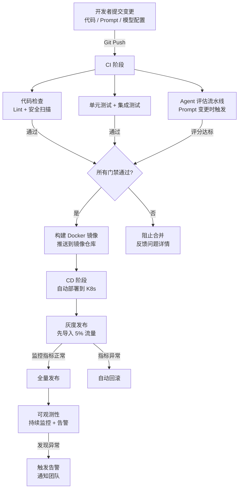

# 自动化工具链（Automation Toolchain）

## 概念解释

自动化工具链是一套把软件从"开发者写完代码"到"用户能用上新功能"之间所有重复性工作串联起来、自动执行的工具体系。你可以把它理解成一条"代码流水线"：代码一提交，流水线自动启动测试、打包、部署、监控，全程不需要人手动操作。

传统软件开发中，发布一个版本需要手动跑测试、手动打包、手动登录服务器部署，流程慢且容易出错。CI/CD（Continuous Integration / Continuous Deployment，持续集成/持续部署）的出现解决了这个问题——让机器代替人执行这些固定步骤。

到了 Agent 应用时代，自动化工具链多了一层新需求：除了代码本身，Prompt（提示词）、模型版本、RAG 检索管线也需要纳入自动化管理。这一层扩展被称为 LLMOps（大语言模型运维）或 AgentOps（Agent 运维）。传统 CI/CD 管的是"代码变更是否安全"，LLMOps 管的是"Prompt 变更后输出质量有没有下降"——两者叠加，才构成 Agent 应用完整的自动化工具链。

## 关键结构

Agent 应用的自动化工具链由四层组成，每层解决不同阶段的问题：

| 层级 | 解决的问题 | 典型工具 |
|------|-----------|---------|
| 代码 CI/CD 层 | 代码变更的测试、构建、部署自动化 | GitHub Actions、GitLab CI、Jenkins |
| 容器化与编排层 | 运行环境一致性和弹性伸缩 | Docker、Kubernetes |
| Prompt/模型管理层 | Prompt 版本控制、模型切换的质量保障 | LangSmith、Langfuse、Braintrust、Promptfoo |
| 可观测性层 | 运行时监控、告警、链路追踪 | Prometheus、Grafana、LangSmith Tracing |

### 第一层：代码 CI/CD

CI（持续集成）在每次代码提交后自动运行测试和检查，确保新代码不会破坏已有功能。CD（持续部署）在 CI 通过后自动将代码发布到生产环境。

关键机制：代码提交触发 Webhook（网络钩子） --> 自动拉取代码 --> 运行单元测试和集成测试 --> 测试通过则构建产物（Docker 镜像） --> 推送到镜像仓库 --> 自动部署到目标环境。任何一步失败，流程中止并通知开发者。

### 第二层：容器化与编排

Docker 把应用及其所有依赖打包成一个镜像（Image），保证"在我电脑上能跑"等同于"在生产环境能跑"。Kubernetes（简称 K8s）在此基础上管理多个容器的调度：自动重启崩溃的容器、根据流量自动扩缩容、执行滚动更新实现零停机发布。

### 第三层：Prompt/模型管理（LLMOps 特有）

这是 Agent 应用区别于传统软件的关键层。Prompt 的微小改动可能导致输出质量剧变，但这种变化不会被传统单元测试捕获。LLMOps 工具链解决的核心问题是：Prompt 或模型版本变更后，如何自动验证输出质量没有退化。

典型做法：Prompt 文件纳入 Git 版本控制 --> 变更触发评估流水线 --> 用预定义数据集（Evaluation Dataset）运行 Agent --> 自动打分（LLM-as-Judge 或规则评分器） --> 分数低于阈值则阻止合并。

### 第四层：可观测性

应用上线后，需要持续监控运行状态。传统软件关注 CPU、内存、请求延迟等指标；Agent 应用还需要追踪 Token 消耗、LLM 调用延迟、工具调用成功率、Agent 多步推理的完整链路等。

## 核心原理

### 原理说明

自动化工具链的核心思想是"变更驱动的流水线"：任何变更（代码、Prompt、模型配置、基础设施配置）都通过 Git 提交触发，经过一系列自动化验证门禁（Quality Gate）后才能到达生产环境。

传统软件的验证门禁是测试通过率、代码覆盖率等指标。Agent 应用在此基础上增加了评估门禁（Eval Gate）：用预定义的测试用例集运行 Agent，由自动评分器对输出质量打分，分数必须达标才允许发布。

这套机制之所以有效，是因为它把"质量保障"从人工审查变成了自动化流程。人容易遗漏，机器不会忘。每次变更都经过同一套标准检验，质量底线就有了保障。

### Mermaid 图解



图中有两条关键路径需要注意：

1. **左侧正常路径**：变更提交 --> 三项门禁并行检查 --> 构建镜像 --> 灰度发布 --> 全量发布 --> 持续监控。这是变更到达用户的完整链路。
2. **右侧异常路径**：任何门禁不通过则阻止合并；灰度阶段发现问题则自动回滚。两道安全网确保问题不会扩散到所有用户。

Agent 评估流水线（B3 节点）是 Agent 应用特有的门禁，传统 CI/CD 中不存在。它的作用是在 Prompt 或模型配置变更时，自动运行一组测试用例并评分，防止输出质量退化。

### 运行示例

以 GitHub Actions 为例，展示一个 Agent 应用 CI 流水线的核心配置结构：

```yaml
# .github/workflows/agent-ci.yml
# 基于 GitHub Actions 验证（截至 2026-03）
name: Agent CI

on:
  pull_request:
    branches: [main]

jobs:
  test:
    runs-on: ubuntu-latest
    steps:
      - uses: actions/checkout@v4
      - uses: actions/setup-python@v5
        with:
          python-version: "3.11"
      - run: pip install -r requirements.txt && pip install pytest
      - run: pytest tests/ --tb=short          # 单元测试 + 集成测试

  eval:
    runs-on: ubuntu-latest
    if: contains(github.event.pull_request.labels.*.name, 'prompt-change')
    steps:
      - uses: actions/checkout@v4
      - run: pip install promptfoo              # Prompt 评估工具
      - run: npx promptfoo eval --config eval/promptfoo.yaml
      # 评估不通过时 exit code 非 0，自动阻止合并
```

上面的配置定义了两个并行任务：`test` 对代码变更运行常规测试；`eval` 仅在 PR 带有 `prompt-change` 标签时触发，运行 Prompt 评估。两个任务都必须通过，PR 才能合并。这体现了"代码门禁 + 评估门禁"的双重保障。

## 易混概念辨析

| 概念 | 与自动化工具链的区别 | 更适合关注的重点 |
|------|---------------------|------------------|
| DevOps | 是一种文化和实践理念，强调开发与运维协作；自动化工具链是落地 DevOps 的具体技术手段 | 团队协作文化、组织流程 |
| MLOps | 面向传统机器学习模型的运维体系，关注数据管线、模型训练、特征工程；自动化工具链范围更广且包含 Agent 特有层 | 模型训练/再训练流水线 |
| LLMOps | Agent 自动化工具链中 Prompt/模型管理层的专项实践，是工具链的子集而非全部 | Prompt 版本控制、LLM 评估 |
| GitOps | 一种以 Git 为唯一事实来源的部署方式（如 ArgoCD），属于工具链中 CD 环节的实现策略之一 | 基础设施即代码、声明式部署 |

核心区别：

- **自动化工具链**：覆盖从代码到生产的全链路自动化体系，强调端到端的工具串联
- **DevOps / MLOps / LLMOps**：偏向理念和方法论，自动化工具链是它们的技术实现
- **GitOps**：工具链中部署环节的一种具体策略，不覆盖 CI 和可观测性

## 适用边界与局限

### 适用场景

1. **团队规模 3 人以上的 Agent 项目**：多人协作时代码冲突和质量管控是刚需，自动化工具链的 CI 门禁能有效防止低质量代码进入主分支
2. **Prompt 频繁迭代的应用**：Prompt 改一个词可能导致输出质量剧变，评估流水线是唯一可靠的质量兜底
3. **需要高可用的生产 Agent 服务**：灰度发布 + 自动回滚 + 持续监控，确保服务稳定运行

### 不适合的场景

1. **个人原型验证阶段**：搭建完整工具链需要数天投入，如果只是验证一个想法，手动部署更快
2. **一次性脚本或批处理任务**：不需要持续运行的任务，配套 Kubernetes 和监控属于过度工程

### 局限性

1. **初期建设成本高**：从零搭建覆盖四层的工具链，一个熟练工程师也需要 1-2 周，涉及 CI/CD、Docker、K8s、评估工具等多个技术栈
2. **Agent 评估本身不完美**：LLM-as-Judge（用大模型给大模型打分）存在偏差，自动评分不能替代人工抽检，只能作为第一道筛选
3. **维护成本持续存在**：告警阈值需要根据业务变化调整，评估数据集需要定期更新，工具版本需要跟进升级

## 常见误区

| 常见误区 | 正确理解 |
|----------|----------|
| "用了 Docker 就算自动化了" | Docker 只解决了环境一致性问题，没有 CI/CD 流程和监控告警就不算完整的自动化工具链 |
| "传统 CI/CD 足以覆盖 Agent 应用" | Agent 应用的 Prompt 和模型配置变更不会被单元测试捕获，需要额外的评估流水线作为门禁 |
| "工具链越复杂越好" | 应从最小可行工具链（如 GitHub Actions + Docker）起步，按需逐层添加，过度工程反而降低效率 |
| "自动化 = 不需要人" | 自动化处理的是确定性流程；复杂故障分析、评估数据集设计、告警规则调优仍然需要人参与 |

## 思考题

<details>
<summary>初级：Agent 应用的 CI/CD 流水线和传统软件的 CI/CD 流水线，最大的区别是什么？</summary>

**参考答案：**

最大区别在于 Agent 应用需要额外的评估门禁（Eval Gate）。传统 CI/CD 通过单元测试和集成测试验证代码功能正确性，但 Prompt 或模型配置的变更不会被这些测试捕获。Agent CI/CD 需要增加评估流水线：用预定义数据集运行 Agent，对输出质量自动打分，分数不达标则阻止发布。

</details>

<details>
<summary>中级：一个 3 人团队刚开始开发 Agent 应用，应该按什么顺序搭建自动化工具链？</summary>

**参考答案：**

建议分三步递进：(1) 先搭建代码 CI（GitHub Actions + pytest），确保每次提交都跑测试，成本最低收益最大；(2) 应用上线后加入容器化（Dockerfile）和基础 CD（自动部署到云服务器或 K8s），消除手动部署；(3) Prompt 迭代频率上升后，引入评估流水线（Promptfoo 或 Braintrust）和可观测性工具（Langfuse 或 LangSmith）。避免一次性铺满四层，按实际痛点逐步叠加。

</details>

<details>
<summary>中级/进阶：团队发现 Prompt 评估流水线经常"误报"（实际输出质量没问题但评分不达标），应该怎么排查和优化？</summary>

**参考答案：**

误报通常有三个原因：(1) 评估数据集不具代表性——测试用例过于极端或过时，需要定期从真实生产日志中抽样更新；(2) 评分标准不合理——LLM-as-Judge 的评分提示词定义模糊，需要明确评分维度（如准确性、完整性、格式）和每个分数段的具体标准；(3) 阈值设置过高——初期建议将通过阈值设为历史基线分数的 90%，而不是追求满分。可以先收集一段时间的评分分布数据，再用统计方法（如 P95）确定合理阈值。

</details>

## 参考资料

1. GitHub Actions 官方文档 - Automating your workflow: https://docs.github.com/en/actions
2. Kubernetes 官方文档 - Production-Grade Container Orchestration: https://kubernetes.io/docs/home/
3. LangSmith 文档 - Testing & Evaluation: https://docs.smith.langchain.com/
4. Langfuse 文档 - Open Source LLM Engineering Platform: https://langfuse.com/docs
5. Braintrust 文档 - AI Evaluation & Observability: https://www.braintrust.dev/docs
6. Promptfoo - Prompt Testing & Evaluation: https://www.promptfoo.dev/docs/intro/

---
