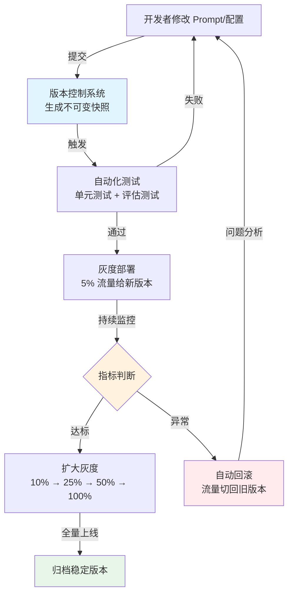

# 模型版本管理（Model Version Management）

## 概念解释

模型版本管理是指对 LLM 应用中的模型权重、Prompt 模板、系统配置等多个组件，进行统一的版本记录、追踪和发布控制的工程实践。

传统软件只需要管好代码版本，但 LLM 应用不同——影响输出质量的因素是多维的：模型本身、Prompt 措辞、temperature 参数、检索库内容，任何一个改动都可能让结果天翻地覆。如果这些改动没有被系统记录，出了问题就无从追溯，团队只能反复猜测"到底是哪次改动导致的"。

模型版本管理把这些分散的组件当作一个整体来版本化。每次提交改动时，系统自动生成一个"快照（Snapshot）"，记录当时所有组件的状态。上线时通过灰度发布（Canary Deployment，即先让小部分用户试用新版本）逐步验证，出问题就一键回滚到上一个稳定版本。

## 关键结构

| 结构 | 作用 | 说明 |
|------|------|------|
| 版本标识系统 | 给每个版本打唯一标签 | 不只是模型版本号，而是模型 + Prompt + 配置的组合标识 |
| Prompt 版本控制 | 记录每次 Prompt 改动 | Prompt 是 LLM 应用中变更最频繁的部分，必须独立版本化 |
| 灰度发布机制 | 控制新版本的上线范围 | 先给 5% 用户试用，观察指标后再逐步扩大 |
| 监控与回滚 | 自动发现问题并恢复 | 关键指标异常时自动切回旧版本 |

### 结构 1：版本标识系统

一个 LLM 应用的"版本"不能只用一个数字表示。完整的版本标识需要记录多个维度：

```
版本快照 = 模型版本 + Prompt 版本 + 配置版本 + 数据版本 + 时间戳
```

举例：`production-v3.2 = (gpt-4-turbo, prompt-v2.5, config-high, rag-index-v10, 2026-03-25T10:30Z)`

业界常用语义化版本号（Semantic Versioning）来管理：
- **主版本号**（v2.0.0）：模型架构变更或 API 破坏性改动
- **次版本号**（v1.3.0）：新数据微调或显著性能提升
- **修订号**（v1.2.1）：Bug 修复和小幅优化

### 结构 2：Prompt 版本控制

Prompt 是 LLM 应用中变更最频繁、影响最大的部分。据行业统计，Prompt 工程占 AI 开发时间的 30%-40%，管理超过 10 个生产 Prompt 的团队普遍将版本控制列为前三大运维挑战。

Prompt 版本控制的核心做法：
- 每次修改自动生成新版本号（v1, v2, v3...），旧版本不可变
- 通过标签（Label）管理部署环境，如 `production`、`staging`、`experiment-a`
- 支持即时回滚：把 `production` 标签指回旧版本即可

### 结构 3：灰度发布机制

灰度发布（也叫金丝雀发布）的核心思路是"不赌博"——新版本先在一小部分用户上运行，边观测边扩大范围：

1. **初始阶段**：新版本承载 1%-5% 流量
2. **观测阶段**：持续监控准确率、延迟、错误率等指标
3. **决策阶段**：指标达标则逐步扩大（5% -> 10% -> 25% -> 50% -> 100%）；异常则立即回滚到 0%

### 结构 4：监控与回滚

系统需要预设"健康指标"的阈值，例如：
- 准确率下降超过 2% -> 触发回滚
- 平均延迟上升超过 500ms -> 触发回滚
- 错误率超过 1% -> 立即回滚

一旦检测到异常，流量自动切回旧版本，无需人工干预。

## 核心原理

### 原理说明

模型版本管理的核心机制可以拆解为三个阶段：

**阶段一：版本化记录**。开发者修改 Prompt 或配置后，提交到版本控制系统。系统自动生成版本快照，记录当时所有组件（模型、Prompt、配置、数据索引）的状态。这个快照是不可变的（Immutable），后续任何时候都能精确还原。

**阶段二：灰度验证**。新版本不直接全量上线，而是通过流量路由器（Traffic Router）分配一小部分请求给新版本。系统同时收集新旧版本的性能数据。这一步的关键在于流量分配要随机且公平，否则对比数据不可信。

**阶段三：自适应决策**。系统根据预设规则自动判断：新版本是否优于旧版本？如果是，扩大流量；如果不是，回滚。复杂场景下也支持 A/B 测试（同时运行多个版本收集对比数据）和人工介入决策。

### Mermaid 图解



图中关键流转：版本控制系统（蓝色）是整个流程的起点，生成不可变快照确保可追溯性；指标判断节点（橙色）是核心决策点，决定扩大灰度还是回滚；回滚节点（红色）是安全兜底，确保问题影响最小化。

### 运行示例

```python
# 最小示例：Prompt 版本管理与灰度路由的核心逻辑
# 基于 pydantic==2.x 验证（截至 2026-03）

import random
from dataclasses import dataclass, field
from datetime import datetime

@dataclass
class PromptVersion:
    """一个 Prompt 版本的完整定义"""
    version_id: str          # 版本标识，如 "prompt-v2.0"
    content: str             # Prompt 文本
    model: str               # 使用的模型
    traffic: float           # 流量比例（0.0 ~ 1.0）
    status: str = "draft"    # draft / canary / stable / deprecated

@dataclass
class CanaryRouter:
    """灰度路由器：根据流量比例分配请求到不同版本"""
    versions: list = field(default_factory=list)

    def route(self, request_id: str) -> PromptVersion:
        """为请求选择版本，基于累积流量比例"""
        rand = random.random()
        cumulative = 0.0
        for v in self.versions:
            cumulative += v.traffic
            if rand < cumulative:
                return v
        return self.versions[-1]  # 兜底

    def rollback(self, target_id: str):
        """回滚：将目标版本流量设为 0，其余版本平分"""
        for v in self.versions:
            if v.version_id == target_id:
                v.traffic = 0.0
                v.status = "deprecated"
            else:
                v.traffic = 1.0
                v.status = "stable"

# --- 使用示例 ---
stable = PromptVersion("v1.0", "请分类以下文本：{text}", "gpt-3.5-turbo", 0.9, "stable")
canary = PromptVersion("v2.0", "你是文本分类专家。请分类：{text}", "gpt-4-turbo", 0.1, "canary")

router = CanaryRouter([stable, canary])

# 模拟 10 次请求路由
for i in range(10):
    selected = router.route(f"req-{i}")
    print(f"请求 {i} -> {selected.version_id} ({selected.model})")

# 模拟回滚（假设 v2.0 指标不达标）
router.rollback("v2.0")
print(f"\n回滚后：v1.0 流量={stable.traffic}, v2.0 流量={canary.traffic}")
```

`CanaryRouter.route()` 对应灰度发布的流量分配逻辑，`rollback()` 对应异常时的自动回滚。实际生产中，路由决策通常由 Langfuse、LangSmith 等平台的 SDK 完成，而非手写。

## 易混概念辨析

| 概念 | 与模型版本管理的区别 | 更适合关注的重点 |
|------|---------------------|------------------|
| 传统 MLOps 模型注册 | 只管模型权重的版本，不涉及 Prompt 和配置 | 模型训练、打包、部署的流水线 |
| Git 代码版本控制 | 管代码文本变更，无法处理大型模型文件和运行时配置 | 代码逻辑和配置文件的变更追踪 |
| Prompt Engineering | 专注于如何写好 Prompt，不涉及版本发布和灰度控制 | Prompt 的设计方法和优化技巧 |
| 特征工程版本管理 | 管理机器学习特征的计算逻辑和数据，不涉及 LLM 组件 | 特征存储、特征计算管道的版本化 |

核心区别：

- **模型版本管理**：关注 LLM 应用整体（模型 + Prompt + 配置）的版本化和安全发布
- **传统 MLOps**：关注单一模型的训练-注册-部署流水线，LLM 时代需要扩展到多组件
- **Git**：擅长管文本代码，但不擅长管大型二进制文件和运行时参数
- **Prompt Engineering**：是"怎么写好 Prompt"，模型版本管理是"怎么安全地把 Prompt 上线"

## 适用边界与局限

### 适用场景

1. **生产环境的模型升级**：从 GPT-3.5 切换到 GPT-4 时，通过灰度发布验证新模型在真实流量下的表现，避免全量上线后才发现问题
2. **Prompt 的迭代优化**：团队频繁修改 Prompt 时，版本管理确保每次改动都被记录、可回滚、可对比效果
3. **多版本并行对比**：需要科学比较不同模型或 Prompt 方案时，通过 A/B 测试获取量化数据支撑决策
4. **合规审计要求**：金融、医疗等受监管行业需要证明"某个时间点系统使用的是什么版本"，版本快照提供完整审计链

### 不适合的场景

1. **早期原型探索**：项目初期快速验证想法时，版本管理的流程开销可能拖慢迭代速度，简单的文件备份即可
2. **单人单次实验**：个人开发者做一次性实验，没有多版本并行需求，引入版本管理系统投入产出比不高

### 局限性

1. **初期建设成本高**：搭建完整的版本管理 + 监控 + 灰度系统需要工程投入，小团队可能难以承担
2. **监控指标定义困难**：什么指标代表"新版本更好"？准确率、用户满意度、成本之间如何权衡？不同业务没有统一答案，错误的指标会导致错误的决策
3. **灰度周期拉长迭代**：即使新版本明显更优，标准灰度流程仍需 3-7 天，急于上线的业务可能感到受限
4. **多组件同步复杂**：当模型、Prompt、检索库需要协调更新时，更新顺序和依赖关系可能导致意外的交互问题

## 常见误区

| 常见误区 | 正确理解 |
|----------|----------|
| Prompt 改个词不用记录版本 | Prompt 的微小措辞变化可能在特定场景引发巨大输出差异，每次改动都应版本化。行业数据显示，多 Prompt 依赖链中，一个 Prompt 的改动可能破坏下游步骤 |
| 灰度发布就是"慢慢上线" | 灰度的核心不是"慢"，而是"可控 + 可回滚"。有数据支撑的灰度决策比盲目全量上线更高效 |
| 模型版本、Prompt 版本应该分开管 | 应该原子化绑定。一个版本快照必须包含当时所有组件的状态，否则无法真正复现和追溯 |
| 灰度完成后可以删除旧版本 | 生产环境应至少保留 3-5 个历史版本。旧版本是回滚的基础，也是分析问题的参照物 |
| A/B 测试必须 50/50 分流量 | 流量分配比例取决于样本量需求和风险承受度。低风险场景可用 5% 小流量快速验证，高风险场景则需要更大样本 |

## 主流工具速览

| 工具 | 定位 | 核心能力 | 适合谁 |
|------|------|---------|--------|
| MLflow Model Registry | 全生命周期管理 | 模型注册、版本管理、阶段切换（Staging -> Production）；3.0 版本已扩展支持 Prompt 和 GenAI | 需要开源自建、管理传统 ML + LLM 的团队 |
| Langfuse | LLM 可观测性 + Prompt 管理 | Prompt 版本控制（不可变版本 + 标签）、A/B 测试、GitHub 同步、追踪分析 | 需要 Prompt 版本管理 + 可观测性的 LLM 团队 |
| Weights & Biases | 实验追踪 + 模型注册 | 实验可视化、模型 Artifact 版本管理、团队协作仪表板 | 重视可视化和团队协作的 ML 团队 |
| DVC | 数据与模型版本控制 | 基于 Git 的大文件版本管理、数据管道版本化 | 已有 Git 工作流、需要管理大型数据集和模型文件的团队 |
| PromptLayer | Prompt 专用版本管理 | Prompt 日志记录、版本对比、A/B 测试、非技术人员可用的 UI | 希望快速上手 Prompt 版本管理的小团队 |

## 思考题

<details>
<summary>初级：为什么 LLM 应用的版本管理不能只记录模型版本号？</summary>

**参考答案：**

LLM 应用的输出由多个组件共同决定：模型权重、Prompt 内容、temperature 等参数、检索库数据。只记录模型版本号无法覆盖其他组件的变更。例如模型没换但 Prompt 改了一个词，输出可能完全不同。完整的版本管理需要对所有影响输出的组件做原子化快照，才能实现真正的可追溯和可复现。

</details>

<details>
<summary>中级：灰度发布和 A/B 测试在目标上有什么区别？什么场景下应该用哪个？</summary>

**参考答案：**

灰度发布的目标是"确认新版本是否稳定"，核心是风险控制——先小范围上线，没问题再扩大。A/B 测试的目标是"发现哪个版本更优"，核心是科学比较——需要精确的流量分配和足够的样本量来获得统计显著性。模型升级时先用灰度发布确认稳定性；需要在两个 Prompt 方案之间做选择时用 A/B 测试。实际操作中两者经常组合使用：灰度阶段同时收集 A/B 对比数据。

</details>

<details>
<summary>中级/进阶：你的电商客服系统计划从 GPT-3.5 升级到 GPT-4（成本高 15 倍），请设计一个版本管理方案来验证这次升级是否值得。</summary>

**参考答案：**

方案分三步：(1) 版本化——创建版本快照 `v2.0 = (gpt-4-turbo, prompt-v1.5, config-standard)`，与当前 `v1.0 = (gpt-3.5-turbo, prompt-v1.5, config-standard)` 仅模型不同，确保对比变量单一。(2) 灰度 + A/B 测试——将 10% 流量分给 v2.0，运行 7 天收集数据，重点跟踪：客户满意度、问题解决率、平均对话轮数、单次对话成本。(3) 决策——如果满意度提升 > 5% 且成本可接受，逐步扩大到全量；如果满意度提升不明显，考虑"动态路由"策略：简单问题用 GPT-3.5，复杂问题才路由到 GPT-4，兼顾效果和成本。

</details>

## 参考资料

1. MLflow 官方文档 - Model Registry：https://mlflow.org/docs/latest/ml/
2. Langfuse 官方文档 - Prompt Version Control：https://langfuse.com/docs/prompt-management/features/prompt-version-control
3. Collabnix - LLM Model Versioning Best Practices and Tools for Production MLOps：https://collabnix.com/llm-model-versioning-best-practices-and-tools-for-production-mlops/
4. Agenta - Prompt Versioning: The Complete Guide：https://agenta.ai/blog/prompt-versioning-guide
5. Mirascope - Five Tools to Help You Leverage Prompt Versioning：https://mirascope.com/blog/prompt-versioning
