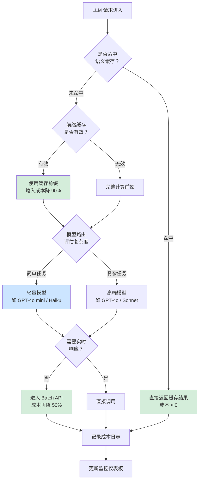

# 成本优化（Cost Optimization）

## 概念解释

成本优化是指在 Agent 应用中，通过一系列技术手段减少 LLM API 的 Token（令牌）消耗和调用费用，同时保持输出质量不明显下降的方法论。

Agent 应用的每一次 LLM 调用都要付费。在多轮循环中，系统提示词、历史对话、工具定义、检索结果会反复传入模型，导致 Token 消耗成倍增长。一个设计不当的 Agent，10 轮对话后的上下文可能膨胀到初始的 50 倍。2025 年的行业统计显示，37% 的企业年 LLM API 支出超过 25 万美元，而其中大部分可以通过合理的优化手段削减 60%--80%。

成本优化的核心思路不是"用更差的模型"，而是"让每一个 Token 都花在刀刃上"——缓存可以复用的内容、把简单任务交给便宜模型、压缩不必要的上下文、批量处理非实时任务。

## 关键结构

成本优化由六个核心策略组成，按"实施难度从低到高"排列：

| 策略 | 作用 | 典型节省幅度 |
|------|------|-------------|
| Prompt Optimization（提示词优化） | 精简提示词、减少冗余 Token | 20%--40% |
| Prompt Caching（前缀缓存） | 缓存固定前缀的 KV 计算结果 | 15%--60% |
| Semantic Caching（语义缓存） | 复用语义相似查询的已有回答 | 30%--70% |
| Model Routing（模型路由） | 按任务复杂度选择不同价位的模型 | 50%--75% |
| Batch API（批量处理） | 非实时任务走批处理通道，享受折扣 | ~50% |
| Context Compression（上下文压缩） | 压缩历史消息和检索内容 | 30%--70% |

### 策略 1：提示词优化

最直接的节省方式。Output Token（输出令牌）的单价通常是 Input Token（输入令牌）的 3--10 倍，因此控制输出长度的收益更大。具体做法包括：去掉提示词中的重复说明、用 JSON 结构化输出代替长文本、限定 `max_tokens` 参数、使用模板复用固定段落。

### 策略 2：前缀缓存

Anthropic 和 OpenAI 都提供 Prompt Caching（提示词缓存）功能。原理是：如果多次请求共享相同的前缀（如系统提示词、RAG 文档），模型可以跳过对前缀部分的重复 KV（Key-Value，键值对）计算，直接复用上次的中间结果。缓存命中时的费用约为标准价格的 10%，即打一折。

关键限制：前缀内容必须严格不变。一旦修改系统提示词或调整消息顺序，缓存就会全部失效。

### 策略 3：语义缓存

前缀缓存只能匹配字面完全相同的前缀。语义缓存更进一步：将用户查询转为 Embedding（向量表示），通过相似度计算判断是否有足够接近的历史查询，如果有就直接返回之前的回答，不再调用 LLM。在 FAQ、客服等场景中缓存命中率可达 60%--85%。

### 策略 4：模型路由

不是所有任务都需要最强的模型。Model Routing（模型路由）的做法是：用一个轻量级分类器评估查询复杂度，简单任务（如格式转换、信息提取）交给便宜模型，只有复杂推理任务才使用高端模型。如果 60% 的请求可以用小模型处理，平均成本能下降 50%--70%。

### 策略 5：批量处理

OpenAI Batch API 对非实时请求提供 50% 折扣，通常在数分钟到 24 小时内返回结果。适合摘要生成、内容审核、数据标注等不要求即时响应的任务。

### 策略 6：上下文压缩

通过 RAG（Retrieval-Augmented Generation，检索增强生成）只传入相关片段而非整个文档，或者对多轮对话的历史消息做摘要压缩，可以将上下文 Token 减少 70% 以上。

## 核心原理

### 原理说明

成本优化的底层逻辑是：LLM API 按 Token 计费，Token 消耗 = 输入 Token + 输出 Token。优化就是在不影响回答质量的前提下，减少这两个数值。

整个优化过程分为三步循环：

1. **度量**：记录每次 LLM 调用的 Token 数、模型、成本、缓存命中情况，建立成本可观测性
2. **分析**：找出成本黑洞——哪个 Agent 花钱最多、哪些请求可以缓存、哪些任务用了过强的模型
3. **优化**：针对分析结果实施具体策略（缓存、路由、压缩、批处理），然后回到第一步持续监测

输出 Token 的单价通常是输入 Token 的 3--5 倍（以 2026 年主流模型为例：Claude Sonnet 4.5 输入 $3/百万、输出 $15/百万），因此控制输出长度往往比压缩输入更有成本收益。

### Mermaid 图解



图中展示了一个请求从进入到完成的完整优化链路。绿色节点表示成本节省点：语义缓存命中可以完全避免 API 调用，前缀缓存和 Batch API 各自可以砍掉一半左右的费用。蓝色节点表示模型路由将简单任务导向廉价模型。多种策略叠加后，综合节省可达 60%--90%。

### 运行示例

以下示例展示模型路由的核心机制——根据任务复杂度选择不同价位的模型：

```python
# 模型路由最小示例（纯逻辑，不依赖外部库）

# 模型定价表：(输入价格/百万Token, 输出价格/百万Token)
MODEL_PRICING = {
    "haiku":  (1.0, 5.0),     # 轻量级
    "sonnet": (3.0, 15.0),    # 中等
    "opus":   (15.0, 75.0),   # 高端
}

def route_model(query: str, task_type: str = "general") -> str:
    """根据任务类型选择最具性价比的模型"""
    # 简单任务用便宜模型，复杂推理才用贵模型
    simple_tasks = {"classification", "extraction", "formatting", "faq"}
    complex_tasks = {"reasoning", "code_generation", "analysis"}

    if task_type in simple_tasks:
        return "haiku"
    elif task_type in complex_tasks:
        return "opus"
    else:
        return "sonnet"

def estimate_cost(model: str, input_tokens: int, output_tokens: int) -> float:
    """估算单次调用成本（美元）"""
    in_price, out_price = MODEL_PRICING[model]
    return input_tokens / 1_000_000 * in_price + output_tokens / 1_000_000 * out_price

# 对比：同一批任务，全用高端模型 vs 路由后的成本
tasks = [
    ("格式转换", "formatting", 500, 200),
    ("FAQ 回答", "faq", 800, 300),
    ("复杂推理", "reasoning", 2000, 1000),
    ("数据提取", "extraction", 1000, 400),
]

cost_all_opus = sum(estimate_cost("opus", it, ot) for _, _, it, ot in tasks)
cost_routed = sum(estimate_cost(route_model(q, t), it, ot) for q, t, it, ot in tasks)

print(f"全部使用 opus: ${cost_all_opus:.4f}")
print(f"路由后混合使用: ${cost_routed:.4f}")
print(f"节省: {(1 - cost_routed / cost_all_opus) * 100:.1f}%")
# 输出示例 → 全部使用 opus: $0.1395 / 路由后: $0.0366 / 节省约 73.8%
```

这段代码只展示路由决策和成本估算的核心逻辑。实际生产中，路由器通常会加入置信度检测——如果轻量模型的回答置信度低于阈值，自动升级到更强的模型重试。

## 易混概念辨析

| 概念 | 与成本优化的区别 | 更适合关注的重点 |
|------|-----------------|-----------------|
| 性能优化（Latency Optimization） | 关注响应速度，可能增加成本（如用更强模型加速） | 延迟、吞吐量、首 Token 时间 |
| 模型压缩 / 蒸馏（Model Distillation） | 通过训练更小的模型来降低推理成本，属于模型层面 | 模型训练、知识迁移 |
| Rate Limiting（速率限制） | 限制请求频率，防止超额调用，是一种被动保护 | API 配额、并发控制 |

核心区别：

- **成本优化**：在应用层面做策略调整（缓存、路由、压缩），不改变模型本身
- **性能优化**：目标是更快的响应，有时需要花更多钱（如增加并发或使用更强模型）
- **模型压缩**：在模型训练层面做文章，需要 GPU 资源和训练数据，门槛更高

## 适用边界与局限

### 适用场景

1. **高频重复查询的应用**：客服、FAQ、文档问答——查询重复率高，语义缓存和前缀缓存的收益最大
2. **多轮对话 Agent**：上下文不断累积，通过消息摘要和前缀缓存可以控制 Token 增长
3. **批量内容处理**：摘要生成、数据标注、内容审核——不要求实时响应，适合用 Batch API 获取 50% 折扣

### 不适合的场景

1. **低频、高价值的单次调用**：如果每天只调用几十次 LLM，且每次都是全新的复杂推理任务，优化空间有限，工程投入不划算
2. **对输出质量零容忍的场景**：医疗诊断、法律条款生成等场景中，模型降级带来的任何质量下降都不可接受

### 局限性

1. **缓存失效风险**：前缀缓存要求前缀严格不变。如果系统提示词频繁迭代，缓存会反复失效，反而增加写入缓存的额外开销
2. **语义缓存的精度问题**：相似度阈值设得太低会误匹配不相关查询（返回错误答案），设得太高则命中率低（省不了钱），需要持续调优
3. **模型路由的复杂度判断不完美**：轻量分类器可能误判任务复杂度，把需要深度推理的任务交给弱模型，导致回答质量下降
4. **监控系统本身的成本**：在极高并发场景下，记录和分析每次调用的成本日志本身也会消耗资源，可能占总成本的 3%--5%

## 常见误区

| 常见误区 | 正确理解 |
|----------|----------|
| "换个便宜模型就算成本优化了" | 模型只是一个维度。提示词精简、缓存复用、上下文压缩往往比换模型的收益更大且风险更低 |
| "前缀缓存设置一次就永久生效" | 前缀缓存对内容变化零容忍——修改一个字符就全部失效。系统提示词必须固定，消息历史只能追加不能删改 |
| "语义缓存能覆盖所有重复查询" | 语义缓存只在查询模式集中的场景（客服、FAQ）效果好。对于每次查询都不同的场景（代码生成、研究分析），缓存命中率极低 |
| "成本优化一定会牺牲质量" | 组合使用多种策略后，大部分场景可以做到成本降 60% 而质量基本不变。关键是把省下来的预算集中到真正需要强模型的任务上 |

## 思考题

<details>
<summary>初级：一个 Agent 每次请求的系统提示词固定为 2000 Token，用户问题平均 200 Token，模型回答平均 500 Token。如果启用前缀缓存（缓存命中价格为标准的 10%），每 100 次请求能省多少比例的输入成本？</summary>

**参考答案：**

每次请求的输入 Token = 2000（系统提示词）+ 200（用户问题）= 2200 Token。启用前缀缓存后，2000 Token 的系统提示词以 10% 的价格计费，相当于只付 200 Token 的价格。实际输入计费 = 200 + 200 = 400 Token。节省比例 = (2200 - 400) / 2200 = 81.8%。输入成本降低约 82%。

</details>

<details>
<summary>中级：一个客服 Agent 每天处理 5000 次查询，其中 70% 是关于订单状态、退换货政策等重复性问题。请设计一个分层优化方案，说明每层用什么策略、预期节省多少。</summary>

**参考答案：**

分三层：(1) 语义缓存层——对 70% 的重复查询缓存回答，假设缓存命中率 60%，这部分成本降至接近零，总成本节省约 42%。(2) 前缀缓存层——对剩余 30% 的非重复查询启用前缀缓存（系统提示词 + 客户档案），输入成本再降约 50%，总成本进一步节省约 10%。(3) 模型路由层——未命中缓存的简单查询用 Haiku，复杂投诉用 Sonnet，再省约 15%。三层叠加总节省约 65%--70%。

</details>

<details>
<summary>中级/进阶：某团队发现启用前缀缓存后，成本不降反升。请列出至少三个可能的原因并给出排查思路。</summary>

**参考答案：**

可能原因：(1) 系统提示词频繁修改——每次修改都导致缓存失效，重新写入缓存需要额外费用（Anthropic 对缓存写入收费高于标准价格），频繁失效 + 重建的成本超过了节省。排查：检查系统提示词的变更频率。(2) 前缀长度未达到最低缓存阈值——Anthropic 要求前缀 >= 1024 Token 才能缓存，如果前缀太短则只有写入开销没有读取收益。排查：检查前缀 Token 数。(3) 消息数组的中间内容不断变化——如果在前缀和用户消息之间插入了动态内容（如实时检索结果），会打断前缀的连续性，导致缓存无法命中。排查：检查请求中消息的拼接顺序，确保固定内容在最前面。

</details>

## 参考资料

1. Anthropic 官方文档 - Prompt Caching：[https://docs.anthropic.com/en/docs/build-with-claude/prompt-caching](https://docs.anthropic.com/en/docs/build-with-claude/prompt-caching)
2. OpenAI 官方文档 - Batch API：[https://platform.openai.com/docs/guides/batch](https://platform.openai.com/docs/guides/batch)
3. PremAI - LLM Cost Optimization: 8 Strategies That Cut API Spend by 80%：[https://blog.premai.io/llm-cost-optimization-8-strategies-that-cut-api-spend-by-80-2026-guide/](https://blog.premai.io/llm-cost-optimization-8-strategies-that-cut-api-spend-by-80-2026-guide/)
4. Koombea - LLM Cost Optimization: Complete Guide to Reducing AI Expenses by 80%：[https://ai.koombea.com/blog/llm-cost-optimization](https://ai.koombea.com/blog/llm-cost-optimization)
5. CostLayer - 2026 AI Pricing War：[https://costlayer.ai/blog/2026-ai-pricing-war-llm-cost-cuts](https://costlayer.ai/blog/2026-ai-pricing-war-llm-cost-cuts)
